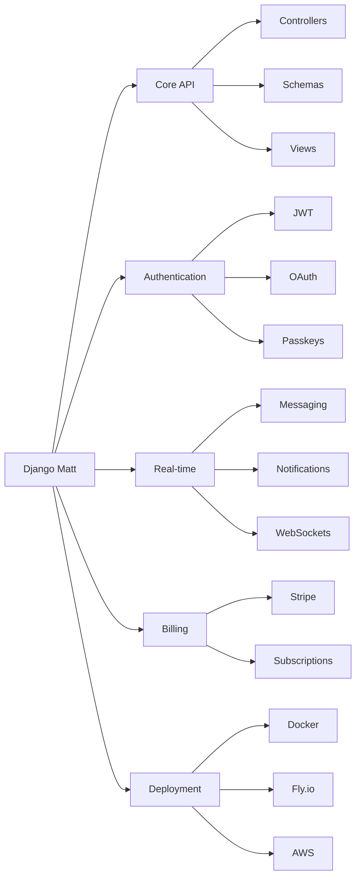

# Django Matt

A modern Django meta-framework for building production-ready APIs with minimal boilerplate.



## Features at a Glance

| Category | Features |
|----------|----------|
| **Core** | Async-first, Pydantic schemas, OpenAPI docs, CRUD views |
| **Auth** | JWT, Sessions, API Keys, OAuth, Passkeys, SSO |
| **Data** | PostgreSQL, pgvector, query optimization, caching |
| **Real-time** | WebSockets, messaging, notifications, email |
| **Billing** | Stripe, PayPal, Polar subscriptions |
| **Frontend** | TypeScript codegen, React/Svelte/Solid components |
| **DevOps** | Docker, Fly.io, Railway, Render, AWS deployment |

## Quick Start

```bash
# Install
pip install django-matt

# Create project
python manage.py startapi myproject

# Run with hot reload
python manage.py runserver_hot
```

## Basic API

```python
from django_matt import MattAPI
from django_matt.auth import jwt_required

api = MattAPI()

@api.get("/hello")
async def hello(request):
    return {"message": "Hello, World!"}

@api.get("/protected")
@jwt_required
async def protected(request):
    return {"user": request.user.email}
```

## CRUD Controller

```python
from django_matt.core import CRUDController

@api.controller("/products", tags=["Products"])
class ProductController(CRUDController):
    model = Product
    # Auto-generates: list, create, read, update, delete
```

## Module Overview

### Core (`django_matt.core`)
- **Router** - `@get`, `@post`, `@put`, `@patch`, `@delete` decorators
- **Controller** - `APIController`, `CRUDController` with dependency injection
- **Schema** - `ModelSchema`, Pydantic integration
- **Errors** - `APIError`, typed error responses

### Authentication (`django_matt.auth`)
- **JWT** - Access/refresh tokens, `@jwt_required`
- **Sessions** - Cookie-based auth, CSRF protection
- **API Keys** - Scoped keys with rate limiting
- **OAuth** - Google, GitHub, Apple, Microsoft
- **Passkeys** - WebAuthn/FIDO2 passwordless
- **SSO** - SAML 2.0, OpenID Connect

### Messaging (`django_matt.messaging`)
- **Conversations** - Direct, group, channels
- **Messages** - Text, attachments, reactions
- **Real-time** - WebSocket delivery, typing indicators
- **Presence** - Online status, last seen

### Notifications (`django_matt.notifications`)
- **Channels** - In-app, email, push, SMS, webhooks
- **Preferences** - Per-user, per-type settings
- **Delivery** - Priority, quiet hours, retry

### Email (`django_matt.email`)
- **Providers** - SMTP, SES, SendGrid, Mailgun
- **Templates** - Database-stored, versioned
- **Tracking** - Opens, clicks, bounces

### Billing (`django_matt.billing`)
- **Providers** - Stripe, PayPal, Polar
- **Subscriptions** - Plans, trials, upgrades
- **Webhooks** - Event handling

### Multi-tenancy (`django_matt.multitenancy`)
- **Organizations** - B2B structure
- **Teams** - Groups within orgs
- **Memberships** - Roles, permissions

### Components (`django_matt.components`)
- **Forms** - Input fields, validation
- **Layout** - Cards, modals, tables
- **Theming** - CSS variables, dark mode

### Type Generation (`django_matt.codegen`)
- **TypeScript** - Types, Zod schemas
- **React** - Hooks, components
- **Svelte** - Stores, components
- **Swift** - Codable structs

### Deployment (`django_matt.deployment`)
- **Platforms** - Fly.io, Railway, Render, AWS
- **Docker** - Compose, production configs
- **Health** - `/health/`, `/ready/`, `/live/`

## Requirements

- Python 3.11+
- Django 5.2+
- PostgreSQL (recommended)

## Installation

```bash
# Core
pip install django-matt

# With all features
pip install "django-matt[all]"

# Specific features
pip install "django-matt[auth,billing,messaging]"
```

## Documentation

- [Architecture Overview](docs/architecture/overview.md)
- [Getting Started](docs/getting-started/quickstart.md)
- [Authentication](docs/auth/overview.md)
- [Messaging](docs/messaging/overview.md)
- [Notifications](docs/notifications/overview.md)
- [Email](docs/email/overview.md)
- [Deployment](docs/deployment/overview.md)
- [Full API Reference](docs/api/)

## CLI Commands

```bash
# Project scaffolding
python manage.py startapi myproject --template b2b

# CRUD generation
python manage.py generate_crud myapp.MyModel --full

# Type synchronization
python manage.py sync_types --target typescript --output frontend/types

# Deployment
python manage.py deploy --platform fly

# Development
python manage.py runserver_hot
```

## Architecture

```
django_matt/
├── api.py              # MattAPI entry point
├── core/               # Router, Controller, Schema
├── auth/               # All authentication methods
├── messaging/          # Real-time messaging
├── notifications/      # Multi-channel notifications
├── email/              # Email service
├── billing/            # Subscription billing
├── multitenancy/       # B2B organizations
├── components/         # UI components
├── codegen/            # Frontend code generation
├── deployment/         # Platform deployments
├── websockets/         # WebSocket support
├── tasks/              # Background tasks
├── files/              # File storage
└── cli/                # CLI infrastructure
```

## Status

This is an internal/private framework for personal development. Not published to PyPI.

## Contributing

Internal use only. See [CONTRIBUTING.md](docs/contributing.md) for development guidelines.
