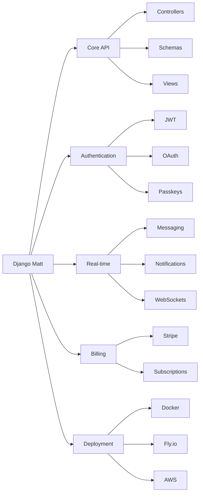

# Django Matt

[](https://github.com/mattjaikaran/django-matt/actions/workflows/ci.yml)
[](https://www.python.org/downloads/)
[](https://www.djangoproject.com/)
[](https://github.com/astral-sh/ruff)

A modern Django meta-framework for building production-ready APIs with minimal boilerplate. Async-first, type-safe, and batteries-included.



## Why Django Matt?

Django Matt consolidates the Django API ecosystem into a single, cohesive framework:

| Before (5+ packages) | After (1 package) |
|---------------------|-------------------|
| Django Ninja | `django-matt` |
| Django Ninja Extra | |
| Django Ninja JWT | |
| ninja-schema | |
| django-ninja-crud | |

**Key Benefits:**
- **Unified API** - One consistent interface for routing, auth, schemas, and more
- **Async-First** - Built for async from the ground up
- **Type-Safe** - Full Pydantic 2.0 integration with IDE support
- **Zero Config** - Sensible defaults that work out of the box
- **Production Ready** - Battle-tested patterns for real applications

## Features

| Category | Features |
|----------|----------|
| **Core** | Async controllers, Pydantic schemas, OpenAPI 3.1, auto CRUD |
| **Auth** | JWT, Sessions, API Keys, OAuth (Google/GitHub/Apple/Microsoft), Passkeys, SAML/OIDC SSO |
| **Data** | PostgreSQL, pgvector, query optimization, distributed caching, N+1 detection |
| **Real-time** | WebSockets, messaging, notifications, presence, typing indicators |
| **Billing** | Stripe, PayPal, Polar - subscriptions, metered billing, webhooks |
| **Frontend** | TypeScript/Zod codegen, React Query hooks, Swift Codable |
| **Observability** | OpenTelemetry tracing, structured logging, Prometheus metrics |
| **DevOps** | Docker, Fly.io, Railway, Render, AWS, Kubernetes |

## Quick Start

### Installation

```bash
# Using uv (recommended)
uv add django-matt

# With all features
uv add "django-matt[all]"

# Specific features
uv add "django-matt[auth,billing,performance]"
```

### Create Your First API

```python
# api.py
from django_matt import MattAPI
from django_matt.auth import jwt_required
from pydantic import BaseModel

api = MattAPI(
    title="My API",
    version="1.0.0",
)

class HelloResponse(BaseModel):
    message: str
    user: str | None = None

@api.get("/hello", response=HelloResponse)
async def hello(request):
    return {"message": "Hello, World!"}

@api.get("/protected", response=HelloResponse)
@jwt_required
async def protected(request):
    return {"message": "Hello!", "user": request.user.email}
```

```python
# urls.py
from django.urls import path
from .api import api

urlpatterns = [
    path("api/", api.urls),
]
```

### CRUD in Seconds

```python
from django_matt.core import CRUDController
from django_matt.permissions import IsAuthenticated

@api.controller("/products", tags=["Products"])
class ProductController(CRUDController):
    model = Product
    permission_classes = [IsAuthenticated]
    # Auto-generates: GET /, POST /, GET /{id}, PATCH /{id}, DELETE /{id}
```

### CLI Commands

```bash
# Create a new project
python manage.py startapi myproject --template b2b --auth jwt

# Generate CRUD from models
python manage.py generate_crud myapp.Product --full

# Generate TypeScript types
python manage.py sync_types --target typescript --output frontend/types

# Generate AI IDE context (CLAUDE.md, .cursorrules)
python manage.py generate_ai_context --format all

# Run with hot reload
python manage.py runserver
```

## Core Modules

### Authentication (`django_matt.auth`)

```python
from django_matt.auth import jwt_required, jwt_optional, AuthController
from django_matt.auth.oauth import OAuthController
from django_matt.auth.passkeys import PasskeyController

# JWT Authentication
@api.get("/me")
@jwt_required
async def get_current_user(request):
    return {"email": request.user.email}

# Register auth endpoints: /auth/login, /auth/register, /auth/refresh
api.register_controller(AuthController)

# OAuth: /auth/oauth/{provider}/login, /auth/oauth/{provider}/callback
api.register_controller(OAuthController)

# Passkeys: /auth/passkeys/register, /auth/passkeys/authenticate
api.register_controller(PasskeyController)
```

### Multi-tenancy (`django_matt.multitenancy`)

```python
from django_matt.multitenancy import Organization, Team, Membership

# Built-in models for B2B applications
# - Organization: company/workspace
# - Team: groups within an org
# - Membership: user roles (owner, admin, member, viewer)
# - Invitation: email invites with tokens
```

### Billing (`django_matt.billing`)

```python
from django_matt.billing import BillingController, get_provider

# Register billing endpoints
api.register_controller(BillingController, prefix="/billing")

# Direct provider access
provider = get_provider("stripe")  # or "paypal", "polar"

checkout = await provider.create_checkout_session(
    price_id="price_xxx",
    success_url="https://example.com/success",
    cancel_url="https://example.com/cancel",
)
```

### Feature Flags (`django_matt.flags`)

```python
from django_matt.flags import feature_enabled, feature_flag, get_variant

# Check flag status
if feature_enabled("new_checkout", user=request.user):
    return new_checkout_flow()

# Decorator
@feature_flag("beta_feature", default=False)
async def beta_endpoint(request):
    ...

# A/B testing variants
variant = get_variant("checkout_experiment", user=request.user)
```

### Performance (`django_matt.utils.performance`)

```python
from django_matt.utils import (
    optimize_queryset,
    cache_response,
    distributed_cache,
    FastJSONRenderer,
)

# Auto-optimize querysets (adds select_related/prefetch_related)
users = optimize_queryset(User.objects.all())

# Response caching
@api.get("/expensive")
@cache_response(timeout=300)
async def expensive_query(request):
    ...

# Distributed caching with stampede prevention
value = distributed_cache.get_or_set("key", compute_fn, timeout=300)
```

### GraphQL (`django_matt.graphql`)

```python
from django_matt.graphql import GraphQLAPI, generate_schema

# Auto-generate schema from Django models
schema = generate_schema(
    models=[User, Post, Comment],
    auto_mutations=True,
)

graphql = GraphQLAPI(schema=schema, graphiql=True)
```

### Type Generation (`django_matt.typegen`)

```python
# Generate TypeScript types from Pydantic schemas
python manage.py sync_types --target typescript --output frontend/src/types

# Generated output:
# export interface User {
#   id: string;
#   email: string;
#   name: string;
#   created_at: string;
# }
#
# export const UserSchema = z.object({
#   id: z.string().uuid(),
#   email: z.string().email(),
#   ...
# });
```

## Project Structure

```
django_matt/
├── api.py              # MattAPI entry point
├── core/               # Router, Controller, Schema, Errors
├── auth/               # JWT, OAuth, Passkeys, SSO, RBAC
├── views/              # Composable CRUD views
├── permissions/        # Permission classes & decorators
├── multitenancy/       # Organizations, Teams, Memberships
├── billing/            # Stripe, PayPal, Polar
├── messaging/          # Real-time messaging
├── notifications/      # Multi-channel notifications
├── email/              # Email providers & templates
├── flags/              # Feature flags & experiments
├── graphql/            # Strawberry GraphQL integration
├── websockets/         # WebSocket consumers & routing
├── observability/      # Tracing, logging, metrics
├── typegen/            # TypeScript/Swift code generation
├── components/         # UI component renderers
├── admin/              # Django Unfold admin integration
├── deployment/         # Platform deployment configs
├── cli/                # CLI commands & infrastructure
└── testing/            # Test client, factories, fixtures
```

## Requirements

- **Python**: 3.12+ (3.13 recommended)
- **Django**: 6.0+
- **Database**: PostgreSQL (recommended), SQLite for development

## Optional Dependencies

```bash
# Authentication extras
uv add "django-matt[auth]"           # Basic auth (no extra deps)
uv add "django-matt[jwt-asymmetric]" # RSA/EC JWT algorithms
uv add "django-matt[oauth]"          # OAuth providers
uv add "django-matt[passkeys]"       # WebAuthn/Passkeys

# Performance
uv add "django-matt[performance]"    # orjson, ujson, msgpack, redis

# Billing
uv add "django-matt[billing]"        # Stripe integration

# Background tasks
uv add "django-matt[tasks]"          # Celery, Dramatiq, Django-Q2

# Everything
uv add "django-matt[all]"
```

## Documentation

- [Getting Started](docs/getting-started/quickstart.md)
- [Authentication Guide](docs/auth/overview.md)
- [Multi-tenancy (B2B)](docs/multitenancy/overview.md)
- [Billing & Subscriptions](docs/billing/overview.md)
- [Real-time Features](docs/messaging/overview.md)
- [Deployment Guide](docs/deployment/overview.md)
- [API Reference](docs/api/)

## Example Projects

- [`examples/saas-starter`](examples/saas-starter) - SaaS application template
- [`examples/ecommerce-api`](examples/ecommerce-api) - E-commerce backend
- [`examples/realtime-chat`](examples/realtime-chat) - Real-time chat application

## Development

```bash
# Clone and install
git clone https://github.com/mattjaikaran/django-matt.git
cd django-matt
uv sync --dev

# Run tests
uv run pytest

# Run linting
uv run ruff check django_matt/
uv run ruff format django_matt/

# Build docs
uv sync --group docs
uv run mkdocs serve
```

## Status

This is a private framework for internal development. Not published to PyPI.

## License

Internal use only. Will be MIT licensed when publicly released.
