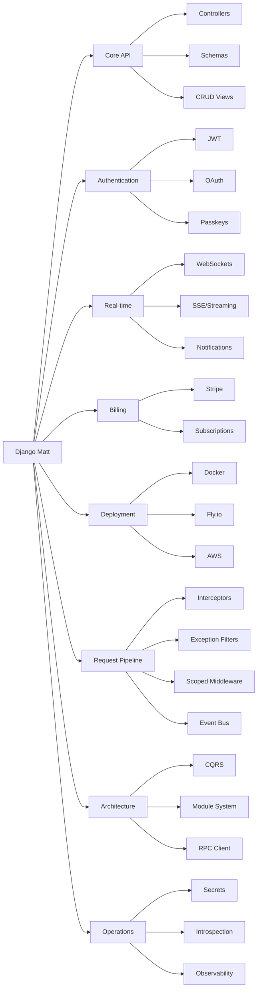

# Django Matt

[](https://github.com/mattjaikaran/django-matt/actions/workflows/ci.yml)
[](https://www.python.org/downloads/)
[](https://www.djangoproject.com/)
[](https://docs.pydantic.dev/)
[](https://github.com/astral-sh/ruff)
[](LICENSE)

A modern Django meta-framework for building production-ready APIs with minimal boilerplate. Async-first, type-safe, batteries-included.



---

## Why Django Matt?

Django Matt consolidates the Django API ecosystem into a single, cohesive framework:

| Before (5+ packages) | After (1 package) |
|---------------------|-------------------|
| Django Ninja | `django-matt` |
| Django Ninja Extra | |
| Django Ninja JWT | |
| ninja-schema | |
| django-ninja-crud | |

**One import. One API. Everything works together.**

- **Unified** -- routing, auth, schemas, billing, real-time, observability in one package
- **Async-first** -- built for async from the ground up, sync fallbacks where needed
- **Type-safe** -- Pydantic v2 schemas with full IDE support and OpenAPI 3.1 generation
- **Zero config** -- sensible defaults that work out of the box
- **60+ modules** -- from JWT auth to CQRS to SSE streaming, all integrated

---

## Quick Start

### 1. Install

```bash
uv add django-matt
```

### 2. Add to settings

```python
INSTALLED_APPS = [
    "django_matt",
    # ...
]
```

### 3. Create your API

```python
# api.py
from django_matt import MattAPI
from pydantic import BaseModel

api = MattAPI(title="My API", version="1.0.0")

class HelloResponse(BaseModel):
    message: str

@api.get("/hello", response=HelloResponse)
async def hello(request):
    return {"message": "Hello, World!"}
```

### 4. Wire up URLs

```python
# urls.py
from django.urls import path
from .api import api

urlpatterns = [
    path("api/", api.urls),
]
```

### 5. Run it

```bash
python manage.py runserver
```

Open `http://localhost:8000/api/docs` for interactive Swagger UI.

---

## Examples

### CRUD ViewSet (5 lines)

```python
from django_matt.views import APIViewSet, ListView, CreateView, ReadView, UpdateView, DeleteView

class ProductViewSet(APIViewSet):
    api = api
    model = Product
    list = ListView()
    create = CreateView()
    read = ReadView()
    update = UpdateView()
    delete = DeleteView()
    # Auto-generates: GET /, POST /, GET /{id}, PATCH /{id}, DELETE /{id}
```

### JWT Authentication

```python
from django_matt.auth import jwt_required, AuthController

# Register auth endpoints: /auth/login, /auth/register, /auth/refresh
api.register_controller(AuthController)

@api.get("/me")
@jwt_required
async def get_current_user(request):
    return {"email": request.user.email}
```

### SSE Streaming

```python
from django_matt.streaming import sse_response, event

@api.get("/feed")
async def live_feed(request):
    async def generate():
        yield event("connected", event_type="status")
        async for update in get_updates():
            yield event(update, event_type="update")

    return sse_response(generate())
```

### Event Bus

```python
from django_matt.events import EventBus, Event, on, get_event_bus

class UserSignedUp(Event):
    email: str

@on("UserSignedUp")
async def send_welcome_email(event: UserSignedUp):
    await send_email(event.email, "Welcome!")

# Emit from anywhere
bus = get_event_bus()
await bus.emit(UserSignedUp(email="user@example.com"))
```

### CQRS Command

```python
from django_matt.cqrs import Command, CommandHandler, command_handler, get_command_bus

class CreateOrder(Command):
    product_id: str
    quantity: int

@command_handler(CreateOrder)
class CreateOrderHandler(CommandHandler):
    async def handle(self, command: CreateOrder):
        return await Order.objects.acreate(
            product_id=command.product_id,
            quantity=command.quantity,
        )

bus = get_command_bus()
order = await bus.dispatch(CreateOrder(product_id="abc", quantity=2))
```

### Service Layer

```python
from django_matt.services import CRUDService

class TodoService(CRUDService["Todo"]):
    model = Todo

    def get_queryset(self):
        return super().get_queryset().select_related("created_by")

# In controller
items, total = await TodoService().list(created_by=request.user)
```

### Interceptors

```python
from django_matt.interceptors import intercept, TimingInterceptor, LoggingInterceptor

@api.get("/users")
@intercept(TimingInterceptor(), LoggingInterceptor())
async def list_users(request):
    return await User.objects.all().avalues()
```

---

## What's New in 0.9

- **Interceptors** -- before/after/error hooks on any route or controller
- **SSE Streaming** -- server-sent events with heartbeat and backpressure
- **Event Bus** -- async pub/sub with in-memory and Redis backends
- **CQRS** -- command/query buses with middleware pipeline
- **Exception Filters** -- layered error handling (route, controller, global)
- **Module System** -- plugins with dependency resolution and lifecycle hooks
- **Scoped Middleware** -- attach middleware to specific routes, not globally
- **Serialization Groups** -- role-based field visibility on schemas
- **RPC Client Generation** -- typed Python and TypeScript clients from OpenAPI
- **Secrets Management** -- unified API for env, AWS Secrets Manager, Vault, GCP
- **Introspection** -- health checks, K8s liveness/readiness probes, `/_info`
- **Auto-Instrumentation** -- zero-config OpenTelemetry tracing and Prometheus metrics
- **LLM-Optimized Errors** -- structured `code`, `hint`, `docs_url` fields in error responses
- **Starter Templates** -- `--template ai-saas` and `--template marketplace` for project scaffolding
- **Rust Extensions** -- optional PyO3 native extensions for hot paths

---

## Module Overview

### Core

| Module | Description |
|--------|-------------|
| `core` | Controllers, schemas (Pydantic v2), error handling, OpenAPI 3.1 |
| `views` | Composable CRUD views with lifecycle hooks (before/after create, update, delete) |
| `services` | CRUDService for domain logic, BaseThirdPartyService for external APIs |
| `permissions` | IsAuthenticated, IsAdmin, IsOwner, HasRole, decorator-based access control |
| `openapi` | Swagger UI and ReDoc generation with Literal-to-enum propagation |
| `config` | Modular Pydantic-validated configuration |
| `di` | Dependency injection container |

### Authentication and Authorization

| Module | Description |
|--------|-------------|
| `auth` | JWT (symmetric + asymmetric), sessions, API keys, magic links |
| `auth.oauth` | OAuth providers (Google, GitHub, Apple, Microsoft) |
| `auth.passkeys` | WebAuthn/FIDO2 passwordless authentication |
| `auth.sso` | SAML and OIDC single sign-on |
| `auth.rbac` | Role-based access control with hierarchical permissions |
| `multitenancy` | Organizations, teams, memberships, invitations (B2B) |

### Request Pipeline

| Module | Description |
|--------|-------------|
| `interceptors` | Before/after/error hooks: timing, logging, caching, rate limiting, retry |
| `exceptions` | Layered exception filters (route, controller, global) |
| `middleware` | Route-scoped middleware: CORS, rate limit, cache, auth per route |
| `serialization` | Groups-based field visibility (public, secret, role-scoped) |
| `filtering` | Django filter backend, search, ordering |
| `pagination` | PageNumber, LimitOffset, Cursor pagination |
| `throttling` | Rate limiting with multiple backends |
| `versioning` | URL, header, query parameter API versioning |
| `negotiation` | Content negotiation (JSON, XML, CSV, YAML, MsgPack) |

### Architecture

| Module | Description |
|--------|-------------|
| `cqrs` | Command/query buses with domain events and middleware pipeline |
| `events` | Async event bus with in-memory and Redis backends |
| `modules` | Plugin system with dependency resolution and lifecycle hooks |
| `rpc` | Typed RPC client generation (Python + TypeScript) from OpenAPI |
| `streaming` | SSE responses, streaming JSON/text, heartbeat helpers |

### Real-time and Communication

| Module | Description |
|--------|-------------|
| `websockets` | WebSocket consumers, auth middleware, presence, routing |
| `messaging` | Conversations, attachments, WebSocket transport |
| `notifications` | In-app, email, push (FCM/APNs), SMS, webhooks |
| `email` | SendGrid, Mailgun, SES, SMTP with template rendering |

### Data and Storage

| Module | Description |
|--------|-------------|
| `db` | PostgreSQL connection pooling (psycopg3), pgvector |
| `files` | Upload handling, S3/R2/MinIO storage backends |
| `audit` | Audit logging, soft delete with restore |
| `ml` | Vector storage, structured LLM output |

### Business Logic

| Module | Description |
|--------|-------------|
| `billing` | Stripe, PayPal, Polar -- subscriptions, metered billing, webhooks |
| `flags` | Feature flags (DB, Redis, LaunchDarkly, Unleash backends) |
| `analytics` | Event tracking, sessions, funnels, multiple backends |
| `experiments` | A/B testing, multi-armed bandits, statistical analysis |

### Operations

| Module | Description |
|--------|-------------|
| `observability` | OpenTelemetry tracing, Prometheus metrics, structured logging, auto-instrumentation |
| `secrets` | Secrets management (env, AWS, Vault, GCP, encrypted file) with rotation |
| `introspection` | Health checks, K8s liveness/readiness probes, `/_info` endpoint |
| `tasks` | Background tasks (Celery, Dramatiq, Django-Q2) |
| `deployment` | Docker, Fly.io, Railway, Render, AWS, Kubernetes configs |

### Frontend and Code Generation

| Module | Description |
|--------|-------------|
| `typegen` | TypeScript interfaces, Zod schemas, Swift Codable from Pydantic models |
| `graphql` | Strawberry-based schema generation with dataloaders |
| `htmx` | HTMX helpers and Livewire-style reactivity |
| `components` | Backend-served component system |
| `ai` | LLM integration, embeddings, RAG, IDE context generation |

### Developer Experience

| Module | Description |
|--------|-------------|
| `cli` | Rich CLI: `matt info`, `matt doctor`, `matt routes`, `matt models` |
| `testing` | Async test client, factories, assertions |
| `inspector` | Request/response capture for development |
| `benchmarks` | Performance benchmarking with comparison reports |

---

## Performance

Django Matt includes optional Rust extensions (via PyO3) for CPU-bound hot paths:

| Component | Speedup | Description |
|-----------|---------|-------------|
| Router | ~3x | Radix tree route matching |
| JWT | ~2-4x | Token encode/decode/verify |
| Serialization | ~2x | JSON serialization with camelCase mapping |
| Query parsing | ~2x | Query string parameter parsing |
| Header parsing | ~2x | HTTP header parsing |

Extensions are **optional** -- the framework auto-detects and falls back to pure Python:

```python
from django_matt._accel import HAS_RUST  # True if extensions are installed
```

Install with Rust support:

```bash
uv add "django-matt[rust]"
```

---

## CLI

```bash
# Project scaffolding
python manage.py startapi myproject --template b2b --auth jwt --docker
# Templates: starter, b2b, b2c, saas, ai-saas, marketplace

# Generate CRUD from models (controller, schema, service, admin, tests)
python manage.py generate_crud myapp.Product --full

# Generate TypeScript types from Pydantic schemas
python manage.py sync_types --target typescript --output frontend/types

# Generate AI IDE context (CLAUDE.md, .cursorrules)
python manage.py generate_ai_context --format all

# Deploy
python manage.py deploy --platform fly
```

---

## Installation Options

```bash
# Core only
uv add django-matt

# With specific features
uv add "django-matt[auth]"              # JWT, sessions, API keys
uv add "django-matt[jwt-asymmetric]"    # RSA/EC JWT algorithms
uv add "django-matt[oauth]"             # OAuth providers
uv add "django-matt[passkeys]"          # WebAuthn/Passkeys
uv add "django-matt[billing]"           # Stripe integration
uv add "django-matt[performance]"       # orjson, ujson, msgpack, redis
uv add "django-matt[tasks]"             # Celery, Dramatiq, Django-Q2
uv add "django-matt[rust]"              # Rust native extensions

# Everything
uv add "django-matt[all]"
```

---

## Documentation

- [Getting Started](docs/getting-started/quickstart.md)
- [Authentication Guide](docs/auth/overview.md)
- [Multi-tenancy (B2B)](docs/multitenancy/overview.md)
- [Billing and Subscriptions](docs/billing/overview.md)
- [Real-time Features](docs/messaging/overview.md)
- [Deployment Guide](docs/deployment/index.md)
- [Service Layer](docs/services/index.md)
- [API Reference](docs/api/)

---

## Example Projects

| Project | Description |
|---------|-------------|
| [`examples/quicktodo`](examples/quicktodo) | Multi-tenant todo API -- the "10-minute demo" |
| [`examples/saas-starter`](examples/saas-starter) | SaaS template with auth, billing, multi-tenancy |
| [`examples/ecommerce-api`](examples/ecommerce-api) | E-commerce backend with products, orders, payments |
| [`examples/ecommerce-v2`](examples/ecommerce-v2) | Multi-vendor marketplace with Stripe payments |
| [`examples/realtime-chat`](examples/realtime-chat) | Real-time chat with WebSockets and presence |
| [`examples/ai-chat`](examples/ai-chat) | AI-powered chat with SSE streaming and CQRS |
| [`examples/devplatform`](examples/devplatform) | API management SaaS with keys, analytics, webhooks |
| [`examples/multitenant-saas`](examples/multitenant-saas) | Multi-tenant SaaS with interceptors and feature flags |

---

## Requirements

- **Python** 3.12+ (3.13 recommended)
- **Django** 5.2+ (6.0 supported)
- **Database** PostgreSQL recommended, SQLite for development

---

## Development

```bash
git clone https://github.com/mattjaikaran/django-matt.git
cd django-matt
uv sync --dev

# Run tests
uv run pytest tests/ -x -q

# Lint and format
uv run ruff check django_matt/
uv run ruff format django_matt/
```

---

## Contributing

1. Fork the repository
2. Create a feature branch (`git checkout -b feature/my-feature`)
3. Write tests for your changes
4. Ensure all tests pass (`uv run pytest tests/ -x -q`)
5. Ensure linting passes (`uv run ruff check django_matt/`)
6. Submit a pull request

---

## License

Apache License 2.0. See [LICENSE](LICENSE) for details.
