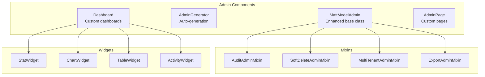

# Admin Interface

Django Matt provides enhanced admin classes with Django Unfold integration, auto-generation utilities, dashboards, and theming.

## Overview



## Installation

```bash
# Install Django Unfold
uv add django-unfold
```

```python
# settings.py - Add BEFORE django.contrib.admin
INSTALLED_APPS = [
    "unfold",
    "unfold.contrib.filters",
    "unfold.contrib.forms",
    "unfold.contrib.import_export",
    "django.contrib.admin",
    ...
]
```

## Quick Start

### Basic Usage

```python
from django.contrib import admin
from django_matt.admin import MattModelAdmin, register_admin
from myapp.models import Product

@register_admin(Product)
class ProductAdmin(MattModelAdmin):
    pass  # Auto-configures list_display, search_fields, filters
```

### Auto-Generation

```python
from django_matt.admin import generate_admin_class

# Generate admin class automatically
ProductAdmin = generate_admin_class(Product)
admin.site.register(Product, ProductAdmin)

# Or generate entire admin module
from django_matt.admin import generate_admin_module
generate_admin_module("myapp", output_path="myapp/admin_generated.py")
```

### CLI Generation

```bash
# Generate admin for all models in an app
python manage.py generate_admin myapp

# Generate for specific model
python manage.py generate_admin myapp.Product
```

## MattModelAdmin

Enhanced ModelAdmin with auto-configuration:

```python
from django_matt.admin import MattModelAdmin

class ProductAdmin(MattModelAdmin):
    # These are auto-configured based on model fields:
    # - list_display: All non-relation fields
    # - search_fields: CharField and TextField
    # - list_filter: BooleanField, DateField, ForeignKey, choices
    # - ordering: Uses model Meta.ordering or pk

    # Override as needed
    list_display = ["name", "price", "is_active", "created_at"]
    search_fields = ["name", "description"]
    list_filter = ["is_active", "category"]
```

### Inlines

```python
from django_matt.admin import MattModelAdmin, MattTabularInline, MattStackedInline

class OrderItemInline(MattTabularInline):
    model = OrderItem
    extra = 0

class OrderNoteInline(MattStackedInline):
    model = OrderNote
    extra = 1

class OrderAdmin(MattModelAdmin):
    inlines = [OrderItemInline, OrderNoteInline]
```

## Mixins

### AuditAdminMixin

Display audit information (created_by, updated_by, timestamps):

```python
from django_matt.admin import MattModelAdmin, AuditAdminMixin

class ArticleAdmin(AuditAdminMixin, MattModelAdmin):
    pass

# Adds to list_display: created_at, updated_at
# Adds to readonly_fields: created_by, updated_by
# Adds fieldset for audit info
```

### SoftDeleteAdminMixin

Handle soft-deleted records:

```python
from django_matt.admin import MattModelAdmin, SoftDeleteAdminMixin

class ProductAdmin(SoftDeleteAdminMixin, MattModelAdmin):
    pass

# Adds filter for deleted/active records
# Adds "Restore" action for deleted records
# Shows deleted_at in list_display
```

### MultiTenantAdminMixin

Filter by organization/tenant:

```python
from django_matt.admin import MattModelAdmin, MultiTenantAdminMixin

class ProjectAdmin(MultiTenantAdminMixin, MattModelAdmin):
    tenant_field = "organization"

# Filters queryset by user's organization
# Adds organization filter for superusers
# Auto-sets organization on save
```

### ExportAdminMixin

Add CSV/JSON export actions:

```python
from django_matt.admin import MattModelAdmin, ExportAdminMixin

class UserAdmin(ExportAdminMixin, MattModelAdmin):
    export_fields = ["id", "email", "name", "created_at"]

# Adds "Export as CSV" action
# Adds "Export as JSON" action
```

## Filters

```python
from django_matt.admin import (
    DateRangeFilter,
    BooleanFilter,
    ChoicesFilter,
    RelatedFilter,
    TenantFilter,
)

class OrderAdmin(MattModelAdmin):
    list_filter = [
        ("created_at", DateRangeFilter),   # Date range picker
        ("is_paid", BooleanFilter),         # Yes/No toggle
        ("status", ChoicesFilter),          # Dropdown for choices
        ("customer", RelatedFilter),        # Autocomplete for FK
        ("organization", TenantFilter),     # Tenant filter
    ]
```

## Actions

```python
from django_matt.admin import (
    export_as_csv,
    export_as_json,
    soft_delete_selected,
    restore_selected,
)

class ProductAdmin(MattModelAdmin):
    actions = [
        export_as_csv,
        export_as_json,
        soft_delete_selected,
        restore_selected,
    ]
```

### Custom Actions

```python
from django.contrib import admin

@admin.action(description="Mark as featured")
def mark_featured(modeladmin, request, queryset):
    queryset.update(is_featured=True)

class ProductAdmin(MattModelAdmin):
    actions = [mark_featured]
```

## Dashboard

### Creating a Dashboard

```python
from django_matt.admin import (
    Dashboard,
    DashboardSection,
    StatWidget,
    ChartWidget,
    ActivityWidget,
)

dashboard = Dashboard(title="Analytics Dashboard")

# Add stat widgets
dashboard.add_stat(StatWidget(
    title="Total Users",
    value=lambda: User.objects.count(),
    icon="users",
    color="primary",
))

dashboard.add_stat(StatWidget(
    title="Revenue",
    value=lambda: Order.objects.aggregate(Sum("total"))["total__sum"],
    prefix="$",
    change="+12%",
    change_type="positive",
))

# Add sections
users_section = DashboardSection(title="User Metrics")
users_section.add_widget(ChartWidget(
    title="User Growth",
    chart_type="line",
    data=get_user_growth_data,
))
dashboard.add_section(users_section)
```

### Model Stat Widgets

```python
from django_matt.admin import model_stat_widget

# Auto-generate stat widget from model
user_stat = model_stat_widget(
    User,
    title="Users",
    filter_kwargs={"is_active": True},
    icon="users",
)
```

### Chart Widgets

```python
from django_matt.admin import (
    ChartWidget,
    model_time_series_chart,
    model_distribution_chart,
    comparison_chart,
)

# Time series from model
orders_chart = model_time_series_chart(
    Order,
    date_field="created_at",
    title="Orders Over Time",
    days=30,
)

# Distribution chart
status_chart = model_distribution_chart(
    Order,
    field="status",
    title="Order Status Distribution",
    chart_type="doughnut",
)

# Comparison chart
comparison = comparison_chart(
    title="Revenue vs Costs",
    labels=["Jan", "Feb", "Mar", "Apr"],
    datasets=[
        {"label": "Revenue", "data": [1000, 1200, 1100, 1400]},
        {"label": "Costs", "data": [800, 850, 900, 950]},
    ],
)
```

### Dashboard Admin Site

```python
from django_matt.admin import DashboardAdminSite

class MyAdminSite(DashboardAdminSite):
    site_header = "My App Admin"

    def get_dashboard(self):
        return dashboard  # Your Dashboard instance

admin_site = MyAdminSite(name="myadmin")
```

### Auto Dashboard

```python
from django_matt.admin import auto_dashboard

# Auto-generate dashboard from registered models
dashboard = auto_dashboard(admin_site)
```

## Custom Pages

### Creating Pages

```python
from django_matt.admin import AdminPage, pages

@pages.register("reports/sales")
class SalesReportPage(AdminPage):
    title = "Sales Report"
    icon = "chart-bar"
    permission = "myapp.view_sales_report"

    def get_context(self, request):
        return {
            "report": generate_sales_report(),
            "filters": request.GET,
        }

    def get_template(self):
        return "admin/reports/sales.html"
```

### Page Groups

```python
from django_matt.admin import AdminPageGroup

reports_group = AdminPageGroup(
    name="Reports",
    icon="document-report",
    pages=[
        SalesReportPage,
        InventoryReportPage,
        UserReportPage,
    ],
)
```

### Adding Pages to Admin

```python
from django_matt.admin import PageBuilderMixin

class MyAdminSite(PageBuilderMixin, admin.AdminSite):
    def get_pages(self):
        return [
            reports_group,
            SettingsPage,
        ]
```

## Configuration

```python
from django_matt.admin import UnfoldConfig, configure_unfold

# Configure Unfold theme
config = UnfoldConfig(
    site_title="My App",
    site_header="My App Admin",
    site_url="/",
    colors={
        "primary": {
            "50": "#f0fdf4",
            "500": "#22c55e",
            "900": "#14532d",
        }
    },
    dark_mode=True,
)

# Apply to settings
UNFOLD = configure_unfold(config)
```

## Widgets Reference

### StatWidget

```python
StatWidget(
    title="Total Sales",
    value=1234,           # Or callable
    prefix="$",           # Optional prefix
    suffix=" items",      # Optional suffix
    icon="shopping-cart", # Heroicon name
    color="primary",      # primary, success, warning, danger
    change="+5.2%",       # Change indicator
    change_type="positive",  # positive, negative, neutral
    link="/admin/orders/", # Optional link
)
```

### ActivityWidget

```python
ActivityWidget(
    title="Recent Activity",
    items=[
        {"text": "User John registered", "time": "5m ago", "icon": "user"},
        {"text": "Order #123 placed", "time": "10m ago", "icon": "cart"},
    ],
    # Or use callable
    items=lambda: get_recent_activity(),
)
```

### TableWidget

```python
TableWidget(
    title="Top Products",
    headers=["Product", "Sales", "Revenue"],
    rows=[
        ["Widget A", 150, "$1,500"],
        ["Widget B", 120, "$1,200"],
    ],
)
```

### ProgressWidget

```python
ProgressWidget(
    title="Monthly Goal",
    current=75,
    target=100,
    unit="sales",
    color="success",
)
```

## Best Practices

1. **Use auto-generation for consistency** - Start with generated admins, customize as needed
2. **Apply mixins for common patterns** - Audit, soft delete, multi-tenant
3. **Create dashboards for key metrics** - Give admins quick insights
4. **Use custom pages for complex reports** - Don't overcomplicate model admins
5. **Configure Unfold theming** - Match your brand colors
6. **Add appropriate filters** - Make data discovery easy
7. **Export functionality** - Users often need data in CSV/JSON
