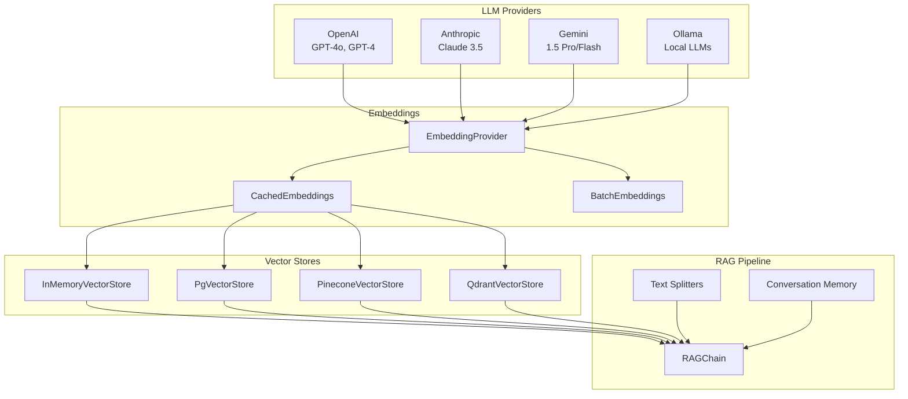

# AI & Machine Learning

Django Matt provides a comprehensive AI toolkit with LLM providers, embeddings, vector stores, and RAG pipelines.

## Overview



## Quick Start

```python
from django_matt.ai import (
    OpenAIProvider,
    Message,
    InMemoryVectorStore,
    OpenAIEmbeddings,
    RAGChain,
)

# Simple completion
llm = OpenAIProvider()  # Uses OPENAI_API_KEY env var
response = await llm.complete([
    Message.system("You are a helpful assistant."),
    Message.user("What is Django?"),
])
print(response.content)

# Streaming
async for chunk in llm.stream([Message.user("Tell me a story")]):
    print(chunk.content, end="", flush=True)
```

## LLM Providers

### OpenAI

```python
from django_matt.ai import OpenAIProvider, Message

llm = OpenAIProvider(
    api_key="sk-...",           # Or use OPENAI_API_KEY env var
    model="gpt-4o",             # Default model
    temperature=0.7,
    max_tokens=1000,
)

response = await llm.complete([
    Message.system("You are a coding assistant."),
    Message.user("Write a Python function to reverse a string."),
])

print(response.content)
print(f"Tokens: {response.usage.total_tokens}")
```

### Anthropic (Claude)

```python
from django_matt.ai import AnthropicProvider, Message

llm = AnthropicProvider(
    api_key="sk-ant-...",       # Or use ANTHROPIC_API_KEY env var
    model="claude-3-5-sonnet-20241022",
    max_tokens=1000,
)

response = await llm.complete([
    Message.user("Explain quantum computing in simple terms."),
])
```

### Google Gemini

```python
from django_matt.ai import GeminiProvider, Message

llm = GeminiProvider(
    api_key="...",              # Or use GOOGLE_API_KEY env var
    model="gemini-1.5-pro",
)

response = await llm.complete([
    Message.user("What are the benefits of async programming?"),
])
```

### Ollama (Local)

```python
from django_matt.ai import OllamaProvider, Message

# Requires: ollama serve
llm = OllamaProvider(
    host="http://localhost:11434",
    model="llama3.2",
)

# List available models
models = await llm.list_models()
print([m["name"] for m in models])

# Pull a new model
async for progress in llm.pull_model("mistral"):
    print(f"Downloading: {progress['status']}")

# Chat completion
response = await llm.complete([
    Message.user("Hello! What can you help me with?"),
])
```

### Factory Function

```python
from django_matt.ai import get_provider

# Get provider by name
llm = get_provider("openai")
llm = get_provider("anthropic", model="claude-3-opus-20240229")
llm = get_provider("ollama", model="llama3.2")
```

## Structured Output

Extract structured data with Pydantic models:

```python
from pydantic import BaseModel
from django_matt.ai import OpenAIProvider, Message

class Person(BaseModel):
    name: str
    age: int
    occupation: str

llm = OpenAIProvider()

person = await llm.complete_structured(
    [Message.user("Extract info: John Smith is a 35-year-old software engineer.")],
    response_model=Person,
)

print(person.name)        # John Smith
print(person.age)         # 35
print(person.occupation)  # software engineer
```

### Complex Structures

```python
from pydantic import BaseModel, Field
from typing import List

class Address(BaseModel):
    street: str
    city: str
    country: str

class Company(BaseModel):
    name: str
    industry: str
    employees: int = Field(ge=0)
    headquarters: Address
    competitors: List[str]

company = await llm.complete_structured(
    [Message.user("Extract company info from this article: ...")],
    response_model=Company,
)
```

## Embeddings

### OpenAI Embeddings

```python
from django_matt.ai import OpenAIEmbeddings

embedder = OpenAIEmbeddings(
    model="text-embedding-3-small",  # or text-embedding-3-large
)

# Single text
embedding = await embedder.embed("Hello, world!")
print(len(embedding))  # 1536 dimensions

# Multiple texts
embeddings = await embedder.embed_many([
    "First document",
    "Second document",
    "Third document",
])
```

### Gemini Embeddings

```python
from django_matt.ai import GeminiEmbeddings

embedder = GeminiEmbeddings(model="text-embedding-004")
embedding = await embedder.embed("Hello, world!")
```

### Ollama Embeddings (Local)

```python
from django_matt.ai import OllamaEmbeddings

embedder = OllamaEmbeddings(
    model="nomic-embed-text",  # or mxbai-embed-large
)
embedding = await embedder.embed("Hello, world!")
```

### Cached Embeddings

Cache embeddings to avoid recomputation:

```python
from django_matt.ai import CachedEmbeddings, OpenAIEmbeddings

embedder = CachedEmbeddings(
    provider=OpenAIEmbeddings(),
    cache_backend="redis",  # or "memory", "database"
)

# First call computes and caches
embedding1 = await embedder.embed("Hello")

# Second call returns cached result
embedding2 = await embedder.embed("Hello")
```

### Batch Embeddings

Efficient bulk embedding with concurrency control:

```python
from django_matt.ai import BatchEmbeddings, OpenAIEmbeddings

embedder = BatchEmbeddings(
    provider=OpenAIEmbeddings(),
    batch_size=100,
    max_concurrent=5,
)

# Embed thousands of documents efficiently
embeddings = await embedder.embed_many(documents)
```

## Vector Stores

### In-Memory (Development)

```python
from django_matt.ai import InMemoryVectorStore, OpenAIEmbeddings

store = InMemoryVectorStore(
    embedding_provider=OpenAIEmbeddings(),
)

# Add documents
await store.add_texts([
    "Python is a programming language",
    "Django is a web framework",
    "FastAPI is also a web framework",
])

# Search
results = await store.search("web frameworks", k=2)
for result in results:
    print(f"{result.score:.3f}: {result.text}")
```

### PostgreSQL with pgvector

```python
from django_matt.ai import PgVectorStore, OpenAIEmbeddings

store = PgVectorStore(
    embedding_provider=OpenAIEmbeddings(),
    table_name="document_embeddings",
    connection_string="postgresql://...",
)

# Add with metadata
await store.add_texts(
    texts=["Document content..."],
    metadata=[{"source": "manual", "category": "guide"}],
)

# Search with filter
results = await store.search(
    "query",
    k=5,
    filter={"category": "guide"},
)
```

### Pinecone

```python
from django_matt.ai import PineconeVectorStore, OpenAIEmbeddings

store = PineconeVectorStore(
    embedding_provider=OpenAIEmbeddings(),
    api_key="...",
    index_name="my-index",
    namespace="production",
)

await store.add_texts(texts, metadata=metadata_list)
results = await store.search("query", k=10)
```

### Qdrant

```python
from django_matt.ai import QdrantVectorStore, OpenAIEmbeddings

store = QdrantVectorStore(
    embedding_provider=OpenAIEmbeddings(),
    url="http://localhost:6333",
    collection_name="documents",
)

await store.add_texts(texts)
results = await store.search("query", k=5)
```

## RAG Pipeline

### Basic RAG

```python
from django_matt.ai import (
    RAGChain,
    OpenAIProvider,
    InMemoryVectorStore,
    OpenAIEmbeddings,
)

# Setup
llm = OpenAIProvider()
store = InMemoryVectorStore(embedding_provider=OpenAIEmbeddings())

# Add knowledge base
await store.add_texts([
    "Django Matt is a meta-framework for Django.",
    "It provides JWT authentication, RBAC, and more.",
    "The framework supports async-first design.",
])

# Create RAG chain
rag = RAGChain(
    llm=llm,
    vector_store=store,
    k=3,  # Number of documents to retrieve
)

# Query
response = await rag.query("What is Django Matt?")
print(response.answer)
print(response.sources)  # Retrieved documents used
```

### Multi-Query RAG

Expand queries for better retrieval:

```python
from django_matt.ai import MultiQueryRAG

rag = MultiQueryRAG(
    llm=llm,
    vector_store=store,
    num_queries=3,  # Generate 3 query variations
)

response = await rag.query("How do I authenticate users?")
# Internally generates variations like:
# - "What authentication methods are available?"
# - "How to implement user login?"
# - "JWT authentication setup"
```

### Text Splitters

Split large documents for embedding:

```python
from django_matt.ai import (
    CharacterSplitter,
    RecursiveSplitter,
    SentenceSplitter,
)

# Split by character count
splitter = CharacterSplitter(
    chunk_size=1000,
    chunk_overlap=200,
)
chunks = splitter.split(long_document)

# Recursive split (respects paragraphs/sentences)
splitter = RecursiveSplitter(
    chunk_size=1000,
    separators=["\n\n", "\n", ". ", " "],
)
chunks = splitter.split(long_document)

# Split by sentences
splitter = SentenceSplitter(
    sentences_per_chunk=5,
    overlap_sentences=1,
)
chunks = splitter.split(long_document)
```

### Conversation Memory

Maintain conversation history:

```python
from django_matt.ai import ConversationMemory, SummaryMemory

# Window-based memory (keeps last N messages)
memory = ConversationMemory(window_size=10)

# Summary memory (summarizes old messages)
memory = SummaryMemory(
    llm=llm,
    max_messages=50,
    summarize_after=20,
)

# Use with RAG
rag = RAGChain(
    llm=llm,
    vector_store=store,
    memory=memory,
)

# Conversation
response1 = await rag.query("What is Django Matt?")
response2 = await rag.query("What authentication does it support?")  # Has context
response3 = await rag.query("How do I set that up?")  # Knows "that" = authentication
```

## Similarity Functions

```python
from django_matt.ai import (
    cosine_similarity,
    euclidean_distance,
    dot_product,
    find_most_similar,
)

# Compare two vectors
similarity = cosine_similarity(embedding1, embedding2)

# Find most similar
matches = find_most_similar(
    query_embedding,
    candidate_embeddings,
    k=5,
)
```

## Configuration

```python
# settings.py
DJANGO_MATT_AI = {
    # Default LLM provider
    "DEFAULT_PROVIDER": "openai",

    # API keys (or use env vars)
    "OPENAI_API_KEY": "sk-...",
    "ANTHROPIC_API_KEY": "sk-ant-...",
    "GOOGLE_API_KEY": "...",

    # Default models
    "OPENAI_MODEL": "gpt-4o",
    "ANTHROPIC_MODEL": "claude-3-5-sonnet-20241022",

    # Embedding cache
    "EMBEDDING_CACHE_BACKEND": "redis",
    "EMBEDDING_CACHE_TTL": 86400,  # 1 day

    # Vector store
    "DEFAULT_VECTOR_STORE": "pgvector",
    "PGVECTOR_CONNECTION": "postgresql://...",
}
```

## Best Practices

1. **Cache embeddings** - Use CachedEmbeddings to avoid recomputing
2. **Batch operations** - Use BatchEmbeddings for large datasets
3. **Choose appropriate models** - Smaller models for simple tasks
4. **Use local LLMs for development** - Ollama is free and fast
5. **Chunk documents properly** - Use RecursiveSplitter for best results
6. **Monitor token usage** - Track `response.usage` for cost management
7. **Stream for long responses** - Better UX with streaming
8. **Handle rate limits** - Implement retry logic for production
