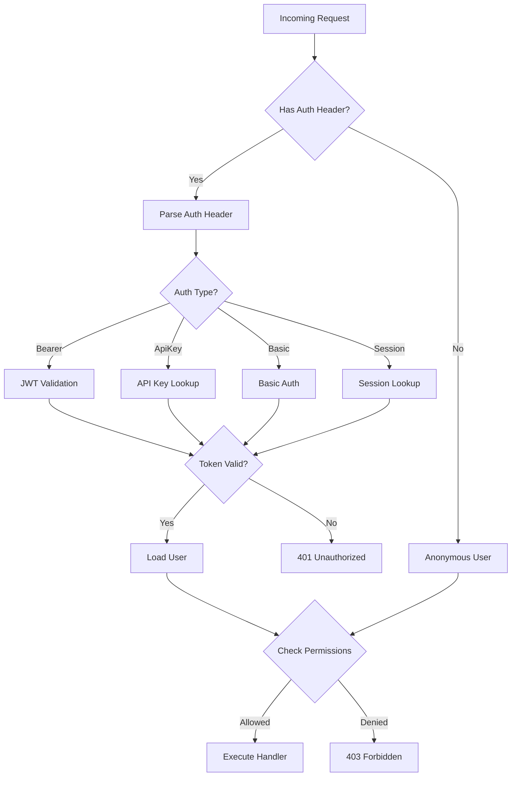
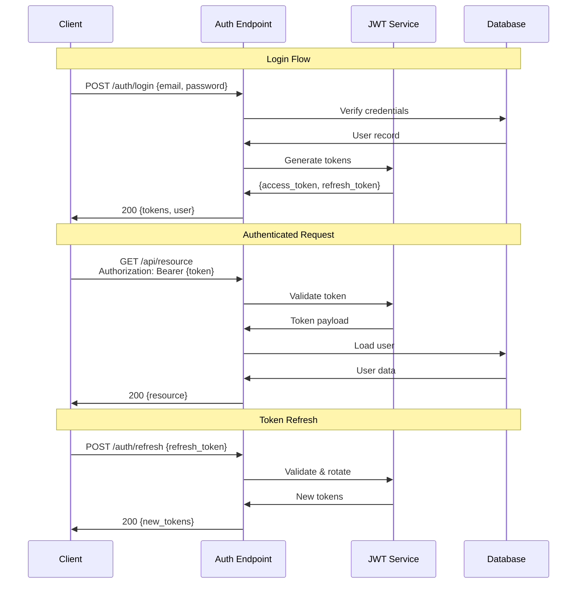
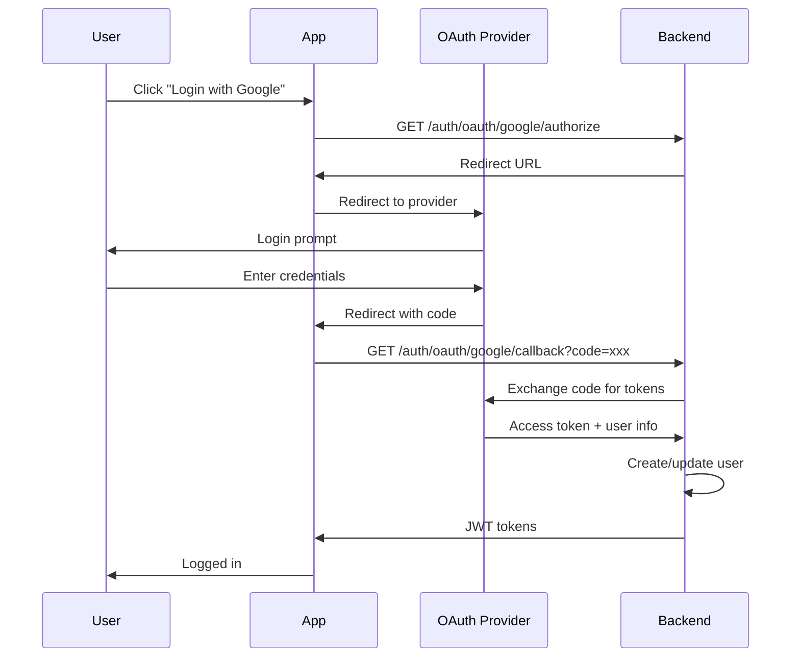
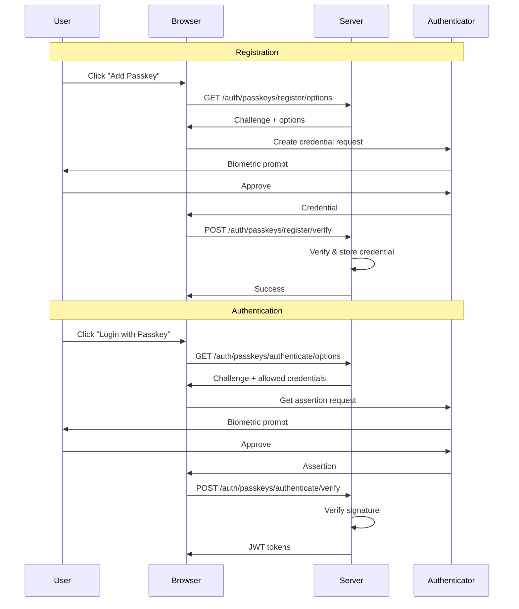
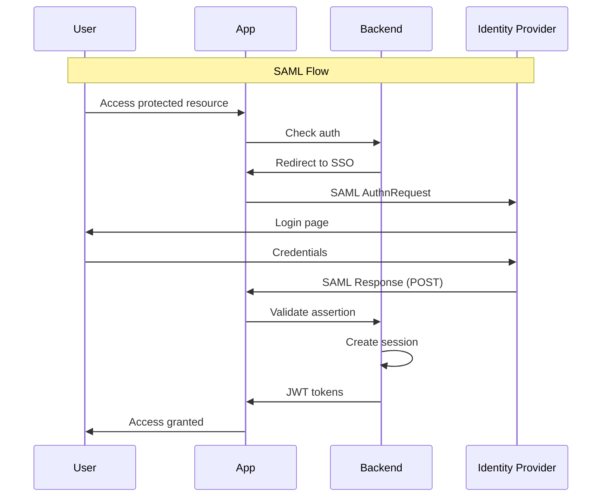

# Authentication Architecture

django-matt supports multiple authentication strategies that can be used independently or combined.

## Authentication Flow Overview



## JWT Authentication



## OAuth Flow



## Passkey/WebAuthn Flow



## Enterprise SSO Flow



## Auth Strategy Comparison

| Strategy | Use Case | Stateless | Security Level |
|----------|----------|-----------|----------------|
| JWT | APIs, SPAs | Yes | High |
| Session | Traditional web | No | High |
| API Keys | Service-to-service | Yes | Medium |
| OAuth | Social login | Yes | High |
| Passkeys | Passwordless | Yes | Very High |
| SSO | Enterprise | No | Very High |

## Configuration

```python
# settings.py
DJANGO_MATT = {
    "AUTH": {
        "JWT_SECRET": env("JWT_SECRET"),
        "JWT_ALGORITHM": "HS256",
        "ACCESS_TOKEN_LIFETIME": timedelta(minutes=15),
        "REFRESH_TOKEN_LIFETIME": timedelta(days=7),
    },
    "OAUTH": {
        "GOOGLE": {
            "CLIENT_ID": env("GOOGLE_CLIENT_ID"),
            "CLIENT_SECRET": env("GOOGLE_CLIENT_SECRET"),
        },
    },
}
```

## Related Documentation

- [JWT Details](../auth/jwt.md)
- [OAuth Providers](../auth/oauth.md)
- [Passkeys](../auth/passkeys.md)
- [Enterprise SSO](../auth/sso.md)
- [API Keys](../auth/api-keys.md)
