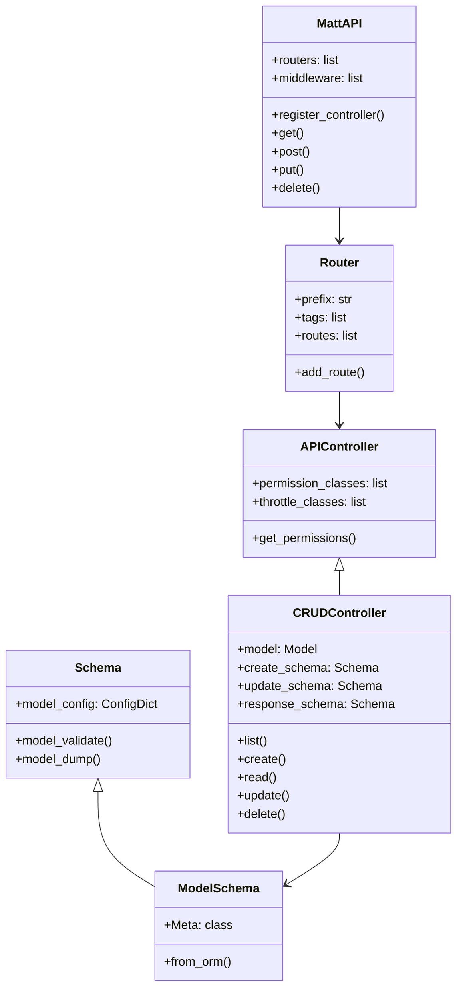
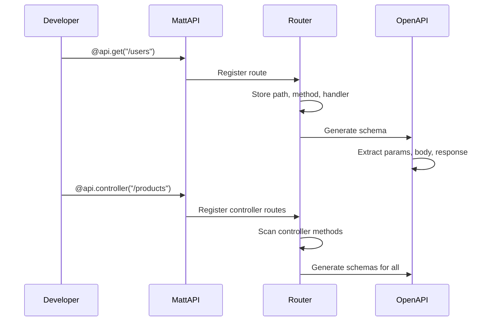
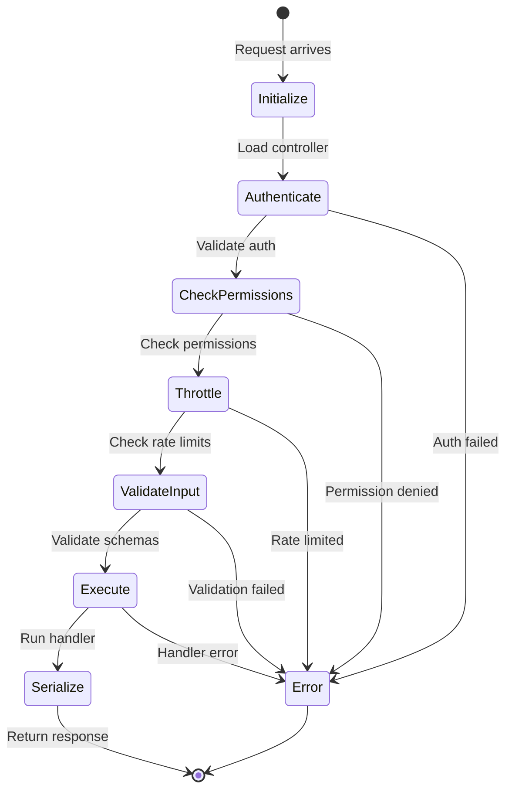
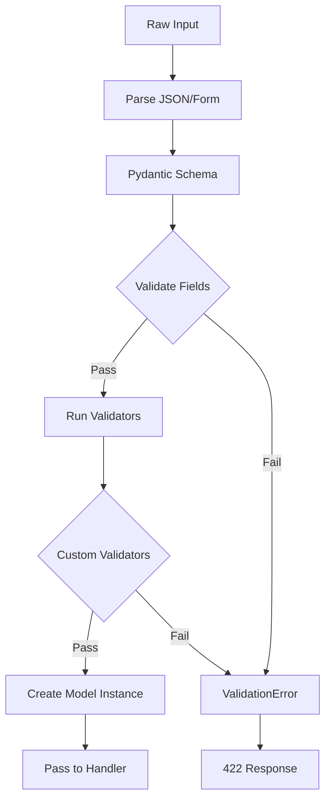
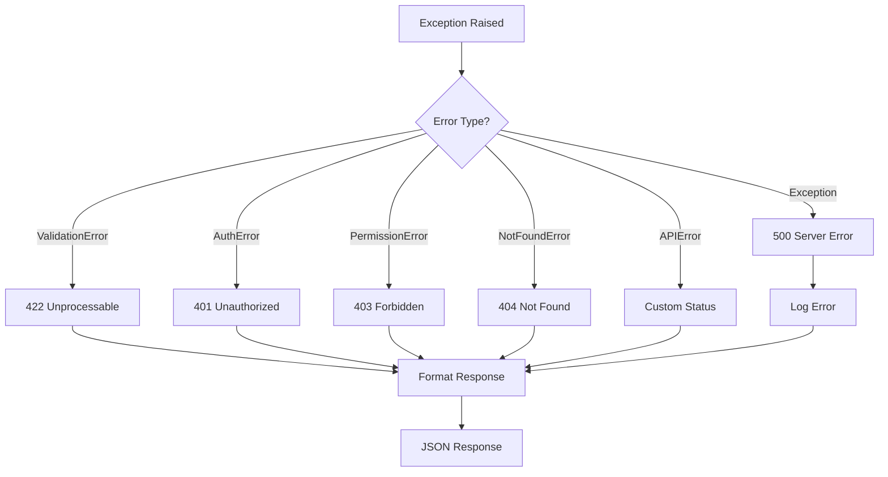

# Core Components Architecture

The core module provides the fundamental building blocks for API development.

## Component Hierarchy



## Route Registration Flow



## Controller Lifecycle



## Schema Validation



## Error Handling



## Code Examples

### Basic Controller

```python
from django_matt import MattAPI
from django_matt.core import APIController

api = MattAPI()

@api.controller("/users", tags=["Users"])
class UserController(APIController):

    @api.get("/")
    async def list(self, request):
        users = await User.objects.all()
        return [UserSchema.from_orm(u) for u in users]

    @api.get("/{user_id}")
    async def detail(self, request, user_id: int):
        user = await User.objects.aget(id=user_id)
        return UserSchema.from_orm(user)
```

### CRUD Controller

```python
from django_matt.core import CRUDController

@api.controller("/products", tags=["Products"])
class ProductController(CRUDController):
    model = Product
    create_schema = ProductCreate
    update_schema = ProductUpdate
    response_schema = ProductSchema

    # All CRUD methods auto-generated
    # Override for customization:
    async def list(self, request, **filters):
        qs = self.get_queryset().filter(is_active=True)
        return await self.paginate(qs)
```

### Schema Definition

```python
from django_matt.core import Schema, ModelSchema

class UserCreate(Schema):
    email: EmailStr
    password: str = Field(min_length=8)
    name: str = Field(max_length=100)

class UserSchema(ModelSchema):
    class Meta:
        model = User
        fields = ["id", "email", "name", "created_at"]
```

## Related Documentation

- [Routing](../core/routing.md)
- [Controllers](../core/controllers.md)
- [Schemas](../core/schemas.md)
- [Errors](../core/errors.md)
