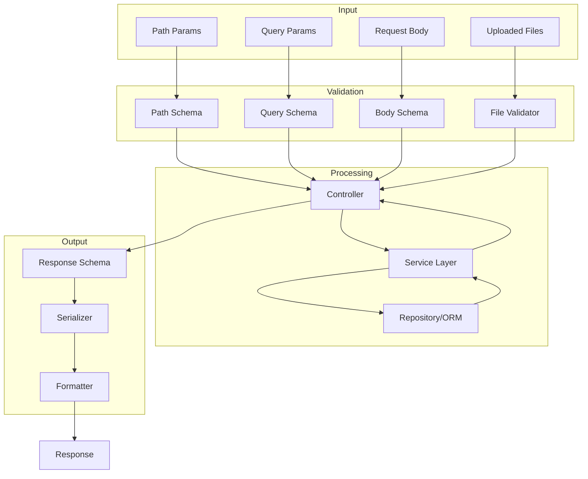
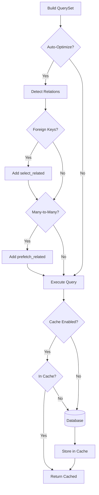
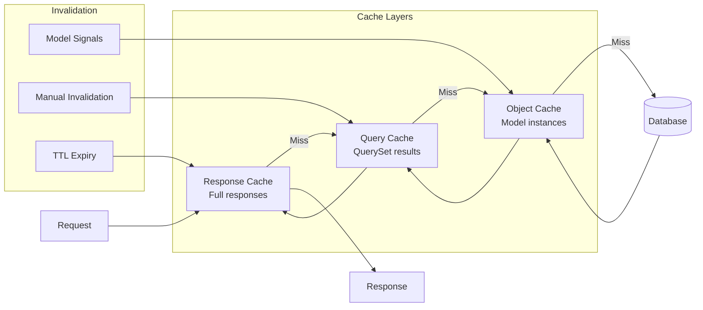
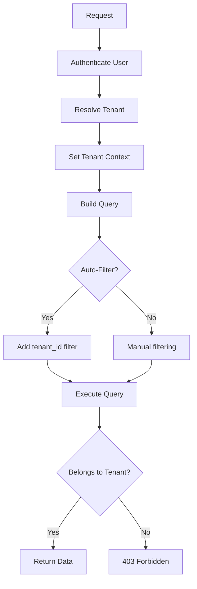
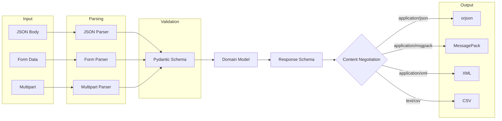

# Data Flow Architecture

This document describes how data flows through a django-matt application.

## Request Processing Pipeline

```mermaid
flowchart LR
    subgraph "Middleware Stack"
        M1[Security] --> M2[Session]
        M2 --> M3[Auth]
        M3 --> M4[Tenant]
        M4 --> M5[Throttle]
    end

    subgraph "Router"
        R1[URL Match] --> R2[Version Check]
        R2 --> R3[Content Negotiation]
    end

    subgraph "Handler"
        H1[Permission Check] --> H2[Input Validation]
        H2 --> H3[Controller Logic]
        H3 --> H4[Response Serialization]
    end

    REQ[Request] --> M1
    M5 --> R1
    R3 --> H1
    H4 --> RES[Response]
```

## Controller Data Flow

## Database Query Optimization

## Caching Strategy

## Multi-Tenant Data Isolation

## Serialization Flow

## Related Documentation

- [Caching](../performance/caching.md)
- [Query Optimization](../performance/optimization.md)
- [Content Negotiation](../features/content-negotiation.md)
- [Multi-tenancy](../multitenancy/overview.md)
