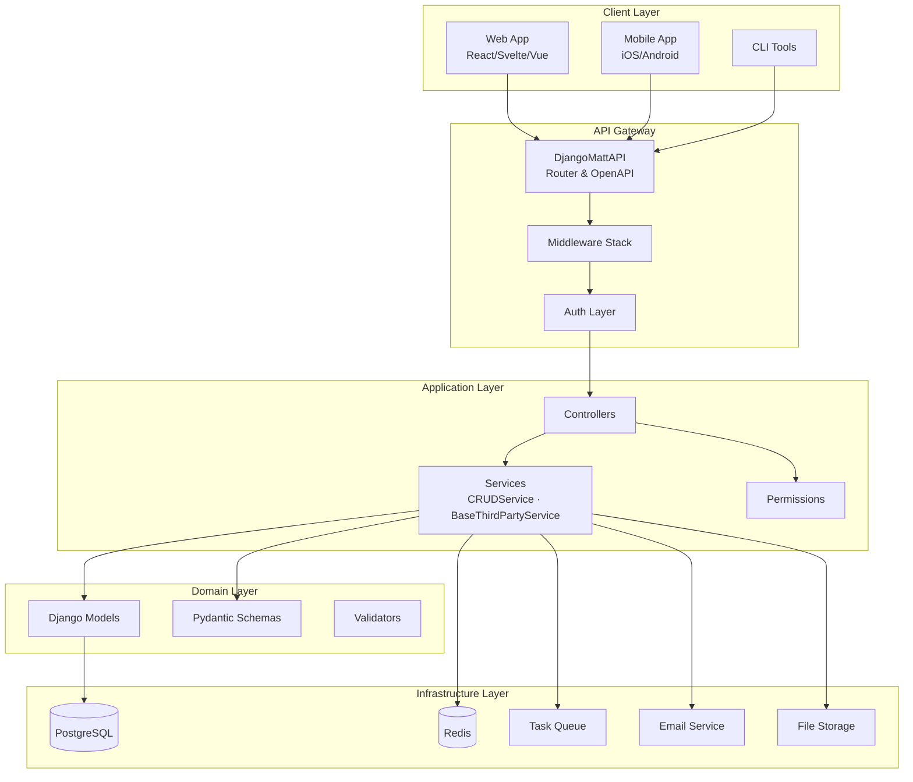
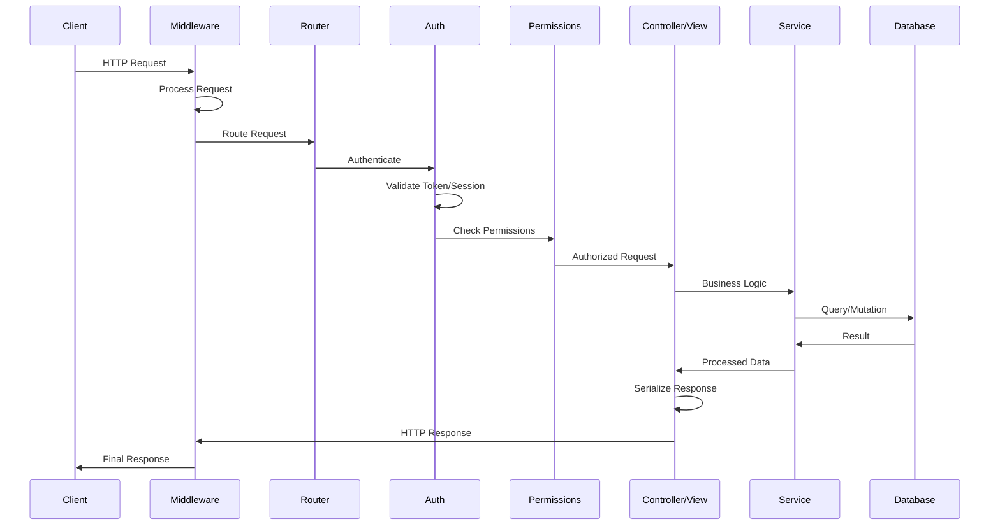
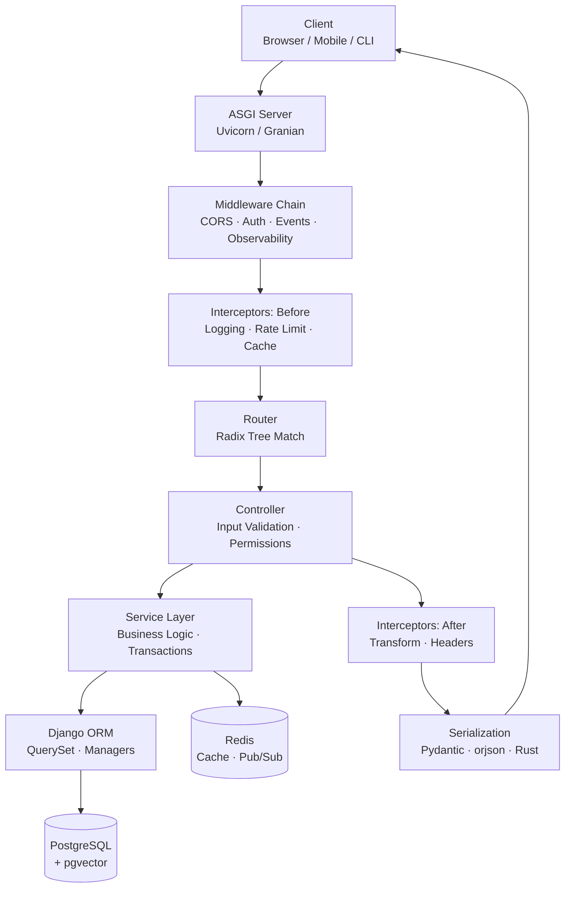
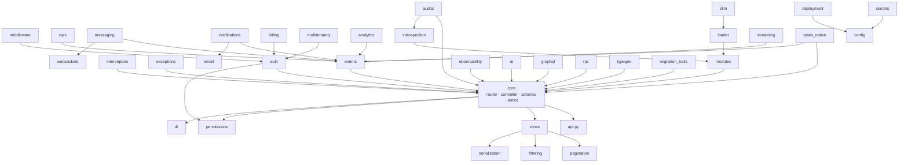

# Architecture Overview

django-matt is a modern Django meta-framework that consolidates multiple packages into a cohesive, async-first library for building production-ready APIs.

## High-Level Architecture



## Request Lifecycle



## Module Structure

```
django_matt/
├── api.py                    # DjangoMattAPI - Main entry point
├── slim.py                   # Slim mode config (full/slim/minimal/auto)
├── loader.py                 # Lazy/deferred module loading (LazyModuleProxy)
│
├── core/                     # Core framework components
│   ├── router.py            # Route decorators (@get, @post, etc.)
│   ├── controller.py        # Base controllers (APIController, CRUDController)
│   ├── schema.py            # Pydantic ModelSchema utilities
│   └── errors.py            # API error classes
│
├── auth/                     # Authentication & Authorization
│   ├── jwt.py               # JWT token handling
│   ├── session.py           # Session authentication
│   ├── api_keys/            # API key authentication
│   ├── oauth/               # OAuth providers (Google, GitHub, etc.)
│   ├── passkeys/            # WebAuthn/Passkeys
│   ├── sso/                 # Enterprise SSO (SAML, OIDC)
│   └── rbac/                # Role-based access control
│
├── views/                    # Composable CRUD views
│   ├── list.py              # ListView
│   ├── create.py            # CreateView
│   ├── read.py              # ReadView
│   ├── update.py            # UpdateView
│   └── delete.py            # DeleteView
│
├── permissions/              # Permission system
│   ├── base.py              # Base permission classes
│   └── decorators.py        # @authenticated, @requires_role, etc.
│
├── services/                 # Service layer
│   ├── base.py              # BaseService, CRUDService, ServiceError hierarchy
│   └── third_party.py       # BaseThirdPartyService, ThirdPartyServiceError
│
├── interceptors/             # Route-scoped pre/post-handler middleware
│   ├── base.py              # Interceptor base class and chain
│   ├── builtins.py          # Logging, timing, cache interceptors
│   ├── decorators.py        # @intercept decorator
│   └── chain.py             # InterceptorChain execution
│
├── exceptions/               # Exception filter system
│   ├── filters.py           # ExceptionFilter base class
│   ├── decorators.py        # @catch decorator
│   ├── builtins.py          # Built-in filters (404, 403, 422)
│   └── registry.py          # Global filter registry
│
├── events/                   # Async event bus (pub/sub)
│   ├── bus.py               # EventBus implementation
│   ├── decorators.py        # @on event subscriber
│   ├── middleware.py        # Event context middleware
│   └── backends.py          # InMemory, Redis backends
│
├── cqrs/                     # Command/Query buses and domain events
│   ├── commands.py          # Command bus and handlers
│   ├── queries.py           # Query bus and handlers
│   ├── events.py            # Domain events
│   └── middleware.py        # Bus middleware
│
├── di/                       # Dependency injection container
│
├── middleware/               # Global middleware utilities
│
├── config/                   # Modular configuration
│
├── openapi/                  # OpenAPI / Swagger / ReDoc generation
│
├── pagination/               # PageNumber, LimitOffset, Cursor
│
├── filtering/                # Filter, search, ordering backends
│
├── throttling/               # Rate limiting
│
├── versioning/               # API versioning strategies
│
├── negotiation/              # Content negotiation (JSON, XML, CSV, YAML, MsgPack)
│
├── serialization/            # Group-based field visibility
│   ├── groups.py            # Serialization group definitions
│   ├── fields.py            # Field visibility helpers
│   └── decorators.py        # @serialize_for
│
├── streaming/                # SSE and NDJSON streaming
│   ├── sse.py               # SSEResponse and helpers
│   ├── response.py          # Streaming response types
│   └── decorators.py        # @sse_endpoint
│
├── websockets/               # WebSocket consumers and routing
│   ├── consumers.py         # Base consumers
│   ├── routing.py           # WebSocket routing
│   └── auth.py              # WebSocket authentication
│
├── messaging/                # Real-time messaging
│   ├── models/              # Conversation, Message, Attachment
│   ├── services/            # ConversationService, MessageService
│   ├── controllers/         # REST API endpoints
│   └── realtime/            # WebSocket & polling transport
│
├── notifications/            # Multi-channel notifications (in-app, push, SMS)
│
├── email/                    # Transactional email
│   ├── providers/           # SMTP, SES, SendGrid, Mailgun
│   └── service.py           # EmailService
│
├── billing/                  # Subscription billing (Stripe, PayPal, Polar)
│   ├── providers/           # Payment provider adapters
│   ├── models.py            # Customer, Subscription, Invoice
│   └── controllers.py       # Billing API
│
├── multitenancy/             # B2B multi-tenant support
│   ├── models.py            # Organization, Team, Membership
│   └── controllers.py       # Tenant management API
│
├── analytics/                # Event tracking, sessions, funnels
│
├── experiments/              # A/B testing, multi-armed bandits
│
├── flags/                    # Feature flags (DB, Redis, LaunchDarkly, Unleash)
│
├── audit/                    # Audit logging and soft delete
│
├── ai/                       # LLM integration, embeddings, RAG
│
├── ml/                       # Vector storage, structured output
│
├── db/                       # PostgreSQL / pgvector helpers
│
├── files/                    # File uploads, S3/R2/MinIO storage
│   ├── storage/             # Storage backends
│   └── upload.py            # Upload handling & validation
│
├── tasks/                    # Background tasks (Celery, Dramatiq, Django-Q)
│   ├── backends/            # Backend adapters
│   └── decorators.py        # @task, @periodic_task
│
├── tasks_native/             # Native task engine (Django 6.0+)
│   ├── core.py              # Task registry and execution
│   ├── scheduling.py        # Periodic task scheduler
│   ├── retry.py             # Retry policies and DLQ
│   └── admin/               # Unfold dashboard integration
│
├── audits/                   # AI-assisted codebase audits
│   ├── framework.py         # Audit framework and runners
│   ├── bundle.py            # Bundle size analysis
│   ├── prompts/             # LLM audit prompt templates
│   └── agents/              # MCP tool integration
│
├── migration_tools/          # Migration acceleration
│   ├── baseline.py          # SQL baseline creation/loading
│   ├── parallel.py          # Parallel migration execution
│   ├── stats.py             # Migration statistics
│   └── squash.py            # Migration squashing
│
├── secrets/                  # Multi-backend secret management
│   ├── manager.py           # SecretStore
│   ├── backends.py          # env, Vault, AWS SM, GCP SM
│   └── rotation.py          # Rotation monitoring
│
├── introspection/            # Health checks, readiness/liveness probes
│   ├── checks.py            # Connectivity health checks
│   ├── endpoints.py         # /health, /ready, /info endpoints
│   └── registry.py          # Check registry
│
├── observability/            # Logging, metrics, tracing
│
├── rpc/                      # Typed inter-service HTTP client
│   ├── client.py            # RPC client implementation
│   └── generator.py         # Client code generation
│
├── modules/                  # Plugin system with lifecycle hooks
│   ├── base.py              # MattModule base class
│   ├── registry.py          # Module registry and discovery
│   └── hooks.py             # Lifecycle hook management
│
├── graphql/                  # Strawberry-based GraphQL schema generation
│
├── htmx/                     # HTMX helpers
│
├── components/               # Backend-served component system
│
├── inertia/                  # Inertia.js adapter
│
├── livewire/                 # Livewire-style reactivity
│
├── typegen/                  # TypeScript/Swift code generation
│
├── codegen/                  # Frontend code generation (React, Svelte, SolidJS)
│
├── sdkgen/                   # SDK generation
│
├── testing/                  # Test client, factories, assertions
│
├── admin/                    # Django Unfold integration, dashboards
│
├── dashboard/                # Admin dashboard widgets
│
├── cli/                      # Rich CLI commands
│
├── deployment/               # Docker, Fly, Railway, Render, AWS
│
├── servers/                  # Alternative ASGI server backends (Robyn, Granian)
│
├── batch/                    # Bulk data operations
│
├── prefetch/                 # Advanced prefetch utilities
│
├── forms/                    # Form handling helpers
│
├── advisor/                  # Code quality advisor
│
├── benchmarks/               # Performance benchmarking tools
│
├── codemods/                 # Code migration utilities
│
├── inspector/                # Request/response capture for dev
│
├── wasm/                     # WebAssembly integration
│
├── vite/                     # Vite dev server integration
│
├── tailwind/                 # Tailwind CSS helpers
│
└── utils/                    # Utilities
    └── performance.py       # Caching, serialization, benchmarks
```

## Layered Architecture



## Module Dependency Graph



## Layer Responsibilities

### API Layer
- Request routing and OpenAPI documentation
- Input validation via Pydantic schemas
- Response serialization
- Content negotiation (JSON, XML, CSV, etc.)

### Authentication Layer
- Multiple auth strategies (JWT, Session, API Keys, OAuth, Passkeys, SSO)
- Token validation and refresh
- User context injection

### Permission Layer
- Role-based access control (RBAC)
- Resource-level permissions
- Tenant isolation for multi-tenancy

### Service Layer

The service layer sits between the Application Layer (controllers) and the Domain/Infrastructure layers (models, external APIs). Controllers delegate all business logic to services; services own the domain behavior.

**Internal services** (`BaseService`, `CRUDService`) manage Django ORM operations:

```python
# myapp/services.py
from django_matt.services import CRUDService
from .models import Order

class OrderService(CRUDService["Order"]):
    model = Order

    def get_queryset(self):
        return super().get_queryset().select_related("user", "items")

    async def cancel(self, pk: int, user, reason: str) -> Order:
        return await self.update(pk, {"status": "cancelled", "cancel_reason": reason}, user=user)
```

**External services** (`BaseThirdPartyService`) wrap third-party HTTP APIs:

```python
# integrations/stripe_service.py
from django_matt.services import BaseThirdPartyService

class StripeService(BaseThirdPartyService):
    base_url = "https://api.stripe.com/v1"

    def _auth_headers(self) -> dict:
        from django.conf import settings
        return {"Authorization": f"Bearer {settings.STRIPE_SECRET_KEY}"}

    async def create_customer(self, email: str, name: str) -> dict:
        return await self._post("/customers", {"email": email, "name": name})
```

Responsibilities:
- Business logic encapsulation (keep controllers HTTP-only)
- Audit field management (`created_by`, `updated_by`)
- Soft-delete handling
- Atomic transactions around write operations
- Cross-cutting concerns (caching, logging)
- External service integration

### Data Layer
- Django ORM models
- Query optimization (select_related, prefetch_related)
- Soft delete support

## Design Principles

### 1. Async-First
All handlers support async/await for non-blocking I/O:

```python
@api.get("/users")
async def list_users(request):
    users = await User.objects.all().aiterator()
    return [UserSchema.from_orm(u) async for u in users]
```

### 2. Type Safety
Pydantic schemas for all request/response validation:

```python
class UserCreate(Schema):
    email: EmailStr
    password: str = Field(min_length=8)

@api.post("/users")
async def create_user(request, data: UserCreate) -> UserSchema:
    user = await User.objects.acreate(**data.model_dump())
    return UserSchema.from_orm(user)
```

### 3. Composability
Mix and match views and controllers:

```python
class ProductViewSet(APIViewSet):
    model = Product
    list = ListView(pagination_class=CursorPagination)
    create = CreateView(permission_classes=[IsAdmin])
    read = ReadView()
    # Omit update/delete for read-only resources
```

### 4. Convention Over Configuration
Sensible defaults with escape hatches:

```python
# Automatic schema generation
class UserController(CRUDController):
    model = User  # Schemas auto-generated from model

# Or explicit control
class UserController(CRUDController):
    model = User
    create_schema = UserCreateSchema
    response_schema = UserDetailSchema
```

## Next Steps

- [Core Components](./core.md) - Routing, controllers, and schemas
- [Authentication](./authentication.md) - Auth strategies and flows
- [Data Flow](./data-flow.md) - Request/response lifecycle
- [Service Layer](../services/index.md) - CRUDService, BaseThirdPartyService, patterns
- [Messaging](../messaging/overview.md) - Real-time messaging
- [Notifications](../notifications/overview.md) - Multi-channel notifications
- [Email](../email/overview.md) - Transactional email
