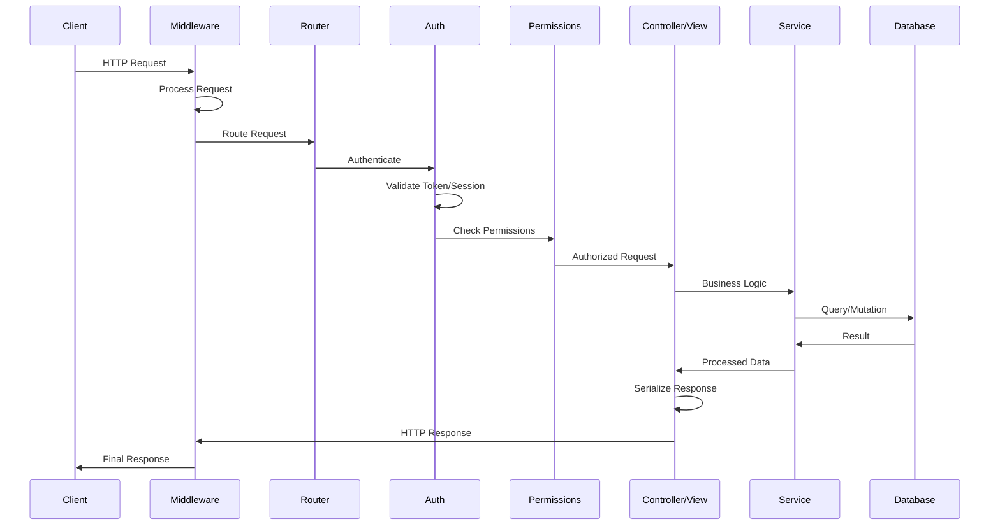

# Architecture Overview

django-matt is a modern Django meta-framework that consolidates multiple packages into a cohesive, async-first library for building production-ready APIs.

## High-Level Architecture


## Request Lifecycle



## Module Structure

```
django_matt/
├── api.py                    # MattAPI - Main entry point
├── core/                     # Core framework components
│   ├── router.py            # Route decorators (@get, @post, etc.)
│   ├── controller.py        # Base controllers (APIController, CRUDController)
│   ├── schema.py            # Pydantic ModelSchema utilities
│   └── errors.py            # API error classes
│
├── auth/                     # Authentication & Authorization
│   ├── jwt.py               # JWT token handling
│   ├── session.py           # Session authentication
│   ├── api_keys/            # API key authentication
│   ├── oauth/               # OAuth providers (Google, GitHub, etc.)
│   ├── passkeys/            # WebAuthn/Passkeys
│   ├── sso/                 # Enterprise SSO (SAML, OIDC)
│   └── rbac/                # Role-based access control
│
├── views/                    # Composable CRUD views
│   ├── list.py              # ListView
│   ├── create.py            # CreateView
│   ├── read.py              # ReadView
│   ├── update.py            # UpdateView
│   └── delete.py            # DeleteView
│
├── permissions/              # Permission system
│   ├── base.py              # Base permission classes
│   └── decorators.py        # @authenticated, @requires_role, etc.
│
├── services/                 # Service layer
│   ├── base.py              # BaseService, CRUDService, ServiceError hierarchy
│   └── third_party.py       # BaseThirdPartyService, ThirdPartyServiceError
│
├── messaging/                # Real-time messaging
│   ├── models/              # Conversation, Message, Attachment
│   ├── services/            # ConversationService, MessageService
│   ├── controllers/         # REST API endpoints
│   └── realtime/            # WebSocket & polling transport
│
├── notifications/            # Multi-channel notifications
│   ├── models/              # Notification, Preferences, Rules
│   ├── services/            # NotificationService, DeliveryService
│   └── controllers/         # Notification API
│
├── email/                    # Email service
│   ├── providers/           # SMTP, SES, SendGrid, Mailgun
│   ├── models.py            # EmailMessage, Template, Events
│   └── service.py           # EmailService
│
├── billing/                  # Subscription billing
│   ├── providers/           # Stripe, PayPal, Polar
│   ├── models.py            # Customer, Subscription, Invoice
│   └── controllers.py       # Billing API
│
├── multitenancy/             # B2B multi-tenant support
│   ├── models.py            # Organization, Team, Membership
│   └── controllers.py       # Tenant management API
│
├── components/               # Backend-served UI components
│   ├── base.py              # Component base classes
│   ├── forms.py             # Form components
│   ├── layout.py            # Layout components
│   └── renderers/           # JSON, HTML, React renderers
│
├── websockets/               # WebSocket support
│   ├── consumers.py         # Base consumers
│   ├── routing.py           # WebSocket routing
│   └── auth.py              # WebSocket authentication
│
├── codegen/                  # Frontend code generation
│   ├── typescript.py        # TypeScript types & Zod schemas
│   ├── react.py             # React components & hooks
│   ├── svelte.py            # Svelte components & stores
│   └── solid.py             # SolidJS components
│
├── tasks/                    # Background task queue
│   ├── backends/            # Celery, Dramatiq, Django-Q
│   └── decorators.py        # @task, @periodic_task
│
├── files/                    # File handling
│   ├── storage/             # S3, R2, MinIO, Local
│   └── upload.py            # Upload handling & validation
│
├── deployment/               # Deployment utilities
│   ├── providers/           # Fly, Railway, Render, AWS, etc.
│   └── docker.py            # Dockerfile generation
│
├── cli/                      # CLI infrastructure
│   ├── base.py              # Command base classes
│   ├── console.py           # Rich terminal output
│   └── prompts.py           # Interactive prompts
│
└── utils/                    # Utilities
    ├── performance.py       # Caching, serialization, benchmarks
    └── hot_reload.py        # Development hot reloading
```

## Layer Responsibilities

### API Layer
- Request routing and OpenAPI documentation
- Input validation via Pydantic schemas
- Response serialization
- Content negotiation (JSON, XML, CSV, etc.)

### Authentication Layer
- Multiple auth strategies (JWT, Session, API Keys, OAuth, Passkeys, SSO)
- Token validation and refresh
- User context injection

### Permission Layer
- Role-based access control (RBAC)
- Resource-level permissions
- Tenant isolation for multi-tenancy

### Service Layer

The service layer sits between the Application Layer (controllers) and the Domain/Infrastructure layers (models, external APIs). Controllers delegate all business logic to services; services own the domain behavior.

**Internal services** (`BaseService`, `CRUDService`) manage Django ORM operations:

```python
# myapp/services.py
from django_matt.services import CRUDService
from .models import Order

class OrderService(CRUDService["Order"]):
    model = Order

    def get_queryset(self):
        return super().get_queryset().select_related("user", "items")

    async def cancel(self, pk: int, user, reason: str) -> Order:
        return await self.update(pk, {"status": "cancelled", "cancel_reason": reason}, user=user)
```

**External services** (`BaseThirdPartyService`) wrap third-party HTTP APIs:

```python
# integrations/stripe_service.py
from django_matt.services import BaseThirdPartyService

class StripeService(BaseThirdPartyService):
    base_url = "https://api.stripe.com/v1"

    def _auth_headers(self) -> dict:
        from django.conf import settings
        return {"Authorization": f"Bearer {settings.STRIPE_SECRET_KEY}"}

    async def create_customer(self, email: str, name: str) -> dict:
        return await self._post("/customers", {"email": email, "name": name})
```

Responsibilities:
- Business logic encapsulation (keep controllers HTTP-only)
- Audit field management (`created_by`, `updated_by`)
- Soft-delete handling
- Atomic transactions around write operations
- Cross-cutting concerns (caching, logging)
- External service integration

### Data Layer
- Django ORM models
- Query optimization (select_related, prefetch_related)
- Soft delete support

## Design Principles

### 1. Async-First
All handlers support async/await for non-blocking I/O:

```python
@api.get("/users")
async def list_users(request):
    users = await User.objects.all().aiterator()
    return [UserSchema.from_orm(u) async for u in users]
```

### 2. Type Safety
Pydantic schemas for all request/response validation:

```python
class UserCreate(Schema):
    email: EmailStr
    password: str = Field(min_length=8)

@api.post("/users")
async def create_user(request, data: UserCreate) -> UserSchema:
    user = await User.objects.acreate(**data.model_dump())
    return UserSchema.from_orm(user)
```

### 3. Composability
Mix and match views and controllers:

```python
class ProductViewSet(APIViewSet):
    model = Product
    list = ListView(pagination_class=CursorPagination)
    create = CreateView(permission_classes=[IsAdmin])
    read = ReadView()
    # Omit update/delete for read-only resources
```

### 4. Convention Over Configuration
Sensible defaults with escape hatches:

```python
# Automatic schema generation
class UserController(CRUDController):
    model = User  # Schemas auto-generated from model

# Or explicit control
class UserController(CRUDController):
    model = User
    create_schema = UserCreateSchema
    response_schema = UserDetailSchema
```

## Next Steps

- [Core Components](./core.md) - Routing, controllers, and schemas
- [Authentication](./authentication.md) - Auth strategies and flows
- [Data Flow](./data-flow.md) - Request/response lifecycle
- [Service Layer](../services/index.md) - CRUDService, BaseThirdPartyService, patterns
- [Messaging](../messaging/overview.md) - Real-time messaging
- [Notifications](../notifications/overview.md) - Multi-channel notifications
- [Email](../email/overview.md) - Transactional email
