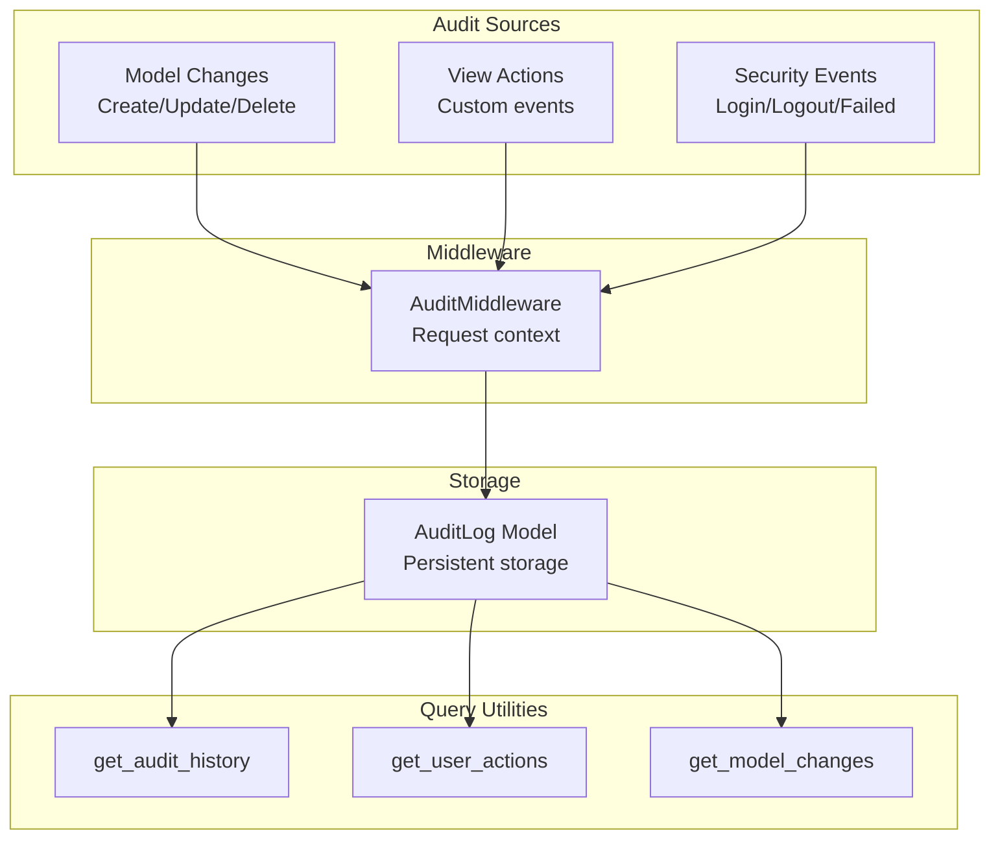

# Audit Logging

Django Matt provides comprehensive audit logging for tracking model changes, user actions, and security events.

## Overview



## Quick Start

### Enable Audit Middleware

```python
# settings.py
MIDDLEWARE = [
    ...
    'django_matt.audit.AuditMiddleware',
]
```

### Make Models Auditable

```python
from django.db import models
from django_matt.audit import AuditableMixin

class Article(AuditableMixin, models.Model):
    title = models.CharField(max_length=200)
    content = models.TextField()
    published = models.BooleanField(default=False)

# All changes are now automatically logged!
```

### Query Audit History

```python
from django_matt.audit import get_audit_history, get_user_actions

# Get history for a specific object
history = get_audit_history(article)
for entry in history:
    print(f"{entry.action} by {entry.user} at {entry.timestamp}")
    print(f"Changes: {entry.changes}")

# Get all actions by a user
actions = get_user_actions(user, days=30)
```

## AuditableMixin

Add automatic change tracking to any model:

```python
from django_matt.audit import AuditableMixin

class Product(AuditableMixin, models.Model):
    name = models.CharField(max_length=100)
    price = models.DecimalField(max_digits=10, decimal_places=2)
    stock = models.IntegerField()

    class Meta:
        # Optional: exclude fields from audit
        audit_exclude_fields = ['updated_at']

        # Optional: include only specific fields
        audit_include_fields = ['name', 'price']
```

### What Gets Logged

- **CREATE**: All field values
- **UPDATE**: Old and new values for changed fields
- **DELETE**: All field values at deletion time

```python
# Example audit log entry
{
    "action": "UPDATE",
    "model": "myapp.Product",
    "object_id": "123",
    "user": "john@example.com",
    "timestamp": "2024-01-15T10:30:00Z",
    "changes": {
        "price": {"old": "99.99", "new": "89.99"},
        "stock": {"old": 100, "new": 95}
    },
    "ip_address": "192.168.1.1",
    "user_agent": "Mozilla/5.0..."
}
```

## Decorators

### @log_action

Log custom actions on views:

```python
from django_matt.audit import log_action, AuditAction

@api.post("/articles/{id}/publish")
@log_action(AuditAction.CUSTOM, description="Published article")
async def publish_article(request, id: int):
    article = Article.objects.get(id=id)
    article.published = True
    article.save()
    return article
```

### @audit_action

More detailed action logging:

```python
from django_matt.audit import audit_action

@api.post("/orders/{id}/refund")
@audit_action(
    action="REFUND",
    description="Refunded order",
    include_request_data=True,
)
async def refund_order(request, id: int, data: RefundRequest):
    order = Order.objects.get(id=id)
    process_refund(order, data.amount)
    return {"refunded": data.amount}
```

### @skip_audit

Temporarily disable audit logging:

```python
from django_matt.audit import skip_audit

@skip_audit
def bulk_import(data):
    """Import without creating audit entries."""
    for item in data:
        Product.objects.create(**item)
```

## AuditAction Enum

```python
from django_matt.audit import AuditAction

class AuditAction:
    CREATE = "CREATE"
    UPDATE = "UPDATE"
    DELETE = "DELETE"
    LOGIN = "LOGIN"
    LOGOUT = "LOGOUT"
    LOGIN_FAILED = "LOGIN_FAILED"
    PASSWORD_CHANGE = "PASSWORD_CHANGE"
    PERMISSION_CHANGE = "PERMISSION_CHANGE"
    EXPORT = "EXPORT"
    IMPORT = "IMPORT"
    CUSTOM = "CUSTOM"
```

## Context Manager

Group related operations:

```python
from django_matt.audit import audit_context

with audit_context(description="Bulk price update"):
    for product in products:
        product.price *= 1.1
        product.save()

# All saves within context are grouped in audit log
```

## Query Utilities

### get_audit_history

```python
from django_matt.audit import get_audit_history

# For a specific object
history = get_audit_history(article)

# With filters
history = get_audit_history(
    article,
    actions=["UPDATE", "DELETE"],
    since=datetime(2024, 1, 1),
    until=datetime(2024, 12, 31),
)

# For a model class
all_article_history = get_audit_history(Article)
```

### get_user_actions

```python
from django_matt.audit import get_user_actions

# All actions by user
actions = get_user_actions(user)

# Recent actions
actions = get_user_actions(user, days=7)

# Filtered by action type
actions = get_user_actions(user, actions=["LOGIN", "LOGIN_FAILED"])
```

### get_model_changes

```python
from django_matt.audit import get_model_changes

# Track changes to a specific field
price_changes = get_model_changes(
    Product,
    field="price",
    since=datetime(2024, 1, 1),
)

for change in price_changes:
    print(f"{change.object_id}: {change.old_value} -> {change.new_value}")
```

### get_recent_activity

```python
from django_matt.audit import get_recent_activity

# Get recent activity across all models
activity = get_recent_activity(limit=50)

# Filter by user
activity = get_recent_activity(user=request.user, limit=20)
```

## Security Events

Track security-related events:

```python
from django_matt.audit import get_security_events, get_failed_logins_by_ip

# Get security events
events = get_security_events(days=7)

# Find suspicious IPs
suspicious = get_failed_logins_by_ip(
    min_failures=5,
    hours=24,
)
for ip, count in suspicious:
    print(f"{ip}: {count} failed attempts")
```

## Signals

Hook into audit events:

```python
from django_matt.audit import pre_audit, post_audit

@pre_audit.connect
def before_audit(sender, instance, action, changes, **kwargs):
    """Called before audit log is created."""
    if action == "DELETE" and isinstance(instance, SensitiveModel):
        # Extra validation or notification
        notify_admins(f"Deleting sensitive record: {instance}")

@post_audit.connect
def after_audit(sender, log_entry, **kwargs):
    """Called after audit log is created."""
    if log_entry.action == "LOGIN_FAILED":
        check_for_brute_force(log_entry.ip_address)
```

## Export & Cleanup

### Export Logs

```python
from django_matt.audit import export_audit_logs

# Export to JSON
export_audit_logs(
    output="audit_2024.json",
    format="json",
    since=datetime(2024, 1, 1),
    until=datetime(2024, 12, 31),
)

# Export to CSV
export_audit_logs(
    output="audit_2024.csv",
    format="csv",
    models=["myapp.Product", "myapp.Order"],
)
```

### Cleanup Old Logs

```python
from django_matt.audit import cleanup_old_logs

# Delete logs older than 90 days
deleted = cleanup_old_logs(days=90)
print(f"Deleted {deleted} old audit entries")

# Keep security events longer
deleted = cleanup_old_logs(
    days=90,
    exclude_actions=["LOGIN_FAILED", "PERMISSION_CHANGE"],
)
```

### Scheduled Cleanup

```python
# tasks.py
from django_matt.tasks import periodic_task
from django_matt.audit import cleanup_old_logs

@periodic_task(crontab(hour=2, minute=0))
def cleanup_audit_logs():
    cleanup_old_logs(days=90)
```

## AuditLog Model

The audit log model stores all entries:

```python
from django_matt.audit import AuditLog

class AuditLog(models.Model):
    # What happened
    action = models.CharField(max_length=50)
    description = models.TextField(blank=True)

    # What was affected
    content_type = models.ForeignKey(ContentType)
    object_id = models.CharField(max_length=255)
    object_repr = models.CharField(max_length=255)

    # Who did it
    user = models.ForeignKey(User, null=True)
    user_email = models.EmailField(blank=True)

    # Request context
    ip_address = models.GenericIPAddressField(null=True)
    user_agent = models.TextField(blank=True)

    # Change details
    changes = models.JSONField(default=dict)
    extra_data = models.JSONField(default=dict)

    # When
    timestamp = models.DateTimeField(auto_now_add=True)
```

## Configuration

```python
# settings.py
DJANGO_MATT_AUDIT = {
    # Enable/disable audit logging
    "ENABLED": True,

    # Log to database
    "BACKEND": "database",  # or "file", "elasticsearch"

    # Exclude certain models
    "EXCLUDE_MODELS": [
        "sessions.Session",
        "admin.LogEntry",
    ],

    # Exclude certain fields globally
    "EXCLUDE_FIELDS": [
        "password",
        "secret_key",
        "api_key",
    ],

    # Auto-cleanup
    "RETENTION_DAYS": 90,

    # Capture request data
    "LOG_REQUEST_DATA": False,  # Be careful with sensitive data
}
```

## Admin Integration

```python
from django.contrib import admin
from django_matt.audit import AuditLog

@admin.register(AuditLog)
class AuditLogAdmin(admin.ModelAdmin):
    list_display = ["timestamp", "action", "user", "object_repr", "ip_address"]
    list_filter = ["action", "content_type", "timestamp"]
    search_fields = ["user__email", "object_repr", "ip_address"]
    readonly_fields = ["__all__"]
    date_hierarchy = "timestamp"

    def has_add_permission(self, request):
        return False

    def has_change_permission(self, request, obj=None):
        return False

    def has_delete_permission(self, request, obj=None):
        return request.user.is_superuser
```

## Best Practices

1. **Use middleware** - Always enable AuditMiddleware for request context
2. **Exclude sensitive fields** - Don't log passwords or secrets
3. **Retention policy** - Set up automatic cleanup for old logs
4. **Security monitoring** - Use security event queries for anomaly detection
5. **Export regularly** - Archive logs before cleanup for compliance
6. **Index wisely** - Add database indexes for common query patterns
7. **Test audit coverage** - Ensure critical models are auditable
