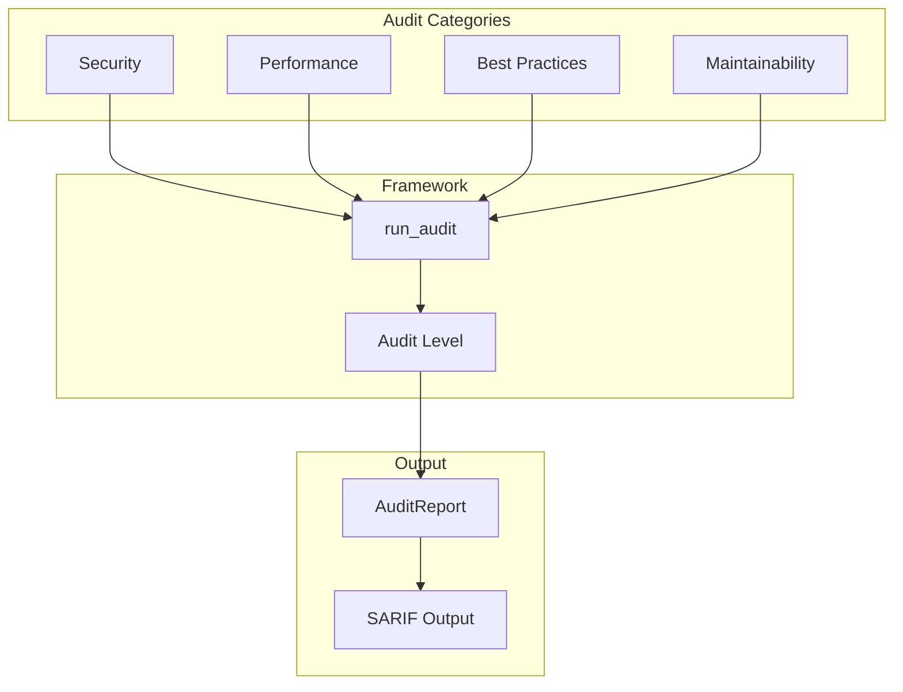

# AI-Assisted Codebase Audits

> Stage 17B: Multi-perspective code analysis with LLM integration.



## Quick Start

```bash
# Run all audits
python manage.py matt_audit

# Security audit with strict level
python manage.py matt_audit security --level strict

# Bundle size analysis
python manage.py matt_audit bundle

# Generate LLM context
python manage.py matt_audit context --for claude
```

## Audit Categories

### Security Audit

Detects vulnerabilities and security issues:

- SQL injection risks
- XSS vulnerabilities
- CSRF protection gaps
- Secrets exposure in code
- Authentication bypass
- Permission issues
- Unsafe deserializations

```bash
python manage.py matt_audit security --level paranoid
```

### Performance Audit

Identifies performance bottlenecks:

- N+1 query patterns
- Missing database indexes
- Inefficient ORM usage
- Cache miss opportunities
- Async/await opportunities
- Memory leaks
- Slow serialization

```bash
python manage.py matt_audit performance
```

### Best Practices Audit

Checks code quality and standards:

- Missing type hints
- Incomplete docstrings
- Test coverage gaps
- Deprecated API usage
- Django conventions
- Code duplication

```bash
python manage.py matt_audit best_practices
```

### Maintainability Audit

Analyzes code health:

- Cyclomatic complexity
- Function/class size
- Dependency health
- Dead code detection
- Tech debt markers

```bash
python manage.py matt_audit maintainability
```

## Audit Levels

| Level | Description |
|-------|-------------|
| `relaxed` | Critical issues only |
| `standard` | Critical + important issues (default) |
| `strict` | All issues including suggestions |
| `paranoid` | Security-focused, warnings as errors |

```python
from django_matt.audits import run_audit, AuditLevel, AuditCategory

report = run_audit(
    categories=[AuditCategory.SECURITY],
    level=AuditLevel.STRICT,
)
```

## Output Formats

### Text (default)

```bash
python manage.py matt_audit --format text
```

### JSON

```bash
python manage.py matt_audit --format json > audit-results.json
```

### Markdown

```bash
python manage.py matt_audit --format markdown > AUDIT.md
```

### SARIF (GitHub Code Scanning)

```bash
python manage.py matt_audit --format sarif > results.sarif
```

Upload to GitHub Security tab for inline annotations.

## Bundle Size Analysis

Analyze module usage and optimize startup time:

```bash
python manage.py matt_audit bundle
```

Output:

```
Bundle Analysis
===============

Unused Modules:
  - django_matt.graphql (0 imports)
  - django_matt.websockets (0 imports)
  - django_matt.analytics (0 imports)

Heavy Imports:
  - django_matt.ai: 245ms startup
  - django_matt.admin: 180ms startup

Recommended SlimConfig:
  MATT_SLIM = {
      "mode": "slim",
      "exclude": ["graphql", "websockets", "analytics"],
      "lazy": ["ai", "admin"],
  }

Potential savings: 425ms startup, 2.3MB memory
```

## LLM Prompt Helpers

Generate context for AI-assisted code review:

```bash
# For Claude
python manage.py matt_audit context --for claude

# For GPT
python manage.py matt_audit context --for gpt

# Custom format
python manage.py matt_audit context --format xml
```

### Built-in Prompts

```python
from django_matt.audits.prompts import get_prompt

# Available prompts
prompts = [
    "security_audit",
    "performance_review",
    "api_design_review",
    "database_optimization",
    "test_coverage_gaps",
    "refactoring_suggestions",
]

prompt = get_prompt("security_audit", project_context=context)
```

### Context Generator

```python
from django_matt.audits.prompts import generate_context

# Generate project context for LLM
context = generate_context(
    include_settings=True,
    include_models=True,
    include_routes=True,
    include_patterns=True,
    format="markdown",  # or "xml", "json"
)
```

### Response Parser

```python
from django_matt.audits.prompts import parse_llm_response

# Parse LLM response into structured findings
findings = parse_llm_response(
    llm_output,
    expected_format="claude",  # or "gpt"
)

for finding in findings:
    print(f"{finding.severity}: {finding.message}")
```

## MCP Tool Integration

For Cursor IDE and Claude Code, 5 MCP tools are available:

| Tool | Description |
|------|-------------|
| `run_django_matt_audit` | Run audit with category and level |
| `analyze_bundle_size` | Get bundle analysis report |
| `get_audit_prompt` | Get prompt template for category |
| `generate_project_context` | Generate LLM context |
| `fix_audit_finding` | Apply automated fix for finding |

### Cursor Rules Generator

```bash
python manage.py matt_audit cursor-rules > .cursorrules
```

### Claude Code Generator

```bash
python manage.py matt_audit claude-md > CLAUDE.md
```

## Programmatic API

```python
from django_matt.audits import (
    run_audit,
    AuditLevel,
    AuditCategory,
    AuditFinding,
    AuditReport,
)

# Run security audit
report: AuditReport = run_audit(
    categories=[AuditCategory.SECURITY, AuditCategory.PERFORMANCE],
    level=AuditLevel.STRICT,
    paths=["myapp/", "api/"],
)

# Process findings
for finding in report.findings:
    if finding.severity == "critical":
        print(f"CRITICAL: {finding.file}:{finding.line}")
        print(f"  {finding.message}")
        if finding.suggestion:
            print(f"  Fix: {finding.suggestion}")
```

## Custom Auditors

Create your own auditor:

```python
from django_matt.audits import BaseAuditor, AuditFinding, AuditSeverity

class MyCustomAuditor(BaseAuditor):
    name = "custom"
    category = AuditCategory.BEST_PRACTICES

    def audit_file(self, path: Path, content: str) -> list[AuditFinding]:
        findings = []

        # Your audit logic here
        if "TODO" in content:
            findings.append(AuditFinding(
                id="CUSTOM001",
                severity=AuditSeverity.LOW,
                category=self.category,
                message="Found TODO comment",
                file=str(path),
                line=self._find_line(content, "TODO"),
            ))

        return findings
```

Register:

```python
from django_matt.audits import register_auditor

register_auditor(MyCustomAuditor())
```

## CI/CD Integration

### GitHub Actions

```yaml
- name: Run security audit
  run: |
    python manage.py matt_audit security --level strict --format sarif > results.sarif

- name: Upload SARIF
  uses: github/codeql-action/upload-sarif@v2
  with:
    sarif_file: results.sarif
```

### Pre-commit Hook

```yaml
# .pre-commit-config.yaml
repos:
  - repo: local
    hooks:
      - id: matt-audit
        name: Django Matt Audit
        entry: python manage.py matt_audit security --level standard
        language: system
        pass_filenames: false
```

## Documentation Tools

Check and improve documentation coverage:

```bash
# Show coverage stats
python manage.py matt_docs coverage

# Generate docstring stubs
python manage.py matt_docs stubs --output DOCS_TODO.md

# Find missing type hints
python manage.py matt_docs hints
```

## See Also

- [Security Auditor Details](./security.md)
- [Performance Auditor Details](./performance.md)
- [Bundle Analyzer](./bundle.md)
- [LLM Prompts Reference](./prompts.md)
- [MCP Tools](./mcp-tools.md)
