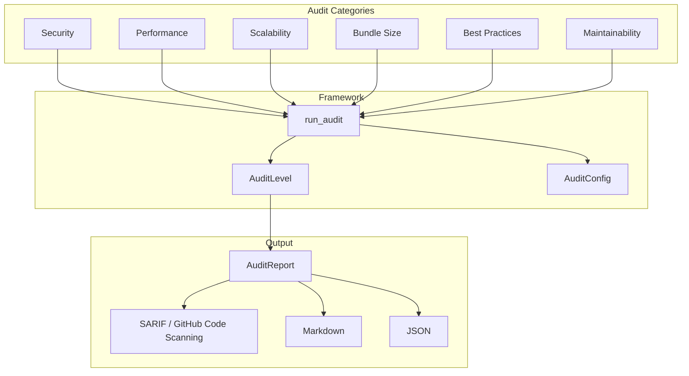

# AI-Assisted Codebase Audits

> Stage 17B — shipped. The `matt_audit` management command and `django_matt.audits` module are implemented and functional. LLM-agent-driven auto-fix (`--fix`), watch mode (`--watch`), and MCP tool integrations are planned for a future release.



## Implementation Status

| Feature | Status |
|---------|--------|
| `matt_audit` management command | Shipped |
| Security, Performance, Scalability, Best Practices, Maintainability auditors | Shipped |
| Bundle size analysis (`matt_audit bundle`) | Shipped |
| LLM context generation (`matt_audit context`) | Shipped |
| SARIF output (GitHub Code Scanning integration) | Shipped |
| Markdown / JSON output formats | Shipped |
| CI mode (`--ci`, `--fail-on`) | Shipped |
| `--diff` mode (audit only changed files) | Shipped |
| Custom auditor registration API | Shipped |
| Programmatic `run_audit()` Python API | Shipped |
| MCP tools for Cursor / Claude Code | Planned |
| LLM-agent-driven auto-fix (`--fix`) | Planned |
| Watch mode (`--watch`) | Planned |

## Quick Start

```bash
# Run all audits
python manage.py matt_audit

# Security audit at strict level
python manage.py matt_audit security --level strict

# Bundle size analysis
python manage.py matt_audit bundle

# Generate LLM context for Claude
python manage.py matt_audit context --for claude
```

## Audit Categories

### Security

Detects vulnerabilities:

- SQL injection risks
- XSS vulnerabilities
- CSRF protection gaps
- Secrets exposed in source
- Authentication bypass
- Permission issues
- Unsafe deserializations

```bash
python manage.py matt_audit security --level paranoid
```

### Performance

Identifies bottlenecks:

- N+1 query patterns
- Missing database indexes
- Inefficient ORM usage
- Cache miss opportunities
- Async/await opportunities
- Memory leaks
- Slow serialization

```bash
python manage.py matt_audit performance
```

### Scalability

Reviews architectural scale limits:

- Blocking synchronous code in async paths
- Unbounded querysets
- Missing pagination
- Rate-limiting gaps

```bash
python manage.py matt_audit scalability
```

### Best Practices

Checks code quality:

- Missing type hints
- Incomplete docstrings
- Test coverage gaps
- Deprecated API usage
- Django conventions
- Code duplication

```bash
python manage.py matt_audit best_practices
```

### Maintainability

Analyzes code health:

- Cyclomatic complexity
- Function/class size
- Dependency health
- Dead code detection
- Tech debt markers

```bash
python manage.py matt_audit maintainability
```

## Audit Levels

Four strictness levels control which findings are reported and how the exit code behaves in CI mode:

| Level | Enum | Description |
|-------|------|-------------|
| `relaxed` | `AuditLevel.RELAXED` | Critical issues only — minimal noise, use for legacy codebases |
| `standard` | `AuditLevel.STANDARD` | Critical + high severity (default) — recommended for CI |
| `strict` | `AuditLevel.STRICT` | All issues including medium/low suggestions |
| `paranoid` | `AuditLevel.PARANOID` | Security-focused — warnings treated as errors, highest signal for security reviews |

In CI mode (`--ci`), the command exits non-zero when any finding meets or exceeds the `--fail-on` threshold (default: `critical`):
```bash
python manage.py matt_audit --ci                   # fail on critical
python manage.py matt_audit --ci --fail-on high    # fail on high+
python manage.py matt_audit --ci --fail-on medium  # fail on medium+
```

```python
from django_matt.audits import run_audit, AuditLevel, AuditCategory

report = run_audit(
    categories=[AuditCategory.SECURITY],
    level=AuditLevel.STRICT,
)
```

## Output Formats

```bash
# Text (default, colorized terminal output)
python manage.py matt_audit --format text

# JSON (for scripting)
python manage.py matt_audit --format json > audit-results.json

# Markdown
python manage.py matt_audit --format markdown > AUDIT.md

# SARIF (GitHub Code Scanning)
python manage.py matt_audit --format sarif > results.sarif
```

Upload SARIF to GitHub Security tab for inline PR annotations.

## CI Mode

```bash
# Exit non-zero if any critical issues found (default)
python manage.py matt_audit --ci

# Fail on high or above
python manage.py matt_audit --ci --fail-on high

# Audit only files changed vs main
python manage.py matt_audit --diff main --ci
```

## Bundle Size Analysis

```bash
python manage.py matt_audit bundle
```

Example output:

```
Bundle Size Analysis
====================

✓ Core modules: 142KB (required)
  Total size: 1.8MB
  Import time: 340ms

⚠ Unused modules detected:
    - django_matt.graphql (48KB)
    - django_matt.websockets (61KB)
    - django_matt.analytics (72KB)

Recommendations:
  1. Exclude unused modules via MATT_SLIM
  2. Lazy-load django_matt.ai (245ms startup)

Suggested SlimConfig:
  MATT_SLIM = {
      "mode": "slim",
      "exclude": ["graphql", "websockets", "analytics"],
      "lazy": ["ai", "admin"],
  }
```

## LLM Context Generation

```bash
# For Claude (XML format)
python manage.py matt_audit context --for claude

# For GPT
python manage.py matt_audit context --for gpt

# Generic markdown
python manage.py matt_audit context --format markdown
```

### Programmatic context API

```python
from django_matt.audits.prompts import generate_context, get_prompt

context = generate_context(
    include_settings=True,
    include_models=True,
    include_routes=True,
    include_patterns=True,
    format="markdown",
)

prompt = get_prompt("security_audit", project_context=context)
```

Available built-in prompts: `security_audit`, `performance_review`, `api_design_review`, `database_optimization`, `test_coverage_gaps`, `refactoring_suggestions`.

## Programmatic API

```python
from django_matt.audits import (
    run_audit,
    AuditLevel,
    AuditCategory,
    AuditFinding,
    AuditReport,
    AuditConfig,
)

config = AuditConfig(
    level=AuditLevel.STRICT,
    max_findings=100,
    exclude_patterns=["**/migrations/**", "**/__pycache__/**"],
    diff_base="main",  # only audit changed files
)

report: AuditReport = run_audit(
    "security",
    level=AuditLevel.STRICT,
    config=config,
)

for finding in report.all_findings:
    if finding.severity == "critical":
        print(f"CRITICAL: {finding.file}:{finding.line}")
        print(f"  {finding.message}")
        if finding.suggestion:
            print(f"  Fix: {finding.suggestion}")
```

## Custom Auditors

```python
from django_matt.audits import BaseAuditor, AuditFinding, AuditSeverity, AuditCategory, register_auditor

class MyCustomAuditor(BaseAuditor):
    name = "custom"
    category = AuditCategory.BEST_PRACTICES

    def audit_file(self, path: Path, content: str) -> list[AuditFinding]:
        findings = []
        if "TODO" in content:
            findings.append(AuditFinding(
                id="CUSTOM001",
                severity=AuditSeverity.LOW,
                category=self.category,
                message="Found TODO comment",
                file=str(path),
                line=self._find_line(content, "TODO"),
            ))
        return findings

register_auditor(MyCustomAuditor())
```

## CI/CD Integration

### GitHub Actions

```yaml
- name: Run security audit
  run: python manage.py matt_audit security --level strict --format sarif > results.sarif

- name: Upload SARIF
  uses: github/codeql-action/upload-sarif@v2
  with:
    sarif_file: results.sarif
```

### Pre-commit hook

```yaml
# .pre-commit-config.yaml
repos:
  - repo: local
    hooks:
      - id: matt-audit
        name: Django Matt Audit
        entry: python manage.py matt_audit security --level standard
        language: system
        pass_filenames: false
```

## See Also

- [Security Auditor Details](./security.md)
- [Performance Auditor Details](./performance.md)
- [Bundle Analyzer](./bundle.md)
- [LLM Prompts Reference](./prompts.md)
