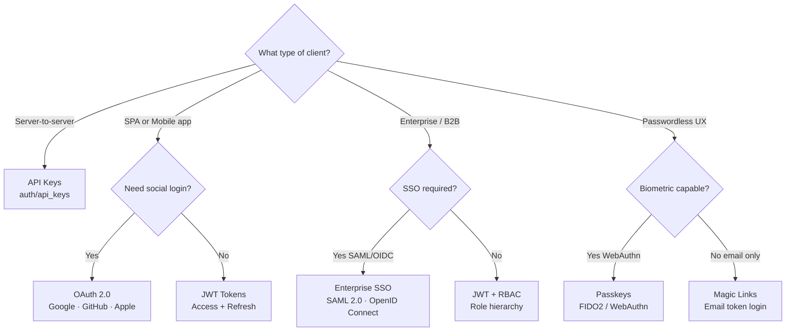

# Authentication Overview

Django Matt provides a comprehensive authentication system with multiple strategies.

## Authentication Methods

| Method | Use Case | Module |
|--------|----------|--------|
| **JWT** | API tokens for SPAs and mobile apps | `django_matt.auth.jwt` |
| **Session** | Traditional web apps with cookies | `django_matt.auth.session` |
| **API Keys** | Server-to-server, third-party integrations | `django_matt.auth.api_keys` |
| **OAuth** | Social login (Google, GitHub, etc.) | `django_matt.auth.oauth` |
| **Passkeys** | Passwordless biometric authentication | `django_matt.auth.passkeys` |
| **SSO** | Enterprise SAML/OIDC | `django_matt.auth.sso` |
| **Magic Links** | Passwordless email authentication | `django_matt.auth.magic_link` |

## Choosing an Auth Method



## Quick Start

### JWT Authentication (Recommended for APIs)

```python
from django_matt import DjangoMattAPI
from django_matt.auth import jwt_required, create_token_pair
from django_matt.auth.schemas import LoginRequest, TokenPair

api = DjangoMattAPI()

@api.post("/auth/login")
async def login(request, data: LoginRequest) -> TokenPair:
    user = await authenticate(data.email, data.password)
    if not user:
        raise AuthenticationAPIError("Invalid credentials")
    return create_token_pair(user)

@api.get("/auth/me")
@jwt_required
async def get_me(request):
    return {"email": request.user.email}
```

### Using AuthController

For a complete auth system out of the box:

```python
from django_matt import DjangoMattAPI
from django_matt.auth import AuthController

api = DjangoMattAPI()
api.register_controller(AuthController)

# This provides:
# POST /auth/login - Login with email/password
# POST /auth/login/username - Login with username/password
# POST /auth/register - Register new user
# POST /auth/refresh - Refresh access token
# POST /auth/logout - Logout (client-side token removal)
# GET  /auth/me - Get current user
# POST /auth/me - Update current user profile
# POST /auth/change-password - Change password
# GET  /auth/verify - Verify if access token is valid
# POST /auth/magic-link/request - Request magic link email
# POST /auth/magic-link/verify - Verify magic link and login
# GET  /auth/magic-link/check - Check if magic link token is valid
```

## Middleware Configuration

Add authentication middleware to your Django settings:

```python
# settings.py
MIDDLEWARE = [
    # ... other middleware
    "django_matt.auth.JWTAuthenticationMiddleware",
    # ... more middleware
]

# JWT Configuration
DJANGO_MATT_JWT = {
    "SECRET_KEY": "your-secret-key",  # Defaults to Django's SECRET_KEY
    "ACCESS_TOKEN_LIFETIME": timedelta(hours=1),
    "REFRESH_TOKEN_LIFETIME": timedelta(days=7),
    "ALGORITHM": "HS256",
}
```

## Authentication Decorators

```python
from django_matt.auth import (
    jwt_required,      # Requires valid JWT
    jwt_optional,      # JWT optional, sets request.user if valid
    admin_required,    # Requires is_staff=True
    superuser_required,  # Requires is_superuser=True
    with_roles,        # Requires specific RBAC roles
    with_permission,   # Requires specific permissions
)

@api.get("/protected")
@jwt_required
async def protected_endpoint(request):
    return {"user": request.user.email}

@api.get("/admin-only")
@jwt_required
@admin_required
async def admin_endpoint(request):
    return {"admin": True}

@api.delete("/users/{id}")
@jwt_required
@with_roles("admin", "moderator")
async def delete_user(request, id: int):
    ...
```

## Role-Based Access Control (RBAC)

Configure roles with hierarchy:

```python
# settings.py
DJANGO_MATT_RBAC = {
    "ROLES": {
        "admin": {
            "permissions": ["*"],
            "priority": 80,
        },
        "moderator": {
            "permissions": ["users.read", "posts.moderate"],
            "inherits": ["member"],
            "priority": 60,
        },
        "member": {
            "permissions": ["posts.read", "posts.create"],
            "priority": 40,
        },
    },
    "DEFAULT_ROLE": "member",
}
```

```python
from django_matt.auth import with_roles
from django_matt.auth.rbac import user_has_permission

@api.post("/posts")
@jwt_required
@with_roles("member")
async def create_post(request, data: PostCreate):
    # Only users with 'member' role can create posts
    ...

# Check permissions programmatically
if user_has_permission(request.user, "posts.delete"):
    ...
```

## Security Best Practices

1. **Use HTTPS** - Always use HTTPS in production
2. **Secure tokens** - Store JWT secret securely, rotate periodically
3. **Short-lived access tokens** - Use refresh tokens for long sessions
4. **Validate all input** - Use Pydantic schemas for validation
5. **Rate limit auth endpoints** - Prevent brute force attacks
6. **Log auth events** - Audit login attempts and failures

## Next Steps

- [JWT Authentication](jwt.md) - Detailed JWT configuration
- [Session Authentication](session.md) - Cookie-based sessions
- [API Keys](api-keys.md) - API key management
- [OAuth](oauth.md) - Social login integration
- [Passkeys](passkeys.md) - WebAuthn/FIDO2
- [SSO](sso.md) - Enterprise SAML/OIDC
