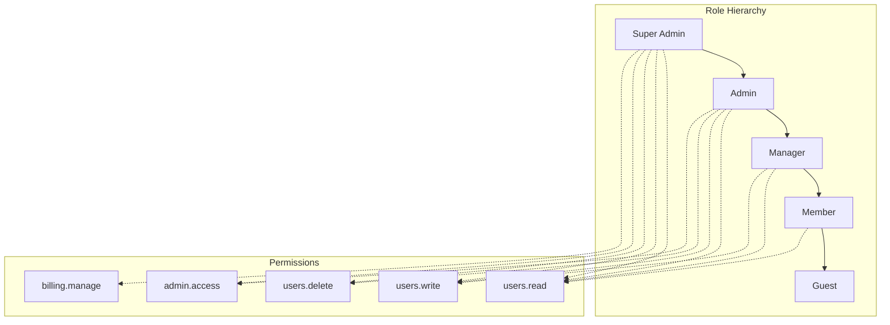

# Role-Based Access Control (RBAC)

Django Matt provides a flexible RBAC system with role hierarchies and permission inheritance.

## Overview



## Quick Start

### Configuration

```python
# settings.py
DJANGO_MATT_RBAC = {
    "ROLES": {
        "super_admin": {
            "permissions": ["*"],  # All permissions
            "priority": 100,
        },
        "admin": {
            "permissions": ["users.*", "posts.*", "admin.access"],
            "priority": 80,
        },
        "manager": {
            "permissions": ["users.read", "users.write", "posts.*"],
            "inherits": ["member"],
            "priority": 60,
        },
        "member": {
            "permissions": ["users.read", "posts.read", "posts.write"],
            "priority": 40,
        },
        "guest": {
            "permissions": ["posts.read"],
            "priority": 20,
        },
    },
    "DEFAULT_ROLE": "member",
    "USE_DJANGO_GROUPS": True,  # Map Django groups to RBAC roles
}
```

### Using in Views

```python
from django_matt.auth.rbac import requires_role_hierarchy, requires_rbac_permission

# Require minimum role level
@api.get("/admin/users")
@requires_role_hierarchy("manager")  # manager or higher
async def list_users(request):
    return User.objects.all()

# Require specific permission
@api.delete("/users/{id}")
@requires_rbac_permission("users.delete")
async def delete_user(request, id: int):
    User.objects.filter(id=id).delete()
    return {"deleted": True}
```

## Role Hierarchy

Roles are organized by `priority`, where higher priority roles have more authority. Use `inherits` to compose permissions from lower roles:

```python
from django_matt.auth.rbac import Role

# Roles can also be defined as Role dataclass instances and registered
# individually via rbac_config.register_role(role)

from django_matt.auth.rbac import rbac_config

rbac_config.register_role(Role(
    name="super_admin",
    permissions=["*"],  # Wildcard: all permissions
    priority=100,
))
rbac_config.register_role(Role(
    name="admin",
    permissions=["users.*", "settings.*", "admin.access"],
    priority=80,
))
rbac_config.register_role(Role(
    name="manager",
    permissions=["users.read", "users.invite", "team.*"],
    inherits=["member"],
    priority=60,
))
rbac_config.register_role(Role(
    name="member",
    permissions=["users.read", "projects.*"],
    priority=40,
))
rbac_config.register_role(Role(
    name="guest",
    permissions=["projects.read"],
    priority=20,
))
```

### Permission Inheritance

When using `requires_role_hierarchy`, users with higher-level roles automatically pass the check:

```python
@requires_role_hierarchy("manager")
async def team_view(request):
    # Accessible by: manager, admin, super_admin
    # NOT accessible by: member, guest
    pass
```

## Permission Syntax

The default permission delimiter is `.` (configurable via `PERMISSION_DELIMITER` in `DJANGO_MATT_RBAC`).

### Wildcards

```python
permissions = [
    "*",              # All permissions
    "users.*",        # All user permissions
    "posts.read",     # Specific permission
]
```

### Scoped Permissions

```python
permissions = [
    "users.read",
    "users.write",
    "users.delete",
    "posts.read",
    "posts.write",
    "posts.publish",
    "admin.access",
    "billing.manage",
]
```

## Utility Functions

### Check User Roles

```python
from django_matt.auth.rbac import (
    get_user_roles,
    user_has_role,
    user_has_any_role,
    user_has_all_roles,
    get_user_highest_role,
)

# Get all roles for a user
roles = get_user_roles(user)  # ["member", "manager"]

# Check specific role
if user_has_role(user, "admin"):
    print("User is admin")

# Check any of multiple roles
if user_has_any_role(user, ["admin", "manager"]):
    print("User can manage")

# Check all roles
if user_has_all_roles(user, ["member", "verified"]):
    print("User is verified member")

# Get highest role
highest = get_user_highest_role(user)  # Role object with highest level
```

### Check Permissions

```python
from django_matt.auth.rbac import (
    get_user_permissions,
    user_has_permission,
)

# Get all permissions (including from role hierarchy)
permissions = get_user_permissions(user)
# {"users.read", "posts.read", "posts.write", ...}

# Check specific permission
if user_has_permission(user, "users.delete"):
    # User can delete users
    pass

# Check scoped permission (resource + action)
if user_has_permission(user, "delete", resource="users"):
    pass

# Wildcard matching
# If user has "users.*", then user_has_permission(user, "users.read") is True
```

## Decorators

### requires_role_hierarchy

Requires the user to have a role at or above the specified level:

```python
from django_matt.auth.rbac import requires_role_hierarchy

@api.get("/admin/dashboard")
@requires_role_hierarchy("admin")
async def admin_dashboard(request):
    # Only admin and super_admin can access
    return {"stats": get_admin_stats()}

@api.get("/team/members")
@requires_role_hierarchy("manager")
async def team_members(request):
    # manager, admin, super_admin can access
    return Team.objects.get_members(request.user)
```

### requires_rbac_permission

Requires a specific permission (checks wildcards):

```python
from django_matt.auth.rbac import requires_rbac_permission

@api.post("/posts")
@requires_rbac_permission("posts.write")
async def create_post(request, data: PostCreate):
    return Post.objects.create(**data.dict())

@api.delete("/posts/{id}")
@requires_rbac_permission("posts.delete")
async def delete_post(request, id: int):
    Post.objects.filter(id=id).delete()
    return {"deleted": True}

# Scoped: permission + resource checked separately
@api.delete("/users/{id}")
@requires_rbac_permission("delete", resource="users")
async def delete_user(request, id: int):
    ...
```

## Integration with Django Groups

When `USE_DJANGO_GROUPS` is `True` (the default), Django group names are treated directly as RBAC role names. Name your Django groups to match your role names:

```python
# settings.py
DJANGO_MATT_RBAC = {
    "ROLES": {
        "super_admin": {"permissions": ["*"], "priority": 100},
        "admin": {"permissions": ["users.*"], "priority": 80},
        "manager": {"permissions": ["users.read"], "inherits": ["member"], "priority": 60},
        "member": {"permissions": ["posts.read"], "priority": 40},
    },
    "USE_DJANGO_GROUPS": True,  # Group named "admin" → "admin" RBAC role
    "DEFAULT_ROLE": "member",
}
```

When a user belongs to a Django group, they automatically receive the matching RBAC role.

## Multi-Tenant RBAC

For B2B applications, use the `Membership` model from multitenancy to assign per-organization roles. Check permissions by querying the membership role directly:

```python
from django_matt.multitenancy import Membership
from django_matt.auth.rbac import user_has_permission

# Assign role within organization
membership = await Membership.objects.acreate(
    user=user,
    organization=org,
    role="admin",  # RBAC role name
)

# Check permission for a user within an org
async def user_can_manage_billing(user, org) -> bool:
    membership = await Membership.objects.filter(
        user=user, organization=org
    ).afirst()
    if not membership:
        return False
    return user_has_permission.__wrapped__(membership.role, "billing.manage")
    # Or simpler: check the membership role against rbac_config directly
    from django_matt.auth.rbac import rbac_config
    return rbac_config.has_permission(membership.role, "billing.manage")
```

## Custom Permission Checks

For complex permission logic, create custom checks:

```python
from django_matt.auth.rbac import user_has_permission

def can_edit_post(user, post):
    """Check if user can edit a post."""
    # Owner can always edit
    if post.author == user:
        return True

    # Check RBAC permission (full dotted permission string)
    if user_has_permission(user, "posts.edit_any"):
        return True

    # Check with resource scope
    if user_has_permission(user, "edit", resource="posts"):
        return True

    return False
```

## Permission Checks in Views

Use the RBAC utility functions directly inside views — no additional middleware needed:

```python
from django_matt.auth.rbac import user_has_permission, get_user_highest_role, get_user_permissions

async def my_view(request):
    # Check permission
    if user_has_permission(request.user, "posts.delete"):
        # Can delete
        pass

    # Get user's highest role
    role = get_user_highest_role(request.user)

    # Get all permissions
    permissions = get_user_permissions(request.user)
```

## Testing

```python
import pytest
from django_matt.auth.rbac import rbac_config

@pytest.fixture
def admin_user(user_factory):
    """Create a user with admin role."""
    user = user_factory()
    user.groups.add(Group.objects.get(name="Staff"))
    return user

def test_admin_access(client, admin_user):
    client.force_login(admin_user)
    response = client.get("/admin/dashboard")
    assert response.status_code == 200

def test_member_denied(client, member_user):
    client.force_login(member_user)
    response = client.get("/admin/dashboard")
    assert response.status_code == 403
```

## Best Practices

1. **Use role hierarchy for levels** - Don't duplicate permissions across roles
2. **Use wildcards sparingly** - Be explicit about permissions
3. **Scope permissions to resources** - Use `resource:action` format
4. **Map Django groups** - Integrate with existing auth systems
5. **Test permission boundaries** - Ensure users can't access unauthorized resources
6. **Document permissions** - Maintain a list of all permissions and their meanings
