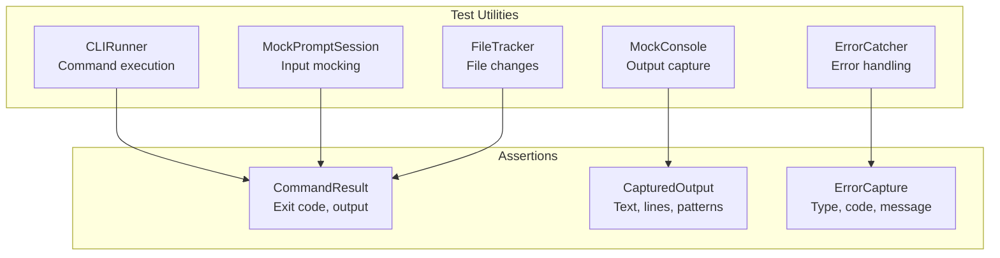

# CLI Testing Utilities

django-matt provides comprehensive testing utilities for CLI commands.

## Overview



## Quick Start

```python
from django_matt.cli.testing import CLIRunner, MockPromptSession

def test_my_command():
    runner = CLIRunner()
    result = runner.invoke("matt", "info")

    result.assert_success()
    result.assert_output_contains("django-matt")
```

## Command Runner

### Basic Usage

```python
from django_matt.cli.testing import CLIRunner, run_command

# Using CLIRunner
runner = CLIRunner()
result = runner.invoke("matt", "info")

# Or use convenience function
result = run_command("matt", "info")

# With options
result = runner.invoke("generate_crud", "myapp.Model", "--dry-run")
```

### CommandResult Assertions

```python
result = runner.invoke("mycommand")

# Success/failure
result.assert_success()
result.assert_failed()
result.assert_exit_code(0)

# Output assertions
result.assert_output_contains("Success")
result.assert_output_not_contains("Error")
result.assert_stdout_contains("Created")
result.assert_stderr_contains("Warning")

# Chainable
result.assert_success().assert_output_contains("Done")
```

### Isolated Filesystem

```python
from django_matt.cli.testing import IsolatedCLIRunner

runner = IsolatedCLIRunner()

# Run in temp directory
result = runner.invoke_isolated("generate_crud", "myapp.Model")

# Or with context manager
with runner.isolated_filesystem() as tmpdir:
    result = runner.invoke("init")
    assert (tmpdir / "config.py").exists()
```

## Mocking Prompts

### Basic Prompt Mocking

```python
from django_matt.cli.testing import MockPromptSession

session = MockPromptSession()

# Add responses
session.text("Enter name:", "John")
session.confirm("Continue?", True)
session.select("Choose option:", "option1")

# Run with mocked prompts
with session.patch():
    result = runner.invoke("interactive_command")

# Verify prompts were shown
session.assert_prompted("Enter name:")
session.assert_prompt_count(3)
```

### Fluent API

```python
session = MockPromptSession()
session.text(response="John") \
       .password(response="secret") \
       .confirm(response=True) \
       .select(response="option1")

with session.patch():
    result = runner.invoke("wizard")
```

### Decorator

```python
from django_matt.cli.testing import mock_prompts

@mock_prompts(text="John", confirm=True)
def test_interactive():
    result = runner.invoke("ask_name")
    result.assert_success()
```

## Console Output Testing

### Capturing Output

```python
from django_matt.cli.testing import MockConsole, ConsoleCapture

# Mock the console
with MockConsole() as console:
    # Run code that uses console
    my_command.handle()

console.output.assert_contains("Success")
console.output.assert_success_message()

# Or capture stdout/stderr directly
with ConsoleCapture() as capture:
    print("Hello")

assert "Hello" in capture.output
```

### Output Assertions

```python
output = console.output

# Content checks
output.assert_contains("text")
output.assert_not_contains("error")
output.assert_matches(r"\d+ files created")

# Message type checks
output.assert_success_message()
output.assert_error_message()
output.assert_warning_message()

# Structure checks
output.assert_line_count(5)
output.assert_empty()
output.assert_not_empty()
```

## File Testing

### Tracking Changes

```python
from django_matt.cli.testing import FileTracker

tracker = FileTracker()
tracker.watch("output/")

# Run command that creates files
runner.invoke("generate_crud", "myapp.Model")

# Check changes
tracker.capture_changes()

assert tracker.was_created("output/controller.py")
assert "controller.py" in tracker.created_files
```

### File Assertions

```python
tracker.assert_created("controller.py")
tracker.assert_modified("existing.py")
tracker.assert_deleted("old.py")
tracker.assert_file_exists("output/schema.py")
tracker.assert_file_contains("controller.py", "class ModelController")
tracker.assert_file_count(3)
```

### Temporary Directories

```python
from django_matt.cli.testing import (
    temp_directory,
    working_directory,
    isolated_filesystem,
)

# Temp directory
with temp_directory() as tmpdir:
    (tmpdir / "test.txt").write_text("hello")

# Change working directory
with working_directory("/tmp/test"):
    # Now in /tmp/test
    pass

# Combined (temp + chdir)
with isolated_filesystem() as tmpdir:
    # In a fresh temp directory
    pass
```

## Error Testing

### Catching Errors

```python
from django_matt.cli.testing import ErrorCatcher, assert_raises_cli_error
from django_matt.cli.errors import CLIError, CLIErrorCode

# Catch and inspect
with ErrorCatcher() as catcher:
    raise CLIError("Not found", code=CLIErrorCode.FILE_NOT_FOUND)

catcher.captured.assert_cli_error(CLIErrorCode.FILE_NOT_FOUND)
catcher.captured.assert_message_contains("Not found")

# Assert specific error
with assert_raises_cli_error(CLIErrorCode.VALIDATION_ERROR):
    raise CLIError("Invalid", code=CLIErrorCode.VALIDATION_ERROR)
```

### Mock Error Handler

```python
from django_matt.cli.testing import MockErrorHandler

handler = MockErrorHandler()

with handler.patch():
    # Errors are captured, not displayed
    run_command_that_may_fail()

handler.assert_error_raised(CLIErrorCode.VALIDATION_ERROR)
# Or
handler.assert_no_errors()
```

## Pytest Fixtures

### Available Fixtures

```python
import pytest

def test_with_runner(cli_runner):
    """cli_runner provides CLIRunner instance."""
    result = cli_runner.invoke("matt", "info")

def test_isolated(isolated_runner):
    """isolated_runner runs in temp directory."""
    result = isolated_runner.invoke_isolated("init")

def test_prompts(mock_prompts):
    """mock_prompts provides MockPromptSession."""
    mock_prompts.text(response="John")
    with mock_prompts.patch():
        ...

def test_files(file_tracker, tmp_path):
    """file_tracker tracks file changes."""
    file_tracker.watch(tmp_path)

def test_errors(error_catcher):
    """error_catcher catches CLIErrors."""
    with error_catcher:
        ...

def test_full(cli_test_env):
    """cli_test_env provides complete environment."""
    runner = cli_test_env["runner"]
    prompts = cli_test_env["prompts"]
    tracker = cli_test_env["tracker"]
```

### Using Fixtures

```python
# conftest.py
pytest_plugins = ["django_matt.cli.testing.fixtures"]

# Or import specific fixtures
from django_matt.cli.testing.fixtures import (
    cli_runner,
    mock_prompts,
    file_tracker,
)
```

## Complete Example

```python
import pytest
from django_matt.cli.testing import (
    CLIRunner,
    MockPromptSession,
    FileTracker,
)

def test_generate_crud_command(tmp_path):
    # Setup
    runner = CLIRunner()
    tracker = FileTracker()
    tracker.watch(tmp_path)

    prompts = MockPromptSession()
    prompts.confirm("Generate tests?", True)
    prompts.select("Permission class:", "IsAuthenticated")

    # Execute
    with prompts.patch():
        result = runner.invoke(
            "generate_crud",
            "myapp.Product",
            f"--output-dir={tmp_path}",
        )

    # Assert
    result.assert_success()
    result.assert_output_contains("Generated")

    tracker.capture_changes()
    tracker.assert_created("controller.py")
    tracker.assert_created("schema.py")
    tracker.assert_file_contains(
        str(tmp_path / "controller.py"),
        "class ProductController"
    )

    prompts.assert_prompted("Generate tests?")
```
