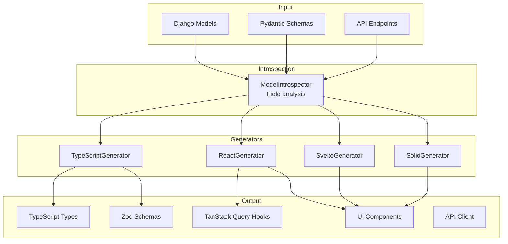

# Code Generation

Django Matt provides a powerful code generation system for creating frontend components, types, and API clients from your Django models.

## Overview



## Quick Start

### CLI Usage

```bash
# Generate TypeScript types for all models
python manage.py sync_types --target typescript --output frontend/types

# Generate React components
python manage.py sync_types --target react --output frontend/src/generated

# Watch mode for development
python manage.py sync_types --target react --output frontend/src/generated --watch

# Generate from config file
python manage.py sync_types --config
```

### Programmatic Usage

```python
from django_matt.codegen import ReactGenerator
from myapp.models import User, Product

generator = ReactGenerator()
files = generator.generate_all([User, Product])

for filename, content in files.items():
    print(f"Generated: {filename}")
```

## TypeScript Types

### Basic Type Generation

```python
from django_matt.codegen import TypeScriptGenerator
from myapp.models import User

generator = TypeScriptGenerator()
types = generator.generate_types([User])
```

Output:

```typescript
// types/user.ts
export interface User {
  id: number;
  email: string;
  firstName: string;
  lastName: string;
  isActive: boolean;
  createdAt: string;
  updatedAt: string;
}

export interface UserCreate {
  email: string;
  firstName: string;
  lastName: string;
  password: string;
}

export interface UserUpdate {
  firstName?: string;
  lastName?: string;
  isActive?: boolean;
}
```

### Zod Schemas

```python
generator = TypeScriptGenerator(include_zod=True)
files = generator.generate_all([User])
```

Output:

```typescript
// schemas/user.ts
import { z } from 'zod';

export const userSchema = z.object({
  id: z.number(),
  email: z.string().email(),
  firstName: z.string().min(1),
  lastName: z.string().min(1),
  isActive: z.boolean(),
  createdAt: z.string().datetime(),
  updatedAt: z.string().datetime(),
});

export const userCreateSchema = z.object({
  email: z.string().email(),
  firstName: z.string().min(1),
  lastName: z.string().min(1),
  password: z.string().min(8),
});

export type User = z.infer<typeof userSchema>;
export type UserCreate = z.infer<typeof userCreateSchema>;
```

## React Generator

### TanStack Query Hooks

```python
from django_matt.codegen import ReactGenerator

generator = ReactGenerator()
files = generator.generate_all([User, Product])
```

Output:

```typescript
// hooks/useUsers.ts
import { useQuery, useMutation, useQueryClient } from '@tanstack/react-query';
import { api } from '../api';
import { User, UserCreate, UserUpdate } from '../types';

export function useUsers(params?: UserListParams) {
  return useQuery({
    queryKey: ['users', params],
    queryFn: () => api.users.list(params),
  });
}

export function useUser(id: number) {
  return useQuery({
    queryKey: ['users', id],
    queryFn: () => api.users.get(id),
    enabled: !!id,
  });
}

export function useCreateUser() {
  const queryClient = useQueryClient();
  return useMutation({
    mutationFn: (data: UserCreate) => api.users.create(data),
    onSuccess: () => {
      queryClient.invalidateQueries({ queryKey: ['users'] });
    },
  });
}

export function useUpdateUser(id: number) {
  const queryClient = useQueryClient();
  return useMutation({
    mutationFn: (data: UserUpdate) => api.users.update(id, data),
    onSuccess: () => {
      queryClient.invalidateQueries({ queryKey: ['users'] });
      queryClient.invalidateQueries({ queryKey: ['users', id] });
    },
  });
}

export function useDeleteUser() {
  const queryClient = useQueryClient();
  return useMutation({
    mutationFn: (id: number) => api.users.delete(id),
    onSuccess: () => {
      queryClient.invalidateQueries({ queryKey: ['users'] });
    },
  });
}
```

### Form Components (shadcn/ui)

```typescript
// components/UserForm.tsx
import { useForm } from 'react-hook-form';
import { zodResolver } from '@hookform/resolvers/zod';
import { userCreateSchema, UserCreate } from '../schemas';
import { useCreateUser } from '../hooks';
import { Form, FormField, FormItem, FormLabel, FormControl, FormMessage } from '@/components/ui/form';
import { Input } from '@/components/ui/input';
import { Button } from '@/components/ui/button';

interface UserFormProps {
  onSuccess?: (user: User) => void;
}

export function UserForm({ onSuccess }: UserFormProps) {
  const form = useForm<UserCreate>({
    resolver: zodResolver(userCreateSchema),
    defaultValues: {
      email: '',
      firstName: '',
      lastName: '',
      password: '',
    },
  });

  const createUser = useCreateUser();

  const onSubmit = async (data: UserCreate) => {
    const user = await createUser.mutateAsync(data);
    onSuccess?.(user);
  };

  return (
    <Form {...form}>
      <form onSubmit={form.handleSubmit(onSubmit)} className="space-y-4">
        <FormField
          control={form.control}
          name="email"
          render={({ field }) => (
            <FormItem>
              <FormLabel>Email</FormLabel>
              <FormControl>
                <Input type="email" {...field} />
              </FormControl>
              <FormMessage />
            </FormItem>
          )}
        />
        {/* ... other fields ... */}
        <Button type="submit" disabled={createUser.isPending}>
          {createUser.isPending ? 'Creating...' : 'Create User'}
        </Button>
      </form>
    </Form>
  );
}
```

### List/Table Components

```typescript
// components/UserList.tsx
import { useUsers, useDeleteUser } from '../hooks';
import { DataTable } from '@/components/ui/data-table';
import { Button } from '@/components/ui/button';
import { User } from '../types';

export function UserList() {
  const { data: users, isLoading } = useUsers();
  const deleteUser = useDeleteUser();

  const columns = [
    { accessorKey: 'email', header: 'Email' },
    { accessorKey: 'firstName', header: 'First Name' },
    { accessorKey: 'lastName', header: 'Last Name' },
    {
      id: 'actions',
      cell: ({ row }) => (
        <Button
          variant="destructive"
          size="sm"
          onClick={() => deleteUser.mutate(row.original.id)}
        >
          Delete
        </Button>
      ),
    },
  ];

  if (isLoading) return <div>Loading...</div>;

  return <DataTable columns={columns} data={users ?? []} />;
}
```

## Svelte Generator

```python
from django_matt.codegen import SvelteGenerator

generator = SvelteGenerator(svelte_version=5)  # Svelte 5 with runes
files = generator.generate_all([User])
```

### Svelte 5 Stores (Runes)

```typescript
// stores/users.svelte.ts
import { api } from '../api';
import type { User, UserCreate } from '../types';

export function createUsersStore() {
  let users = $state<User[]>([]);
  let loading = $state(false);
  let error = $state<Error | null>(null);

  const load = async () => {
    loading = true;
    error = null;
    try {
      users = await api.users.list();
    } catch (e) {
      error = e as Error;
    } finally {
      loading = false;
    }
  };

  const create = async (data: UserCreate) => {
    const user = await api.users.create(data);
    users = [...users, user];
    return user;
  };

  return {
    get users() { return users; },
    get loading() { return loading; },
    get error() { return error; },
    load,
    create,
  };
}
```

### Svelte Components

```svelte
<!-- components/UserForm.svelte -->
<script lang="ts">
  import { createUsersStore } from '../stores/users.svelte';
  import type { UserCreate } from '../types';

  const { create } = createUsersStore();

  let formData: UserCreate = {
    email: '',
    firstName: '',
    lastName: '',
    password: '',
  };

  let submitting = $state(false);

  const handleSubmit = async () => {
    submitting = true;
    try {
      await create(formData);
      formData = { email: '', firstName: '', lastName: '', password: '' };
    } finally {
      submitting = false;
    }
  };
</script>

<form on:submit|preventDefault={handleSubmit}>
  <input bind:value={formData.email} type="email" placeholder="Email" />
  <input bind:value={formData.firstName} placeholder="First Name" />
  <input bind:value={formData.lastName} placeholder="Last Name" />
  <input bind:value={formData.password} type="password" placeholder="Password" />
  <button type="submit" disabled={submitting}>
    {submitting ? 'Creating...' : 'Create User'}
  </button>
</form>
```

## SolidJS Generator

```python
from django_matt.codegen import SolidGenerator

generator = SolidGenerator()
files = generator.generate_all([User])
```

### Solid Primitives

```typescript
// stores/users.ts
import { createSignal, createResource } from 'solid-js';
import { createStore, produce } from 'solid-js/store';
import { api } from '../api';
import type { User, UserCreate } from '../types';

export function createUsersResource() {
  const [users, { refetch }] = createResource(() => api.users.list());

  const createUser = async (data: UserCreate) => {
    const user = await api.users.create(data);
    refetch();
    return user;
  };

  return { users, createUser, refetch };
}
```

## Configuration

### Config File

```python
# django_matt_codegen.py or pyproject.toml
from django_matt.codegen import CodegenConfig, ModelConfig

config = CodegenConfig(
    output_dir="frontend/src/generated",
    target="react",

    # What to generate
    generate_types=True,
    generate_zod=True,
    generate_hooks=True,
    generate_components=True,
    generate_api_client=True,

    # Naming conventions
    type_suffix="",
    create_suffix="Create",
    update_suffix="Update",

    # Model-specific config
    models={
        "myapp.User": ModelConfig(
            exclude_fields=["password", "last_login"],
            readonly_fields=["id", "created_at"],
            generate_crud=True,
        ),
        "myapp.AuditLog": ModelConfig(
            generate_crud=False,  # Read-only model
        ),
    },
)
```

### pyproject.toml Config

```toml
[tool.django_matt.codegen]
output_dir = "frontend/src/generated"
target = "react"
generate_types = true
generate_zod = true
generate_hooks = true

[tool.django_matt.codegen.models."myapp.User"]
exclude_fields = ["password"]
generate_crud = true
```

### CLI Options

```bash
# Basic generation
python manage.py sync_types --target typescript --output frontend/types

# React with all features
python manage.py sync_types --target react --output frontend/src/generated

# Watch mode
python manage.py sync_types --target react --output frontend/src/generated --watch

# Custom watch directories
python manage.py sync_types --watch --watch-dirs myapp/models,other/models

# With debounce (value is in seconds)
python manage.py sync_types --watch --debounce 0.5

# From config
python manage.py sync_types --config

# Initialize config file
python manage.py init_codegen
```

## Model Introspection

### Field Type Mapping

| Django Field | TypeScript | Zod |
|-------------|-----------|-----|
| CharField | string | z.string() |
| TextField | string | z.string() |
| IntegerField | number | z.number().int() |
| FloatField | number | z.number() |
| DecimalField | string | z.string() |
| BooleanField | boolean | z.boolean() |
| DateField | string | z.string().date() |
| DateTimeField | string | z.string().datetime() |
| EmailField | string | z.string().email() |
| URLField | string | z.string().url() |
| UUIDField | string | z.string().uuid() |
| JSONField | unknown | z.unknown() |
| ForeignKey | number | z.number() |
| ManyToManyField | number[] | z.array(z.number()) |

### Validators

Django validators are converted to Zod validators:

```python
class User(models.Model):
    name = models.CharField(max_length=100, validators=[MinLengthValidator(2)])
    age = models.IntegerField(validators=[MinValueValidator(0), MaxValueValidator(150)])
    email = models.EmailField(unique=True)
```

```typescript
export const userSchema = z.object({
  name: z.string().min(2).max(100),
  age: z.number().int().min(0).max(150),
  email: z.string().email(),
});
```

## API Client Generation

```typescript
// api/client.ts
import axios from 'axios';

const client = axios.create({
  baseURL: '/api',
});

export const api = {
  users: {
    list: (params?: UserListParams) =>
      client.get<User[]>('/users/', { params }).then(r => r.data),

    get: (id: number) =>
      client.get<User>(`/users/${id}/`).then(r => r.data),

    create: (data: UserCreate) =>
      client.post<User>('/users/', data).then(r => r.data),

    update: (id: number, data: UserUpdate) =>
      client.patch<User>(`/users/${id}/`, data).then(r => r.data),

    delete: (id: number) =>
      client.delete(`/users/${id}/`).then(r => r.data),
  },
  // ... other models
};
```

## Best Practices

1. **Use config files** - Consistent generation across team
2. **Watch mode in development** - Auto-regenerate on model changes
3. **Commit generated files** - Ensures CI/CD has correct types
4. **Exclude sensitive fields** - Don't expose passwords in types
5. **Use Zod for validation** - Client-side validation matches server
6. **Generate API client** - Type-safe API calls
7. **Keep models clean** - Good model design = good generated code
