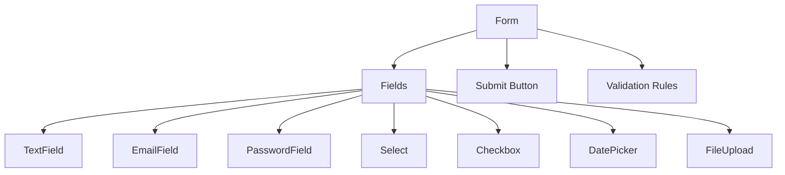
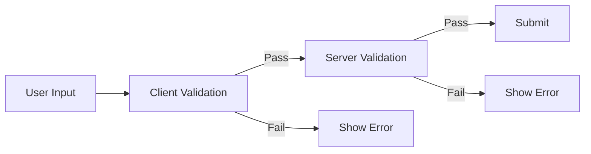

# Form Components

Pre-built form components with validation and accessibility.

## Form Structure



## Basic Form

```python
from django_matt.components import (
    Form, TextField, EmailField, Select, Checkbox, SubmitButton
)

contact_form = Form(
    id="contact-form",
    fields=[
        TextField(
            name="name",
            label="Full Name",
            placeholder="John Doe",
            required=True,
        ),
        EmailField(
            name="email",
            label="Email Address",
            required=True,
        ),
        Select(
            name="subject",
            label="Subject",
            options=[
                {"value": "general", "label": "General Inquiry"},
                {"value": "support", "label": "Technical Support"},
                {"value": "sales", "label": "Sales"},
            ],
        ),
        TextField(
            name="message",
            label="Message",
            multiline=True,
            rows=5,
            required=True,
        ),
        Checkbox(
            name="subscribe",
            label="Subscribe to newsletter",
        ),
    ],
    submit=SubmitButton(label="Send Message"),
    action="/api/contact",
)
```

## Input Components

### TextField

```python
TextField(
    name="username",
    label="Username",
    placeholder="Enter username",
    required=True,
    min_length=3,
    max_length=50,
    pattern=r"^[a-z0-9_]+$",
    helper_text="Lowercase letters, numbers, and underscores only",
)
```

### EmailField

```python
EmailField(
    name="email",
    label="Email",
    required=True,
    autocomplete="email",
)
```

### PasswordField

```python
PasswordField(
    name="password",
    label="Password",
    required=True,
    min_length=8,
    show_strength=True,  # Password strength indicator
)
```

### NumberField

```python
NumberField(
    name="quantity",
    label="Quantity",
    min_value=1,
    max_value=100,
    step=1,
)
```

### Select

```python
Select(
    name="country",
    label="Country",
    options=[
        {"value": "us", "label": "United States"},
        {"value": "uk", "label": "United Kingdom"},
        {"value": "ca", "label": "Canada"},
    ],
    placeholder="Select a country",
    searchable=True,
)
```

### MultiSelect

```python
MultiSelect(
    name="tags",
    label="Tags",
    options=[
        {"value": "python", "label": "Python"},
        {"value": "django", "label": "Django"},
        {"value": "api", "label": "API"},
    ],
    max_selections=5,
)
```

### Checkbox

```python
Checkbox(
    name="agree_terms",
    label="I agree to the Terms of Service",
    required=True,
)
```

### RadioGroup

```python
RadioGroup(
    name="plan",
    label="Select Plan",
    options=[
        {"value": "free", "label": "Free", "description": "$0/month"},
        {"value": "pro", "label": "Pro", "description": "$9/month"},
        {"value": "team", "label": "Team", "description": "$29/month"},
    ],
)
```

### DatePicker

```python
DatePicker(
    name="birth_date",
    label="Date of Birth",
    min_date="1900-01-01",
    max_date="today",
)
```

### FileUpload

```python
FileUpload(
    name="avatar",
    label="Profile Picture",
    accept=["image/png", "image/jpeg"],
    max_size=5 * 1024 * 1024,  # 5MB
    preview=True,
)
```

## Validation



### Built-in Rules

```python
from django_matt.components import ValidationRule

TextField(
    name="username",
    validation=[
        ValidationRule(type="required", message="Username is required"),
        ValidationRule(type="minLength", value=3, message="Min 3 characters"),
        ValidationRule(type="pattern", value=r"^[a-z]+$", message="Lowercase only"),
    ],
)
```

### Custom Validation

```python
# Server-side validation endpoint
@api.post("/api/validate/username")
async def validate_username(request, username: str):
    exists = await User.objects.filter(username=username).aexists()
    if exists:
        return {"valid": False, "error": "Username already taken"}
    return {"valid": True}

# Component with async validation
TextField(
    name="username",
    async_validation="/api/validate/username",
    debounce=300,  # ms
)
```

## Pre-built Auth Forms

### LoginForm

```python
from django_matt.components.auth import LoginForm

login = LoginForm(
    action="/api/auth/login",
    show_remember_me=True,
    show_forgot_password=True,
    forgot_password_url="/forgot-password",
    oauth_providers=["google", "github"],
    show_magic_link=True,
    show_passkeys=True,
)
```

### RegisterForm

```python
from django_matt.components.auth import RegisterForm

register = RegisterForm(
    action="/api/auth/register",
    fields=["email", "password", "name"],
    show_password_confirmation=True,
    show_terms_checkbox=True,
    terms_url="/terms",
    privacy_url="/privacy",
    oauth_providers=["google", "github"],
)
```
