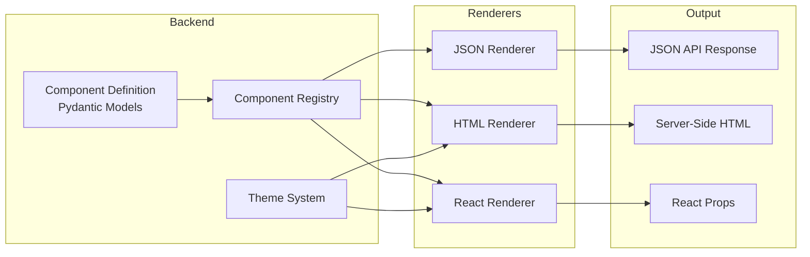
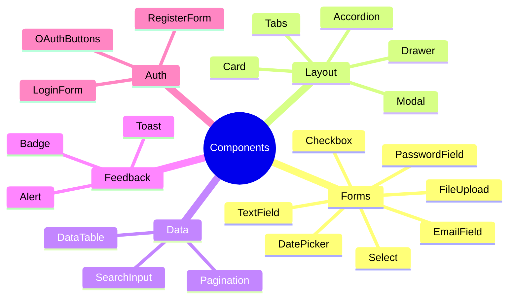
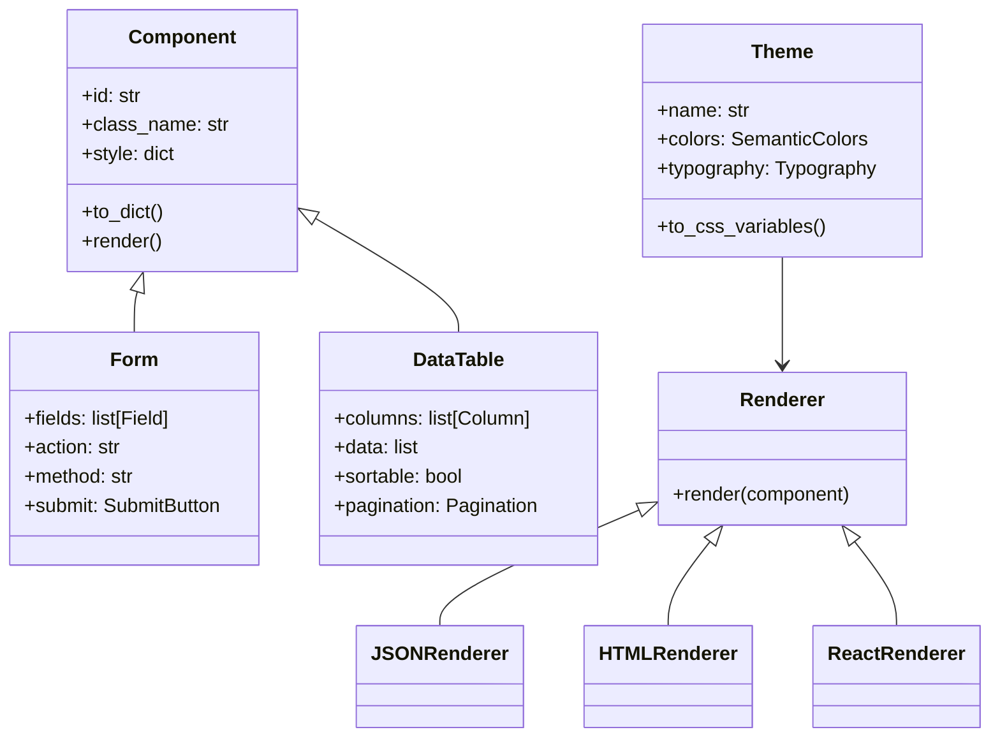

# Backend Components Overview

django-matt includes a backend-served UI component system that generates components for multiple frontend frameworks.

## Concept



## Component Categories



## Architecture



## Quick Start

### Define a Component

```python
from django_matt.components import (
    Form, TextField, EmailField, PasswordField, SubmitButton
)

login_form = Form(
    id="login-form",
    fields=[
        EmailField(name="email", label="Email", required=True),
        PasswordField(name="password", label="Password", required=True),
    ],
    submit=SubmitButton(label="Sign In"),
    action="/api/auth/login",
)
```

### Serve as JSON

```python
from django_matt.components import JsonComponentResponse

@api.get("/components/login")
def get_login_form(request):
    return JsonComponentResponse(login_form)
```

### Serve as HTML

```python
from django_matt.components import HtmlComponentResponse

@api.get("/login")
def login_page(request):
    return HtmlComponentResponse(login_form)
```

### With Theme

```python
from django_matt.components.themes import Theme, ShadcnPreset

theme = Theme.from_preset(ShadcnPreset.BLUE, mode="dark")

return HtmlComponentResponse(login_form, theme=theme)
```

## Related Documentation

- [Form Components](./forms.md)
- [Layout Components](./layout.md)
- [Data Components](./data.md)
- [Theming](./theming.md)
- [Renderers](./renderers.md)
