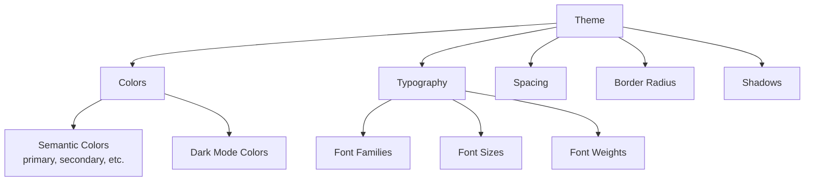
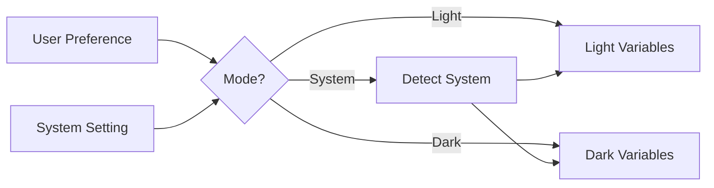

# Component Theming

django-matt components support comprehensive theming with CSS variables.

## Theme Structure



## Creating a Theme

```python
from django_matt.components.themes import (
    Theme, SemanticColors, DarkColors, Typography
)

theme = Theme(
    name="custom",
    colors=SemanticColors(
        primary="hsl(221.2 83.2% 53.3%)",
        secondary="hsl(210 40% 96.1%)",
        accent="hsl(210 40% 96.1%)",
        background="hsl(0 0% 100%)",
        foreground="hsl(222.2 84% 4.9%)",
        muted="hsl(210 40% 96.1%)",
        muted_foreground="hsl(215.4 16.3% 46.9%)",
        destructive="hsl(0 84.2% 60.2%)",
        border="hsl(214.3 31.8% 91.4%)",
        input="hsl(214.3 31.8% 91.4%)",
        ring="hsl(221.2 83.2% 53.3%)",
    ),
    dark_colors=DarkColors(
        background="hsl(222.2 84% 4.9%)",
        foreground="hsl(210 40% 98%)",
        # ... dark mode overrides
    ),
    typography=Typography(
        font_family="Inter, system-ui, sans-serif",
        font_size_base="16px",
    ),
)
```

## Using Presets

```python
from django_matt.components.themes import Theme, ShadcnPreset

# Built-in presets
theme = Theme.from_preset(ShadcnPreset.ZINC)
theme = Theme.from_preset(ShadcnPreset.BLUE)
theme = Theme.from_preset(ShadcnPreset.GREEN)
theme = Theme.from_preset(ShadcnPreset.VIOLET)

# With dark mode
dark_theme = Theme.from_preset(ShadcnPreset.BLUE, mode="dark")
```

## CSS Output

```python
# Generate CSS variables
css = theme.to_css_variables()
```

Output:
```css
:root {
  --primary: 221.2 83.2% 53.3%;
  --primary-foreground: 210 40% 98%;
  --secondary: 210 40% 96.1%;
  --secondary-foreground: 222.2 47.4% 11.2%;
  --accent: 210 40% 96.1%;
  --accent-foreground: 222.2 47.4% 11.2%;
  --background: 0 0% 100%;
  --foreground: 222.2 84% 4.9%;
  --muted: 210 40% 96.1%;
  --muted-foreground: 215.4 16.3% 46.9%;
  --destructive: 0 84.2% 60.2%;
  --destructive-foreground: 210 40% 98%;
  --border: 214.3 31.8% 91.4%;
  --input: 214.3 31.8% 91.4%;
  --ring: 221.2 83.2% 53.3%;
  --radius: 0.5rem;
}

.dark {
  --background: 222.2 84% 4.9%;
  --foreground: 210 40% 98%;
  /* ... dark mode variables */
}
```

## Tailwind Integration

```python
# Generate Tailwind config
tailwind_config = theme.to_tailwind_config()
```

Output:
```javascript
module.exports = {
  theme: {
    extend: {
      colors: {
        primary: {
          DEFAULT: "hsl(var(--primary))",
          foreground: "hsl(var(--primary-foreground))",
        },
        secondary: {
          DEFAULT: "hsl(var(--secondary))",
          foreground: "hsl(var(--secondary-foreground))",
        },
        // ...
      },
      borderRadius: {
        lg: "var(--radius)",
        md: "calc(var(--radius) - 2px)",
        sm: "calc(var(--radius) - 4px)",
      },
    },
  },
}
```

## Component Styling

### Class Names

```python
from django_matt.components import Card

card = Card(
    title="Hello",
    class_name="shadow-lg hover:shadow-xl transition-shadow",
)
```

### Inline Styles

```python
card = Card(
    title="Hello",
    style={
        "maxWidth": "400px",
        "margin": "0 auto",
    },
)
```

### Builder Pattern

```python
card = (
    Card(title="Hello")
    .with_class("shadow-lg")
    .with_style({"maxWidth": "400px"})
)
```

## Theme Context

Apply theme to all components in a response:

```python
from django_matt.components import Page, Card, theme_context

page = Page(
    title="Dashboard",
    components=[
        Card(title="Stats", content="..."),
        Card(title="Chart", content="..."),
    ],
)

# Apply theme
with theme_context(theme):
    html = page.render()
```

## Dark Mode



```python
# Auto dark mode (uses system preference)
theme = Theme.from_preset(ShadcnPreset.BLUE, mode="auto")

# Force dark mode
theme = Theme.from_preset(ShadcnPreset.BLUE, mode="dark")

# Light only
theme = Theme.from_preset(ShadcnPreset.BLUE, mode="light")
```

Client-side toggle:
```javascript
// Toggle dark mode
document.documentElement.classList.toggle('dark');
```
