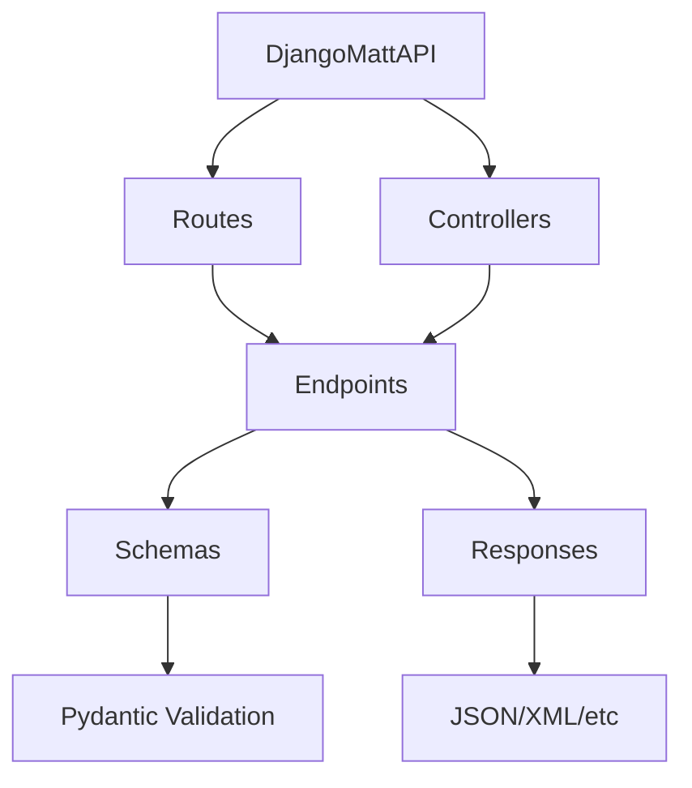

# Core Concepts

The core of django-matt provides the building blocks for your API: routing, controllers, schemas, and error handling.

## Overview

django-matt is built around these core concepts:



## Core Components

<div class="grid cards" markdown>

-   :material-routes: **API & Routing**

    ---

    Define endpoints with decorator-based routing.

    [:octicons-arrow-right-24: Routing](routing.md)

-   :material-view-dashboard: **Controllers**

    ---

    Organize endpoints into class-based controllers.

    [:octicons-arrow-right-24: Controllers](controllers.md)

-   :material-code-json: **Schemas**

    ---

    Define request/response schemas with Pydantic.

    [:octicons-arrow-right-24: Schemas](schemas.md)

-   :material-alert-circle: **Error Handling**

    ---

    Handle errors gracefully with built-in exceptions.

    [:octicons-arrow-right-24: Error Handling](errors.md)

</div>

## Quick Example

Here's a complete example using all core concepts:

```python
from django_matt import DjangoMattAPI
from django_matt.core.controller import APIController
from django_matt.core.schema import ModelSchema
from django_matt.core.router import get, post
from django_matt.core.errors import NotFoundAPIError
from django_matt.permissions import IsAuthenticated
from pydantic import BaseModel
from myapp.models import Product

# Initialize API
api = DjangoMattAPI(title="Product API", version="1.0.0")


# Define schemas
class ProductSchema(ModelSchema):
    class Config:
        model = Product
        include = ['id', 'name', 'price', 'description']


class ProductCreateSchema(BaseModel):
    name: str
    price: float
    description: str = ""


# Define controller
class ProductController(APIController):
    prefix = "/products"
    tags = ["Products"]
    permission_classes = [IsAuthenticated]

    @get("/")
    async def list_products(self, request):
        """List all products."""
        products = [p async for p in Product.objects.all()]
        return [ProductSchema.from_orm_fast(p) for p in products]

    @get("/<int:product_id>")
    async def get_product(self, request, product_id: int):
        """Get a single product."""
        try:
            product = await Product.objects.aget(id=product_id)
        except Product.DoesNotExist:
            raise NotFoundAPIError(f"Product {product_id} not found")
        return ProductSchema.from_orm(product)

    @post("/")
    async def create_product(self, request, data: ProductCreateSchema):
        """Create a new product."""
        product = await Product.objects.acreate(**data.model_dump())
        return ProductSchema.from_orm(product)


# Register controller and expose URLs
api.register_controller(ProductController)

# In urls.py:
# from django.urls import path, include
# urlpatterns = [path("api/", include(api.urls))]
```

## Key Principles

### Async-First

django-matt is designed for async operations. All handlers are async by default. Use `sync_to_async()` from `asgiref` when you need to call synchronous ORM operations inside an async handler:

```python
from asgiref.sync import sync_to_async

# Recommended: async handlers with async ORM
@api.get("/users")
async def list_users(request):
    users = [u async for u in User.objects.all()]
    return users

# Sync ORM inside async handler — wrap with sync_to_async
@api.get("/count")
async def count_users(request):
    count = await sync_to_async(User.objects.count)()
    return {"count": count}
```

### Type Safety

All request and response data is validated with Pydantic:

```python
from pydantic import BaseModel, EmailStr

class UserCreate(BaseModel):
    email: EmailStr  # Validated as email
    password: str    # Required string
    age: int | None = None  # Optional integer

@api.post("/users")
async def create_user(request, data: UserCreate):
    # data is automatically validated
    # Invalid requests return 422 with error details
    ...
```

### OpenAPI Integration

Every endpoint is automatically documented:

- Swagger UI at `/docs`
- ReDoc at `/redoc`
- OpenAPI JSON at `/openapi.json`

### Modular Design

Organize your API into logical modules:

```
api/
    __init__.py
    main.py           # DjangoMattAPI instance
    users/
        controllers.py
        schemas.py
    products/
        controllers.py
        schemas.py
```

## Next Steps

- [Routing](routing.md) - Learn about route decorators and parameters
- [Controllers](controllers.md) - Organize endpoints with controllers
- [Schemas](schemas.md) - Define validation schemas
- [Error Handling](errors.md) - Handle errors properly
