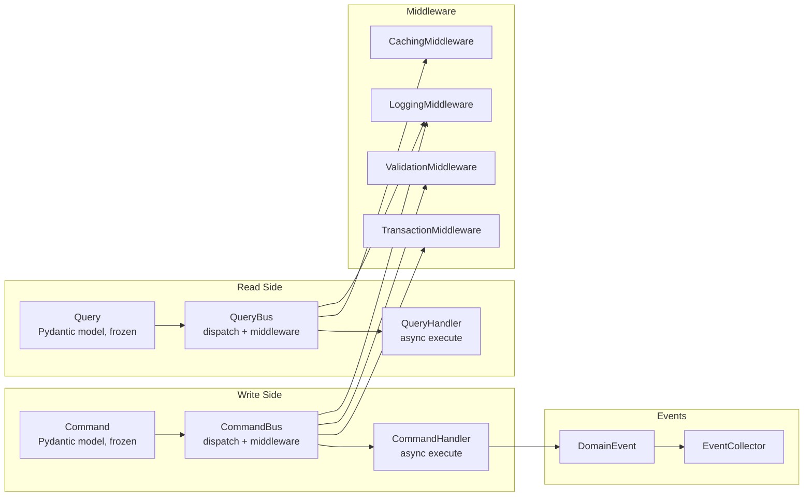

# CQRS (Command Query Responsibility Segregation)

Django Matt provides a CQRS implementation with command and query buses, domain events, bus middleware, and route decorators for cleanly separating write operations from read operations.

## Overview



## Quick Start

```python
from django_matt.cqrs import (
    Command, CommandBus, CommandHandler, command_handler,
    Query, QueryBus, QueryHandler, query_handler,
    get_command_bus, get_query_bus,
)

# 1. Define a command
class CreateUser(Command):
    name: str
    email: str

# 2. Register a handler
@command_handler(CreateUser)
class CreateUserHandler:
    async def execute(self, command: CreateUser) -> dict:
        user = await User.objects.acreate(name=command.name, email=command.email)
        return {"id": user.id, "name": user.name}

# 3. Dispatch
bus = get_command_bus()
result = await bus.dispatch(CreateUser(name="Alice", email="alice@example.com"))
```

## Commands

Commands represent intent to change state. They are frozen Pydantic models (immutable after creation).

### Defining Commands

```python
from django_matt.cqrs import Command


class CreateOrder(Command):
    customer_id: str
    items: list[dict]
    shipping_address: str


class CancelOrder(Command):
    order_id: str
    reason: str = ""
```

### Command Handlers

Handlers implement the `CommandHandler` protocol with an `async execute` method:

```python
from django_matt.cqrs import command_handler


@command_handler(CreateOrder)
class CreateOrderHandler:
    async def execute(self, command: CreateOrder) -> dict:
        order = await Order.objects.acreate(
            customer_id=command.customer_id,
            shipping_address=command.shipping_address,
        )
        for item in command.items:
            await OrderItem.objects.acreate(order=order, **item)
        return {"order_id": str(order.id)}
```

The `@command_handler` decorator instantiates the class and registers it with the default command bus. Each command type must have exactly one handler.

### CommandBus

```python
from django_matt.cqrs import CommandBus

bus = CommandBus()
bus.register(CreateOrder, CreateOrderHandler())
bus.use(LoggingMiddleware())
bus.use(TransactionMiddleware())

result = await bus.dispatch(CreateOrder(
    customer_id="cust_123",
    items=[{"sku": "ITEM-1", "qty": 2}],
    shipping_address="123 Main St",
))
```

The bus executes middleware `before` hooks in order, calls the handler, then executes middleware `after` hooks in reverse order.

### Default Bus

```python
from django_matt.cqrs import get_command_bus

# Singleton — same instance returned every time
bus = get_command_bus()
```

## Queries

Queries represent requests to read data. Also frozen Pydantic models.

### Defining Queries

```python
from django_matt.cqrs import Query


class GetUser(Query):
    user_id: str


class ListOrders(Query):
    customer_id: str
    status: str | None = None
    page: int = 1
```

### Query Handlers

```python
from django_matt.cqrs import query_handler


@query_handler(GetUser)
class GetUserHandler:
    async def execute(self, query: GetUser) -> dict:
        user = await User.objects.aget(id=query.user_id)
        return {"id": str(user.id), "name": user.name, "email": user.email}


@query_handler(ListOrders)
class ListOrdersHandler:
    async def execute(self, query: ListOrders) -> list[dict]:
        qs = Order.objects.filter(customer_id=query.customer_id)
        if query.status:
            qs = qs.filter(status=query.status)
        return [
            {"id": str(o.id), "total": o.total}
            async for o in qs[(query.page - 1) * 20 : query.page * 20]
        ]
```

### QueryBus

The query bus supports cache-hit short-circuiting — if `CachingMiddleware` finds a cached result, the handler is never called.

```python
from django_matt.cqrs import get_query_bus

bus = get_query_bus()
user = await bus.dispatch(GetUser(user_id="123"))
```

## Bus Middleware

Middleware hooks into the dispatch pipeline. Each middleware implements `before(message)` and `after(message, result)`.

### BusMiddleware Protocol

```python
from django_matt.cqrs import BusMiddleware

class MyMiddleware:
    async def before(self, message: Any) -> None:
        # Called before handler.execute()
        pass

    async def after(self, message: Any, result: Any) -> Any:
        # Called after handler.execute() (reverse order)
        return result  # return modified result or original
```

### LoggingMiddleware

Logs dispatch start and completion with elapsed time:

```python
from django_matt.cqrs import LoggingMiddleware

bus.use(LoggingMiddleware())
# INFO: dispatching CreateOrder
# INFO: completed CreateOrder in 12.3ms

# Custom logger
import logging
bus.use(LoggingMiddleware(log=logging.getLogger("myapp.cqrs")))
```

### ValidationMiddleware

Re-validates the message through Pydantic before dispatch:

```python
from django_matt.cqrs import ValidationMiddleware

bus.use(ValidationMiddleware())
```

### TransactionMiddleware

Wraps the handler in a database transaction. If the handler is already inside an atomic block, no additional transaction is created.

```python
from django_matt.cqrs import TransactionMiddleware

command_bus.use(TransactionMiddleware())
```

### CachingMiddleware

Caches query results by message type and content hash. When a cache hit occurs, the handler is skipped entirely.

```python
from django_matt.cqrs import CachingMiddleware

caching = CachingMiddleware(ttl=300)  # 5 minutes
query_bus.use(caching)

# First call — executes handler, caches result
result1 = await query_bus.dispatch(GetUser(user_id="123"))

# Second call — returns cached result, handler not called
result2 = await query_bus.dispatch(GetUser(user_id="123"))

# Invalidate all cached results
caching.invalidate()
```

Cache keys are generated from `{ClassName}:{md5(orjson.dumps(model_dump()))}`.

### Composing Middleware

```python
command_bus = CommandBus()
command_bus.use(LoggingMiddleware())
command_bus.use(ValidationMiddleware())
command_bus.use(TransactionMiddleware())

query_bus = QueryBus()
query_bus.use(LoggingMiddleware())
query_bus.use(CachingMiddleware(ttl=60))
```

Middleware `.use()` returns the bus, so you can chain:

```python
bus = CommandBus().use(LoggingMiddleware()).use(TransactionMiddleware())
```

## Domain Events

Events represent things that happened as a result of commands.

### Defining Events

```python
from django_matt.cqrs import DomainEvent


class UserCreated(DomainEvent):
    user_id: str
    email: str


class OrderPlaced(DomainEvent):
    order_id: str
    customer_id: str
    total: float
```

Every event gets an auto-generated `event_id` (UUID4) and `occurred_at` (timestamp).

### @emits Decorator

Annotate handlers with the events they emit (documentation and introspection):

```python
from django_matt.cqrs import emits


@emits(UserCreated)
@command_handler(CreateUser)
class CreateUserHandler:
    async def execute(self, command: CreateUser) -> dict:
        user = await User.objects.acreate(name=command.name, email=command.email)
        return {"id": str(user.id)}
```

### EventCollector

Collect events during a handler and publish them afterward:

```python
from django_matt.cqrs import EventCollector, DomainEvent


class OrderPlaced(DomainEvent):
    order_id: str


collector = EventCollector()

# Register event handlers
collector.on(OrderPlaced, send_confirmation_email)
collector.on(OrderPlaced, update_inventory)

# Collect events during command handling
collector.collect(OrderPlaced(order_id="order_123"))
collector.collect(OrderPlaced(order_id="order_456"))

# Publish all collected events
await collector.publish()  # calls both handlers for each event

# Events are cleared after publish
assert collector.events == []
```

## Route Decorators

Wire CQRS directly to controller endpoints.

### @command Decorator

Deserializes the request body into a command and dispatches it:

```python
from django_matt.cqrs import command


class UserController(APIController):
    @api.post("/users/")
    @command(CreateUser)
    async def create_user(self, request, data=None):
        pass  # handler body is ignored — bus handles execution
```

The decorator:
1. Extracts `data` from the endpoint parameter (Pydantic schema) or parses `request.body` with orjson
2. Constructs the command from the data
3. Dispatches through the command bus
4. Returns the handler result

### @query Decorator

Builds a query from request query parameters and dispatches it:

```python
from django_matt.cqrs import query


class UserController(APIController):
    @api.get("/users/<str:user_id>/")
    @query(GetUser)
    async def get_user(self, request, user_id: str):
        pass  # handler body is ignored — bus handles execution
```

The decorator:
1. Collects `request.GET` parameters
2. Merges in URL kwargs (e.g., `user_id` from the path)
3. Constructs the query
4. Dispatches through the query bus

## Testing

### InMemoryCommandBus

Drop-in replacement that records dispatched commands without executing handlers:

```python
from django_matt.cqrs.testing import InMemoryCommandBus, assert_command_dispatched

bus = InMemoryCommandBus()

# Pre-configure responses
bus.set_response(CreateUser, {"id": "user_123"})

# Dispatch
result = await bus.dispatch(CreateUser(name="Alice", email="alice@example.com"))
assert result == {"id": "user_123"}

# Assert what was dispatched
assert_command_dispatched(bus, CreateUser, name="Alice")
```

### InMemoryQueryBus

```python
from django_matt.cqrs.testing import InMemoryQueryBus, assert_query_dispatched

bus = InMemoryQueryBus()
bus.set_response(GetUser, {"id": "123", "name": "Alice"})

result = await bus.dispatch(GetUser(user_id="123"))
assert_query_dispatched(bus, GetUser, user_id="123")
```

### Dynamic Responses

Pass a callable for computed test responses:

```python
bus.set_response(CreateUser, lambda cmd: {"id": "new", "name": cmd.name})
result = await bus.dispatch(CreateUser(name="Bob", email="bob@example.com"))
assert result["name"] == "Bob"
```

### Assertion Helpers

```python
# Assert a specific command type was dispatched
assert_command_dispatched(bus, CreateUser)

# Assert with field matching
assert_command_dispatched(bus, CreateUser, name="Alice", email="alice@example.com")

# Assert a query was dispatched
assert_query_dispatched(bus, GetUser, user_id="123")
```

Both raise `AssertionError` with a descriptive message if the assertion fails.

## Full CQRS Flow Example

```python
# commands.py
from django_matt.cqrs import Command, DomainEvent, command_handler, emits, EventCollector

class PlaceOrder(Command):
    customer_id: str
    items: list[dict]

class OrderPlaced(DomainEvent):
    order_id: str
    customer_id: str

@emits(OrderPlaced)
@command_handler(PlaceOrder)
class PlaceOrderHandler:
    async def execute(self, command: PlaceOrder) -> dict:
        order = await Order.objects.acreate(customer_id=command.customer_id)
        for item in command.items:
            await OrderItem.objects.acreate(order=order, **item)

        # Emit domain event
        collector = EventCollector()
        collector.on(OrderPlaced, send_order_confirmation)
        collector.on(OrderPlaced, notify_warehouse)
        collector.collect(OrderPlaced(
            order_id=str(order.id),
            customer_id=command.customer_id,
        ))
        await collector.publish()

        return {"order_id": str(order.id)}


# queries.py
from django_matt.cqrs import Query, query_handler

class GetOrderStatus(Query):
    order_id: str

@query_handler(GetOrderStatus)
class GetOrderStatusHandler:
    async def execute(self, query: GetOrderStatus) -> dict:
        order = await Order.objects.aget(id=query.order_id)
        return {"order_id": str(order.id), "status": order.status}


# controllers.py
from django_matt.cqrs import command, query

class OrderController(APIController):
    @api.post("/orders/")
    @command(PlaceOrder)
    async def place_order(self, request, data=None):
        pass

    @api.get("/orders/<str:order_id>/status/")
    @query(GetOrderStatus)
    async def order_status(self, request, order_id: str):
        pass


# tests.py
import pytest
from django_matt.cqrs.testing import InMemoryCommandBus, assert_command_dispatched

@pytest.fixture
def command_bus():
    bus = InMemoryCommandBus()
    bus.set_response(PlaceOrder, {"order_id": "test_123"})
    return bus

async def test_place_order(command_bus):
    result = await command_bus.dispatch(PlaceOrder(
        customer_id="cust_1",
        items=[{"sku": "ITEM-1", "qty": 1}],
    ))
    assert result["order_id"] == "test_123"
    assert_command_dispatched(command_bus, PlaceOrder, customer_id="cust_1")
```

## Best Practices

1. **Commands change state, queries read state** — never mutate data in a query handler
2. **One handler per command** — the bus enforces this; if you need fan-out, use domain events
3. **Use `TransactionMiddleware` on the command bus** — ensures atomic writes
4. **Use `CachingMiddleware` on the query bus** — avoids redundant reads
5. **Keep commands and queries as frozen Pydantic models** — immutability prevents accidental mutation
6. **Use `InMemoryCommandBus` in tests** — avoids hitting real handlers while verifying dispatch
7. **Emit domain events from handlers** — decouple side effects (emails, notifications) from core logic
8. **Use route decorators** to connect CQRS directly to HTTP endpoints with zero boilerplate
