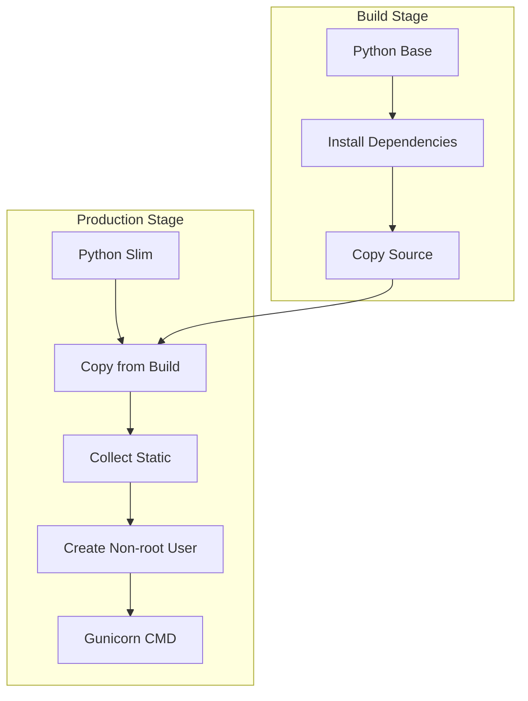

# Docker Deployment

django-matt generates production-ready Docker configurations.

## Generated Files

```bash
python manage.py deploy init --platform docker
```

Creates:
```
├── Dockerfile
├── docker-compose.yml
├── docker-compose.prod.yml
└── .dockerignore
```

## Dockerfile



Generated Dockerfile:
```dockerfile
# Build stage
FROM python:3.12-slim as builder

WORKDIR /app

# Install build dependencies
RUN apt-get update && apt-get install -y \
    build-essential \
    libpq-dev \
    && rm -rf /var/lib/apt/lists/*

# Install Python dependencies
COPY pyproject.toml uv.lock ./
RUN pip install uv && uv sync --frozen --no-dev

# Production stage
FROM python:3.12-slim

WORKDIR /app

# Install runtime dependencies
RUN apt-get update && apt-get install -y \
    libpq5 \
    && rm -rf /var/lib/apt/lists/*

# Copy dependencies from builder
COPY --from=builder /app/.venv /app/.venv

# Copy application
COPY . .

# Collect static files
RUN .venv/bin/python manage.py collectstatic --noinput

# Create non-root user
RUN useradd -m appuser && chown -R appuser:appuser /app
USER appuser

# Health check
HEALTHCHECK --interval=30s --timeout=10s --start-period=5s --retries=3 \
    CMD curl -f http://localhost:8000/health/ || exit 1

EXPOSE 8000

CMD [".venv/bin/gunicorn", "config.wsgi:application", \
     "--bind", "0.0.0.0:8000", \
     "--workers", "4", \
     "--threads", "2"]
```

## Docker Compose (Development)

```yaml
# docker-compose.yml
version: '3.8'

services:
  web:
    build: .
    ports:
      - "8000:8000"
    volumes:
      - .:/app
    environment:
      - DEBUG=true
      - DATABASE_URL=postgres://postgres:postgres@db:5432/app
      - REDIS_URL=redis://redis:6379/0
    depends_on:
      - db
      - redis
    command: python manage.py runserver 0.0.0.0:8000

  db:
    image: postgres:16-alpine
    volumes:
      - postgres_data:/var/lib/postgresql/data
    environment:
      - POSTGRES_DB=app
      - POSTGRES_USER=postgres
      - POSTGRES_PASSWORD=postgres

  redis:
    image: redis:7-alpine
    volumes:
      - redis_data:/data

volumes:
  postgres_data:
  redis_data:
```

## Docker Compose (Production)

```yaml
# docker-compose.prod.yml
version: '3.8'

services:
  web:
    build:
      context: .
      dockerfile: Dockerfile
    restart: always
    expose:
      - "8000"
    environment:
      - DEBUG=false
      - DATABASE_URL=${DATABASE_URL}
      - REDIS_URL=${REDIS_URL}
      - SECRET_KEY=${SECRET_KEY}
    depends_on:
      db:
        condition: service_healthy
      redis:
        condition: service_healthy
    healthcheck:
      test: ["CMD", "curl", "-f", "http://localhost:8000/health/"]
      interval: 30s
      timeout: 10s
      retries: 3

  caddy:
    image: caddy:2-alpine
    restart: always
    ports:
      - "80:80"
      - "443:443"
    volumes:
      - ./Caddyfile:/etc/caddy/Caddyfile
      - caddy_data:/data
      - caddy_config:/config
    depends_on:
      - web

  db:
    image: postgres:16-alpine
    restart: always
    volumes:
      - postgres_data:/var/lib/postgresql/data
    environment:
      - POSTGRES_DB=${POSTGRES_DB}
      - POSTGRES_USER=${POSTGRES_USER}
      - POSTGRES_PASSWORD=${POSTGRES_PASSWORD}
    healthcheck:
      test: ["CMD-SHELL", "pg_isready -U ${POSTGRES_USER}"]
      interval: 10s
      timeout: 5s
      retries: 5

  redis:
    image: redis:7-alpine
    restart: always
    volumes:
      - redis_data:/data
    healthcheck:
      test: ["CMD", "redis-cli", "ping"]
      interval: 10s
      timeout: 5s
      retries: 5

  celery:
    build: .
    restart: always
    command: celery -A config worker -l info
    environment:
      - DATABASE_URL=${DATABASE_URL}
      - REDIS_URL=${REDIS_URL}
    depends_on:
      - db
      - redis

  celery-beat:
    build: .
    restart: always
    command: celery -A config beat -l info
    environment:
      - DATABASE_URL=${DATABASE_URL}
      - REDIS_URL=${REDIS_URL}
    depends_on:
      - db
      - redis

volumes:
  postgres_data:
  redis_data:
  caddy_data:
  caddy_config:
```

## Caddyfile (Auto SSL)

```caddyfile
{$DOMAIN:localhost} {
    reverse_proxy web:8000

    encode gzip

    header {
        X-Content-Type-Options nosniff
        X-Frame-Options DENY
        Referrer-Policy strict-origin-when-cross-origin
    }
}
```

## Running Production

```bash
# Build and start
docker-compose -f docker-compose.prod.yml up -d --build

# Run migrations
docker-compose -f docker-compose.prod.yml exec web \
    python manage.py migrate

# Create superuser
docker-compose -f docker-compose.prod.yml exec web \
    python manage.py createsuperuser

# View logs
docker-compose -f docker-compose.prod.yml logs -f web

# Scale workers
docker-compose -f docker-compose.prod.yml up -d --scale celery=3
```
