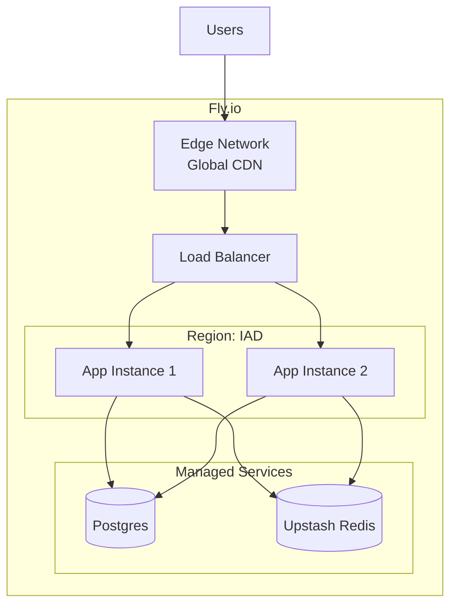

# Fly.io Deployment

Deploy django-matt applications to Fly.io with automatic configuration.

## Quick Start

```bash
# Initialize Fly.io configuration
python manage.py deploy init --platform fly

# Deploy
python manage.py deploy --platform fly
```

## Generated Configuration

### fly.toml

```toml
app = "myapp"
primary_region = "iad"

[build]
  dockerfile = "Dockerfile"

[env]
  DJANGO_SETTINGS_MODULE = "config.settings.production"
  PORT = "8000"

[http_service]
  internal_port = 8000
  force_https = true
  auto_stop_machines = true
  auto_start_machines = true
  min_machines_running = 1
  processes = ["app"]

[[http_service.checks]]
  grace_period = "10s"
  interval = "30s"
  method = "GET"
  path = "/health/"
  timeout = "5s"

[[services]]
  internal_port = 8000
  protocol = "tcp"

  [[services.ports]]
    handlers = ["http"]
    port = 80

  [[services.ports]]
    handlers = ["tls", "http"]
    port = 443

[mounts]
  source = "data"
  destination = "/app/data"
```

## Architecture



## Setup Steps

### 1. Install Fly CLI

```bash
# macOS
brew install flyctl

# Linux
curl -L https://fly.io/install.sh | sh

# Login
fly auth login
```

### 2. Create App

```bash
# Initialize (creates fly.toml)
python manage.py deploy init --platform fly --app myapp

# Or manually
fly apps create myapp
```

### 3. Provision Database

```bash
# Create Postgres cluster
fly postgres create --name myapp-db

# Attach to app
fly postgres attach myapp-db --app myapp
```

### 4. Set Secrets

```bash
fly secrets set \
    SECRET_KEY="your-secret-key" \
    DJANGO_ALLOWED_HOSTS="myapp.fly.dev" \
    --app myapp
```

### 5. Deploy

```bash
# Deploy application
fly deploy

# Or via management command
python manage.py deploy --platform fly
```

## Scaling

```bash
# Scale to 3 instances
fly scale count 3

# Scale machine size
fly scale vm shared-cpu-2x

# Auto-scaling configuration
fly scale show
```

## Database Migrations

```bash
# Run migrations
fly ssh console -C "python manage.py migrate"

# Or with release command in fly.toml
[deploy]
  release_command = "python manage.py migrate --noinput"
```

## Monitoring

```bash
# View logs
fly logs

# Monitor metrics
fly dashboard

# SSH into instance
fly ssh console
```

## Multi-Region

```toml
# fly.toml
primary_region = "iad"

[env]
  PRIMARY_REGION = "iad"

# Read replicas in other regions
[[services]]
  internal_port = 8000
  protocol = "tcp"
  regions = ["iad", "lhr", "sin"]
```

## Celery Workers

```toml
# fly.toml - Additional process
[processes]
  app = "gunicorn config.wsgi:application --bind 0.0.0.0:8000"
  worker = "celery -A config worker -l info"
  beat = "celery -A config beat -l info"
```

```bash
# Scale workers independently
fly scale count app=2 worker=4 beat=1
```
