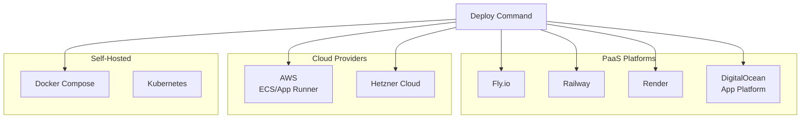
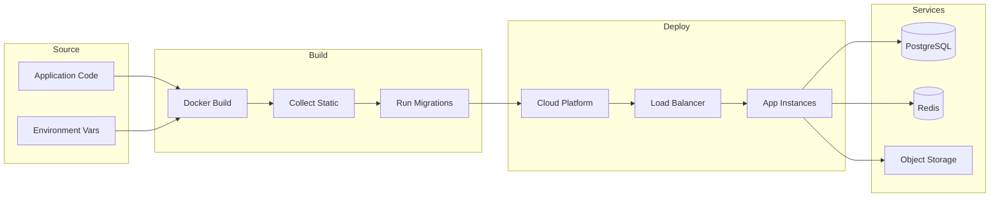
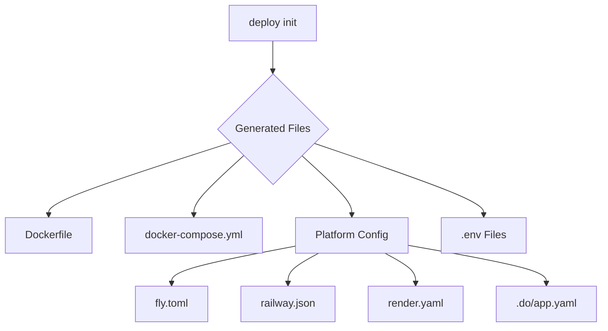
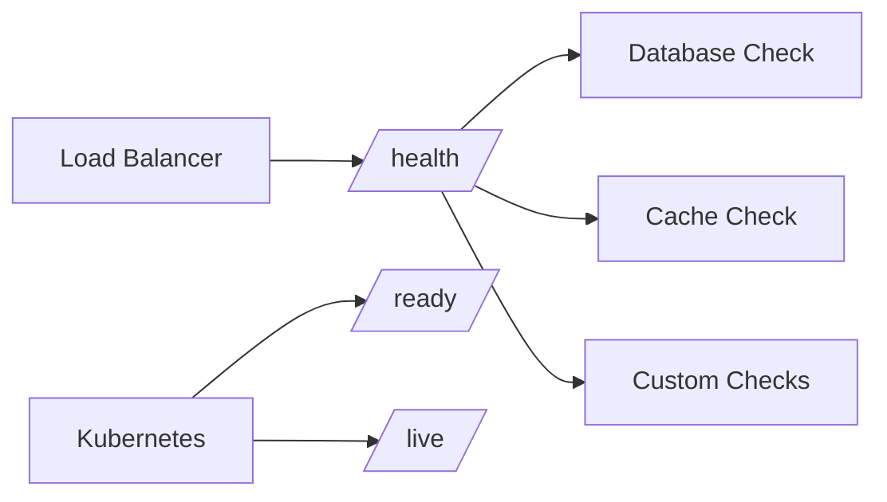

# Deployment Overview

django-matt provides built-in deployment support for popular cloud platforms and self-hosted options.

## Supported Platforms



## Quick Start

```bash
# Initialize deployment configuration
python manage.py deploy init --platform fly

# Deploy to platform
python manage.py deploy --platform fly

# Deploy specific environment
python manage.py deploy --platform fly --env production
```

## Deployment Architecture



## Configuration Files



## Environment Configuration

```python
# Generated environments
environments/
├── .env.development
├── .env.staging
└── .env.production
```

Each environment includes:
- Database connection
- Redis/cache settings
- Security settings (SECRET_KEY, ALLOWED_HOSTS)
- Email configuration
- Storage settings

## Health Checks



Built-in endpoints:
- `/health/` - Full health check (all services)
- `/ready/` - Kubernetes readiness probe
- `/live/` - Kubernetes liveness probe

## Related Documentation

- [Fly.io](./fly.md)
- [Railway](./railway.md)
- [Render](./render.md)
- [AWS](./aws.md)
- [Docker](./docker.md)
- [Environment Setup](./environments.md)
