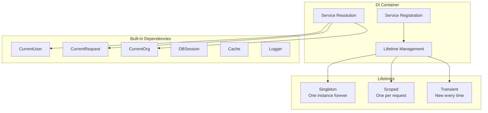

# Dependency Injection

Django Matt provides a lightweight, type-safe Dependency Injection (DI) container for building modular, testable applications.

## Overview



!!! warning "Limitation: Depends() is not auto-wired in the router"
    The DI container and `Depends()` marker exist, but `Depends()` is **not automatically
    resolved** in the request pipeline. The router does not inspect controller method
    parameters for `Depends()` markers. You must resolve dependencies manually using
    `container.resolve()` or use the DI middleware for scope management.

    This is a known limitation and may be addressed in a future release.

## Quick Start

```python
from django_matt.di import container, Singleton, Scoped

# 1. Define your services
class EmailService:
    def send(self, to: str, subject: str, body: str):
        # Send email logic
        pass

class UserService:
    def __init__(self, email: EmailService):
        self.email = email

    def send_welcome(self, user_id: int):
        user = User.objects.get(id=user_id)
        self.email.send(user.email, "Welcome!", "Welcome to our app!")

# 2. Register services
container.register(EmailService, lifetime=Singleton)
container.register(UserService, lifetime=Singleton)

# 3. Resolve manually in controllers
class UserController(APIController):
    @post("/send-welcome")
    async def send_welcome(self, request, user_id: int):
        user_service = container.resolve(UserService)
        user_service.send_welcome(user_id)
        return {"status": "sent"}
```

## Service Lifetimes

### Singleton

One instance for the entire application lifetime. Perfect for stateless services, database connections, or expensive-to-create objects.

```python
from django_matt.di import container, Singleton

class DatabaseConnection:
    def __init__(self):
        self.pool = create_pool()

container.register(DatabaseConnection, lifetime=Singleton)

# Same instance everywhere
db1 = container.resolve(DatabaseConnection)
db2 = container.resolve(DatabaseConnection)
assert db1 is db2  # True
```

### Scoped

One instance per request/scope. Useful for request-specific data or per-request caching.

```python
from django_matt.di import container, Scoped

class RequestCache:
    def __init__(self):
        self.data = {}

container.register(RequestCache, lifetime=Scoped)

# Different instance per scope
with container.create_scope() as scope:
    cache1 = scope.resolve(RequestCache)
    cache2 = scope.resolve(RequestCache)
    assert cache1 is cache2  # Same within scope

# New scope = new instance
with container.create_scope() as scope:
    cache3 = scope.resolve(RequestCache)
    assert cache3 is not cache1  # Different across scopes
```

### Transient

New instance every time. For lightweight services or when each consumer needs its own instance.

```python
from django_matt.di import container, Transient

class QueryBuilder:
    def __init__(self):
        self.parts = []

container.register(QueryBuilder, lifetime=Transient)

# Different instance every time
qb1 = container.resolve(QueryBuilder)
qb2 = container.resolve(QueryBuilder)
assert qb1 is not qb2  # Always new
```

## Registration Methods

### Basic Registration

```python
# Register concrete class
container.register(EmailService, lifetime=Singleton)

# Register interface with implementation
container.register(IEmailService, SmtpEmailService, lifetime=Singleton)

# Register with factory function
container.register(
    Config,
    factory=lambda: Config.from_env(),
    lifetime=Singleton
)

# Register existing instance
logger = Logger(level="DEBUG")
container.register_instance(logger, Logger)
```

### Using Decorators

```python
from django_matt.di import injectable, singleton, scoped, transient

@singleton
class ConfigService:
    def __init__(self):
        self.settings = load_settings()

@scoped
class RequestContext:
    def __init__(self):
        self.start_time = time.time()

@transient
class QueryBuilder:
    pass

# Or with the base decorator
@injectable(lifetime=Singleton)
class MyService:
    pass
```

## Dependency Resolution

### Automatic Resolution

Dependencies are automatically resolved based on type hints:

```python
class NotificationService:
    def __init__(self, email: EmailService, sms: SMSService):
        self.email = email
        self.sms = sms

container.register(EmailService, lifetime=Singleton)
container.register(SMSService, lifetime=Singleton)
container.register(NotificationService, lifetime=Singleton)

# Dependencies are automatically injected
notification = container.resolve(NotificationService)
# notification.email is EmailService instance
# notification.sms is SMSService instance
```

### Using container.resolve() in Controllers

Since `Depends()` is not auto-wired in the router, resolve services manually:

```python
from django_matt.di import container

class OrderController(APIController):
    @post("/orders")
    async def create_order(self, request, data: OrderCreate):
        order_service = container.resolve(OrderService)
        notification = container.resolve(NotificationService)
        order = order_service.create(data)
        notification.send_order_confirmation(order)
        return order
```

### Manual Resolution

```python
# Resolve a service
service = container.resolve(MyService)

# Try to resolve (returns None if not found)
service = container.try_resolve(MyService)

# Check if registered
if container.is_registered(MyService):
    service = container.resolve(MyService)
```

## Built-in Dependencies

Django Matt provides built-in dependency markers for common needs. These are
designed for use with the DI middleware and manual resolution.

!!! note "Auto-injection not yet wired"
    These markers (`CurrentUser()`, `CurrentOrg()`, etc.) are defined but are
    **not automatically resolved** as function parameters by the router. Access
    the request object directly for user and org context, or use the DI middleware
    with `container.resolve()`.

```python
# Recommended approach — use request directly:
@api.get("/profile")
@jwt_required
async def get_profile(request):
    user = request.user
    return {"user": user.email}

# Query parameters are handled via standard function signatures:
@api.get("/items")
async def list_items(request, page: int = 1):
    return {"page": page}
```

Available built-in markers (for use with DI middleware/manual resolution):

```python
from django_matt.di import (
    CurrentUser,
    CurrentRequest,
    CurrentOrg,
    CurrentTenant,
    DBSession,
    Settings,
    Cache,
    Logger,
    Query,
    Header,
    Path,
)
```

### CurrentUser

For authenticated user access, use the `@jwt_required` decorator and `request.user`:

```python
from django_matt.auth import jwt_required, jwt_optional

@api.get("/me")
@jwt_required
async def get_me(request):
    return {"id": request.user.id, "email": request.user.email}

# Optional auth
@api.get("/maybe-me")
@jwt_optional
async def get_maybe_me(request):
    if request.user.is_authenticated:
        return {"user": request.user.email}
    return {"user": None}
```

### CurrentOrg / CurrentTenant

For multi-tenant applications, use the tenant middleware which sets `request.org`:

```python
@api.get("/projects")
@jwt_required
async def list_projects(request):
    org = request.org  # Set by TenantMiddleware
    return Project.objects.filter(organization=org)
```

### Query and Path Parameters

Query and path parameters are extracted via standard function signatures (not DI):

```python
@api.get("/search")
async def search(request, q: str = "", limit: int = 10):
    # q and limit come from query string: ?q=term&limit=20
    return {"query": q, "limit": limit}

@api.get("/users/{user_id}")
async def get_user(request, user_id: int):
    # user_id comes from the URL path
    return User.objects.get(id=user_id)

# For headers, access request.headers directly:
@api.get("/check-key")
async def check_key(request):
    api_key = request.headers.get("X-API-Key", "")
    return {"has_key": bool(api_key)}
```

## Middleware

Enable DI middleware for automatic scope management:

```python
# settings.py
MIDDLEWARE = [
    ...
    'django_matt.di.DependencyInjectionMiddleware',
    # Or for async views:
    # 'django_matt.di.AsyncDependencyInjectionMiddleware',
]
```

This creates a new scope for each request, ensuring scoped services are properly managed.

## Error Handling

### ServiceNotFoundError

Raised when resolving an unregistered service:

```python
from django_matt.di import ServiceNotFoundError

try:
    service = container.resolve(UnknownService)
except ServiceNotFoundError as e:
    print(f"Service not found: {e.service_type}")
```

### CircularDependencyError

Raised when circular dependencies are detected:

```python
from django_matt.di import CircularDependencyError

class ServiceA:
    def __init__(self, b: "ServiceB"): pass

class ServiceB:
    def __init__(self, a: ServiceA): pass

container.register(ServiceA)
container.register(ServiceB)

try:
    container.resolve(ServiceA)
except CircularDependencyError as e:
    print(f"Circular: {e.chain}")
    # Output: Circular: [ServiceA, ServiceB, ServiceA]
```

## Testing

DI makes testing easy by allowing service substitution:

```python
import pytest
from django_matt.di import container

class MockEmailService:
    def __init__(self):
        self.sent = []

    def send(self, to, subject, body):
        self.sent.append((to, subject, body))

@pytest.fixture
def mock_email():
    # Save original
    original = container.try_resolve(EmailService)

    # Register mock
    mock = MockEmailService()
    container.register_instance(mock, EmailService)

    yield mock

    # Restore original
    if original:
        container.register_instance(original, EmailService)

def test_send_welcome(mock_email):
    user_service = container.resolve(UserService)
    user_service.send_welcome(1)

    assert len(mock_email.sent) == 1
    assert "Welcome" in mock_email.sent[0][1]
```

## Best Practices

1. **Register services at startup** - Register all services when the application starts (e.g., in `AppConfig.ready()`)

2. **Use interfaces** - Register interfaces with implementations for flexibility:
   ```python
   container.register(IEmailService, SmtpEmailService, lifetime=Singleton)
   ```

3. **Prefer constructor injection** - Let dependencies be injected via constructors:
   ```python
   class OrderService:
       def __init__(self, db: Database, cache: Cache):
           self.db = db
           self.cache = cache
   ```

4. **Keep services stateless** - Singletons should be stateless or thread-safe

5. **Use scoped services for request data** - Request-specific caching or context should be scoped

6. **Test with mocks** - Replace services with mocks in tests for isolation
