# Visual Diagrams Index

This page collects all architectural diagrams for django-matt.

## System Overview

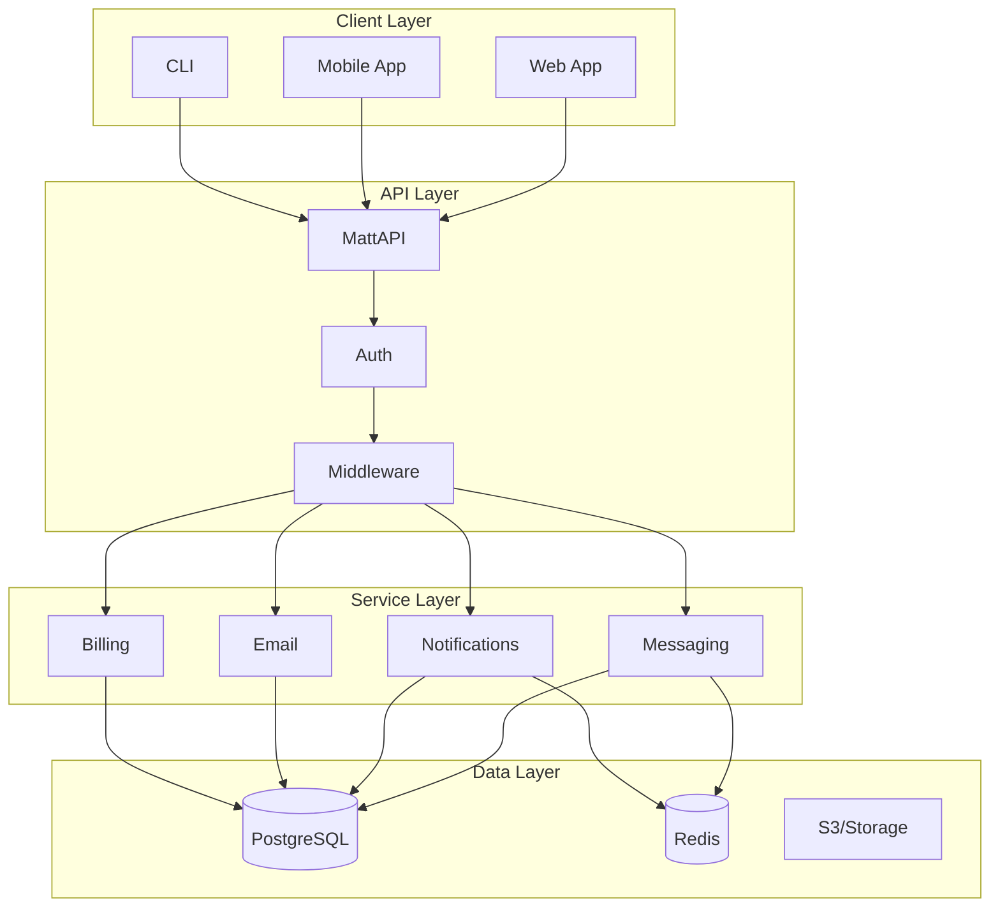

## Request Flow

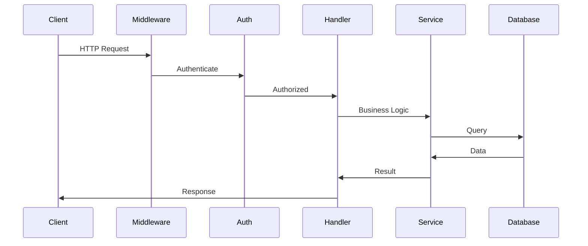

## Authentication Methods

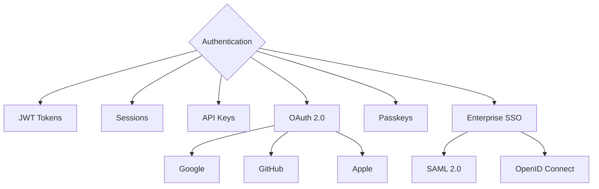

## Messaging Architecture

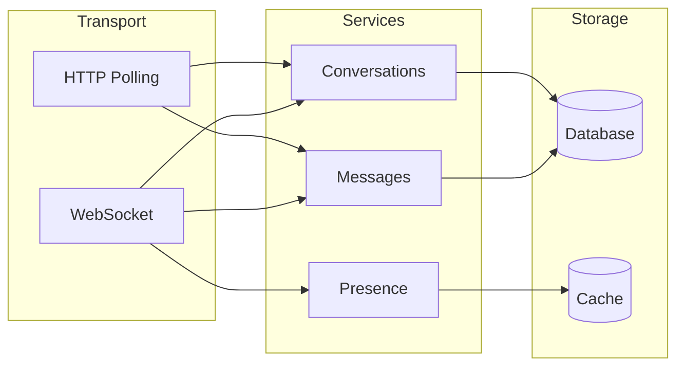

## Notification Channels

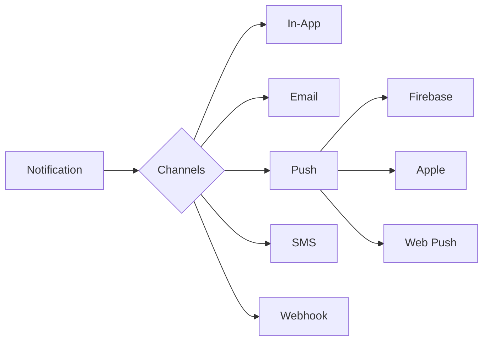

## Email Service

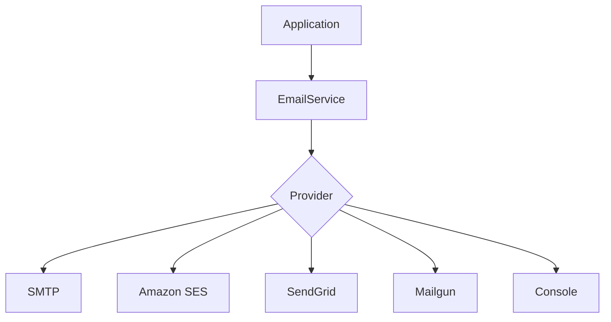

## Data Model - Core

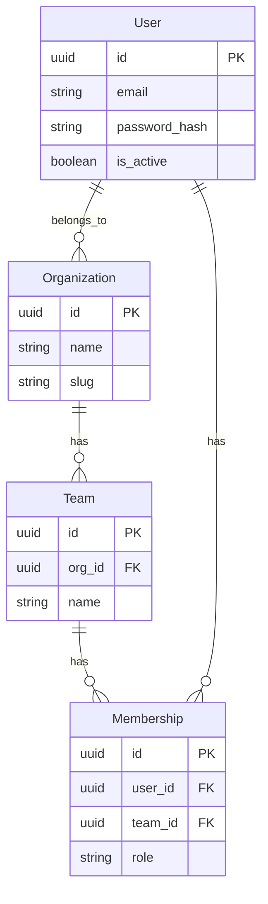

## Data Model - Messaging

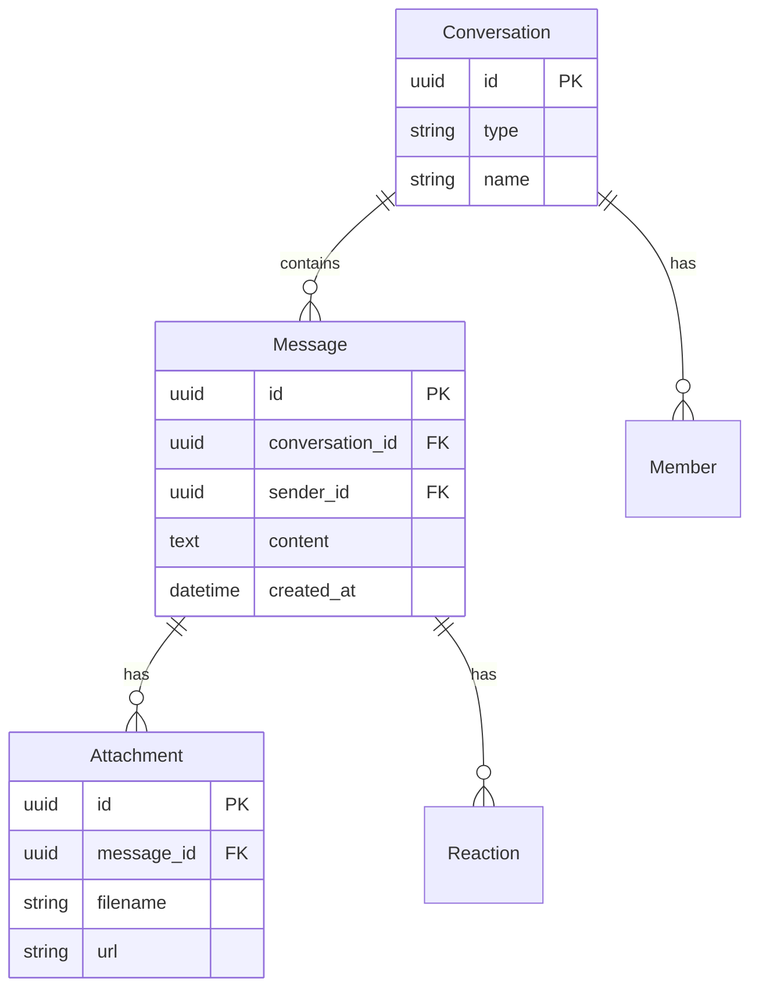

## Data Model - Billing

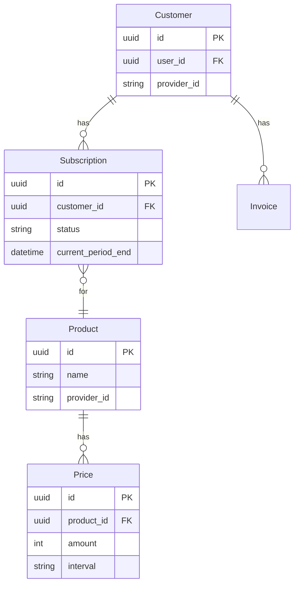

## Deployment Architecture

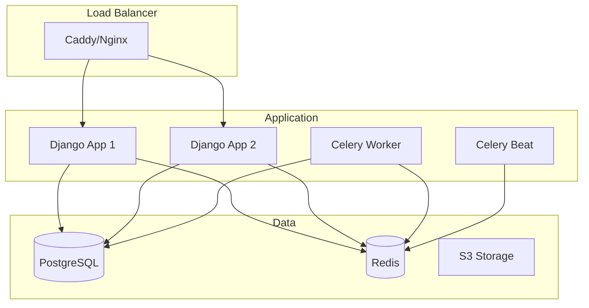

## Component System

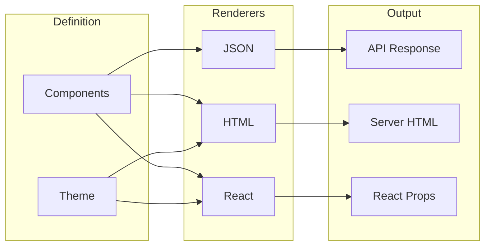

## Related Documentation

- [Architecture Overview](./architecture/overview.md)
- [Authentication](./architecture/authentication.md)
- [Data Flow](./architecture/data-flow.md)
- [Messaging](./messaging/overview.md)
- [Notifications](./notifications/overview.md)
- [Email](./email/overview.md)
- [Deployment](./deployment/overview.md)
