# Visual Diagrams Index

This page collects all architectural diagrams for django-matt.

## System Overview

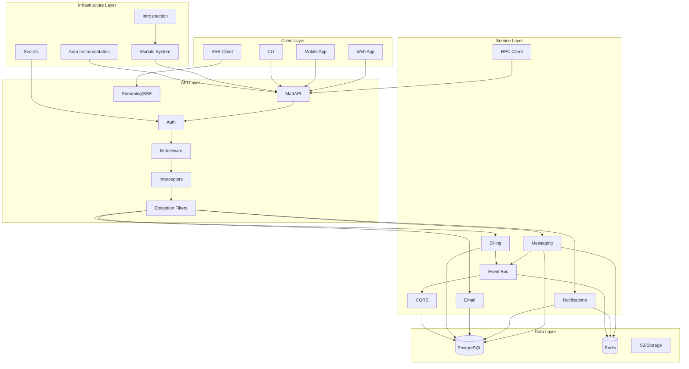

## Request Flow

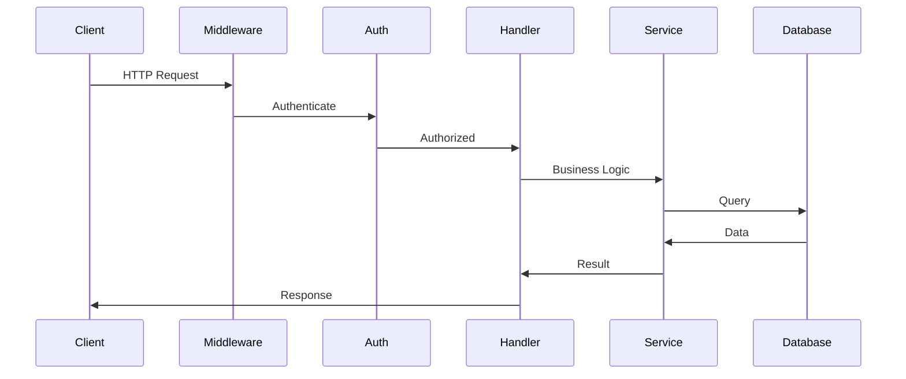

## Authentication Methods

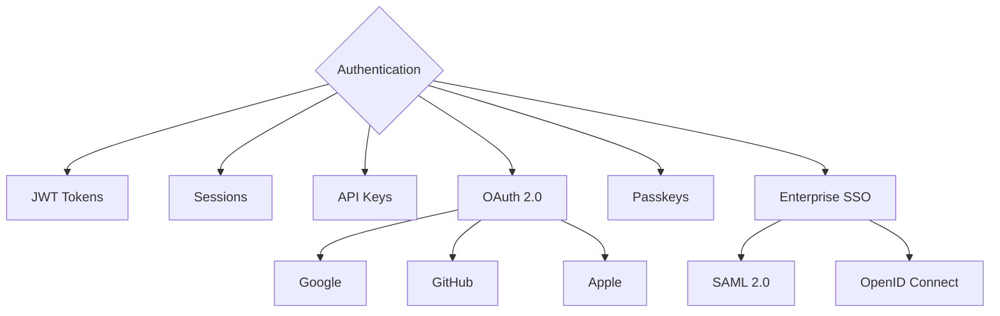

## Messaging Architecture

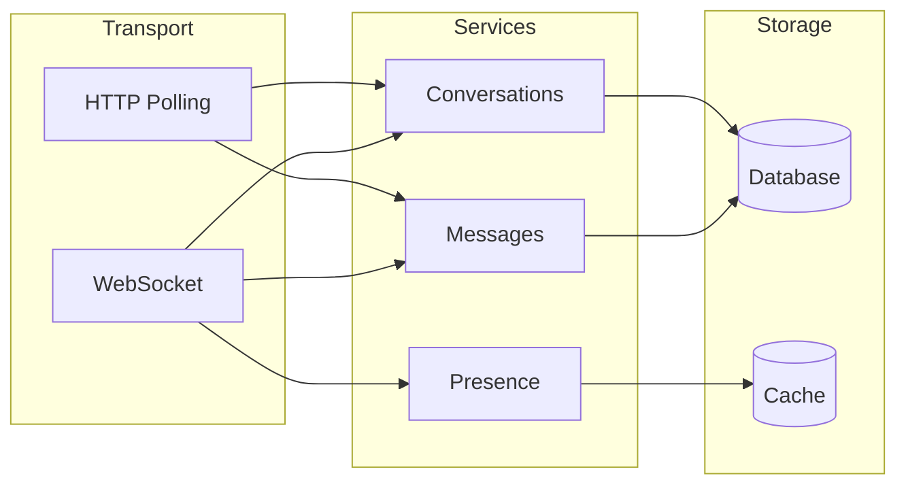

## Notification Channels

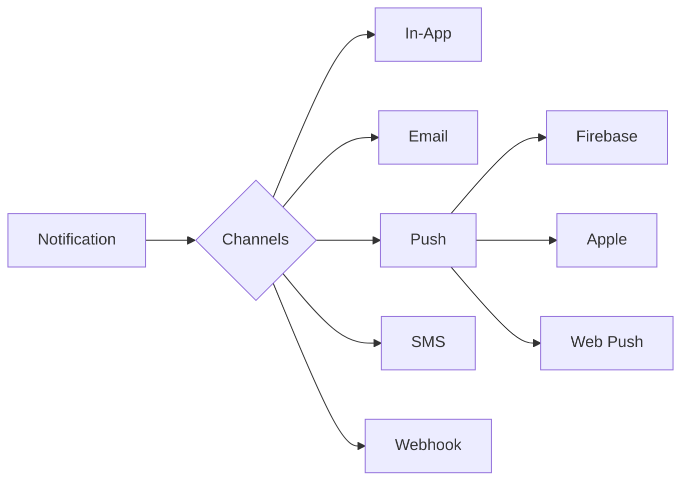

## Email Service

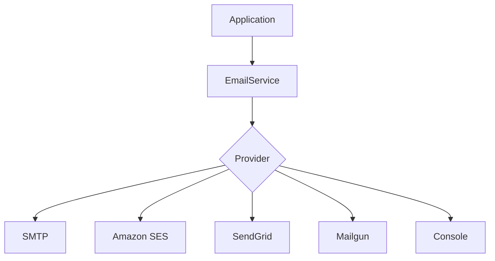

## Data Model - Core

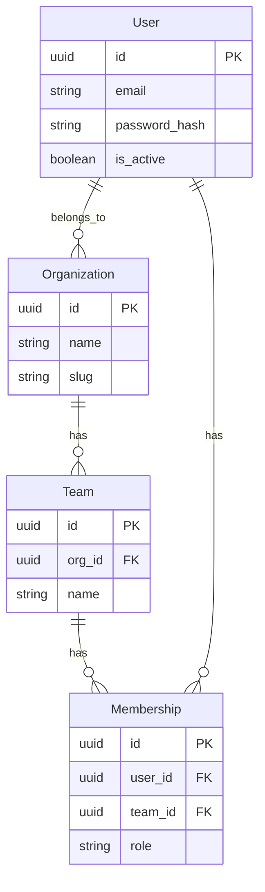

## Data Model - Messaging

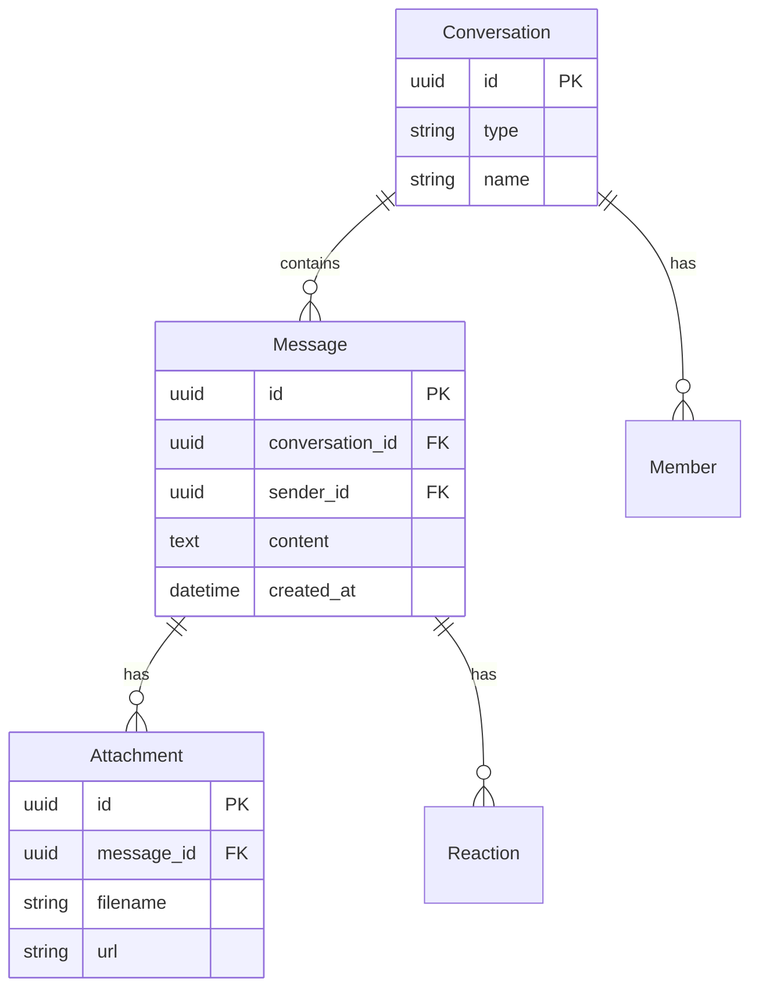

## Data Model - Billing

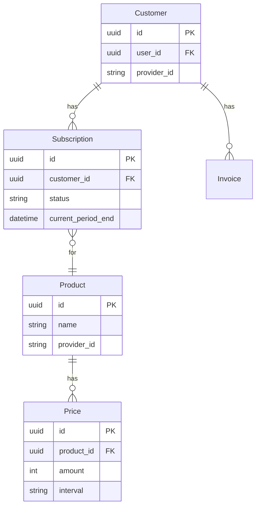

## Deployment Architecture

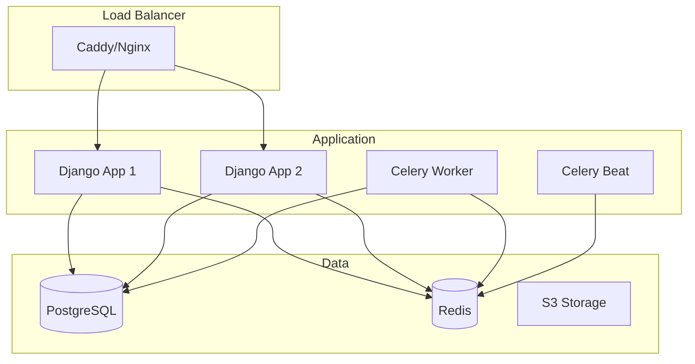

## Component System

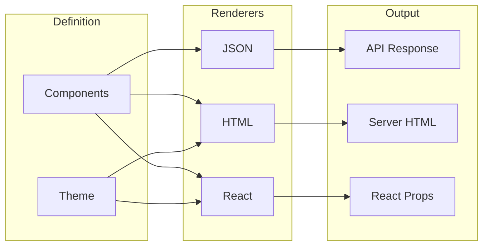

## Dependency Injection

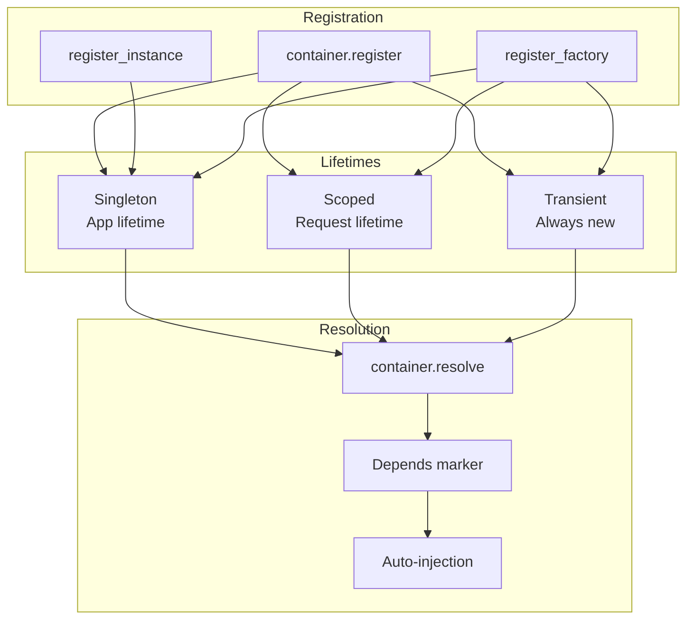

## Content Negotiation

```mermaid
flowchart LR
    subgraph "Input"
        ACCEPT[Accept Header]
        QUERY[?format=xml]
        SUFFIX[/users.csv]
    end

    subgraph "Negotiator"
        NEG[ContentNegotiator]
    end

    subgraph "Renderers"
        JSON[JSON]
        XML[XML]
        CSV[CSV]
        YAML[YAML]
        MSG[MessagePack]
    end

    ACCEPT & QUERY & SUFFIX --> NEG
    NEG --> JSON & XML & CSV & YAML & MSG
```

## RBAC Hierarchy

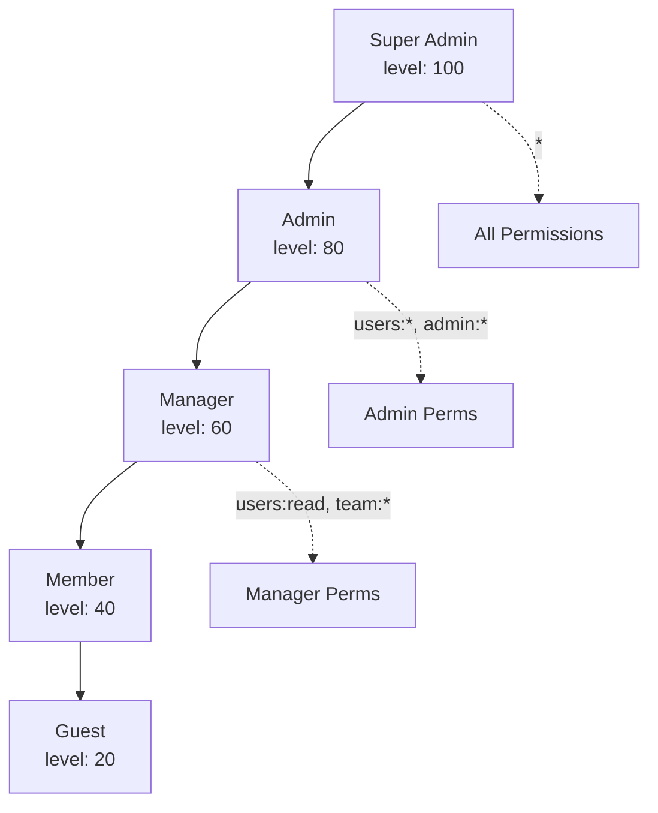

## AI/RAG Pipeline

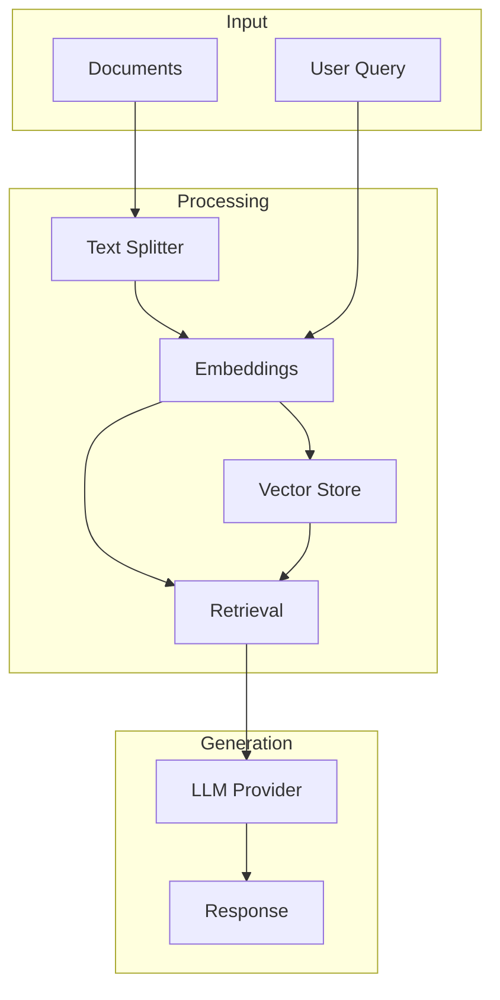

## Audit Trail

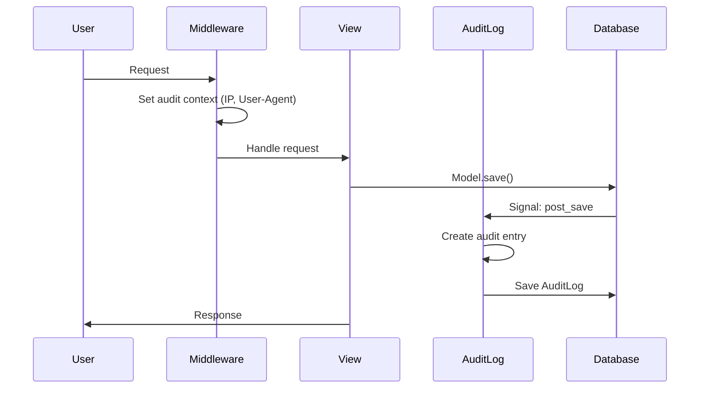

## Request Pipeline

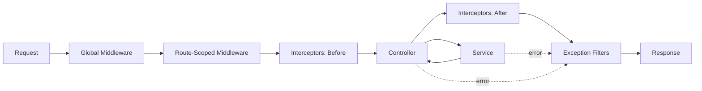

## Event-Driven Architecture

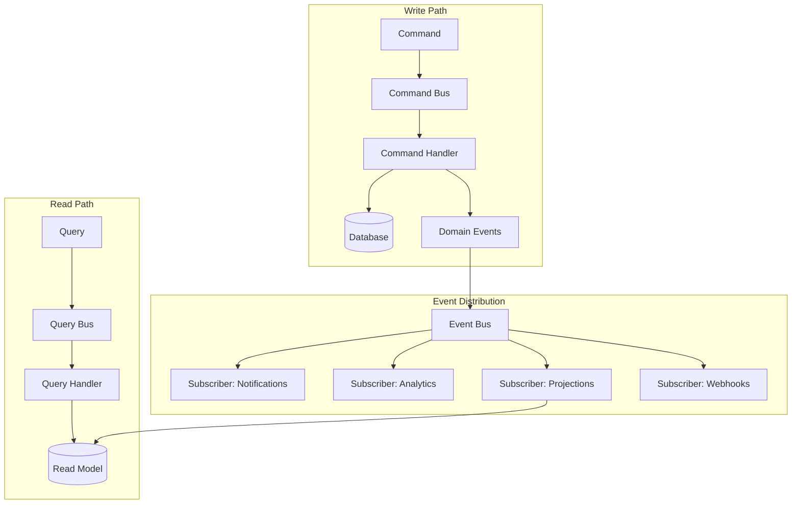

## Module System

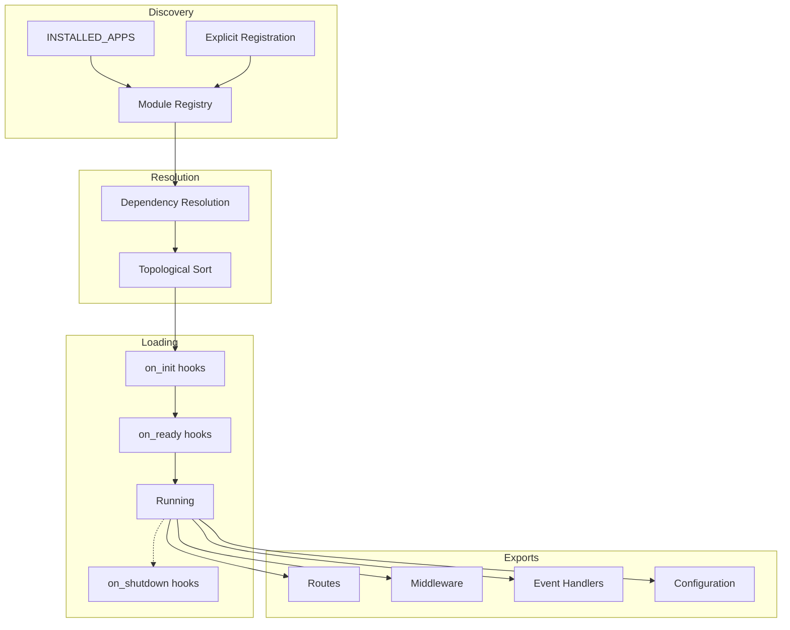

## Slim Mode

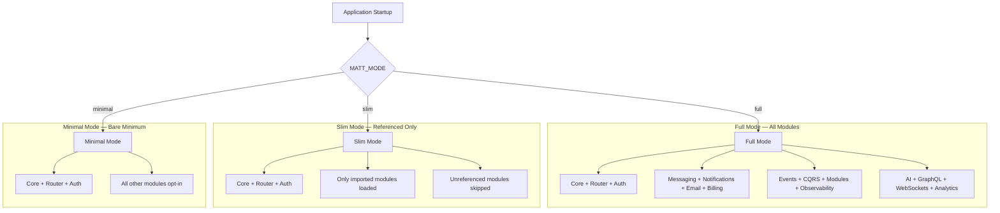

## Streaming / SSE

```mermaid
sequenceDiagram
    participant C as Client
    participant S as SSE Endpoint
    participant E as Event Bus
    participant SVC as Service

    C->>S: GET /events (Accept: text/event-stream)
    S->>C: HTTP 200 (chunked)

    loop While connected
        SVC->>E: emit(OrderCreated)
        E->>S: notify subscriber
        S->>C: event: order.created\ndata: {...}\n\n
    end

    S->>C: keepalive (: ping)
    C--xS: disconnect
    S->>S: cleanup
```

## Secrets Management

```mermaid
flowchart LR
    subgraph "Backends"
        ENV[Environment Vars]
        VAULT[HashiCorp Vault]
        AWS[AWS Secrets Manager]
        GCP[GCP Secret Manager]
    end

    subgraph "Secrets Manager"
        SM[SecretStore]
        CACHE_S[Local Cache]
        ROTATE[Rotation Monitor]
    end

    subgraph "Consumers"
        AUTH[Auth / JWT Keys]
        DB_CONF[DB Credentials]
        API_KEYS[External API Keys]
    end

    ENV & VAULT & AWS & GCP --> SM
    SM --> CACHE_S
    ROTATE --> SM
    CACHE_S --> AUTH & DB_CONF & API_KEYS
```

## Module Ecosystem

```mermaid
graph TB
    subgraph "Core"
        API[api.py<br/>MattAPI]
        ROUTER[core/router]
        CTRL[core/controller]
        SCHEMA[core/schema]
        ERRORS[core/errors]
    end

    subgraph "Auth & Access"
        JWT[auth/jwt]
        OAUTH[auth/oauth]
        SSO[auth/sso]
        PASSKEYS[auth/passkeys]
        APIKEYS[auth/api_keys]
        RBAC[auth/rbac]
        PERMS[permissions]
    end

    subgraph "Request Pipeline"
        MW[middleware]
        INTERCEPT[interceptors]
        EXCFILTER[exceptions]
        THROTTLE[throttling]
        NEGOTIATE[negotiation]
        VERSION[versioning]
        DI_MOD[di]
    end

    subgraph "Data & Query"
        VIEWS[views]
        PAGINATE[pagination]
        FILTER[filtering]
        SERIAL[serialization]
        DB[db]
        AUDIT_MOD[audit]
    end

    subgraph "Communication"
        MSG_MOD[messaging]
        NOTIF_MOD[notifications]
        EMAIL_MOD[email]
        WS[websockets]
        STREAM_MOD[streaming]
        EVENTS_MOD[events]
    end

    subgraph "Business Logic"
        BILLING_MOD[billing]
        TENANT[multitenancy]
        FLAGS_MOD[flags]
        ANALYTICS_MOD[analytics]
        EXPERIMENTS_MOD[experiments]
        TASKS_MOD[tasks]
    end

    subgraph "AI & ML"
        AI[ai]
        ML[ml]
        GRAPHQL_MOD[graphql]
    end

    subgraph "Frontend & Codegen"
        HTMX_MOD[htmx]
        COMPONENTS_MOD[components]
        TYPEGEN[typegen]
        CODEGEN[codegen]
        RPC_MOD[rpc]
    end

    subgraph "DevOps & Infra"
        DEPLOY[deployment]
        CLI_MOD[cli]
        OBSERVE_MOD[observability]
        SECRETS_MOD[secrets]
        FILES[files]
        INTRO_MOD[introspection]
        CONFIG[config]
    end

    subgraph "Architecture"
        CQRS_MOD[cqrs]
        MODULES_MOD[modules]
        LOADER[loader]
        SLIM[slim]
    end

    API --> ROUTER
    ROUTER --> CTRL
    CTRL --> SCHEMA
    CTRL --> ERRORS
    CTRL --> PERMS
    CTRL --> DI_MOD

    API --> MW
    MW --> INTERCEPT
    INTERCEPT --> EXCFILTER
    MW --> THROTTLE
    MW --> NEGOTIATE
    MW --> VERSION

    CTRL --> VIEWS
    VIEWS --> PAGINATE
    VIEWS --> FILTER
    VIEWS --> SERIAL
    VIEWS --> DB

    JWT --> RBAC
    OAUTH --> JWT
    SSO --> JWT
    PASSKEYS --> JWT
    APIKEYS --> JWT

    EVENTS_MOD --> CQRS_MOD
    MSG_MOD --> WS
    MSG_MOD --> EVENTS_MOD
    NOTIF_MOD --> EMAIL_MOD
    STREAM_MOD --> EVENTS_MOD

    MODULES_MOD --> LOADER
    LOADER --> SLIM
    OBSERVE_MOD --> INTRO_MOD
    SECRETS_MOD --> CONFIG
```

## Rust Acceleration Map

```mermaid
graph LR
    subgraph "Request Hot Path"
        direction LR
        TCP["TCP Accept<br/>🐍 Python"]
        HTTP["HTTP Parse<br/>🐍 ASGI Server"]
        ROUTE["Route Match<br/>🦀 Rust 4x"]
        HEADERS["Header Parse<br/>🦀 Rust"]
        AUTH_R["JWT Verify<br/>🦀 Rust 1.5x"]
        QS["Query Parse<br/>🦀 Rust 4x"]
        HANDLER["Handler<br/>🐍 Python"]
        ORM["ORM Query<br/>🐍 Python"]
        SERIALIZE["JSON Serialize<br/>🦀 Rust 1.9x"]
        RESP["Response<br/>🐍 Python"]
    end

    TCP --> HTTP --> ROUTE --> HEADERS --> AUTH_R --> QS --> HANDLER --> ORM --> SERIALIZE --> RESP

    style ROUTE fill:#dea584,stroke:#b7472a
    style HEADERS fill:#dea584,stroke:#b7472a
    style AUTH_R fill:#dea584,stroke:#b7472a
    style QS fill:#dea584,stroke:#b7472a
    style SERIALIZE fill:#dea584,stroke:#b7472a

    style TCP fill:#306998,stroke:#FFD43B,color:#fff
    style HTTP fill:#306998,stroke:#FFD43B,color:#fff
    style HANDLER fill:#306998,stroke:#FFD43B,color:#fff
    style ORM fill:#306998,stroke:#FFD43B,color:#fff
    style RESP fill:#306998,stroke:#FFD43B,color:#fff
```

## Release Pipeline

```mermaid
flowchart LR
    PR[Pull Request] --> LINT[Ruff Lint<br/>+ Type Check]
    LINT --> TEST[pytest<br/>4100+ tests]
    TEST --> RUSTBUILD[Build Rust<br/>Wheels]
    RUSTBUILD --> SMOKE[Smoke Test<br/>Import + CLI]
    SMOKE --> TESTPYPI[Upload to<br/>TestPyPI]
    TESTPYPI --> VERIFY[Install Verify<br/>from TestPyPI]
    VERIFY --> PYPI[Publish to<br/>PyPI]
    PYPI --> DOCS[Deploy<br/>Docs]
    DOCS --> SDK[Generate<br/>TS/Swift SDK]

    RUSTBUILD --> |"Linux x86_64<br/>Linux aarch64<br/>macOS x86_64<br/>macOS aarch64<br/>Windows x86_64"| WHEELS[Platform<br/>Wheels]
    WHEELS --> SMOKE
```

## Related Documentation

- [Architecture Overview](./architecture/overview.md)
- [Authentication](./architecture/authentication.md)
- [Data Flow](./architecture/data-flow.md)
- [Messaging](./messaging/overview.md)
- [Notifications](./notifications/overview.md)
- [Email](./email/overview.md)
- [Deployment](./deployment/index.md)
- [Dependency Injection](./di/overview.md)
- [Content Negotiation](./negotiation/overview.md)
- [RBAC](./auth/rbac.md)
- [Admin Interface](./admin/overview.md)
- [Audit Logging](./audit/overview.md)
- [AI/ML](./ai/overview.md)
- [HTMX](./htmx/overview.md)
- [Livewire](./livewire/overview.md)
- [Code Generation](./codegen/overview.md)
- [OpenAPI](./openapi/overview.md)
- [Interceptors](./interceptors/overview.md)
- [Streaming/SSE](./streaming/overview.md)
- [Event Bus](./events/overview.md)
- [CQRS](./cqrs/overview.md)
- [Module System](./modules/overview.md)
- [Secrets Management](./secrets/overview.md)
- [Introspection](./introspection/overview.md)
- [RPC Client](./rpc/overview.md)
- [Observability](./observability/index.md)
