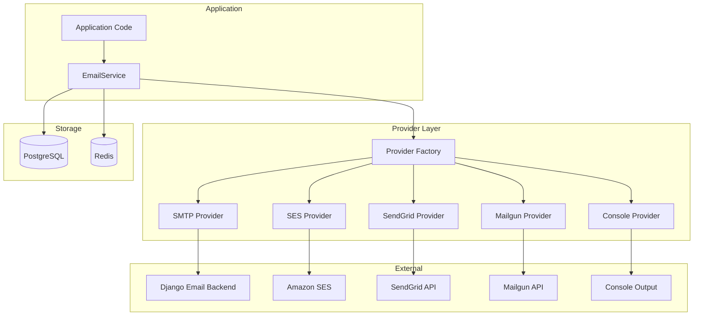
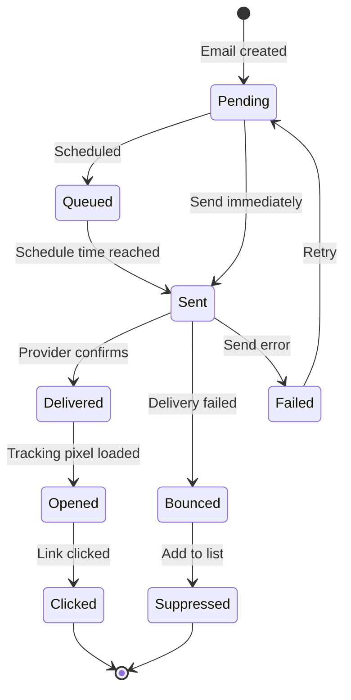
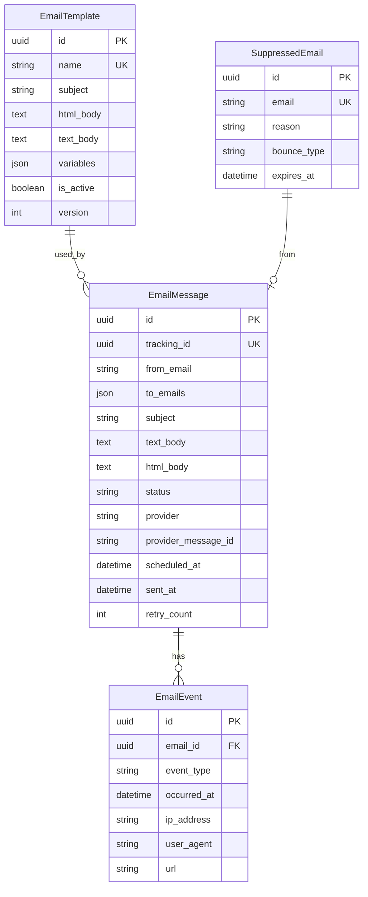

# Email Service Overview

django-matt provides a comprehensive email service with multiple provider support, templates, tracking, and delivery management.

## Features

- Multiple email providers (SMTP, SES, SendGrid, Mailgun)
- Template-based emails with variable interpolation
- Delivery tracking (opens, clicks, bounces)
- Suppression list management
- Scheduled sending
- Retry logic for failures

## Architecture



## Email Lifecycle



## Data Model



## Quick Start

### 1. Add to INSTALLED_APPS

```python
INSTALLED_APPS = [
    ...
    'django_matt.email',
]
```

### 2. Configure Provider

```python
DJANGO_MATT = {
    "EMAIL": {
        "DEFAULT_PROVIDER": "sendgrid",  # or smtp, ses, mailgun, console
        "DEFAULT_FROM": "noreply@example.com",

        # Provider-specific settings
        "SENDGRID_API_KEY": env("SENDGRID_API_KEY"),

        # Or for SES
        "AWS_SES_REGION": "us-east-1",

        # Or for Mailgun
        "MAILGUN_API_KEY": env("MAILGUN_API_KEY"),
        "MAILGUN_DOMAIN": "mg.example.com",
    }
}
```

### 3. Run Migrations

```bash
python manage.py migrate
```

### 4. Send an Email

```python
from django_matt.email import send_email

email = await send_email(
    to="user@example.com",
    subject="Welcome!",
    text="Thanks for signing up.",
    html="<h1>Thanks for signing up!</h1>",
)
```

## Related Documentation

- [Providers](./providers.md)
- [Templates](./templates.md)
- [Tracking](./tracking.md)
- [Suppression](./suppression.md)
