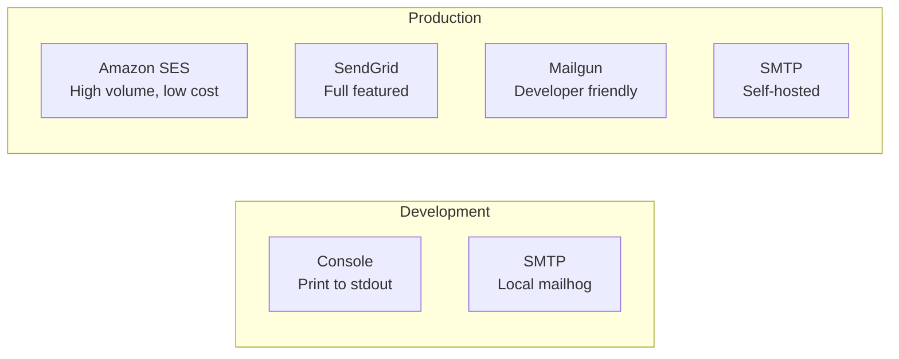
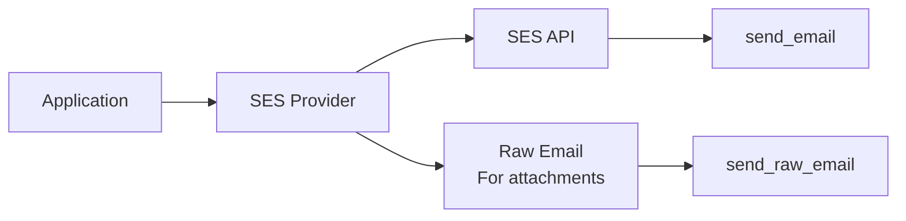
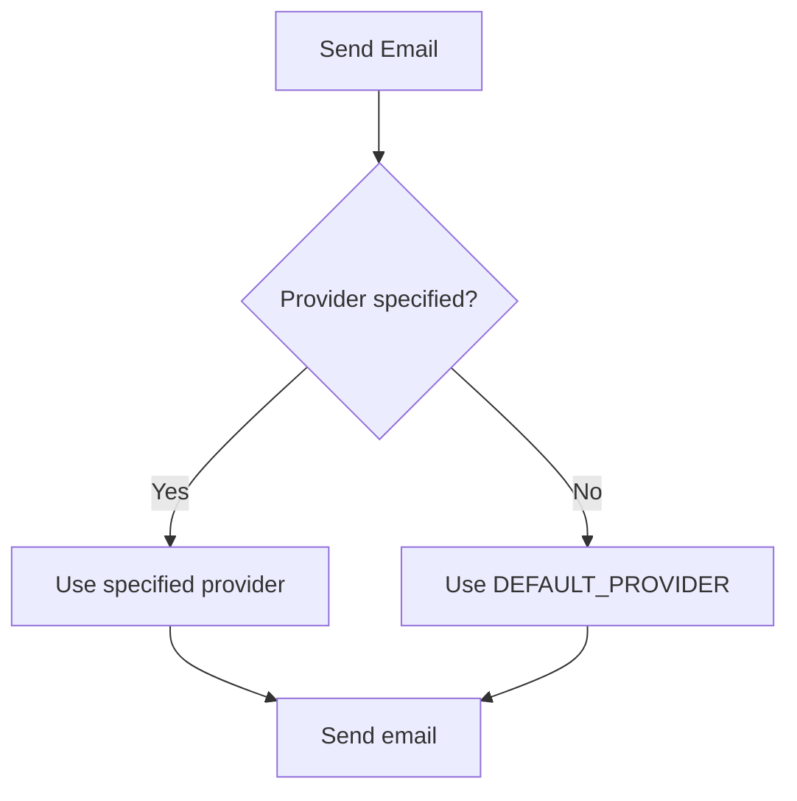

# Email Providers

django-matt supports multiple email providers with a unified interface.

## Provider Comparison



| Provider | Best For | Pricing | Features |
|----------|----------|---------|----------|
| Console | Development | Free | Debug output |
| SMTP | Self-hosted | Varies | Basic sending |
| SES | High volume | $0.10/1k | AWS integration |
| SendGrid | Full featured | Tiered | Analytics, templates |
| Mailgun | Developers | $0.80/1k | Simple API |

## Console Provider

For development - prints emails to stdout:

```python
DJANGO_MATT = {
    "EMAIL": {
        "DEFAULT_PROVIDER": "console",
    }
}
```

Output:
```
============================================================
📧 EMAIL (Console Provider)
============================================================
Message ID: abc-123
From: noreply@example.com
To: user@example.com
Subject: Welcome!
------------------------------------------------------------
📝 TEXT BODY:
Thanks for signing up!
============================================================
```

## SMTP Provider

Uses Django's built-in email backend:

```python
DJANGO_MATT = {
    "EMAIL": {
        "DEFAULT_PROVIDER": "smtp",
    }
}

# Django email settings
EMAIL_HOST = "smtp.example.com"
EMAIL_PORT = 587
EMAIL_USE_TLS = True
EMAIL_HOST_USER = "user"
EMAIL_HOST_PASSWORD = "password"
```

## Amazon SES Provider



Configuration:
```python
DJANGO_MATT = {
    "EMAIL": {
        "DEFAULT_PROVIDER": "ses",
    }
}

# AWS credentials (or use IAM role)
AWS_ACCESS_KEY_ID = env("AWS_ACCESS_KEY_ID")
AWS_SECRET_ACCESS_KEY = env("AWS_SECRET_ACCESS_KEY")
AWS_SES_REGION_NAME = "us-east-1"
AWS_SES_CONFIGURATION_SET = "my-config-set"  # Optional
```

Features:
- Automatic raw email for attachments
- Configuration set support for tracking
- Tag support (up to 10 tags)

## SendGrid Provider

```python
DJANGO_MATT = {
    "EMAIL": {
        "DEFAULT_PROVIDER": "sendgrid",
        "SENDGRID_API_KEY": env("SENDGRID_API_KEY"),
    }
}
```

Features:
- Full API v3 support
- Categories and tags
- Inline attachments
- Click/open tracking

## Mailgun Provider

```python
DJANGO_MATT = {
    "EMAIL": {
        "DEFAULT_PROVIDER": "mailgun",
        "MAILGUN_API_KEY": env("MAILGUN_API_KEY"),
        "MAILGUN_DOMAIN": "mg.example.com",
        "MAILGUN_REGION": "us",  # or "eu"
    }
}
```

Features:
- Simple REST API
- Tags support
- Delivery tracking

## Using Providers Directly

```python
from django_matt.email import get_provider

# Get configured provider
provider = get_provider()

# Get specific provider
ses_provider = get_provider("ses")

# Send email
result = await provider.send(
    to=["user@example.com"],
    subject="Hello",
    from_email="sender@example.com",
    text="Plain text body",
    html="<h1>HTML body</h1>",
    attachments=[
        {
            "filename": "report.pdf",
            "content": pdf_bytes,
            "content_type": "application/pdf",
        }
    ],
    tags=["welcome", "onboarding"],
    metadata={"user_id": "123"},
)

if result.success:
    print(f"Sent! Message ID: {result.message_id}")
else:
    print(f"Failed: {result.error}")
```

## Provider Selection



```python
from django_matt.email import send_email

# Use default provider
await send_email(to="...", subject="...")

# Use specific provider
await send_email(to="...", subject="...", provider="ses")
```

## Custom Provider

Create a custom provider by extending the base class:

```python
from django_matt.email.providers import EmailProviderBase, EmailResult

class CustomProvider(EmailProviderBase):
    name = "custom"

    async def send(
        self,
        to: list[str],
        subject: str,
        from_email: str | None = None,
        text: str | None = None,
        html: str | None = None,
        **kwargs,
    ) -> EmailResult:
        # Your implementation
        response = await self.custom_api.send(...)

        return EmailResult(
            success=True,
            message_id=response["id"],
            provider=self.name,
        )
```

Register it:
```python
from django_matt.email.providers import register_provider

register_provider("custom", CustomProvider)
```
