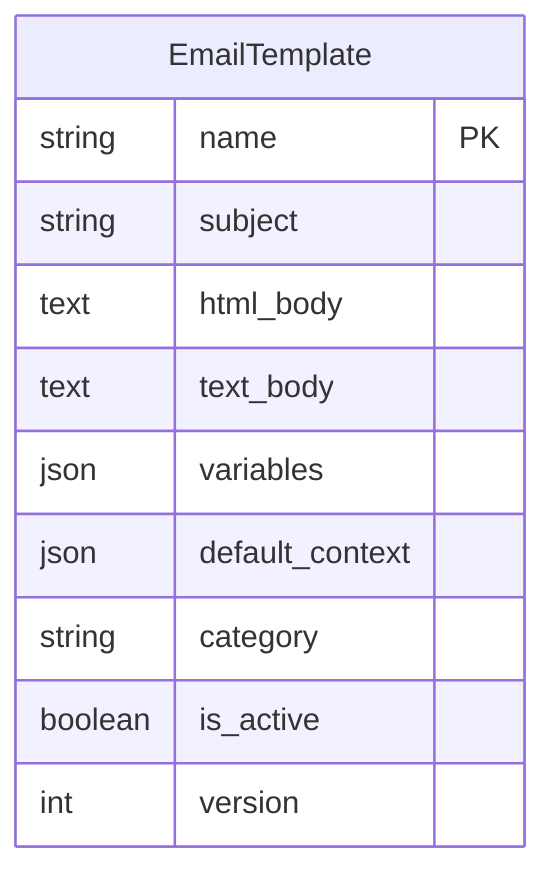
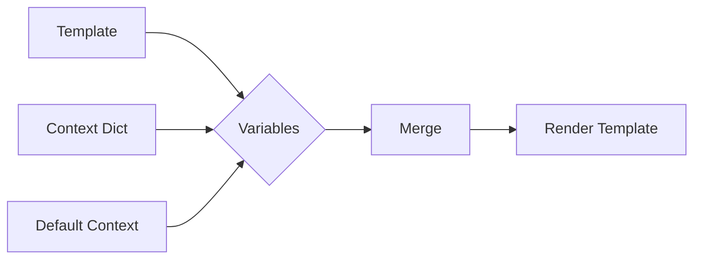
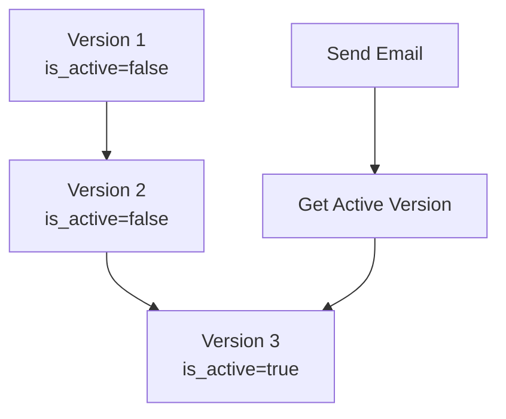

# Email Templates

django-matt supports database-stored email templates with variable interpolation.

## Template Structure



## Creating Templates

### Via Admin

```python
# In Django admin, create an EmailTemplate:
name = "welcome"
subject = "Welcome to {{ app_name }}, {{ user_name }}!"
html_body = """
<html>
<body>
    <h1>Welcome, {{ user_name }}!</h1>
    <p>Thanks for joining {{ app_name }}.</p>
    <a href="{{ activation_url }}">Activate your account</a>
</body>
</html>
"""
text_body = """
Welcome, {{ user_name }}!

Thanks for joining {{ app_name }}.

Activate your account: {{ activation_url }}
"""
variables = ["user_name", "app_name", "activation_url"]
default_context = {"app_name": "MyApp"}
```

### Via Code

```python
from django_matt.email.models import EmailTemplate

template = await EmailTemplate.objects.acreate(
    name="password_reset",
    subject="Reset your password",
    html_body="<h1>Reset Password</h1><a href='{{ reset_url }}'>Click here</a>",
    text_body="Reset your password: {{ reset_url }}",
    variables=["reset_url"],
    is_active=True,
)
```

## Sending Template Emails

```python
from django_matt.email import send_template_email

email = await send_template_email(
    to="user@example.com",
    template_name="welcome",
    context={
        "user_name": "John",
        "activation_url": "https://app.example.com/activate/xyz",
    },
)
```

## Template Variables



Variable resolution order:
1. Provided context (highest priority)
2. Default context from template
3. Global defaults from settings

```python
# Template default_context: {"app_name": "MyApp"}
# Settings default: {"support_email": "help@example.com"}
# Provided context: {"user_name": "John"}

# Final context:
{
    "app_name": "MyApp",
    "support_email": "help@example.com",
    "user_name": "John",
}
```

## Template Syntax

Using Jinja2-style syntax:

### Variables
```html
Hello, {{ user_name }}!
```

### Conditionals
```html

    <p>Your plan: {{ plan_name }}</p>

    <a href="{{ upgrade_url }}">Upgrade now</a>

```

### Loops
```html
<ul>

    <li>{{ item.name }}: ${{ item.price }}</li>

</ul>
```

### Filters
```html
{{ amount | currency }}
{{ date | date("MMMM d, YYYY") }}
{{ name | title }}
```

## Template Versioning



Only one version can be active at a time:

```python
# Create new version
new_version = await EmailTemplate.objects.acreate(
    name="welcome",
    subject="New subject",
    html_body="...",
    version=3,
    is_active=False,
)

# Activate new version (deactivates old)
await new_version.activate()
```

## Preview Templates

```python
from django_matt.email.models import EmailTemplate

template = await EmailTemplate.objects.aget(name="welcome", is_active=True)

# Render with test data
subject, text, html = template.render({
    "user_name": "Test User",
    "activation_url": "https://example.com/test",
})

print(subject)  # "Welcome to MyApp, Test User!"
print(html)     # Rendered HTML
```

## Common Templates

### Welcome Email
```python
EmailTemplate(
    name="welcome",
    subject="Welcome to {{ app_name }}!",
    variables=["user_name", "app_name", "login_url"],
)
```

### Password Reset
```python
EmailTemplate(
    name="password_reset",
    subject="Reset your password",
    variables=["user_name", "reset_url", "expires_in"],
)
```

### Order Confirmation
```python
EmailTemplate(
    name="order_confirmation",
    subject="Order #{{ order_number }} confirmed",
    variables=["user_name", "order_number", "order_items", "total", "shipping_address"],
)
```

### Magic Link
```python
EmailTemplate(
    name="magic_link",
    subject="Your login link",
    variables=["login_url", "expires_in"],
)
```
