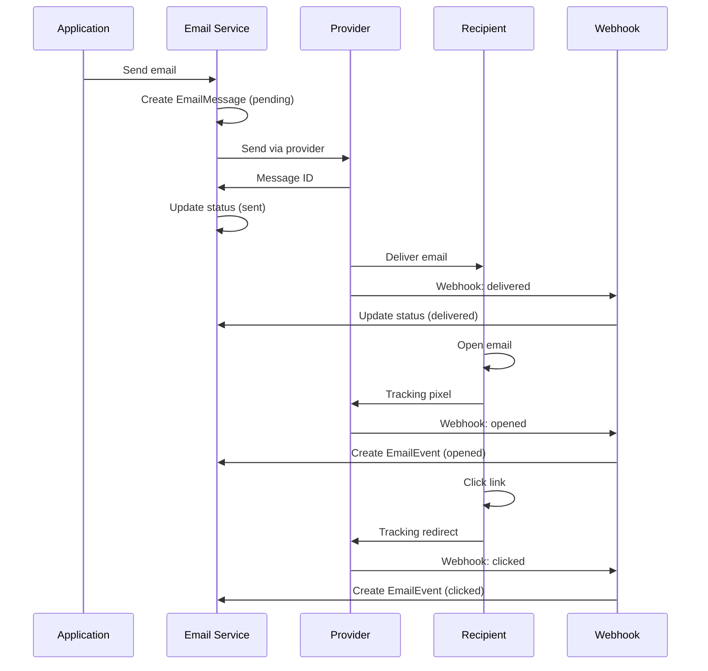
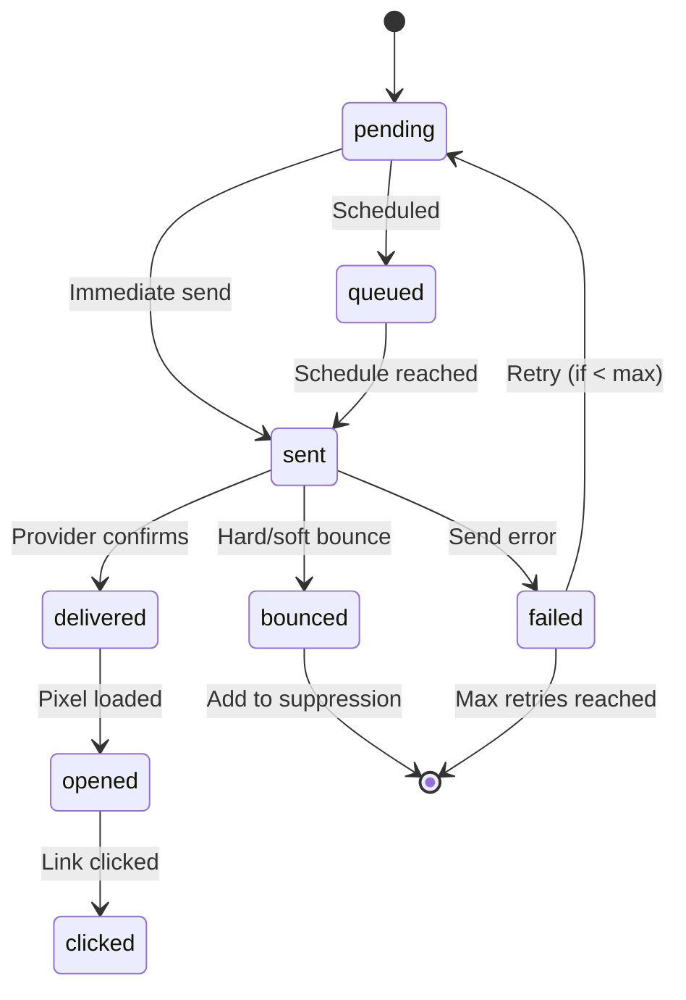
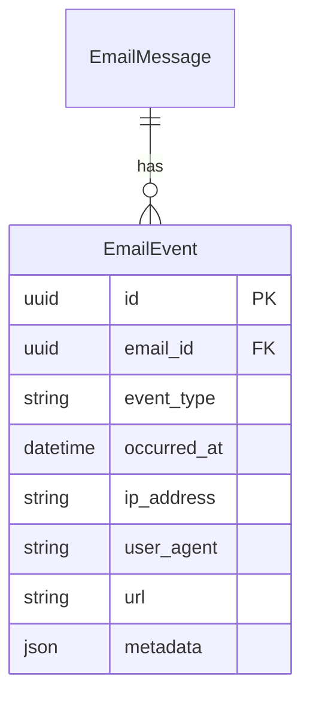

# Email Tracking

django-matt provides comprehensive email tracking for delivery, opens, clicks, and bounces.

## Tracking Flow



## Email Status Flow



## Email Events

Track individual events:



Event types:
- `sent` - Email sent to provider
- `delivered` - Provider confirmed delivery
- `opened` - Tracking pixel loaded
- `clicked` - Link clicked (includes URL)
- `bounced` - Delivery failed
- `complained` - Marked as spam

## Querying Tracking Data

```python
from django_matt.email.models import EmailMessage, EmailEvent

# Get email with events
email = await EmailMessage.objects.prefetch_related('events').aget(
    tracking_id="abc-123"
)

for event in email.events.all():
    print(f"{event.event_type} at {event.occurred_at}")

# Get all opens for a campaign
opens = await EmailEvent.objects.filter(
    event_type="opened",
    email__category="newsletter",
    email__created_at__gte=start_date,
).acount()

# Get click-through rate
total_sent = await EmailMessage.objects.filter(
    category="newsletter",
    status__in=["sent", "delivered", "opened", "clicked"],
).acount()

total_clicked = await EmailMessage.objects.filter(
    category="newsletter",
    status="clicked",
).acount()

ctr = total_clicked / total_sent if total_sent > 0 else 0
```

## Email Statistics

```python
from django_matt.email import EmailService

stats = await EmailService.get_email_stats(
    start_date=datetime(2025, 1, 1),
    end_date=datetime(2025, 1, 31),
    category="newsletter",
)

print(stats)
# {
#     "total": 10000,
#     "sent": 9800,
#     "delivered": 9500,
#     "opened": 4200,
#     "clicked": 850,
#     "bounced": 150,
#     "failed": 50,
#     "delivery_rate": 96.94,
#     "open_rate": 42.86,
#     "click_rate": 8.67,
#     "bounce_rate": 1.53,
# }
```

## Webhook Handling

Configure webhooks with your email provider:

```python
# urls.py
from django_matt.email.webhooks import email_webhook_view

urlpatterns = [
    path("webhooks/email/", email_webhook_view),
]
```

Provider-specific endpoints:
- SendGrid: `/webhooks/email/sendgrid/`
- SES (SNS): `/webhooks/email/ses/`
- Mailgun: `/webhooks/email/mailgun/`

## Tracking Pixel

For providers without native open tracking:

```html
<!-- Added automatically to HTML emails -->

```

## Link Tracking

Links are automatically wrapped for click tracking:

```html
<!-- Original -->
<a href="https://example.com/product/123">View Product</a>

<!-- Tracked -->
<a href="https://api.example.com/email/track/click/{{ tracking_id }}?url=...">
    View Product
</a>
```

## Privacy Considerations

Disable tracking for specific emails:

```python
await send_email(
    to="user@example.com",
    subject="Your invoice",
    html=html_content,
    track_opens=False,
    track_clicks=False,
)
```

Configure global tracking:

```python
DJANGO_MATT = {
    "EMAIL": {
        "TRACK_OPENS": True,
        "TRACK_CLICKS": True,
        "TRACKING_DOMAIN": "track.example.com",
    }
}
```
