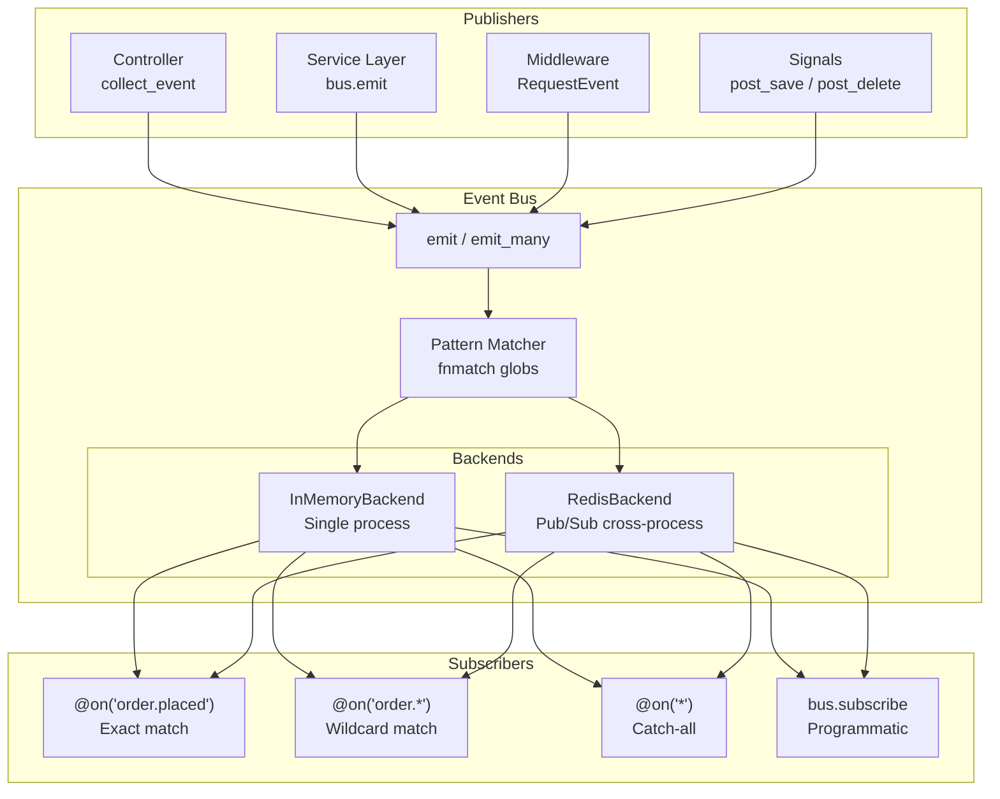

# Events

Django Matt includes an async event bus for decoupled pub/sub communication within your application. Events are Pydantic models emitted through a central bus, with support for wildcard subscriptions, pluggable backends (in-memory, Redis), request-scoped collection, and error isolation.

## Quick Start

```python
from django_matt.events import Event, get_event_bus, on

# Define an event
class OrderPlacedEvent(Event):
    __event_type__: str = "order.placed"
    event_type: str = "order.placed"
    order_id: int
    total: float

# Subscribe with decorator
@on("order.placed")
async def send_confirmation(event: Event):
    await send_email(event.metadata.get("email"), f"Order {event.order_id} confirmed")

# Emit from anywhere
bus = get_event_bus()
await bus.emit(OrderPlacedEvent(order_id=42, total=99.99))
```

## Event Base Class

All events extend `Event`, a Pydantic `BaseModel` with built-in fields.

```python
from django_matt.events import Event

class MyEvent(Event):
    __event_type__: str = "my.event"    # used for routing
    event_type: str = "my.event"        # set on instance
    # custom fields
    user_id: int
    action: str
```

### Built-in Fields

| Field | Type | Default | Description |
|-------|------|---------|-------------|
| `event_type` | `str` | Class name or `__event_type__` | Routing key for subscriptions |
| `timestamp` | `float` | `time.time()` | Unix timestamp of creation |
| `metadata` | `dict[str, Any]` | `{}` | Arbitrary metadata |

### Serialization

Events serialize to bytes via orjson for backend transport.

```python
event = OrderPlacedEvent(order_id=1, total=50.0)
raw = event.serialize()          # bytes (orjson)
restored = Event.deserialize(raw)  # Event instance
```

## EventBus

The `EventBus` is the central pub/sub dispatcher. Access the singleton via `get_event_bus()`.

```python
from django_matt.events import EventBus, get_event_bus, reset_event_bus

bus = get_event_bus()  # singleton instance
```

### subscribe / unsubscribe

```python
async def handle_user_event(event: Event):
    print(f"User event: {event.event_type}")

bus.subscribe("user.created", handle_user_event)
bus.subscribe(UserCreatedEvent, handle_user_event)  # also accepts Event subclass
bus.unsubscribe("user.created", handle_user_event)
```

### emit / emit_many

`emit` dispatches an event to all matching handlers concurrently via `asyncio.gather`. Returns a list of `Exception | None` per handler (errors are logged, not raised).

```python
results = await bus.emit(OrderPlacedEvent(order_id=1, total=50.0))
# [None, None] -- two handlers ran successfully

results = await bus.emit_many([event1, event2, event3])
# [[None], [None, ValueError(...)], [None]]
```

### Error Isolation

Handler exceptions never propagate to the emitter. Each handler runs independently; failures are logged to `django_matt.events` and returned in the results list.

### Wildcard Subscriptions

Event type matching uses `fnmatch` glob patterns.

```python
bus.subscribe("user.*", handle_all_user_events)     # user.created, user.updated, user.deleted
bus.subscribe("model.*", handle_all_model_events)    # model.created, model.updated, model.deleted
bus.subscribe("*", handle_everything)                # all events
```

### Introspection

```python
handlers = bus.handlers_for("user.created")  # list of registered handlers
bus.clear()                                   # remove all subscriptions
```

## @on() Decorator

Register event handlers declaratively. Handlers are subscribed immediately on import.

```python
from django_matt.events import on

@on("order.placed")
async def notify_warehouse(event):
    await warehouse_api.notify(event.order_id)

@on("order.*")
def log_order_events(event):
    logger.info(f"Order event: {event.event_type}")

@on(UserCreatedEvent)
async def welcome_user(event):
    await send_welcome_email(event.email)
```

Supports both sync and async handlers. The subscription pattern is stored on the function as `func._event_subscription`.

## autodiscover()

Auto-imports `events.py` modules from installed Django apps to register `@on()` handlers.

```python
from django_matt.events import autodiscover

# In your AppConfig.ready() or startup
count = autodiscover()                    # all installed apps
count = autodiscover(["orders", "users"])  # specific apps only
```

For each app label, attempts to import `{app.name}.events`. Returns the number of modules successfully imported.

## EventMiddleware

Django middleware that enables request-scoped event collection and automatically emits a `RequestEvent` after each successful response.

### Setup

```python
# settings.py
MIDDLEWARE = [
    # ...
    "django_matt.events.EventMiddleware",
    # ...
]
```

### Request-Scoped Events

Use `collect_event()` to queue events during request handling. They are emitted after the response completes.

```python
from django_matt.events import collect_event, ModelCreatedEvent

@api.post("/products")
async def create_product(request, data: ProductCreate):
    product = await Product.objects.acreate(**data.model_dump())

    collect_event(request, ModelCreatedEvent(
        model_name="Product",
        instance_id=product.id,
        data=data.model_dump(),
    ))

    return {"id": product.id}
```

### Automatic RequestEvent

After every successful response (status < 400), `EventMiddleware` emits a `RequestEvent` with:

| Field | Value |
|-------|-------|
| `method` | HTTP method |
| `path` | Request path |
| `status_code` | Response status |
| `duration_ms` | Request duration in milliseconds |
| `user_id` | Authenticated user's PK (if available) |

The middleware supports both sync and async Django deployments.

## Built-in Event Types

### User Events

```python
from django_matt.events import UserCreatedEvent, UserUpdatedEvent, UserDeletedEvent

UserCreatedEvent(user_id=1, email="user@example.com")
UserUpdatedEvent(user_id=1, changes={"name": "New Name"})
UserDeletedEvent(user_id=1)
```

| Event | Type Key | Extra Fields |
|-------|----------|--------------|
| `UserCreatedEvent` | `user.created` | `user_id`, `email` |
| `UserUpdatedEvent` | `user.updated` | `user_id`, `changes` |
| `UserDeletedEvent` | `user.deleted` | `user_id` |

### Model Events

```python
from django_matt.events import ModelCreatedEvent, ModelUpdatedEvent, ModelDeletedEvent

ModelCreatedEvent(model_name="Product", instance_id=42, data={"name": "Widget"})
ModelUpdatedEvent(model_name="Product", instance_id=42, changes={"price": 19.99})
ModelDeletedEvent(model_name="Product", instance_id=42)
```

| Event | Type Key | Extra Fields |
|-------|----------|--------------|
| `ModelCreatedEvent` | `model.created` | `model_name`, `instance_id`, `data` |
| `ModelUpdatedEvent` | `model.updated` | `model_name`, `instance_id`, `changes` |
| `ModelDeletedEvent` | `model.deleted` | `model_name`, `instance_id` |

### Request Events

```python
from django_matt.events import RequestEvent

RequestEvent(method="POST", path="/api/orders", status_code=201, duration_ms=45.2, user_id=1)
```

Emitted automatically by `EventMiddleware`.

## Backends

### InMemoryBackend

Default backend for single-process deployments and testing. No external dependencies.

```python
from django_matt.events import InMemoryBackend, get_event_bus

backend = InMemoryBackend()
await backend.subscribe("order.*", handle_order)
await backend.publish(OrderPlacedEvent(order_id=1, total=50.0))

bus = get_event_bus()
bus.backend = backend
```

### RedisBackend

Distributed backend using Redis Pub/Sub. Enables cross-process event delivery.

```python
from django_matt.events import RedisBackend, get_event_bus

backend = RedisBackend(redis_url="redis://localhost:6379/0")
await backend.subscribe("order.*", handle_order)  # uses psubscribe for wildcards
await backend.publish(OrderPlacedEvent(order_id=1, total=50.0))

# Attach to event bus
bus = get_event_bus()
bus.backend = backend

# Clean up on shutdown
await backend.close()
```

Requires the `redis` package (`uv add redis`). Uses `psubscribe` for glob patterns and `subscribe` for exact matches. Channels are namespaced as `django_matt:events:{event_type}`.

## Common Patterns

### Audit Trail

```python
@on("model.*")
async def audit_log(event):
    await AuditLog.objects.acreate(
        event_type=event.event_type,
        data=event.model_dump(),
        timestamp=event.timestamp,
    )
```

### Analytics Pipeline

```python
@on("request")
async def track_request(event):
    await analytics.track(
        event="page_view",
        properties={"path": event.path, "method": event.method},
        user_id=event.user_id,
    )
```

### Chaining Events

```python
@on("order.placed")
async def process_order(event):
    await fulfill(event.order_id)
    bus = get_event_bus()
    await bus.emit(ModelUpdatedEvent(
        model_name="Order",
        instance_id=event.order_id,
        changes={"status": "fulfilled"},
    ))
```

## Event Bus Architecture



## Best Practices

1. **Define `__event_type__` on every Event subclass** -- explicit routing keys are easier to trace than auto-generated class names
2. **Use `collect_event()` in request handlers** rather than emitting directly, so events fire after the response completes successfully
3. **Keep handlers fast** -- offload heavy work to background tasks; the event bus runs handlers concurrently but still within the request cycle (unless using a backend)
4. **Use wildcards sparingly** -- `*` handlers see every event, which can create unexpected coupling
5. **Call `autodiscover()` in AppConfig.ready()** to ensure `@on()` handlers are registered at startup
6. **Use RedisBackend for multi-process deployments** -- the in-memory backend is per-process only
7. **Always `await backend.close()`** on shutdown to clean up Redis connections and listener tasks
