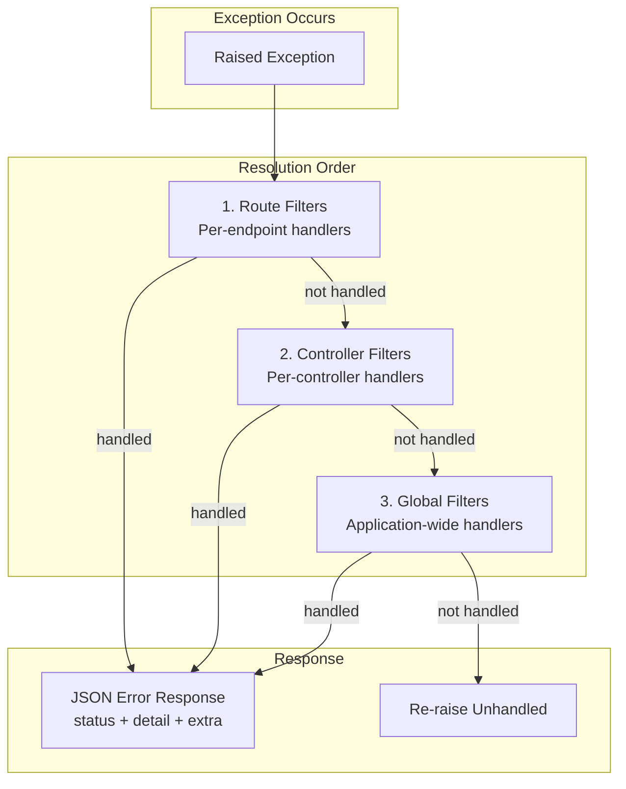

# Exception Filters

Django Matt provides a layered exception handling system that catches errors at route, controller, and global scopes — converting them into structured JSON responses.

## Overview



Exception filters are tried in order: **route -> controller -> global**. The first filter that handles the exception wins. If no filter matches, the exception propagates normally.

## Quick Start

### Register Built-in Filters

```python
from django_matt.exceptions import (
    ValidationExceptionFilter,
    NotFoundExceptionFilter,
    PermissionExceptionFilter,
    DatabaseExceptionFilter,
    ThrottleExceptionFilter,
    default_registry,
)

# Register all built-in filters globally
default_registry.register_global_filter(ValidationExceptionFilter())
default_registry.register_global_filter(NotFoundExceptionFilter())
default_registry.register_global_filter(PermissionExceptionFilter())
default_registry.register_global_filter(DatabaseExceptionFilter())
default_registry.register_global_filter(ThrottleExceptionFilter())
```

### Use Decorators on Routes

```python
from django_matt.exceptions import catch

@api.post("/users")
@catch(ValueError, handler=lambda exc, req: JsonResponse({"detail": str(exc)}, status=400))
async def create_user(request, data: UserCreateSchema):
    ...
```

## ExceptionFilter Base Class

All filters extend `ExceptionFilter`, an abstract base with two key pieces: a `can_handle` check and an async `catch` method.

```python
from django.http import HttpRequest, HttpResponse
from django_matt.exceptions import ExceptionFilter


class MyFilter(ExceptionFilter):
    exception_types = (MyCustomError,)
    order = 10  # lower = higher priority

    def can_handle(self, exc: Exception) -> bool:
        # Default checks isinstance(exc, self.exception_types)
        # Override for custom matching logic
        return isinstance(exc, MyCustomError)

    async def catch(self, exc: Exception, request: HttpRequest) -> HttpResponse:
        return HttpResponse(
            '{"detail": "something went wrong"}',
            content_type="application/json",
            status=500,
        )
```

### Key Attributes

| Attribute | Type | Description |
|-----------|------|-------------|
| `exception_types` | `tuple[type[Exception], ...]` | Exception classes this filter handles |
| `order` | `int` | Sort priority within a chain (lower runs first) |

### FunctionExceptionFilter

Wraps a plain function as an `ExceptionFilter`. Used internally by the `@catch` decorator.

```python
from django_matt.exceptions import FunctionExceptionFilter

filter_ = FunctionExceptionFilter(
    exception_types=(ValueError, TypeError),
    handler=my_handler_func,  # sync or async
    order=5,
)
```

The handler receives `(exc, request)` and must return an `HttpResponse`. Both sync and async handlers are supported.

## ExceptionFilterChain

An ordered list of filters. Filters are sorted by `order` on insertion. When `handle()` is called, it iterates through filters and returns the first successful response.

```python
from django_matt.exceptions import ExceptionFilterChain, ValidationExceptionFilter

chain = ExceptionFilterChain()
chain.add(ValidationExceptionFilter())

# Handle an exception
response = await chain.handle(exc, request)
if response is None:
    # No filter matched — exception is unhandled
    raise exc
```

If a filter itself raises during `catch()`, the chain logs the error and continues to the next filter.

## ExceptionFilterRegistry

The registry manages filters at three scopes and resolves them in order.

### Scoped Resolution

```python
from django_matt.exceptions import ExceptionFilterRegistry

registry = ExceptionFilterRegistry()

# 1. Global scope — catches everything not handled elsewhere
registry.register_global_filter(NotFoundExceptionFilter())

# 2. Controller scope — only for a specific controller class
registry.register_controller_filter(UserController, CustomUserFilter())

# 3. Route scope — only for a specific endpoint
registry.register_route_filter("UserController.create_user", SpecialFilter())
```

### Handling Exceptions

```python
response = await registry.handle(
    exc,
    request,
    route_key="UserController.create_user",
    controller_cls=UserController,
)
```

Resolution walks route -> controller -> global. Returns `None` if no filter matched.

### Default Registry

A singleton `default_registry` is provided for application-wide use:

```python
from django_matt.exceptions import default_registry

default_registry.register_global_filter(ValidationExceptionFilter())
```

## Decorators

### @exception_filter

Class decorator that sets `exception_types` and `order` on a filter class:

```python
from django_matt.exceptions import exception_filter, ExceptionFilter


@exception_filter(ValueError, TypeError, order=5)
class InputErrorFilter(ExceptionFilter):
    async def catch(self, exc, request):
        return HttpResponse(
            '{"detail": "Invalid input"}',
            content_type="application/json",
            status=400,
        )
```

The decorated class must define an async `catch` method or a `TypeError` is raised.

### @catch

Route-level decorator that attaches exception filters to a view function:

```python
from django_matt.exceptions import catch


# With an explicit handler function
@catch(ValueError, handler=my_handler, order=5)
async def my_view(request):
    ...


# Catch multiple exception types
@catch(ValueError, TypeError, handler=handle_input_error)
async def another_view(request):
    ...
```

Filters attached via `@catch` are stored on `func._exception_filters` and picked up by the framework during dispatch.

### @catch_all

Shorthand for `@catch(Exception, handler=...)`:

```python
from django_matt.exceptions import catch_all


@catch_all(handler=fallback_handler, order=99)
async def risky_view(request):
    ...
```

### register_global_filter

Register a filter instance on the default registry:

```python
from django_matt.exceptions import register_global_filter

filter_instance = register_global_filter(MyFilter())
```

Returns the filter instance for chaining.

## Built-in Filters

### ValidationExceptionFilter (422)

Catches Pydantic `ValidationError` and returns structured validation errors:

```json
{
    "status": 422,
    "detail": "Validation error",
    "extra": [
        {
            "message": "Value is not a valid integer",
            "key": "age",
            "source": "body"
        }
    ]
}
```

### NotFoundExceptionFilter (404)

Catches Django's `ObjectDoesNotExist`:

```json
{
    "status": 404,
    "detail": "Product matching query does not exist.",
    "extra": null
}
```

### PermissionExceptionFilter (403)

Catches Django's `PermissionDenied` and Python's `PermissionError`:

```json
{
    "status": 403,
    "detail": "Permission denied",
    "extra": null
}
```

### DatabaseExceptionFilter (409)

Catches Django's `IntegrityError` (unique constraint violations, FK conflicts):

```json
{
    "status": 409,
    "detail": "Database conflict",
    "extra": null
}
```

### ThrottleExceptionFilter (429)

Catches `RateLimitAPIError` from `django_matt.core.errors`. Includes a `Retry-After` header when the error context provides one:

```json
{
    "status": 429,
    "detail": "Rate limit exceeded",
    "extra": null
}
```

### Filter Priority

| Filter | Order | Status |
|--------|-------|--------|
| ThrottleExceptionFilter | 5 | 429 |
| ValidationExceptionFilter | 10 | 422 |
| NotFoundExceptionFilter | 10 | 404 |
| PermissionExceptionFilter | 10 | 403 |
| DatabaseExceptionFilter | 20 | 409 |

## Custom Filters

### Stripe Payment Errors

```python
import stripe
from django_matt.exceptions import ExceptionFilter, default_registry


class StripeExceptionFilter(ExceptionFilter):
    order = 15

    def can_handle(self, exc: Exception) -> bool:
        return isinstance(exc, stripe.StripeError)

    async def catch(self, exc, request):
        import orjson
        from django.http import HttpResponse

        if isinstance(exc, stripe.CardError):
            status = 402
            detail = exc.user_message or "Card declined"
        elif isinstance(exc, stripe.RateLimitError):
            status = 429
            detail = "Payment service busy"
        else:
            status = 502
            detail = "Payment service error"

        body = orjson.dumps({"status": status, "detail": detail, "extra": None})
        return HttpResponse(body, content_type="application/json", status=status)


default_registry.register_global_filter(StripeExceptionFilter())
```

### Scoped to a Controller

```python
from django_matt.exceptions import default_registry


class PaymentController:
    ...


default_registry.register_controller_filter(
    PaymentController,
    StripeExceptionFilter(),
)
```

### Scoped to a Route

```python
default_registry.register_route_filter(
    "PaymentController.charge",
    StripeExceptionFilter(),
)
```

## Integration with ErrorHandler

Exception filters complement the existing `ErrorHandler` in `django_matt.core.errors`. The registry is checked first during request dispatch. If no filter handles the exception, it falls through to the standard `ErrorHandler` pipeline. You can use both systems together — filters for structured per-scope handling, `ErrorHandler` for global fallback behavior.

## Configuration

```python
# settings.py
DJANGO_MATT = {
    "EXCEPTION_FILTERS": {
        # Auto-register all built-in filters globally
        "REGISTER_BUILTINS": True,
    },
}
```

## Best Practices

1. **Use scoped filters** - Register filters at the narrowest scope needed. Route-level for endpoint-specific errors, controller-level for domain errors, global for cross-cutting concerns.
2. **Set order carefully** - Lower `order` values run first. Put throttle/rate-limit filters early so they short-circuit before heavier logic.
3. **Return structured JSON** - All built-in filters return `{"status": int, "detail": str, "extra": any}`. Follow this pattern for consistency.
4. **Don't swallow errors silently** - Always log unexpected exceptions inside `catch()`. If a filter's `catch` raises, the chain logs it and moves on.
5. **Keep filters stateless** - Filter instances may be shared across requests. Don't store per-request state on `self`.
6. **Test your filters** - Filters are plain classes. Instantiate them and call `can_handle()` / `catch()` directly in tests.
