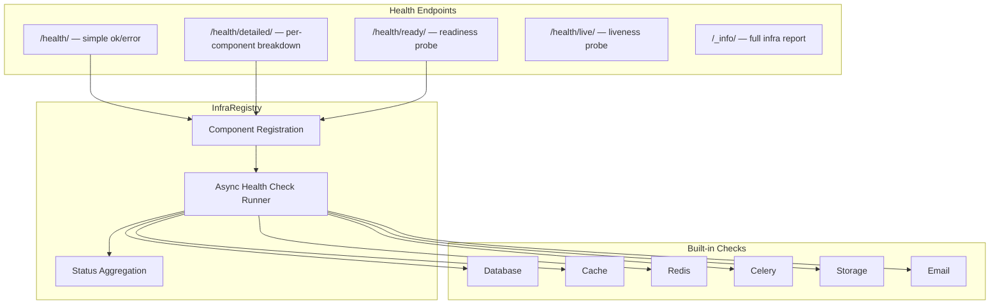

# Introspection & Health Checks

Django Matt provides production-ready health check endpoints, infrastructure component registration, and runtime introspection for monitoring and Kubernetes deployments.

## Overview



## Quick Start

```python
# urls.py
from django_matt.introspection import get_health_urls

urlpatterns = [
    *get_health_urls(),  # adds /health/, /health/detailed/, etc.
]
```

```python
# settings.py — add middleware for fast health responses
MIDDLEWARE = [
    "django_matt.introspection.HealthCheckMiddleware",  # must be first
    # ... other middleware
]
```

## Health Check Endpoints

### GET /health/

Simple status check. Returns 200 if no critical component is unhealthy, 503 otherwise.

```json
{"status": "ok"}
```

### GET /health/detailed/

Full per-component breakdown. Requires authentication (returns 401 for anonymous requests).

```json
{
    "status": "healthy",
    "timestamp": 1712400000.0,
    "components": {
        "database": {
            "status": "healthy",
            "component_type": "database",
            "latency_ms": 1.2,
            "details": {"backend": "django.db.backends.postgresql", "name": "mydb"},
            "error": null,
            "critical": true
        },
        "cache": {
            "status": "healthy",
            "component_type": "cache",
            "latency_ms": 0.5,
            "details": {"backend": "RedisCache"},
            "error": null,
            "critical": false
        }
    }
}
```

### GET /health/ready/

Kubernetes readiness probe. Returns 200 only when all **critical** components are healthy. Non-critical components (cache, storage, email) do not affect readiness.

```json
{"ready": true}
```

### GET /health/live/

Kubernetes liveness probe. Always returns 200 with a timestamp. Does not run any checks — proves the process is alive.

```json
{"alive": true, "timestamp": 1712400000.0}
```

### GET /_info/

Full infrastructure report including framework version, Python version, Django version, installed apps, middleware stack, enabled modules, route count, and health summary.

```json
{
    "timestamp": 1712400000.0,
    "framework_version": "0.1.0",
    "python_version": "3.13.0",
    "django_version": "5.2",
    "platform": "Linux-6.1.0",
    "debug": false,
    "installed_apps": ["django.contrib.auth", "myapp"],
    "middleware_stack": ["django_matt.introspection.HealthCheckMiddleware"],
    "enabled_modules": ["auth", "billing", "introspection"],
    "database_backend": "django.db.backends.postgresql",
    "cache_backend": "django.core.cache.backends.redis.RedisCache",
    "route_count": 42,
    "health": {
        "status": "healthy",
        "components": {
            "database": {"status": "healthy", "latency_ms": 1.2, "error": null}
        }
    }
}
```

## Kubernetes Probe Configuration

```yaml
# deployment.yaml
spec:
  containers:
    - name: app
      livenessProbe:
        httpGet:
          path: /health/live/
          port: 8000
        initialDelaySeconds: 5
        periodSeconds: 10
      readinessProbe:
        httpGet:
          path: /health/ready/
          port: 8000
        initialDelaySeconds: 10
        periodSeconds: 5
```

## HealthCheckMiddleware

The `HealthCheckMiddleware` short-circuits `/health/` and `/health/live/` requests before they reach the full Django middleware stack. This avoids authentication, CORS, rate limiting, and other overhead for probe requests.

```python
MIDDLEWARE = [
    "django_matt.introspection.HealthCheckMiddleware",  # first in stack
    "django_matt.auth.middleware.JWTAuthenticationMiddleware",
    # ...
]
```

The middleware handles two paths:

| Path | Response |
|------|----------|
| `/health/` | `{"status": "ok"}` with 200 |
| `/health/live/` | `{"alive": true, "timestamp": ...}` with 200 |

All other paths pass through to the next middleware unchanged.

## InfraRegistry

The `InfraRegistry` manages component health checks. Components are registered with a name, type, check function, and criticality flag. All checks run concurrently via `asyncio.gather`.

### Component Registration

```python
from django_matt.introspection import registry

# Register a custom check
async def check_external_api() -> ComponentInfo:
    from django_matt.introspection import ComponentInfo, ComponentStatus
    info = ComponentInfo(name="external_api", component_type="api")
    try:
        # your check logic
        info.status = ComponentStatus.HEALTHY
        info.details["endpoint"] = "https://api.example.com"
    except Exception as e:
        info.status = ComponentStatus.UNHEALTHY
        info.error = str(e)
    return info

registry.register(
    "external_api",
    "api",
    check_external_api,
    critical=False,  # non-critical won't fail readiness probe
)
```

### Auto-Registration

Built-in checks for database, cache, storage, and email can be registered in one call:

```python
from django_matt.introspection.checks import auto_register
from django_matt.introspection import registry

auto_register(registry)
```

This registers: `database` (critical), `cache` (non-critical), `storage` (non-critical), `email` (non-critical).

### Registry API

| Method | Description |
|--------|-------------|
| `register(name, component_type, check_fn, *, critical=True)` | Add a component check |
| `unregister(name)` | Remove a component check |
| `clear()` | Remove all registered checks |
| `registered` | List of registered component names |
| `health_check()` | Run all checks concurrently, return `HealthResult` |

## ComponentStatus

Four possible states for any component:

| Status | Meaning |
|--------|---------|
| `HEALTHY` | Fully operational |
| `DEGRADED` | Working but impaired (e.g., no Celery workers) |
| `UNHEALTHY` | Not functional |
| `UNKNOWN` | Cannot determine (e.g., optional dep not installed) |

Overall status logic:
- If any **critical** component is `UNHEALTHY`, overall status is `UNHEALTHY`
- If any component is `DEGRADED` (and none critical are unhealthy), overall is `DEGRADED`
- Otherwise `HEALTHY`

## Built-in Checks

### Database (`check_database`)

Runs `SELECT 1` against the default database connection. Reports backend engine and database name.

### Cache (`check_cache`)

Writes, reads back, and deletes a test key (`_matt_health_check`) from the default Django cache.

### Redis (`check_redis`)

Pings Redis directly using `redis.asyncio`. Reads `REDIS_URL` from settings or falls back to `redis://localhost:6379/0`. Reports Redis server version. Returns `UNKNOWN` if redis package is not installed or no Redis is configured.

### Celery (`check_celery`)

Inspects active Celery workers via `current_app.control.inspect()` with a 2-second timeout. Returns `DEGRADED` if no workers are active. Non-critical by default.

### Storage (`check_storage`)

Checks that `default_storage.exists()` works. Reports the storage backend class name.

### Email (`check_email`)

For production backends (SMTP, SES, etc.), opens and closes a connection. Development backends (console, locmem, filebased, dummy) are marked healthy without testing.

## InfraReport

The `InfraReport` model aggregates system information:

```python
from django_matt.introspection import generate_report

report = await generate_report()
print(report.framework_version)
print(report.enabled_modules)
print(report.health)
```

The report auto-detects enabled modules by attempting to import each `django_matt.*` submodule.

## Custom Health Check Example

```python
from django_matt.introspection import ComponentInfo, ComponentStatus, registry


async def check_stripe() -> ComponentInfo:
    import stripe

    info = ComponentInfo(name="stripe", component_type="payment", critical=False)
    try:
        await stripe.Account.retrieve_async()
        info.status = ComponentStatus.HEALTHY
    except stripe.AuthenticationError as e:
        info.status = ComponentStatus.UNHEALTHY
        info.error = str(e)
    except Exception as e:
        info.status = ComponentStatus.DEGRADED
        info.error = str(e)
    return info


# Register at startup (e.g., in AppConfig.ready())
registry.register("stripe", "payment", check_stripe, critical=False)
```

## URL Prefix Customization

```python
# Default: /health/, /health/detailed/, /health/ready/, /health/live/, /_info/
urlpatterns = [
    *get_health_urls(),
]

# Custom prefix: /status/, /status/detailed/, etc.
urlpatterns = [
    *get_health_urls(prefix="status"),
]
```

## Best Practices

1. **Place `HealthCheckMiddleware` first** in `MIDDLEWARE` so probes skip auth and CORS
2. **Mark external services as non-critical** unless your app literally cannot serve requests without them
3. **Use `/health/ready/` for Kubernetes readiness** and `/health/live/` for liveness probes
4. **Protect `/health/detailed/`** — it requires authentication and exposes internal infrastructure details
5. **Keep check functions fast** — health checks run on every probe; avoid expensive operations
6. **Register checks at startup** in your `AppConfig.ready()` method or during module initialization
