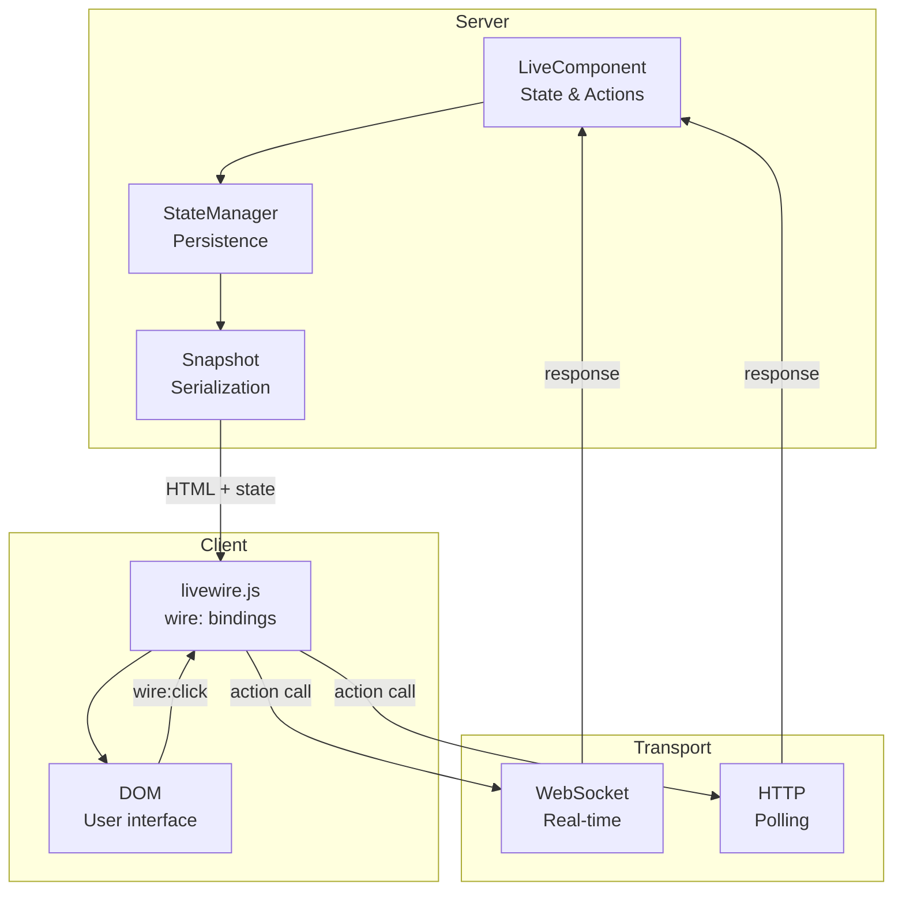

# Livewire-Style Reactivity

Django Matt provides Laravel Livewire-style reactive components for building dynamic UIs with minimal JavaScript.

## Overview



## Quick Start

### Define a Component

```python
from django_matt.livewire import LiveComponent, action, computed

class Counter(LiveComponent):
    # Reactive state
    count: int = 0

    @action
    def increment(self):
        self.count += 1

    @action
    def decrement(self):
        self.count -= 1

    @computed
    def doubled(self):
        return self.count * 2

    def get_template_name(self):
        return "components/counter.html"
```

### Create Template

```html
<!-- templates/components/counter.html -->
<div>
    <h2>Count: {{ count }}</h2>
    <p>Doubled: {{ doubled }}</p>

    <button wire:click="increment">+</button>
    <button wire:click="decrement">-</button>
</div>
```

### Use in Page

```html

<html>
<head>
    
</head>
<body>
    

    
</body>
</html>
```

## Components

### Basic Component

```python
from django_matt.livewire import LiveComponent

class UserProfile(LiveComponent):
    name: str = ""
    email: str = ""
    bio: str = ""

    def mount(self, user_id: int):
        """Called when component is first loaded."""
        user = User.objects.get(id=user_id)
        self.name = user.name
        self.email = user.email
        self.bio = user.bio

    def get_template_name(self):
        return "components/user_profile.html"
```

### With Validation

```python
from django_matt.livewire import ValidatedComponent
from pydantic import EmailStr, Field

class ContactForm(ValidatedComponent):
    name: str = Field(min_length=2)
    email: EmailStr
    message: str = Field(min_length=10)

    @action
    def submit(self):
        if self.validate():
            # Validation passed
            send_contact_email(self.name, self.email, self.message)
            self.reset()  # Clear form
            self.emit("contact_sent")
```

### Lifecycle Hooks

```python
from django_matt.livewire import LiveComponent, on_mount, on_hydrate, on_dehydrate

class Dashboard(LiveComponent):
    stats: dict = {}

    @on_mount
    def load_initial_data(self):
        """Called once when component first renders."""
        self.stats = get_dashboard_stats()

    @on_hydrate
    def on_request(self):
        """Called on every request (after state restored)."""
        self.refresh_if_stale()

    @on_dehydrate
    def before_response(self):
        """Called before state is serialized."""
        self.cleanup_sensitive_data()
```

## Actions

### Basic Actions

```python
class TodoList(LiveComponent):
    items: list = []
    new_item: str = ""

    @action
    def add_item(self):
        if self.new_item:
            self.items.append({"text": self.new_item, "done": False})
            self.new_item = ""

    @action
    def remove_item(self, index: int):
        del self.items[index]

    @action
    def toggle_item(self, index: int):
        self.items[index]["done"] = not self.items[index]["done"]
```

```html
<input wire:model="new_item" placeholder="New todo...">
<button wire:click="add_item">Add</button>


    <div>
        <input type="checkbox"
               wire:click="toggle_item({{ forloop.counter0 }})"
               checked>
        {{ item.text }}
        <button wire:click="remove_item({{ forloop.counter0 }})">X</button>
    </div>

```

### Action with Parameters

```python
@action
def set_page(self, page: int):
    self.page = page
    self.load_items()

@action
def update_status(self, item_id: int, status: str):
    Item.objects.filter(id=item_id).update(status=status)
```

```html
<button wire:click="set_page({{ page_num }})">Page {{ page_num }}</button>
<button wire:click="update_status({{ item.id }}, 'approved')">Approve</button>
```

### Action Modifiers

```html
<!-- Prevent default -->
<form wire:submit.prevent="save">

<!-- Stop propagation -->
<button wire:click.stop="handle">

<!-- Debounce -->
<input wire:input.debounce.300ms="search">

<!-- Throttle -->
<button wire:click.throttle.1000ms="loadMore">

<!-- Confirmation -->
<button wire:click.confirm="delete">Delete</button>
```

## Data Binding

### wire:model

Two-way data binding:

```html
<!-- Instant updates -->
<input wire:model="name">

<!-- Debounced (default 150ms) -->
<input wire:model.debounce="search">

<!-- Custom debounce -->
<input wire:model.debounce.500ms="query">

<!-- Update on blur only -->
<input wire:model.blur="email">

<!-- Lazy (update on change event) -->
<input wire:model.lazy="description">
```

### Different Input Types

```html
<!-- Text -->
<input type="text" wire:model="name">

<!-- Textarea -->
<textarea wire:model="bio"></textarea>

<!-- Checkbox -->
<input type="checkbox" wire:model="is_active">

<!-- Select -->
<select wire:model="category">
    <option value="">Choose...</option>
    
        <option value="{{ cat.id }}">{{ cat.name }}</option>
    
</select>

<!-- Multiple select -->
<select multiple wire:model="tags">
    
        <option value="{{ tag }}">{{ tag }}</option>
    
</select>

<!-- Radio buttons -->

    <input type="radio" wire:model="selected" value="{{ option }}">

```

## Computed Properties

```python
from django_matt.livewire import LiveComponent, computed

class Cart(LiveComponent):
    items: list = []

    @computed
    def total(self):
        return sum(item["price"] * item["quantity"] for item in self.items)

    @computed
    def item_count(self):
        return sum(item["quantity"] for item in self.items)

    @computed
    def is_empty(self):
        return len(self.items) == 0
```

```html

    <p>Your cart is empty</p>

    <p>{{ item_count }} items</p>
    <p>Total: ${{ total }}</p>

```

## Watchers

React to state changes:

```python
from django_matt.livewire import LiveComponent, watch

class Search(LiveComponent):
    query: str = ""
    results: list = []

    @watch("query")
    def on_query_change(self, old_value, new_value):
        if len(new_value) >= 3:
            self.results = self.perform_search(new_value)
        else:
            self.results = []
```

## Events

### Emitting Events

```python
class Form(LiveComponent):
    @action
    def save(self):
        # Save logic...
        self.emit("saved", {"id": self.item_id})
        self.emit_to("notification", "show", {"message": "Saved!"})
        self.emit_up("item_updated")  # To parent component
```

### Listening to Events

```python
from django_matt.livewire import LiveComponent, on

class NotificationBar(LiveComponent):
    message: str = ""
    visible: bool = False

    @on("show")
    def show_notification(self, message: str):
        self.message = message
        self.visible = True
```

```html
<!-- Listen in template -->
<div wire:listen.saved="handleSaved">
```

## Real-Time Updates

### WebSocket Mode

```python
# settings.py
CHANNEL_LAYERS = {
    "default": {
        "BACKEND": "channels_redis.core.RedisChannelLayer",
        "CONFIG": {"hosts": [("127.0.0.1", 6379)]},
    },
}

# routing.py
from django_matt.livewire import LivewireConsumer

websocket_urlpatterns = [
    path("ws/livewire/", LivewireConsumer.as_asgi()),
]
```

### Broadcasting

```python
from django_matt.livewire import LiveComponent, broadcast_to, broadcast_to_user

class ChatRoom(LiveComponent):
    messages: list = []
    room_id: str = ""

    @action
    def send_message(self, text: str):
        message = {"user": self.user.name, "text": text}
        self.messages.append(message)

        # Broadcast to all users in room
        broadcast_to(f"room.{self.room_id}", "new_message", message)

class Notifications(LiveComponent):
    @action
    def notify_user(self, user_id: int, message: str):
        # Broadcast to specific user
        broadcast_to_user(user_id, "notification", {"message": message})
```

## State Management

### State Persistence

```python
from django_matt.livewire import StateManager

# Configure state backend
state_manager = StateManager(
    backend="cache",  # "memory", "cache", or "database"
    ttl=3600,  # State TTL in seconds
)
```

### Snapshot Serialization

```python
from django_matt.livewire import Snapshot

class SecureComponent(LiveComponent):
    # Exclude from state serialization
    _private_data: str = ""  # Underscore prefix = excluded

    # Or use exclude list
    class Meta:
        exclude_from_state = ["sensitive_field"]
```

## Template Tags

```html


<!-- Render component -->




<!-- Include scripts/styles -->



<!-- Wire attributes as template tags -->



```

## Component Registration

```python
from django_matt.livewire import component_registry

# Auto-register from module
component_registry.register_from_module("myapp.components")

# Manual registration
component_registry.register("counter", Counter)
component_registry.register("user-profile", UserProfile)

# Get component by name
CounterClass = component_registry.get("counter")
```

## Testing

```python
from django_matt.livewire.testing import LivewireTest

class TestCounter(LivewireTest):
    component_class = Counter

    def test_increment(self):
        component = self.mount()

        self.assertEqual(component.count, 0)

        component.call("increment")
        self.assertEqual(component.count, 1)

        component.call("increment")
        component.call("increment")
        self.assertEqual(component.count, 3)

    def test_decrement(self):
        component = self.mount(count=5)

        component.call("decrement")
        self.assertEqual(component.count, 4)

    def test_computed(self):
        component = self.mount(count=5)

        self.assertEqual(component.doubled, 10)
```

## Best Practices

1. **Keep components small** - Each component should have a single responsibility
2. **Use computed properties** - Don't duplicate derived state
3. **Debounce inputs** - Reduce server requests on text input
4. **Secure actions** - Validate and authorize all action calls
5. **Exclude sensitive data** - Use `_prefix` or `exclude_from_state`
6. **Test components** - Use LivewireTest for reliable testing
7. **Use events for decoupling** - Components shouldn't know about each other
8. **Cache expensive computations** - Use `@computed` with caching
