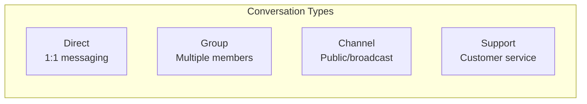
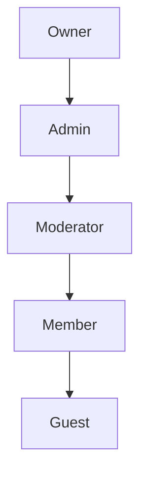

# Conversations

Conversations are containers for messages between users.

## Conversation Types



| Type | Description | Max Members |
|------|-------------|-------------|
| `direct` | Private 1:1 chat | 2 |
| `group` | Private group chat | Unlimited |
| `channel` | Public broadcast | Unlimited |
| `support` | Customer support | 2+ |

## Member Roles



| Role | Permissions |
|------|------------|
| `owner` | Full control, delete conversation |
| `admin` | Manage members, settings |
| `moderator` | Delete messages, mute users |
| `member` | Send messages, react |
| `guest` | Read-only access |

## API Endpoints

### List Conversations

```http
GET /messaging/conversations/
```

Response:
```json
{
  "items": [
    {
      "id": "conv_123",
      "type": "direct",
      "name": null,
      "last_message": {
        "content": "Hello!",
        "sender_id": "user_456",
        "created_at": "2025-01-18T10:00:00Z"
      },
      "unread_count": 2,
      "members": [...]
    }
  ],
  "total": 10,
  "has_more": true
}
```

### Create Conversation

```http
POST /messaging/conversations/
Content-Type: application/json

{
  "type": "group",
  "name": "Project Team",
  "member_ids": ["user_1", "user_2", "user_3"]
}
```

### Get or Create Direct

```http
POST /messaging/conversations/direct
Content-Type: application/json

{
  "user_id": "user_456"
}
```

This endpoint is idempotent - returns existing conversation if one exists.

### Update Conversation

```http
PATCH /messaging/conversations/{id}/
Content-Type: application/json

{
  "name": "New Name",
  "avatar": "https://..."
}
```

### Member Management

```http
POST /messaging/conversations/{id}/members
Content-Type: application/json

{
  "user_id": "user_789",
  "role": "member"
}
```

```http
DELETE /messaging/conversations/{id}/members/{user_id}
```

### Conversation Settings

```http
PATCH /messaging/conversations/{id}/settings
Content-Type: application/json

{
  "muted": true,
  "pinned": false,
  "notification_level": "mentions_only"
}
```

## Service Layer

```python
from django_matt.messaging.services import ConversationService

# Create a group conversation
conversation = await ConversationService.create_group(
    creator=request.user,
    name="Project Team",
    member_ids=[user1.id, user2.id, user3.id],
)

# Get or create direct conversation
conversation = await ConversationService.get_or_create_direct(
    user1=request.user,
    user2=other_user,
)

# List user's conversations
conversations = await ConversationService.list_for_user(
    user=request.user,
    include_archived=False,
)

# Add member
await ConversationService.add_member(
    conversation=conversation,
    user=new_member,
    role="member",
    added_by=request.user,
)

# Update settings
await ConversationService.update_settings(
    conversation=conversation,
    user=request.user,
    muted=True,
)
```

## Events

Conversation events are broadcast via WebSocket:

```json
{
  "type": "conversation.created",
  "conversation": {...}
}

{
  "type": "conversation.updated",
  "conversation_id": "conv_123",
  "changes": {"name": "New Name"}
}

{
  "type": "member.added",
  "conversation_id": "conv_123",
  "member": {...}
}

{
  "type": "member.removed",
  "conversation_id": "conv_123",
  "user_id": "user_456"
}
```
