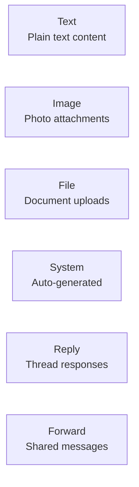
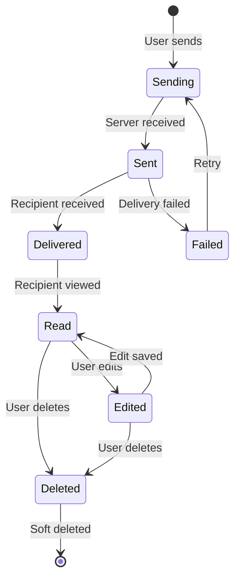
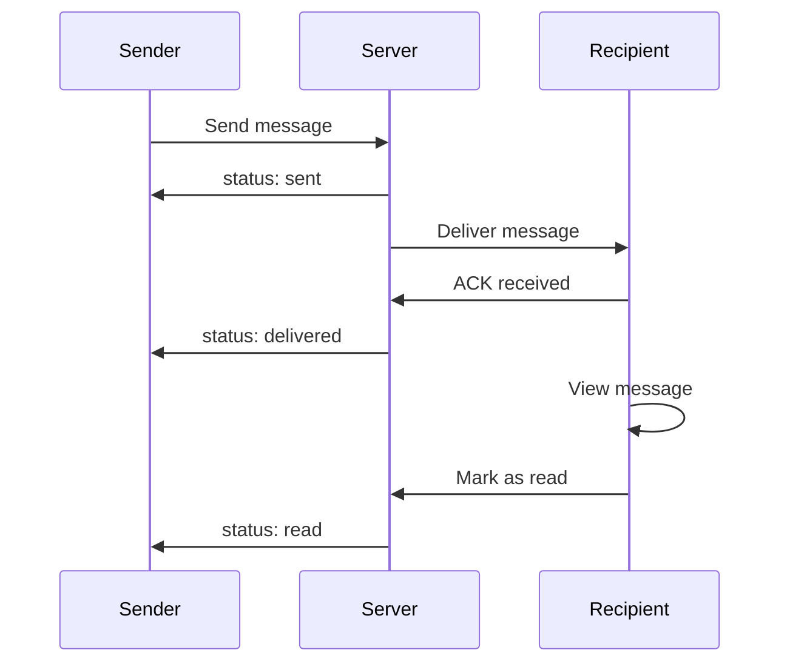

# Messages

Messages are the core content within conversations.

## Message Types



## Message Lifecycle



## Delivery Status



## API Endpoints

### Send Message

```http
POST /messaging/conversations/{conv_id}/messages
Content-Type: application/json

{
  "content": "Hello, world!",
  "type": "text"
}
```

### Send Reply

```http
POST /messaging/conversations/{conv_id}/messages
Content-Type: application/json

{
  "content": "Great point!",
  "type": "reply",
  "reply_to_id": "msg_456"
}
```

### Get Messages (Paginated)

```http
GET /messaging/conversations/{conv_id}/messages?limit=50&before=msg_100
```

Response:
```json
{
  "items": [
    {
      "id": "msg_99",
      "sender_id": "user_123",
      "content": "Hello!",
      "type": "text",
      "status": "read",
      "created_at": "2025-01-18T10:00:00Z",
      "reactions": [
        {"emoji": "👍", "count": 2, "users": ["user_1", "user_2"]}
      ]
    }
  ],
  "has_more": true
}
```

### Edit Message

```http
PATCH /messaging/messages/{id}/
Content-Type: application/json

{
  "content": "Updated content"
}
```

### Delete Message

```http
DELETE /messaging/messages/{id}/
```

### Add Reaction

```http
POST /messaging/messages/{id}/reactions
Content-Type: application/json

{
  "emoji": "👍"
}
```

### Mark as Read

```http
POST /messaging/conversations/{conv_id}/read
Content-Type: application/json

{
  "message_id": "msg_123"
}
```

## Service Layer

```python
from django_matt.messaging.services import MessageService

# Send a message
message = await MessageService.send(
    conversation=conversation,
    sender=request.user,
    content="Hello!",
    message_type="text",
)

# Send with attachment
message = await MessageService.send(
    conversation=conversation,
    sender=request.user,
    content="Check this out",
    attachments=[
        {"filename": "doc.pdf", "url": "...", "content_type": "application/pdf"}
    ],
)

# Edit message
await MessageService.edit(
    message=message,
    user=request.user,
    new_content="Updated content",
)

# Delete message
await MessageService.delete(
    message=message,
    user=request.user,
)

# Mark as read
await MessageService.mark_read(
    conversation=conversation,
    user=request.user,
    up_to_message=message,
)

# Get unread count
count = await MessageService.unread_count(
    user=request.user,
    conversation=conversation,
)
```

## Real-time Events

```json
// New message
{
  "type": "message.created",
  "message": {...}
}

// Message edited
{
  "type": "message.updated",
  "message_id": "msg_123",
  "content": "New content",
  "edited_at": "..."
}

// Message deleted
{
  "type": "message.deleted",
  "message_id": "msg_123"
}

// Typing indicator
{
  "type": "typing.start",
  "conversation_id": "conv_123",
  "user_id": "user_456"
}

// Read receipt
{
  "type": "message.read",
  "conversation_id": "conv_123",
  "user_id": "user_456",
  "message_id": "msg_123"
}
```
