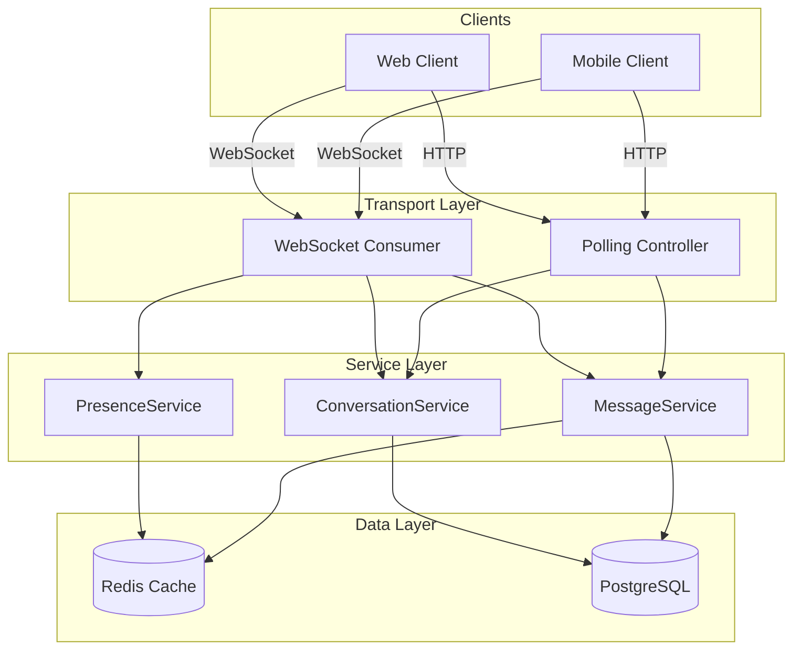
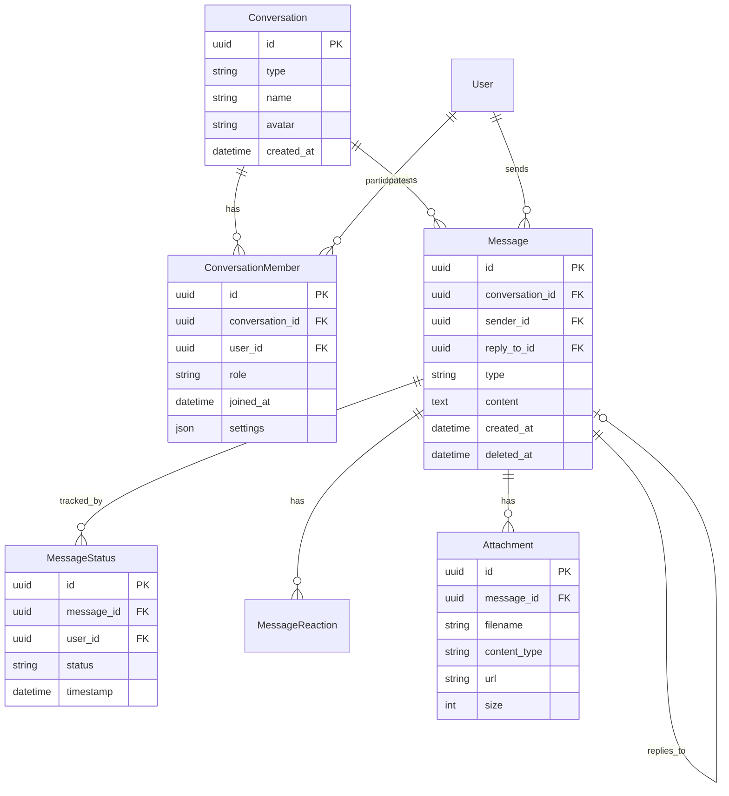

# Messaging System Overview

django-matt includes a full-featured real-time messaging system for building chat applications, support systems, and in-app communication.

## Features

- Direct and group conversations
- Message delivery tracking (sent, delivered, read)
- Typing indicators and presence
- File attachments
- Message reactions and threading
- WebSocket real-time delivery
- HTTP polling fallback

## Architecture



## Data Model



## Quick Start

### 1. Add to INSTALLED_APPS

```python
INSTALLED_APPS = [
    ...
    'django_matt.messaging',
]
```

### 2. Run Migrations

```bash
python manage.py migrate
```

### 3. Register Controllers

```python
from django_matt import DjangoMattAPI
from django_matt.messaging.controllers import (
    ConversationController,
    MessageController,
)

api = DjangoMattAPI()
api.register_controller(ConversationController)
api.register_controller(MessageController)
```

### 4. Configure WebSocket (Optional)

```python
# routing.py
from django_matt.messaging.realtime import MessagingConsumer

websocket_urlpatterns = [
    path("ws/messaging/", MessagingConsumer.as_asgi()),
]
```

## Related Documentation

- [Conversations](./conversations.md)
- [Messages](./messages.md)
- [Real-time](./realtime.md)
- [Attachments](./attachments.md)
