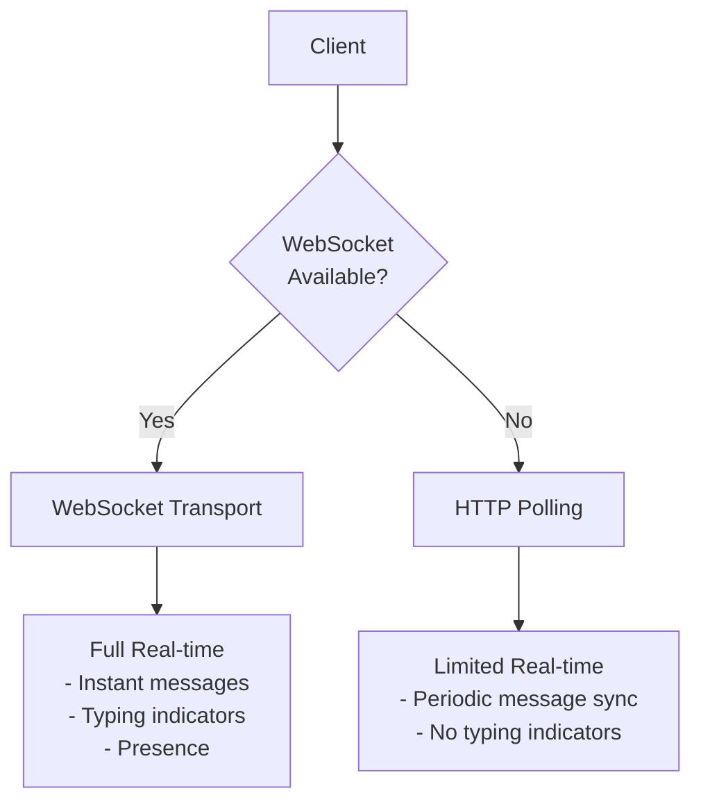
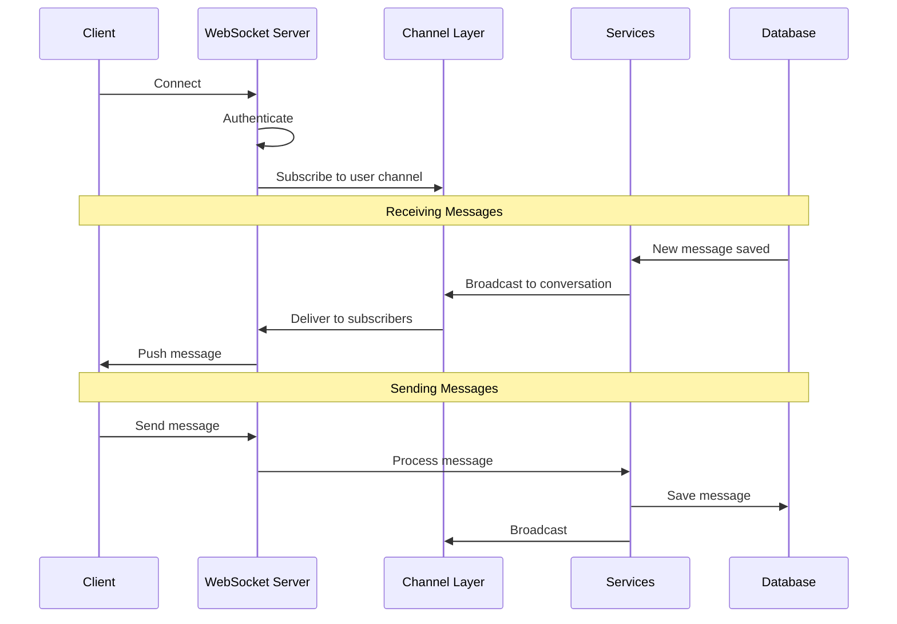

# Real-time Messaging

django-matt supports real-time messaging via WebSocket with HTTP polling fallback.

## Transport Options



## WebSocket Architecture



## WebSocket Consumer

```python
# routing.py
from django.urls import path
from django_matt.messaging.realtime import MessagingConsumer

websocket_urlpatterns = [
    path("ws/messaging/", MessagingConsumer.as_asgi()),
]
```

## Client Connection

```javascript
// Connect with authentication
const ws = new WebSocket('wss://api.example.com/ws/messaging/');

ws.onopen = () => {
  // Authenticate
  ws.send(JSON.stringify({
    type: 'authenticate',
    token: 'jwt_token_here'
  }));
};

ws.onmessage = (event) => {
  const data = JSON.parse(event.data);

  switch (data.type) {
    case 'message.created':
      handleNewMessage(data.message);
      break;
    case 'typing.start':
      showTypingIndicator(data.user_id);
      break;
    case 'presence.update':
      updatePresence(data.user_id, data.status);
      break;
  }
};

// Send a message
ws.send(JSON.stringify({
  type: 'message.send',
  conversation_id: 'conv_123',
  content: 'Hello!'
}));

// Start typing indicator
ws.send(JSON.stringify({
  type: 'typing.start',
  conversation_id: 'conv_123'
}));
```

## Event Types

### Inbound (Client → Server)

| Event | Description |
|-------|-------------|
| `authenticate` | Authenticate connection |
| `message.send` | Send a message |
| `typing.start` | Start typing indicator |
| `typing.stop` | Stop typing indicator |
| `presence.update` | Update presence status |
| `message.read` | Mark messages as read |

### Outbound (Server → Client)

| Event | Description |
|-------|-------------|
| `message.created` | New message received |
| `message.updated` | Message edited |
| `message.deleted` | Message deleted |
| `typing.start` | User started typing |
| `typing.stop` | User stopped typing |
| `presence.update` | User presence changed |
| `conversation.updated` | Conversation changed |

## HTTP Polling Fallback

For environments without WebSocket support:

```http
GET /messaging/poll?since=2025-01-18T10:00:00Z
```

Response:
```json
{
  "messages": [...],
  "typing": [...],
  "presence": {...},
  "timestamp": "2025-01-18T10:00:05Z"
}
```

## Presence Service

```python
from django_matt.messaging.services import PresenceService

# Update presence
await PresenceService.set_online(user)
await PresenceService.set_offline(user)
await PresenceService.set_away(user)

# Get presence for users
presence = await PresenceService.get_presence(user_ids)
# Returns: {"user_1": "online", "user_2": "away", ...}

# Track typing
await PresenceService.start_typing(user, conversation)
await PresenceService.stop_typing(user, conversation)

# Get who's typing
typing = await PresenceService.get_typing(conversation)
# Returns: ["user_1", "user_2"]
```

## Configuration

```python
DJANGO_MATT = {
    "MESSAGING": {
        # WebSocket settings
        "WEBSOCKET_ENABLED": True,

        # Polling settings
        "POLLING_INTERVAL": 5,  # seconds

        # Presence settings
        "PRESENCE_TIMEOUT": 60,  # seconds until marked away
        "TYPING_TIMEOUT": 3,  # seconds until typing stops

        # Channel layer
        "CHANNEL_LAYER": "default",
    }
}

# Django Channels config
CHANNEL_LAYERS = {
    "default": {
        "BACKEND": "channels_redis.core.RedisChannelLayer",
        "CONFIG": {
            "hosts": [("redis", 6379)],
        },
    },
}
```
