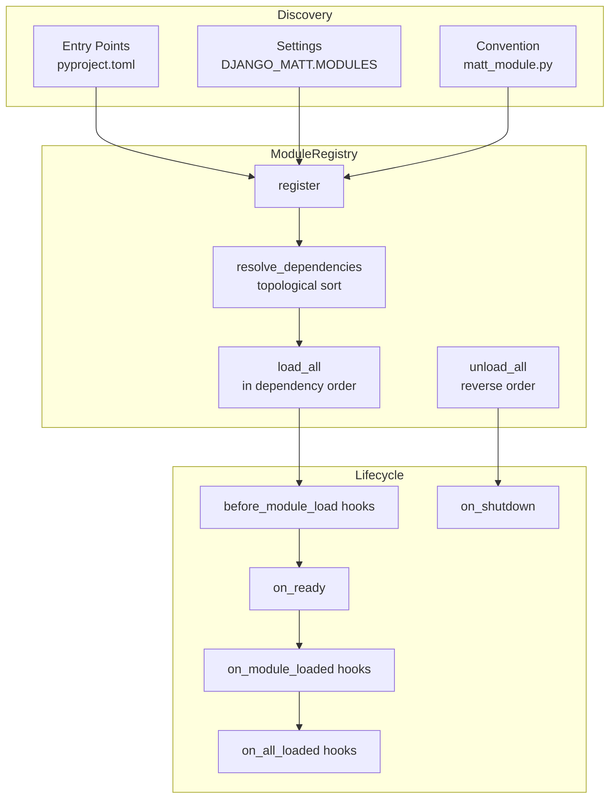

# Module System

Django Matt provides a plugin-style module system for packaging and distributing reusable features with lifecycle management, dependency resolution, and configuration validation.

## Overview



## Quick Start

```python
# myapp/matt_module.py
from django_matt.modules import MattModule


class NotificationsModule(MattModule):
    name = "notifications"
    version = "1.0.0"
    dependencies = ["auth"]

    async def on_ready(self) -> None:
        print(f"{self.name} module ready")

    async def on_shutdown(self) -> None:
        print(f"{self.name} module shutting down")

    def get_urls(self) -> list:
        from myapp.urls import urlpatterns
        return urlpatterns

    def get_middleware(self) -> list[str]:
        return ["myapp.middleware.NotificationMiddleware"]
```

```python
# Load all discovered modules at startup
from django_matt.modules import load_modules

await load_modules()
```

## MattModule Base Class

All modules extend `MattModule`. The `name` is auto-derived from the class name (lowercased, with "module" suffix stripped) if not set explicitly.

### Class Attributes

| Attribute | Type | Default | Description |
|-----------|------|---------|-------------|
| `name` | `str` | Auto from class name | Unique module identifier |
| `version` | `str` | `"0.1.0"` | Semantic version |
| `dependencies` | `list[str]` | `[]` | Names of required modules (loaded first) |
| `config_namespace` | `str \| None` | `None` | Key in `DJANGO_MATT` settings for this module's config |
| `config_schema` | `type[BaseModel] \| None` | `None` | Pydantic model for config validation |

### Lifecycle Methods

| Method | When Called | Description |
|--------|------------|-------------|
| `on_ready()` | After dependencies loaded | Async initialization |
| `on_shutdown()` | During unload (reverse order) | Async cleanup |
| `get_urls()` | During URL collection | Return Django URL patterns |
| `get_middleware()` | During middleware collection | Return middleware class dotted paths |
| `get_checks()` | During check collection | Return system checks |
| `validate_config(config)` | Before `on_ready()` | Validate config dict against `config_schema` |

### Module with Config Validation

```python
from pydantic import BaseModel
from django_matt.modules import MattModule


class BillingConfig(BaseModel):
    stripe_key: str
    webhook_secret: str
    currency: str = "usd"


class BillingModule(MattModule):
    name = "billing"
    version = "2.0.0"
    dependencies = ["auth", "notifications"]
    config_namespace = "BILLING"
    config_schema = BillingConfig

    async def on_ready(self) -> None:
        config = self.validate_config(self._get_config())
        # config is a validated BillingConfig instance
```

```python
# settings.py
DJANGO_MATT = {
    "BILLING": {
        "stripe_key": "sk_live_...",
        "webhook_secret": "whsec_...",
        "currency": "usd",
    },
}
```

## ModuleRegistry

The registry manages module registration, dependency resolution, and lifecycle orchestration.

### API Reference

| Method | Description |
|--------|-------------|
| `register(module)` | Register a module instance or class (instantiated automatically) |
| `resolve_dependencies()` | Topological sort of all registered modules; raises on cycles or missing deps |
| `load_all()` | Load modules in dependency order, calling lifecycle hooks |
| `unload_all()` | Unload modules in reverse order, calling `on_shutdown()` |
| `get(name)` | Get a loaded module by name; raises `ModuleNotFoundError` if not loaded |
| `is_loaded(name)` | Check if a module is loaded |
| `is_registered(name)` | Check if a module is registered |
| `list_loaded()` | Return loaded modules in load order |
| `list_registered()` | Return all registered modules |
| `set_config(namespace, config)` | Set config dict for a namespace |
| `reset()` | Clear all state |

```python
from django_matt.modules import get_registry

registry = get_registry()
registry.register(BillingModule)
registry.set_config("BILLING", {"stripe_key": "sk_test_..."})
registry.resolve_dependencies()
await registry.load_all()

billing = registry.get("billing")
print(billing.version)  # "2.0.0"
```

### Dependency Resolution

Dependencies are resolved via topological sort. The registry detects:

- **Missing dependencies**: `MissingDependencyError` if a required module is not registered
- **Circular dependencies**: `CircularDependencyError` if module A depends on B which depends on A

```python
# This will raise CircularDependencyError
class ModuleA(MattModule):
    name = "a"
    dependencies = ["b"]

class ModuleB(MattModule):
    name = "b"
    dependencies = ["a"]
```

### Error Hierarchy

```
ModuleError (base)
  CircularDependencyError  — cycle detected in dependency graph
  MissingDependencyError   — required module not registered
  ModuleNotFoundError      — module not loaded when accessed via get()
```

## Decorators

### @module

Convert any class into a `MattModule` subclass:

```python
from django_matt.modules import module


@module("analytics", version="1.0.0", depends=["auth"], config_namespace="ANALYTICS")
class AnalyticsModule:
    async def on_ready(self) -> None:
        print("Analytics ready")
```

If the class does not already extend `MattModule`, the decorator creates a new class with both the original class and `MattModule` as bases.

### @requires_module

Guard a function to only execute when a module is loaded:

```python
from django_matt.modules import requires_module


@requires_module("billing")
async def charge_customer(customer_id: str, amount: int):
    # Only runs if billing module is loaded
    # Raises RuntimeError otherwise
    ...
```

Works with both sync and async functions.

### @optional_module

Like `@requires_module` but returns a default value instead of raising:

```python
from django_matt.modules import optional_module


@optional_module("analytics", default=None)
async def track_event(event_name: str, data: dict):
    # Returns None if analytics module is not loaded
    ...
```

## Lifecycle Hooks

### @on_module_loaded

Run code after a specific module loads:

```python
from django_matt.modules import on_module_loaded


@on_module_loaded("auth")
async def setup_auth_integrations(auth_module):
    print(f"Auth module loaded: {auth_module.name}")
```

### @on_all_loaded

Run code after all modules have loaded:

```python
from django_matt.modules import on_all_loaded


@on_all_loaded
async def post_startup():
    print("All modules ready, starting background tasks")
```

### @before_module_load

Run code before a specific module loads:

```python
from django_matt.modules import before_module_load


@before_module_load("billing")
async def validate_stripe_keys(billing_module):
    from django.conf import settings
    assert hasattr(settings, "STRIPE_SECRET_KEY"), "STRIPE_SECRET_KEY required"
```

## Module Discovery

Modules are discovered automatically via three mechanisms (in order):

### 1. Entry Points

Third-party packages register modules via `pyproject.toml`:

```toml
[project.entry-points."django_matt.modules"]
my_module = "my_package.matt_module:MyModule"
```

### 2. Settings

Explicit module paths in Django settings:

```python
# settings.py
DJANGO_MATT = {
    "MODULES": [
        "myapp.modules.billing",
        "myapp.modules.analytics",
    ],
}
```

The loader imports each path and registers any `MattModule` subclass found.

### 3. Convention

The loader scans every installed Django app for a `matt_module.py` file:

```
myapp/
    __init__.py
    models.py
    matt_module.py  <-- auto-discovered
```

Any `MattModule` subclass in `matt_module.py` is registered automatically.

## Loading and Shutting Down

```python
from django_matt.modules import load_modules, shutdown_modules

# Discovers, resolves dependencies, and loads all modules
await load_modules()

# Unloads in reverse order (call during shutdown)
await shutdown_modules()
```

## CLI Commands

### matt modules list

```
Name                 Version    Status     Dependencies
----------------------------------------------------------------------
auth                 1.0.0      loaded     -
billing              2.0.0      loaded     auth, notifications
notifications        1.0.0      loaded     auth
analytics            1.0.0      registered auth
```

### matt modules info \<name\>

```
Name:         billing
Version:      2.0.0
Class:        BillingModule
Status:       loaded
Dependencies: auth, notifications
Config NS:    BILLING
URLs:         3 patterns
Middleware:    1 classes
Checks:       0 checks
```

### matt modules check

Validates dependency graph and config schemas:

```
All modules OK.
```

Or:

```
  ERROR: Module 'billing' depends on 'payments', which is not registered
  ERROR: Module 'analytics' config validation failed: field required: api_key
```

## Creating a Custom Module Tutorial

### 1. Define the Module

```python
# myapp/matt_module.py
from pydantic import BaseModel
from django_matt.modules import MattModule


class SearchConfig(BaseModel):
    engine: str = "elasticsearch"
    hosts: list[str] = ["localhost:9200"]
    index_prefix: str = ""


class SearchModule(MattModule):
    name = "search"
    version = "1.0.0"
    dependencies = []
    config_namespace = "SEARCH"
    config_schema = SearchConfig

    async def on_ready(self) -> None:
        config = self.validate_config(self._config)
        # Initialize search client
        pass

    async def on_shutdown(self) -> None:
        # Close search connections
        pass

    def get_urls(self) -> list:
        from django.urls import path
        from myapp.views import search_view
        return [path("search/", search_view)]

    def get_middleware(self) -> list[str]:
        return []  # no middleware needed

    def get_checks(self) -> list:
        return []
```

### 2. Configure

```python
# settings.py
DJANGO_MATT = {
    "SEARCH": {
        "engine": "elasticsearch",
        "hosts": ["es1.internal:9200", "es2.internal:9200"],
        "index_prefix": "myapp_",
    },
}
```

### 3. Use the Guard Decorators

```python
from django_matt.modules import requires_module


@requires_module("search")
async def full_text_search(query: str) -> list[dict]:
    # Only callable when search module is loaded
    ...
```

## Best Practices

1. **Always declare dependencies** — implicit dependencies lead to load-order bugs
2. **Keep `on_ready()` fast** — defer heavy initialization to first use
3. **Use `config_schema`** — catch config errors at startup, not at runtime
4. **Use entry points for distribution** — third-party modules should register via pyproject.toml
5. **Use `@optional_module`** for graceful degradation when a feature module is absent
6. **Run `matt modules check`** in CI to validate your module graph before deployment
