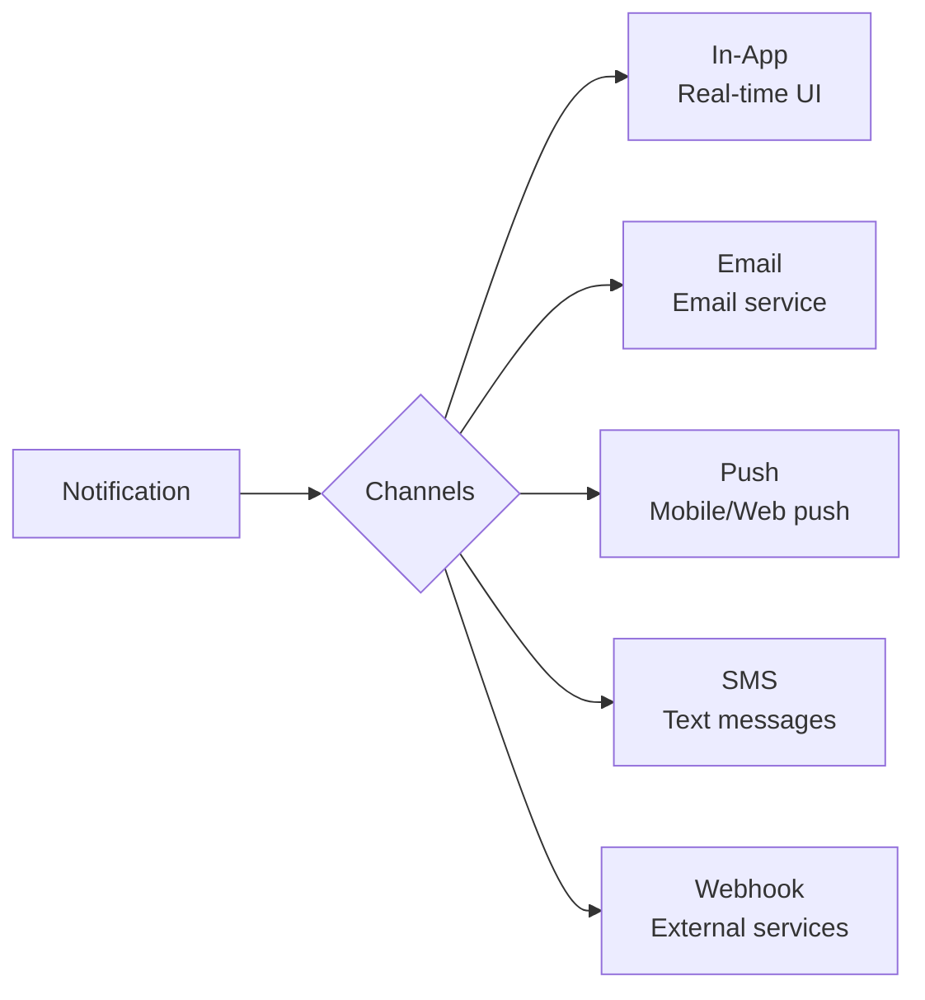
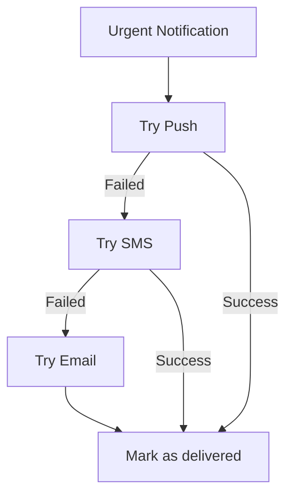

# Notification Channels

django-matt supports multiple delivery channels for notifications.

## Available Channels



## Channel Comparison

| Channel | Real-time | Offline | Rich Content | Cost |
|---------|-----------|---------|--------------|------|
| In-App | Yes | No | Yes | Free |
| Email | No | Yes | Yes | Low |
| Push | Yes | Yes | Limited | Low |
| SMS | Yes | Yes | No | Medium |
| Webhook | Yes | No | Yes | Free |

## In-App Notifications

Delivered via WebSocket for real-time display:

```python
from django_matt.notifications import notify

await notify(
    user=user,
    notification_type="new_comment",
    title="New comment on your post",
    channels=["in_app"],
    data={"post_id": 123, "comment_id": 456},
)
```

Client-side handling:
```javascript
ws.onmessage = (event) => {
  const data = JSON.parse(event.data);
  if (data.type === 'notification') {
    showToast(data.notification);
  }
};
```

## Email Notifications

Integrates with the Email Service:

```python
await notify(
    user=user,
    notification_type="welcome",
    title="Welcome to our platform!",
    body="Thanks for signing up...",
    channels=["email"],
    data={
        "email_template": "welcome",
        "context": {"name": user.name},
    },
)
```

## Push Notifications

### Firebase Cloud Messaging (FCM)

```python
# Store device token
user.profile.fcm_token = "device_token_here"
await user.profile.asave()

# Send push
await notify(
    user=user,
    notification_type="message_received",
    title="New message",
    body="You have a new message from...",
    channels=["push"],
    data={
        "click_action": "OPEN_CHAT",
        "chat_id": "123",
    },
)
```

### Apple Push Notifications (APNs)

```python
# Store device token
user.profile.apns_token = "device_token_here"

# Sent automatically when push channel is enabled
```

### Web Push

```python
# Store subscription
user.profile.web_push_subscription = {
    "endpoint": "...",
    "keys": {"p256dh": "...", "auth": "..."}
}
```

## SMS Notifications

Via Twilio:

```python
await notify(
    user=user,
    notification_type="verification_code",
    title="Verification Code",
    body="Your code is: 123456",
    channels=["sms"],
)
```

Configuration:
```python
DJANGO_MATT = {
    "NOTIFICATIONS": {
        "SMS": {
            "PROVIDER": "twilio",
            "ACCOUNT_SID": env("TWILIO_SID"),
            "AUTH_TOKEN": env("TWILIO_TOKEN"),
            "FROM_NUMBER": "+1234567890",
        }
    }
}
```

## Webhook Notifications

Send to external services:

```python
await notify(
    user=user,
    notification_type="order_completed",
    channels=["webhook"],
    data={
        "webhook_url": "https://external.service/webhook",
        "order_id": order.id,
        "total": str(order.total),
    },
)
```

## Multi-Channel Delivery

Send to multiple channels at once:

```python
await notify(
    user=user,
    notification_type="account_alert",
    title="Security Alert",
    body="A new device logged into your account",
    channels=["in_app", "email", "push"],
    priority="high",
)
```

## Channel Priority

For urgent notifications:



```python
await notify(
    user=user,
    notification_type="2fa_code",
    title="Your verification code",
    body="123456",
    priority="urgent",
    channels=["push", "sms", "email"],  # Tries in order
    channel_fallback=True,
)
```
