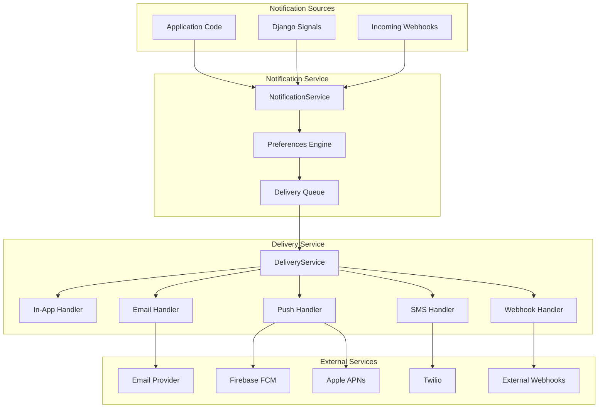
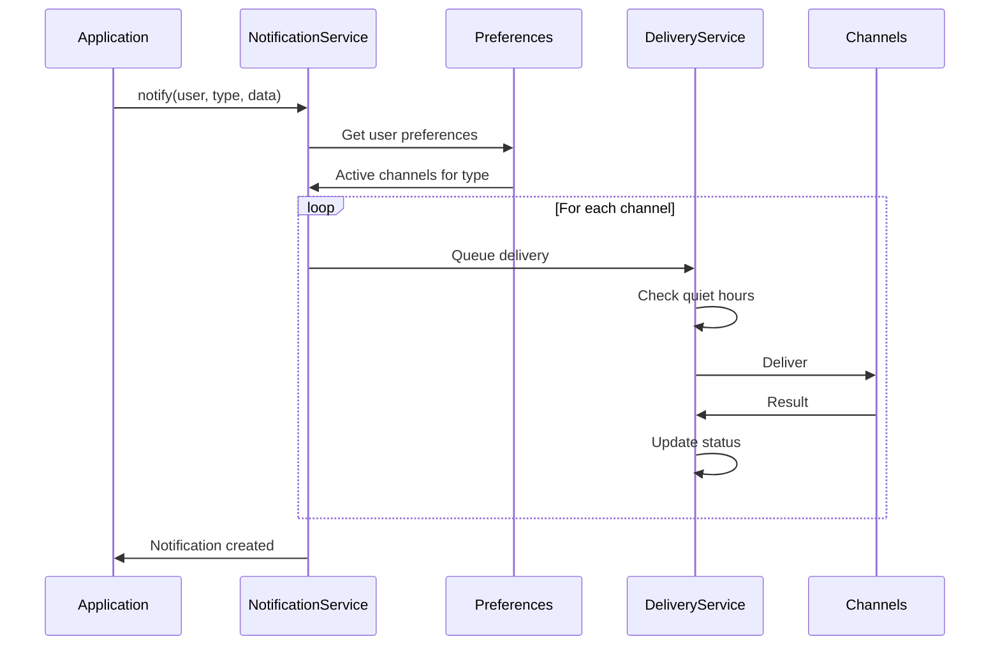
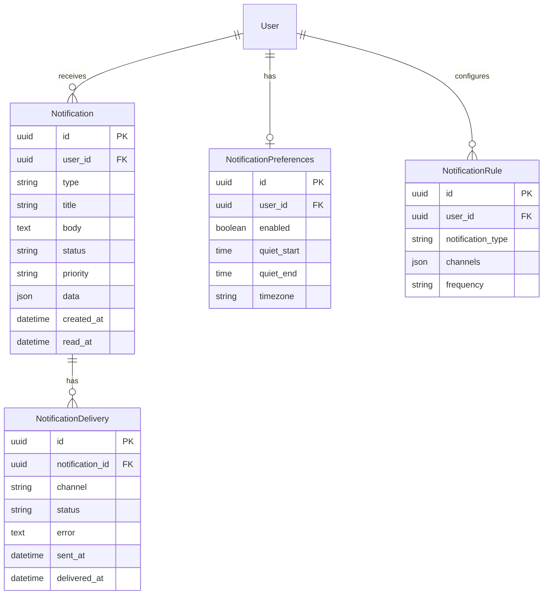

# Notifications System Overview

django-matt provides a unified notification system supporting multiple delivery channels with user preferences.

## Features

- Multi-channel delivery (in-app, email, push, SMS, webhook)
- User preferences per notification type
- Priority levels and quiet hours
- Delivery tracking and retry
- Real-time in-app notifications

## Architecture



## Delivery Flow



## Data Model



## Quick Start

### 1. Add to INSTALLED_APPS

```python
INSTALLED_APPS = [
    ...
    'django_matt.notifications',
]
```

### 2. Run Migrations

```bash
python manage.py migrate
```

### 3. Register Controller

```python
from django_matt import MattAPI
from django_matt.notifications import NotificationController

api = MattAPI()
api.register_controller(NotificationController)
```

### 4. Send a Notification

```python
from django_matt.notifications import notify

await notify(
    user=user,
    notification_type="order_shipped",
    title="Your order has shipped!",
    body="Track your package...",
    data={"order_id": order.id, "tracking_url": "..."},
)
```

## Related Documentation

- [Channels](./channels.md)
- [Preferences](./preferences.md)
- [Delivery](./delivery.md)
