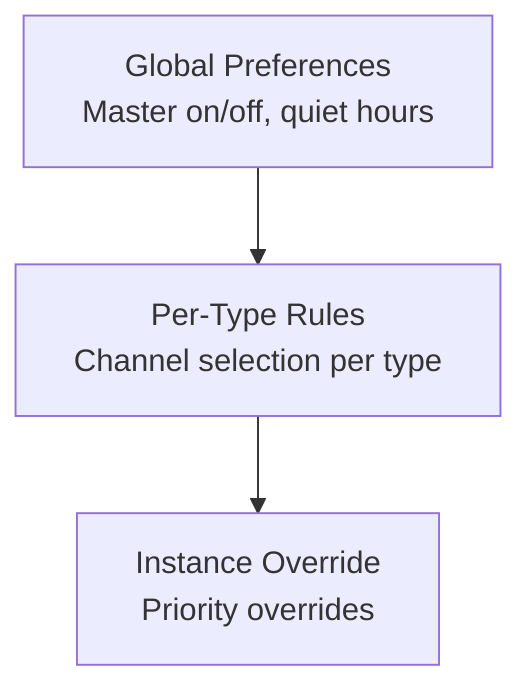
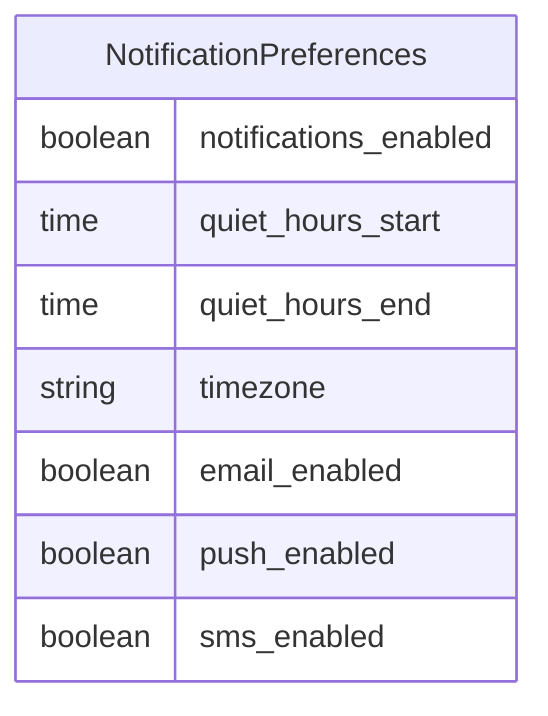
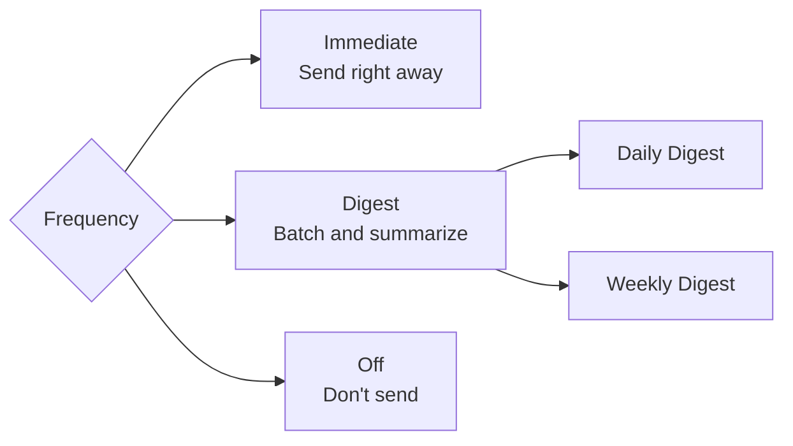
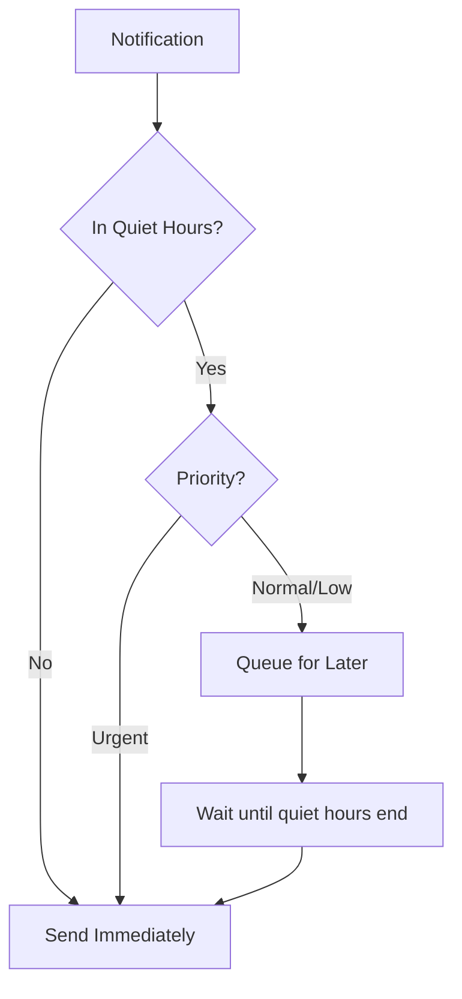

# Notification Preferences

Users can control how and when they receive notifications.

## Preference Hierarchy



## Global Preferences



### API Endpoints

```http
GET /notifications/preferences
```

```json
{
  "notifications_enabled": true,
  "email_enabled": true,
  "push_enabled": true,
  "sms_enabled": false,
  "quiet_hours_start": "22:00",
  "quiet_hours_end": "08:00",
  "timezone": "America/New_York"
}
```

```http
PATCH /notifications/preferences
Content-Type: application/json

{
  "quiet_hours_start": "23:00",
  "sms_enabled": true
}
```

## Per-Type Rules

Configure channels for each notification type:

```http
GET /notifications/rules
```

```json
{
  "rules": [
    {
      "notification_type": "new_message",
      "channels": ["in_app", "push"],
      "frequency": "immediate"
    },
    {
      "notification_type": "weekly_digest",
      "channels": ["email"],
      "frequency": "weekly"
    },
    {
      "notification_type": "marketing",
      "channels": [],
      "frequency": "off"
    }
  ]
}
```

```http
PUT /notifications/rules/{type}
Content-Type: application/json

{
  "channels": ["in_app", "email"],
  "frequency": "immediate"
}
```

## Frequency Options



| Frequency | Description |
|-----------|-------------|
| `immediate` | Send as soon as possible |
| `daily_digest` | Batch into daily email |
| `weekly_digest` | Batch into weekly email |
| `off` | Don't send this type |

## Quiet Hours



Quiet hours respect the user's timezone:

```python
# Server processes at 2 AM UTC
# User's timezone: America/New_York (9 PM local)
# Quiet hours: 10 PM - 8 AM

# Notification IS delivered (9 PM < 10 PM)
```

## Service Layer

```python
from django_matt.notifications.services import NotificationService

# Check if user wants this notification
should_send = await NotificationService.should_send(
    user=user,
    notification_type="marketing",
    channel="email",
)

# Get active channels for a type
channels = await NotificationService.get_active_channels(
    user=user,
    notification_type="new_message",
)
# Returns: ["in_app", "push"]

# Update preferences
await NotificationService.update_preferences(
    user=user,
    notifications_enabled=True,
    quiet_hours_start=time(22, 0),
    quiet_hours_end=time(8, 0),
)

# Update rule
await NotificationService.update_rule(
    user=user,
    notification_type="comments",
    channels=["in_app"],
    frequency="immediate",
)
```

## Unsubscribe Links

Generate secure unsubscribe links for emails:

```python
from django_matt.notifications import generate_unsubscribe_token

token = generate_unsubscribe_token(user, "marketing")
unsubscribe_url = f"https://app.example.com/unsubscribe?token={token}"
```

Handle unsubscribe:
```python
from django_matt.notifications import process_unsubscribe

success = await process_unsubscribe(token)
# Automatically disables the notification type for the user
```
