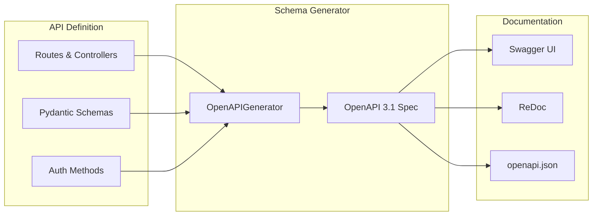

# OpenAPI / Swagger

Django Matt provides automatic OpenAPI schema generation with Swagger UI and ReDoc documentation.

## Overview



## Quick Start

```python
from django_matt import MattAPI

api = MattAPI(
    title="My API",
    version="1.0.0",
    description="A powerful API built with Django Matt",
    docs_url="/docs",      # Swagger UI
    redoc_url="/redoc",    # ReDoc
    openapi_url="/openapi.json",
)

# Routes are automatically documented
@api.get("/users", tags=["Users"])
async def list_users(request) -> list[UserSchema]:
    """
    List all users.

    Returns a paginated list of users with optional filtering.
    """
    return User.objects.all()
```

Access documentation at:
- Swagger UI: `http://localhost:8000/api/docs`
- ReDoc: `http://localhost:8000/api/redoc`
- OpenAPI JSON: `http://localhost:8000/api/openapi.json`

## Configuration

### API Setup

```python
from django_matt import MattAPI
from django_matt.openapi import OpenAPIConfig

config = OpenAPIConfig(
    title="My API",
    version="1.0.0",
    description="Full API documentation",

    # Documentation URLs
    docs_url="/docs",
    redoc_url="/redoc",
    openapi_url="/openapi.json",

    # Contact info
    contact={
        "name": "API Support",
        "email": "support@example.com",
        "url": "https://example.com/support",
    },

    # License
    license={
        "name": "MIT",
        "url": "https://opensource.org/licenses/MIT",
    },

    # External docs
    external_docs={
        "description": "Full documentation",
        "url": "https://docs.example.com",
    },

    # Servers
    servers=[
        {"url": "https://api.example.com", "description": "Production"},
        {"url": "https://staging-api.example.com", "description": "Staging"},
        {"url": "http://localhost:8000", "description": "Development"},
    ],

    # Security schemes
    security_schemes={
        "bearerAuth": {
            "type": "http",
            "scheme": "bearer",
            "bearerFormat": "JWT",
        },
        "apiKey": {
            "type": "apiKey",
            "in": "header",
            "name": "X-API-Key",
        },
    },
)

api = MattAPI(openapi_config=config)
```

### Tags

Organize endpoints with tags:

```python
api = MattAPI(
    tags=[
        {"name": "Users", "description": "User management operations"},
        {"name": "Products", "description": "Product CRUD operations"},
        {"name": "Orders", "description": "Order processing"},
        {"name": "Auth", "description": "Authentication endpoints"},
    ]
)

@api.get("/users", tags=["Users"])
async def list_users(request):
    """List all users."""
    pass

@api.post("/auth/login", tags=["Auth"])
async def login(request):
    """Authenticate user."""
    pass
```

## Schema Documentation

### Pydantic Schemas

Schemas are automatically documented:

```python
from pydantic import BaseModel, Field, EmailStr

class UserCreate(BaseModel):
    """Schema for creating a new user."""

    email: EmailStr = Field(
        description="User's email address",
        example="john@example.com",
    )
    name: str = Field(
        min_length=2,
        max_length=100,
        description="User's full name",
        example="John Doe",
    )
    age: int = Field(
        ge=0,
        le=150,
        description="User's age in years",
        example=30,
    )

class UserResponse(BaseModel):
    """User response with all fields."""

    id: int = Field(description="Unique identifier")
    email: EmailStr
    name: str
    age: int
    is_active: bool = Field(default=True, description="Whether user is active")
    created_at: datetime = Field(description="Account creation timestamp")

    class Config:
        json_schema_extra = {
            "example": {
                "id": 1,
                "email": "john@example.com",
                "name": "John Doe",
                "age": 30,
                "is_active": True,
                "created_at": "2024-01-15T10:30:00Z",
            }
        }
```

### Response Documentation

```python
from django_matt.openapi import responses, APIResponse

@api.get(
    "/users/{id}",
    tags=["Users"],
    summary="Get user by ID",
    description="Retrieve a single user by their unique identifier.",
    responses={
        200: {"model": UserResponse, "description": "User found"},
        404: {"description": "User not found"},
        403: {"description": "Permission denied"},
    },
)
async def get_user(request, id: int) -> UserResponse:
    user = User.objects.get(id=id)
    return user
```

### Request Body Documentation

```python
from django_matt.openapi import Body

@api.post("/users", tags=["Users"])
async def create_user(
    request,
    data: UserCreate = Body(
        description="User data to create",
        example={
            "email": "new@example.com",
            "name": "New User",
            "age": 25,
        },
    ),
) -> UserResponse:
    """
    Create a new user.

    Creates a new user account with the provided data.
    Email must be unique across the system.
    """
    return User.objects.create(**data.dict())
```

## Parameters

### Path Parameters

```python
@api.get("/users/{user_id}/posts/{post_id}")
async def get_user_post(
    request,
    user_id: int = Path(description="User's unique identifier", ge=1),
    post_id: int = Path(description="Post's unique identifier", ge=1),
):
    """Get a specific post by a user."""
    pass
```

### Query Parameters

```python
from typing import Optional
from django_matt.openapi import Query

@api.get("/users")
async def list_users(
    request,
    page: int = Query(default=1, ge=1, description="Page number"),
    limit: int = Query(default=20, ge=1, le=100, description="Items per page"),
    search: Optional[str] = Query(default=None, description="Search term"),
    is_active: Optional[bool] = Query(default=None, description="Filter by active status"),
    sort: str = Query(default="created_at", description="Sort field"),
    order: str = Query(default="desc", enum=["asc", "desc"], description="Sort order"),
):
    """
    List users with pagination and filtering.

    Supports searching by name/email and filtering by active status.
    """
    pass
```

### Header Parameters

```python
from django_matt.openapi import Header

@api.get("/protected")
async def protected_endpoint(
    request,
    authorization: str = Header(description="Bearer token"),
    x_request_id: Optional[str] = Header(default=None, alias="X-Request-ID"),
):
    pass
```

## Security

### JWT Authentication

```python
from django_matt.openapi import security

@api.get("/me", tags=["Users"])
@security("bearerAuth")  # Requires JWT
async def get_current_user(request):
    """Get current authenticated user."""
    return request.user
```

### API Key Authentication

```python
@api.get("/data", tags=["Data"])
@security("apiKey")
async def get_data(request):
    """Get data with API key auth."""
    pass
```

### Multiple Security Options

```python
@api.get("/resource")
@security(["bearerAuth", "apiKey"])  # Either method works
async def get_resource(request):
    pass
```

### OAuth2 Flows

```python
config = OpenAPIConfig(
    security_schemes={
        "oauth2": {
            "type": "oauth2",
            "flows": {
                "authorizationCode": {
                    "authorizationUrl": "https://auth.example.com/authorize",
                    "tokenUrl": "https://auth.example.com/token",
                    "scopes": {
                        "read": "Read access",
                        "write": "Write access",
                        "admin": "Admin access",
                    },
                },
            },
        },
    },
)
```

## Controller Documentation

```python
from django_matt.core import APIController

@api.controller("/products", tags=["Products"])
class ProductController(APIController):
    """
    Product management controller.

    Handles all CRUD operations for products.
    """

    @api.get("/")
    async def list(self, request) -> list[ProductSchema]:
        """List all products."""
        return Product.objects.all()

    @api.get("/{id}")
    async def get(self, request, id: int) -> ProductSchema:
        """Get product by ID."""
        return Product.objects.get(id=id)

    @api.post("/")
    async def create(self, request, data: ProductCreate) -> ProductSchema:
        """Create a new product."""
        return Product.objects.create(**data.dict())
```

## Customization

### Custom Schema Generator

```python
from django_matt.openapi import OpenAPIGenerator

class CustomGenerator(OpenAPIGenerator):
    def customize_operation(self, operation, route):
        # Add custom headers to all operations
        if "parameters" not in operation:
            operation["parameters"] = []

        operation["parameters"].append({
            "name": "X-Correlation-ID",
            "in": "header",
            "required": False,
            "schema": {"type": "string"},
            "description": "Request correlation ID for tracing",
        })

        return operation

api = MattAPI(openapi_generator=CustomGenerator())
```

### Hide Endpoints

```python
@api.get("/internal", include_in_schema=False)
async def internal_endpoint(request):
    """This won't appear in docs."""
    pass
```

### Deprecated Endpoints

```python
@api.get("/old-endpoint", deprecated=True)
async def old_endpoint(request):
    """
    **Deprecated**: Use `/new-endpoint` instead.

    This endpoint will be removed in v2.0.
    """
    pass
```

## Swagger UI Customization

```python
from django_matt.openapi import SwaggerUIConfig

swagger_config = SwaggerUIConfig(
    # UI options
    deep_linking=True,
    display_operation_id=False,
    default_models_expand_depth=1,
    default_model_expand_depth=1,
    doc_expansion="list",  # "list", "full", or "none"
    filter=True,
    show_extensions=True,

    # Try it out
    try_it_out_enabled=True,

    # Syntax highlighting
    syntax_highlight_theme="monokai",

    # OAuth
    oauth2_redirect_url="/api/docs/oauth2-redirect",
)

api = MattAPI(swagger_config=swagger_config)
```

## ReDoc Customization

```python
from django_matt.openapi import ReDocConfig

redoc_config = ReDocConfig(
    # Sidebar
    hide_hostname=False,
    hide_download_button=False,
    hide_loading=False,

    # Expansion
    expand_responses="200,201",
    json_sample_expand_level=2,

    # Code samples
    generate_code_samples=True,
    code_samples_languages=["curl", "python", "javascript"],

    # Theme
    theme={
        "colors": {
            "primary": {"main": "#6366f1"},
        },
        "typography": {
            "fontSize": "15px",
            "fontFamily": "Inter, sans-serif",
        },
    },
)

api = MattAPI(redoc_config=redoc_config)
```

## Export Schema

### CLI

```bash
# Export to file
python manage.py export_openapi --output openapi.json

# Export YAML
python manage.py export_openapi --format yaml --output openapi.yaml
```

### Programmatic

```python
from django_matt.openapi import get_openapi_schema
import json

schema = get_openapi_schema(api)

# Save to file
with open("openapi.json", "w") as f:
    json.dump(schema, f, indent=2)
```

## Best Practices

1. **Write docstrings** - They become operation descriptions
2. **Use Pydantic Field** - Add descriptions, examples, constraints
3. **Organize with tags** - Group related endpoints
4. **Document responses** - Include error responses
5. **Add examples** - Help API consumers understand format
6. **Version your API** - Include version in title and servers
7. **Secure appropriately** - Document authentication requirements
8. **Deprecate gracefully** - Mark old endpoints before removal
