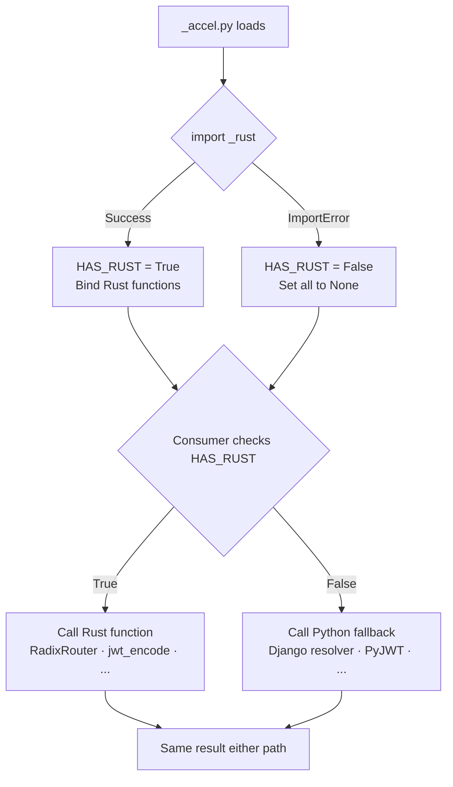

# Rust Extensions

django-matt ships optional Rust-accelerated hot paths via [PyO3](https://pyo3.rs/) and [maturin](https://www.maturin.rs/). These compile framework overhead (routing, JWT, serialization, query parsing, header parsing) to native code while maintaining pure-Python fallbacks on all platforms.

## Installation

```bash
# Install with Rust extensions
uv add django-matt[rust]

# Or build from source (development)
cd rust && maturin develop --release
# Or use the Makefile
make rust-dev
```

When Rust extensions are available:

```python
from django_matt._accel import HAS_RUST
print(HAS_RUST)  # True
```

## Architecture

```
django_matt/
├── _accel.py          # Import guard — dispatches Rust or Python
├── _rust.so           # Compiled Rust module (platform-specific)
└── ...

rust/
├── Cargo.toml         # Rust crate config (PyO3 + maturin)
├── src/
│   ├── lib.rs         # PyO3 module registration
│   ├── router.rs      # Radix tree URL router
│   ├── jwt.rs         # JWT encode/decode/verify (HMAC)
│   ├── querystring.rs # Query string parser
│   ├── headers.rs     # HTTP header parser
│   └── serializer.rs  # JSON serializer with camelCase
└── fuzz/              # cargo-fuzz targets
```

### Fallback Pattern

Every Rust-accelerated path has a pure-Python fallback. The pattern is:

```python
# django_matt/_accel.py
try:
    from django_matt._rust import RadixRouter, jwt_encode, ...
    HAS_RUST = True
except ImportError:
    HAS_RUST = False
    RadixRouter = None
    jwt_encode = None
    ...
```

Consumers check `HAS_RUST` before using Rust functions:

```python
from django_matt._accel import HAS_RUST, parse_query_string_rust

if HAS_RUST and parse_query_string_rust is not None:
    parsed = parse_query_string_rust(query_string)
else:
    # Pure Python fallback
    parsed = parse_query_string_python(query_string)
```

This means django-matt works everywhere Python runs — Rust extensions are a transparent performance upgrade.

## Request Hot Path — Rust vs Python

```mermaid
graph LR
    subgraph "Python (ASGI)"
        A1[TCP Accept]
        A2[HTTP Parse]
    end

    subgraph "Rust Accelerated"
        B1["Route Match<br/>RadixRouter 4x"]
        B2["Header Parse<br/>Auth · Accept · Content-Type"]
        B3["JWT Verify<br/>HMAC 1.5x + GIL release"]
        B4["Query Parse<br/>filters · sort · pagination 4x"]
    end

    subgraph "Python (Application)"
        C1[Controller Handler]
        C2[Django ORM]
    end

    subgraph "Rust Accelerated "
        D1["JSON Serialize<br/>+ camelCase 1.9x"]
    end

    subgraph "Python (ASGI) "
        E1[Send Response]
    end

    A1 --> A2 --> B1 --> B2 --> B3 --> B4 --> C1 --> C2 --> D1 --> E1

    style B1 fill:#dea584,stroke:#b7472a
    style B2 fill:#dea584,stroke:#b7472a
    style B3 fill:#dea584,stroke:#b7472a
    style B4 fill:#dea584,stroke:#b7472a
    style D1 fill:#dea584,stroke:#b7472a
```



## Fallback Dispatch



## Components

### Radix Tree URL Router

Replaces Django's regex-based URL resolver with a radix tree for O(path_length) route matching.

**Features:**
- Static, parameterized (`{id}`), and wildcard (`{path:*}`) segments
- Static routes prioritized over parameterized (correct behavior)
- Method-isolated (GET and POST on same path are distinct)

**Integration:** Automatically wired into `core/router.py` via `radix_dispatch()`. Routes are registered when `get_urls()` is called.

**Speedup:** **4.0x overall** (up to 12.7x on cache misses / late matches)

### JWT Encode/Decode/Verify

HMAC-based JWT operations (HS256/HS384/HS512) compiled to Rust with GIL release.

**Features:**
- `jwt_encode(payload_bytes, secret, algorithm)` — returns JWT string
- `jwt_decode(token, secret, algorithm, verify_exp, leeway)` — returns payload dict
- `jwt_verify(token, secret, algorithm)` — signature check only (faster)
- Constant-time signature comparison via the `subtle` crate
- GIL released during HMAC computation

**Integration:** Wired into `auth/jwt_builtin.py` — transparent to all 229 auth tests. RSA/EC algorithms fall back to Python's `cryptography` package (which is itself Rust-based).

**Speedup:** **1.5x** (Python's `hmac` module is already C-accelerated; main win is GIL release for concurrency)

### Query String Parser

Structured parsing of filter/sort/fields/pagination query parameters in a single pass.

**Features:**
- `?fields=id,name,email` → fields list
- `?filter[status]=active` → filter dict
- `?sort=-created,name` → sort tuples with direction
- `?page=2&limit=20` → pagination dict
- URL percent-decoding included
- Results cached on the request object (`request._parsed_qs`)

**Integration:** Wired into `views/base.py` — used by field selection, ordering, and filtering in `ListView`.

**Speedup:** **2.7-4.6x** (scales with query complexity)

### JSON Serializer with camelCase

Single-pass JSON serialization with optional snake_case → camelCase field renaming.

**Features:**
- `serialize_dicts_to_json(dicts, alias_map?)` — list of dicts to JSON bytes
- `serialize_dict_to_json(dict, alias_map?)` — single dict to JSON bytes
- `build_camel_case_map(field_names)` — builds rename map at startup
- Handles str, int, float, bool, None, list, nested dict
- Uses `ryu` crate for fast float formatting

**Integration:** Wired into `views/base.py` — activated when `CAMEL_CASE_API = True`. Serializes list response items with rename in one pass, bypassing separate Pydantic alias + JSON encode steps.

**When orjson is faster:** For plain JSON serialization without field renaming, orjson wins due to deeper CPython integration. The Rust serializer's value is the combined serialize+rename path for camelCase APIs.

**Speedup:** **1.7-1.9x** vs stdlib json; camelCase rename included at no extra cost

### HTTP Header Parser

Structured extraction of common HTTP headers from `request.META`.

**Features:**
- `parse_headers(meta)` extracts:
  - `Authorization` → `{type, credential}` (malformed headers without spaces are ignored)
  - `X-API-Key` → string
  - `X-Request-ID` → string
  - `Content-Type` → `{media_type, params}`
  - `Accept` → `{media_type: quality}` with q-value parsing
- Results cached on the request object (`request._parsed_headers`)

**Integration:** Wired into `auth/jwt.py` (`get_token_from_request`) and `auth/api_keys/utils.py` (`get_api_key_from_request`). Both JWT and API key middleware use Rust-parsed headers when available.

## Measured Performance

| Component | Python | Rust | Speedup |
|-----------|--------|------|---------|
| Route matching (20 routes) | ~6.6us | ~1.7us | **4.0x** (up to 13.1x) |
| JWT encode | ~2.9us | ~1.9us | **1.5x** |
| JWT decode+verify | ~2.9us | ~2.0us | **1.5x** + GIL release |
| Query string (full) | ~3.4us | ~0.8us | **4.1x** |
| JSON serialize (10 dicts) | ~9.6us | ~4.9us | **1.9x** (camelCase: 1.7x) |
| Header parsing | N/A | built | new capability |
| **Total per-request** | **~25us** | **~11us** | **~2.3x** |

The biggest wins are on route matching (especially misses/late matches) and query string parsing. JWT speedup is modest because Python's `hmac` is already C-accelerated.

## Development Workflow

```bash
# Build and install Rust extensions into venv
make rust-dev

# Run Rust unit tests
make rust-test

# Run benchmarks (Rust vs Python)
make rust-bench

# Run fuzz tests (requires nightly toolchain)
make rust-fuzz

# Clean build artifacts
make rust-clean
```

### Adding a New Rust Extension

1. Create `rust/src/my_module.rs` with PyO3 bindings
2. Add `mod my_module;` to `rust/src/lib.rs`
3. Call `my_module::register(m)?;` in the `_rust` module function
4. Add imports to `django_matt/_accel.py` with fallback
5. Wire into the Python consumer with `if HAS_RUST` guard
6. Add a fuzz target in `rust/fuzz/fuzz_targets/`
7. Run `make rust-dev` to build

### Fuzz Testing

Fuzz targets test pure Rust logic (without PyO3) using [cargo-fuzz](https://github.com/rust-fuzz/cargo-fuzz):

```bash
# Install (one-time)
cargo install cargo-fuzz
rustup toolchain install nightly

# Run all targets (10s each)
make rust-fuzz

# Run a specific target longer
cd rust && cargo +nightly fuzz run fuzz_router -- -max_total_time=300
```

Targets:
- `fuzz_router` — radix tree insert/match with arbitrary patterns
- `fuzz_jwt` — base64url roundtrip, HMAC signing, JWT encode/verify
- `fuzz_querystring` — URL decoding, query string parsing
- `fuzz_serializer` — JSON string escaping, camelCase conversion
- `fuzz_headers` — Authorization/Accept/Content-Type parsing

## Configuration

No configuration needed — Rust extensions activate automatically when installed. The `HAS_RUST` flag controls all dispatch decisions.

To force pure-Python mode (useful for debugging):

```python
# In tests or debugging
import django_matt._accel as accel
accel.HAS_RUST = False
```

## Why Rust

The Python extension ecosystem has converged on Rust + PyO3:
- **pydantic-core** — validation engine
- **orjson** — JSON serialization
- **ruff** — linting and formatting
- **uv** — package management
- **cryptography** — crypto primitives
- **tiktoken** — tokenization
- **jiter** — JSON iteration

Same performance ceiling as C, compile-time memory safety, and maturin handles cross-platform wheel builds. The precedent is overwhelming for new Python extension work.
