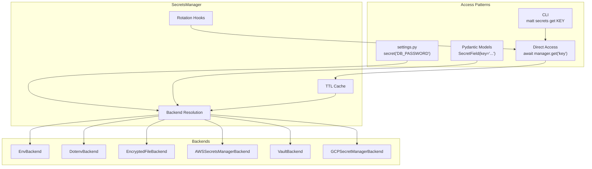

# Secrets Management

Django Matt provides a unified secrets management system with pluggable backends, caching, rotation policies, and Pydantic integration.

## Overview



## Quick Start

### In settings.py

```python
from django_matt.secrets import secret

SECRET_KEY = secret("DJANGO_SECRET_KEY", default="dev-only-key")
DATABASE_PASSWORD = secret("DB_PASSWORD")
STRIPE_SECRET = secret("STRIPE_SECRET_KEY")
```

`secret()` returns a lazy resolver that reads from environment variables on first access. Values are never eagerly loaded at import time.

### In Pydantic Models

```python
from pydantic import BaseModel
from django_matt.secrets import SecretField


class AppConfig(BaseModel):
    db_password: SecretField = SecretField(key="DB_PASSWORD")
    api_key: SecretField = SecretField(key="API_KEY")
```

`SecretField` values are masked in `repr()` and `str()` — they display as `***`. Access the real value via `.secret_value`:

```python
config = AppConfig(db_password="hunter2", api_key="sk-123")
print(config.db_password)              # ***
print(repr(config.db_password))        # '***'
print(config.db_password.secret_value) # hunter2
```

Serialization also masks the value — JSON output shows `"***"`.

### Async Manager API

```python
from django_matt.secrets import get_secrets_manager

manager = get_secrets_manager()

# Get a secret
value = await manager.get("DATABASE_URL")

# Get with default
value = await manager.get("OPTIONAL_KEY", default="fallback")

# Batch fetch
values = await manager.get_many(["DB_HOST", "DB_PORT", "DB_NAME"])

# Store a secret
await manager.set("NEW_SECRET", "my-value")

# Delete a secret
await manager.delete("OLD_SECRET")

# List all keys
keys = await manager.list_keys()
```

## SecretsManager

Central manager with caching, multi-backend routing, and rotation hooks.

### Constructor

```python
from django_matt.secrets import SecretsManager, EnvBackend, VaultBackend

manager = SecretsManager(
    backend=EnvBackend(),           # default backend
    backends={                       # scheme-specific backends
        "vault": VaultBackend(url="https://vault.internal:8200", token="..."),
    },
    cache_ttl=300.0,                # cache secrets for 5 minutes
)
```

### Singleton Access

```python
from django_matt.secrets import get_secrets_manager

# First call creates the instance; subsequent calls return the same one
manager = get_secrets_manager(cache_ttl=600.0)
```

### Secret References

Resolve secrets by URI, routing to the correct backend by scheme:

```python
from django_matt.secrets import SecretReference

ref = SecretReference("vault://database/password")
value = await manager.resolve_ref(ref)

ref = SecretReference("aws://prod/stripe-key")
value = await manager.resolve_ref(ref)
```

Supported URI schemes:

| Scheme | Backend | Example |
|--------|---------|---------|
| `env://` | EnvBackend | `env://DATABASE_URL` |
| `vault://` | VaultBackend | `vault://secret/db-password` |
| `aws://` | AWSSecretsManagerBackend | `aws://prod/api-key` |
| `gcp://` | GCPSecretManagerBackend | `gcp://my-secret` |
| `file://` | EncryptedFileBackend | `file://secrets.enc#db_pass` |
| `plain://` | (inline) | `plain://literal-value` |

`SecretReference` masks its value in `repr()` and `str()`:

```python
ref = SecretReference("vault://database/password")
print(ref)       # vault://***
print(repr(ref)) # SecretReference('vault://***')
```

### Caching

All `get()` and `resolve_ref()` calls are cached with a configurable TTL (default 300 seconds).

```python
# Invalidate a single key
manager.invalidate("DATABASE_URL")

# Invalidate everything
manager.invalidate_all()
```

### Registering Additional Backends

```python
from django_matt.secrets import AWSSecretsManagerBackend

manager.register_backend("aws", AWSSecretsManagerBackend(region_name="eu-west-1"))
```

## Backends

All backends implement the `SecretsBackend` protocol:

```python
class SecretsBackend(Protocol):
    async def get(self, key: str) -> str | None: ...
    async def get_many(self, keys: list[str]) -> dict[str, str | None]: ...
    async def set(self, key: str, value: str) -> None: ...
    async def delete(self, key: str) -> None: ...
    async def list_keys(self) -> list[str]: ...
```

### EnvBackend

Reads from `os.environ`. Default backend when none is specified.

```python
from django_matt.secrets import EnvBackend

backend = EnvBackend(prefix="MYAPP_")
# get("DB_HOST") reads os.environ["MYAPP_DB_HOST"]
```

### DotenvBackend

Reads from `.env` files. Parses on first access, supports quoted values and comments.

```python
from django_matt.secrets import DotenvBackend

backend = DotenvBackend(path=".env.production")
```

Writes back to the file on `set()` and `delete()`.

### EncryptedFileBackend

Fernet-encrypted JSON file. Requires `cryptography`.

```python
from django_matt.secrets import EncryptedFileBackend

# Generate a new encryption key
key = EncryptedFileBackend.generate_key()

backend = EncryptedFileBackend(path="secrets.enc", key=key)
```

The file is decrypted into memory on first read and re-encrypted on every write.

### AWSSecretsManagerBackend

AWS Secrets Manager via `boto3`. All calls use `asyncio.to_thread` to avoid blocking.

```python
from django_matt.secrets import AWSSecretsManagerBackend

backend = AWSSecretsManagerBackend(
    region_name="us-west-2",
    prefix="prod/myapp/",
)
```

`set()` creates the secret if it doesn't exist, or updates it if it does.

### VaultBackend

HashiCorp Vault KV v2 via `hvac`.

```python
from django_matt.secrets import VaultBackend

backend = VaultBackend(
    url="https://vault.internal:8200",
    token="hvs.xxxxx",
    mount_point="secret",
    path_prefix="myapp",
)
```

Secrets are stored as `{"value": "<secret>"}` at the resolved path.

### GCPSecretManagerBackend

Google Cloud Secret Manager via `google-cloud-secret-manager`.

```python
from django_matt.secrets import GCPSecretManagerBackend

backend = GCPSecretManagerBackend(
    project_id="my-gcp-project",
    prefix="myapp-",
)
```

Always reads the `latest` version. Creates the secret resource on first `set()`.

## secret() Lazy Resolver

For use in `settings.py` where async isn't available. Returns a `_LazySecret` that resolves from `os.environ` on first access.

```python
from django_matt.secrets import secret

# In settings.py
SECRET_KEY = secret("DJANGO_SECRET_KEY", default="change-me-in-production")
DATABASE_URL = secret("DATABASE_URL")
```

`_LazySecret` supports string operations — concatenation, `len()`, `bool()`, equality checks, and hashing — so it works seamlessly where Django expects a string:

```python
DATABASE_URL = secret("DB_HOST", default="localhost") + ":5432"
```

The `repr()` masks the key: `secret('DJANGO_SECRET_KEY')`.

## Rotation

### RotationPolicy

TTL-based rotation schedule:

```python
from django_matt.secrets import RotationPolicy

policy = RotationPolicy(
    key="DATABASE_PASSWORD",
    ttl_seconds=86400,  # 24 hours
    callback=my_rotation_handler,
)

print(policy.is_expired)      # True/False
print(policy.time_remaining)  # seconds until expiry
policy.mark_rotated()          # reset the timer
```

### @on_rotation Decorator

Register callbacks that fire when a secret rotates:

```python
from django_matt.secrets import on_rotation


@on_rotation("DATABASE_PASSWORD")
async def reconnect_database(key: str):
    from django.db import connections
    connections.close_all()


@on_rotation("CACHE_PASSWORD")
def flush_cache(key: str):
    from django.core.cache import cache
    cache.clear()
```

Both sync and async callbacks are supported.

### RotationChecker

Background task that monitors policies and fires hooks when secrets expire:

```python
from django_matt.secrets.rotation import RotationChecker, RotationPolicy

checker = RotationChecker(check_interval=60.0)  # check every 60 seconds

checker.add_policy(RotationPolicy(
    key="DATABASE_PASSWORD",
    ttl_seconds=3600,
))

checker.add_policy(RotationPolicy(
    key="API_KEY",
    ttl_seconds=86400,
    callback=regenerate_api_key,
))

# Start the background loop (requires a running asyncio event loop)
checker.start()

# Stop when shutting down
checker.stop()
```

### Manual Rotation

```python
manager = get_secrets_manager()
await manager.rotate("DATABASE_PASSWORD")
# Invalidates cache and fires all registered rotation hooks
```

You can also register hooks directly on the manager:

```python
manager.on_rotation("DATABASE_PASSWORD", reconnect_database)
```

## CLI Commands

The `secrets` CLI is available via typer:

```bash
# List all secret keys
matt secrets list

# Get a secret value
matt secrets get DATABASE_URL

# Store a secret
matt secrets set API_KEY sk-live-xxxxx

# Force rotation (invalidate cache + fire hooks)
matt secrets rotate DATABASE_PASSWORD

# Encrypt a JSON file
matt secrets encrypt secrets.json secrets.enc
matt secrets encrypt secrets.json secrets.enc --key <fernet-key>
```

The `encrypt` command generates a Fernet key if none is provided and prints it to stdout. Store this key securely.

## SecretField

Pydantic field type that masks values in serialization and display.

```python
from pydantic import BaseModel
from django_matt.secrets import SecretField


class Config(BaseModel):
    db_password: SecretField = SecretField(key="DB_PASSWORD")
```

| Operation | Result |
|-----------|--------|
| `str(field)` | `***` |
| `repr(field)` | `'***'` |
| `field.secret_value` | Actual value |
| JSON serialization | `"***"` |

Values are validated as strings. Any non-string input raises `ValueError`.

## API Reference

### Manager

| Method | Description |
|--------|-------------|
| `await get(key, default=None)` | Get a secret, with caching |
| `await get_many(keys)` | Batch get, with caching |
| `await set(key, value)` | Store a secret |
| `await delete(key)` | Delete a secret |
| `await resolve_ref(ref)` | Resolve a `SecretReference` URI |
| `await rotate(key)` | Invalidate + fire rotation hooks |
| `await list_keys()` | List all secret keys |
| `invalidate(key)` | Clear cache for one key |
| `invalidate_all()` | Clear entire cache |
| `register_backend(scheme, backend)` | Add a backend for a URI scheme |
| `on_rotation(key, callback)` | Register a rotation hook |

### Functions

| Function | Description |
|----------|-------------|
| `get_secrets_manager(**kwargs)` | Get/create singleton manager |
| `secret(key, default, backend)` | Lazy resolver for settings.py |
| `on_rotation(key)` | Decorator to register rotation callbacks |

## Security Considerations

1. **SecretReference masks URIs** - `repr()` and `str()` never expose the path portion of a secret URI.
2. **SecretField masks values** - Display and serialization always show `***`. Use `.secret_value` explicitly.
3. **Lazy resolution** - `secret()` doesn't read values at import time, reducing exposure window during module loading.
4. **Cache TTL** - Cached values expire. Shorter TTL = less stale data but more backend calls. Default is 300 seconds.
5. **Rotation hooks** - Use `@on_rotation` to automatically refresh connections when credentials change.
6. **Encrypted at rest** - `EncryptedFileBackend` uses Fernet (AES-128-CBC + HMAC-SHA256). Keep the encryption key in a separate secure store.
7. **Never log secrets** - The masked types prevent accidental logging. Don't call `.secret_value` in log statements.
8. **Thread safety** - `SecretsManager` uses an `asyncio.Lock` for singleton creation. Cache reads/writes are not locked — acceptable for the common case where stale reads are benign.

## Best Practices

1. **Use `secret()` in settings.py** - Lazy resolution keeps secrets out of module-level globals until needed.
2. **Use `SecretField` in Pydantic models** - Automatic masking prevents accidental exposure in logs and API responses.
3. **Set up rotation policies** - Don't let credentials live forever. Use `RotationChecker` with appropriate TTLs.
4. **Use EncryptedFileBackend for local dev** - Encrypt your `.env` secrets file instead of storing plaintext.
5. **Prefer cloud backends in production** - AWS Secrets Manager, Vault, or GCP Secret Manager provide audit trails, access control, and automatic rotation.
6. **Invalidate cache after rotation** - `manager.rotate()` does this automatically. If you rotate externally, call `manager.invalidate()`.
7. **Keep encryption keys separate** - The Fernet key for `EncryptedFileBackend` should come from an environment variable or hardware security module, not from the same encrypted file.
