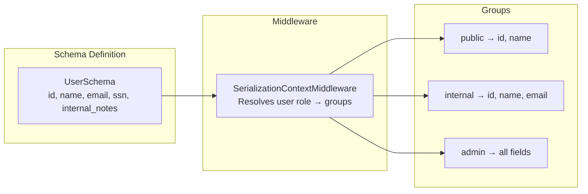

# Serialization Groups

Django Matt provides role-based field visibility for Pydantic schemas. Annotate fields with groups, and the framework automatically strips fields the current user shouldn't see.

## Overview



Fields without a group annotation are visible to everyone. Fields with a `Grouped()` annotation are only included when the request's serialization context contains at least one matching group.

## Quick Start

### Define a Schema with Groups

```python
from pydantic import BaseModel
from django_matt.serialization import Grouped, Secret, Public


class UserSchema(BaseModel):
    id: int
    name: str = Public()
    email: str = Grouped("internal", "admin")
    ssn: str = Secret()  # shorthand for Grouped("admin", "internal")
    salary: int = Grouped("admin")
    notes: str = Grouped("admin", "internal")
```

### Add the Middleware

```python
# settings.py
MIDDLEWARE = [
    ...
    "django_matt.serialization.SerializationContextMiddleware",
]
```

### Decorate Routes

```python
from django_matt.serialization import serialize_for


@api.get("/users/{id}")
@serialize_for(groups=["public"])
async def get_user_public(request, id: int) -> UserSchema:
    user = await User.objects.aget(id=id)
    return UserSchema.from_orm(user)


@api.get("/admin/users/{id}")
@serialize_for(groups=["admin", "internal", "public"])
async def get_user_admin(request, id: int) -> UserSchema:
    user = await User.objects.aget(id=id)
    return UserSchema.from_orm(user)
```

Public endpoint returns:
```json
{"id": 1, "name": "Alice"}
```

Admin endpoint returns:
```json
{"id": 1, "name": "Alice", "email": "alice@example.com", "ssn": "123-45-6789", "salary": 95000, "notes": "Senior engineer"}
```

## Field Annotations

### Grouped(*groups, **field_kwargs)

Annotate a field with one or more visibility groups. Wraps Pydantic's `Field()` and stores groups in `json_schema_extra`.

```python
from django_matt.serialization import Grouped

class ProductSchema(BaseModel):
    id: int
    name: str
    cost: float = Grouped("admin", "finance")
    margin: float = Grouped("admin", "finance")
    internal_sku: str = Grouped("internal")
```

Any keyword arguments accepted by `pydantic.Field()` are passed through:

```python
price: float = Grouped("public", "admin", ge=0, description="Retail price")
```

### Secret(**field_kwargs)

Shorthand for `Grouped("admin", "internal")`. Use for fields that should never appear in public responses.

```python
from django_matt.serialization import Secret

class UserSchema(BaseModel):
    api_key: str = Secret()
    password_hash: str = Secret()
```

### Public(**field_kwargs)

Plain `pydantic.Field()` with no group restriction. Included in all responses regardless of context. Use for explicit documentation — fields without any annotation are also always visible.

```python
from django_matt.serialization import Public

class UserSchema(BaseModel):
    id: int = Public()
    display_name: str = Public(max_length=100)
```

## SerializationContext

An immutable dataclass that carries the active groups and field include/exclude sets for a request.

```python
from django_matt.serialization import SerializationContext

# Create from groups
ctx = SerializationContext.from_groups("admin", "internal", "public")

# Full constructor
ctx = SerializationContext(
    groups=frozenset(["admin", "internal", "public"]),
    include_fields=frozenset(["id", "name", "email"]),  # whitelist
    exclude_fields=frozenset(["password_hash"]),          # blacklist
)
```

### Field Visibility Rules

1. If `exclude_fields` contains the field name, it is hidden.
2. If `include_fields` is set and the field name is not in it, it is hidden.
3. If the field has no groups, it is visible.
4. If the field's groups intersect with the context's groups, it is visible.

## @serialize_for Decorator

Applies group-based filtering to a route's return value. Works with both sync and async views.

```python
from django_matt.serialization import serialize_for

# Static groups
@serialize_for(groups=["public"])
async def public_endpoint(request):
    ...

# Dynamic groups resolved from request attributes
@serialize_for(groups_from="user.roles")
async def dynamic_endpoint(request):
    ...

# Field whitelist/blacklist
@serialize_for(
    groups=["admin"],
    include_fields={"id", "name", "email"},
)
async def limited_admin_endpoint(request):
    ...

@serialize_for(
    groups=["admin", "internal", "public"],
    exclude_fields={"password_hash", "secret_key"},
)
async def safe_admin_endpoint(request):
    ...
```

### groups_from

Resolve groups dynamically from the request object using dot-separated attribute paths:

```python
# Reads request.user.roles (expects str, list, tuple, set, or frozenset)
@serialize_for(groups_from="user.roles")
async def role_based_view(request):
    ...
```

The decorator inspects the first positional argument for a Django `HttpRequest` (checks for `.META` attribute). For class-based views where `self` is the first argument, it checks `args[1]`.

### Return Value Handling

- **Pydantic BaseModel**: Fields are filtered by group visibility.
- **list of BaseModel**: Each item is filtered individually.
- **dict or other types**: Returned as-is (no filtering applied).

## SerializationContextMiddleware

Automatically attaches a `SerializationContext` to every request based on the authenticated user's role.

```python
# settings.py
MIDDLEWARE = [
    "django.contrib.auth.middleware.AuthenticationMiddleware",
    "django_matt.serialization.SerializationContextMiddleware",
]
```

### Default Role Mapping

| User Type | Groups |
|-----------|--------|
| Superuser | `admin`, `internal`, `public` |
| Staff | `internal`, `public` |
| User with `role` attribute matching `role_to_groups` | Mapped groups |
| Authenticated (no special role) | `public` |
| Anonymous | `public` |

The middleware sets `request.serialization_context` which can then be used by `groups_from` or read directly in views:

```python
@api.get("/users/{id}")
async def get_user(request, id: int):
    user = await User.objects.aget(id=id)
    schema = UserSchema.from_orm(user)
    ctx = request.serialization_context
    return filter_schema(schema, ctx)
```

### Custom Role Mapping

Subclass the middleware to customize group resolution:

```python
from django_matt.serialization import SerializationContextMiddleware


class CustomSerializationMiddleware(SerializationContextMiddleware):
    def __init__(self, get_response):
        super().__init__(get_response)
        self.role_to_groups = {
            "admin": ["admin", "internal", "public"],
            "manager": ["internal", "public"],
            "viewer": ["public"],
        }
        self.default_groups = ["public"]
```

## filter_schema

Filter a Pydantic model instance's fields based on a serialization context. Returns a dict of visible field names to values.

```python
from django_matt.serialization import filter_schema, SerializationContext

ctx = SerializationContext.from_groups("public")
data = filter_schema(user_schema_instance, ctx)
# {"id": 1, "name": "Alice"}
```

## schema_for_groups

Generate a new Pydantic model class containing only the fields visible to the given groups. Results are cached.

```python
from django_matt.serialization import schema_for_groups

PublicUserSchema = schema_for_groups(UserSchema, "public")
AdminUserSchema = schema_for_groups(UserSchema, "admin", "internal", "public")

# Use for OpenAPI docs or response validation
public_user = PublicUserSchema(id=1, name="Alice")
```

The generated model name follows the pattern `{OriginalName}_{sorted-groups}`, e.g. `UserSchema_public`.

### Cache Management

```python
from django_matt.serialization import clear_schema_cache

# Clear the schema cache (useful in tests)
clear_schema_cache()
```

## API Reference

### Fields

| Function | Description |
|----------|-------------|
| `Grouped(*groups, **kwargs)` | Pydantic Field with group visibility |
| `Secret(**kwargs)` | Shorthand for `Grouped("admin", "internal")` |
| `Public(**kwargs)` | Plain `Field()` — always visible |

### Functions

| Function | Description |
|----------|-------------|
| `filter_schema(instance, context)` | Filter model instance fields, returns `dict` |
| `schema_for_groups(base, *groups)` | Generate cached sub-schema for groups |
| `clear_schema_cache()` | Clear the `schema_for_groups` cache |
| `serialize_for(groups, groups_from, ...)` | Route decorator for group filtering |

### Classes

| Class | Description |
|-------|-------------|
| `SerializationContext` | Immutable context with groups and field sets |
| `SerializationContextMiddleware` | Django middleware that resolves user -> groups |

## Best Practices

1. **Use the middleware** - Let `SerializationContextMiddleware` handle group resolution centrally instead of setting groups per-route.
2. **Prefer Grouped over include/exclude** - Group annotations are declarative and self-documenting. Reserve `include_fields` / `exclude_fields` for one-off overrides.
3. **Keep group names consistent** - Stick to a small set (`public`, `internal`, `admin`) across all schemas.
4. **Use Secret for sensitive data** - API keys, hashes, SSNs — anything that should never appear in a public response.
5. **Generate OpenAPI sub-schemas** - Use `schema_for_groups()` to produce accurate per-role OpenAPI definitions.
6. **Clear cache in tests** - Call `clear_schema_cache()` in test teardown if you modify schemas dynamically.
7. **Don't filter dicts** - `filter_schema` only works on Pydantic `BaseModel` instances. If your view returns a dict, the decorator passes it through unmodified.
