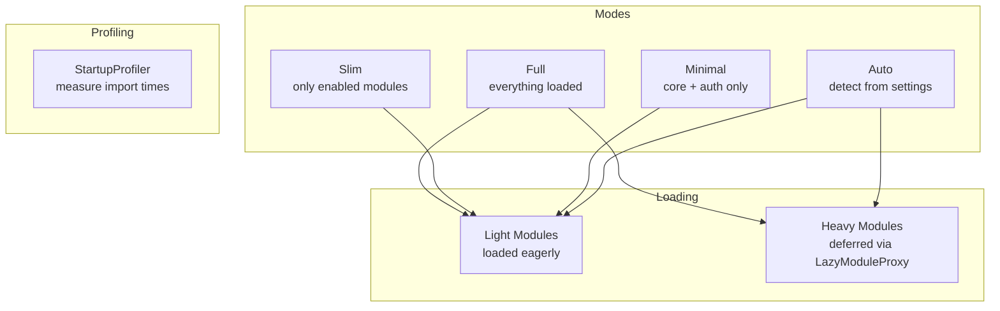

# Slim Mode

Django Matt ships with every module available by default ("full" mode). Slim mode lets you control which modules load, reducing startup time and memory usage for applications that only use a subset of the framework.

## Overview



## Quick Start

```python
# settings.py
DJANGO_MATT = {
    "SLIM_MODE": {
        "mode": "slim",
        "enabled_modules": ["auth", "billing", "notifications"],
        "lazy_imports": True,
    },
}
```

```python
# api.py — mode can also be set on the API instance
from django_matt import MattAPI

api = MattAPI(mode="slim")
```

## Three Modes

### Full (default)

All modules are active. Every middleware, URL pattern, and feature is available. Backwards-compatible with existing setups.

```python
DJANGO_MATT = {
    "SLIM_MODE": {"mode": "full"},
}
```

In full mode, `disabled_modules` can selectively turn off specific modules:

```python
DJANGO_MATT = {
    "SLIM_MODE": {
        "mode": "full",
        "disabled_modules": ["graphql", "websockets"],
    },
}
```

### Slim

Only explicitly enabled modules (plus core) are loaded.

```python
DJANGO_MATT = {
    "SLIM_MODE": {
        "mode": "slim",
        "enabled_modules": ["auth", "billing", "views", "openapi"],
    },
}
```

Core modules (`core`, `router`, `controller`, `schema`, `errors`, `openapi`, `docs`, `redoc`) are always loaded regardless of mode.

In slim mode without `enabled_modules` set, the registry starts with core + auth and you add modules programmatically:

```python
from django_matt.slim import ModuleRegistry

registry = ModuleRegistry(mode="slim")
registry.activate("billing", "notifications")
```

### Minimal

Only core and auth. The smallest possible footprint.

```python
DJANGO_MATT = {
    "SLIM_MODE": {"mode": "minimal"},
}
```

### Auto

Detects which modules are configured by scanning `DJANGO_MATT` settings keys:

```python
DJANGO_MATT = {
    "SLIM_MODE": {"mode": "auto"},
    "JWT_AUTH": {"secret": "..."},          # activates auth
    "BILLING": {"stripe_key": "..."},       # activates billing
    "FEATURE_FLAGS": {"backend": "db"},     # activates flags
}
```

Setting key to module mapping:

| Settings Key | Module Activated |
|-------------|-----------------|
| `AUTH_BACKEND`, `JWT_AUTH` | `auth` |
| `CORS` | `cors` |
| `SECURITY_HEADERS` | `security` |
| `REQUEST_ID_HEADER` | `request_id` |
| `REQUEST_LOGGING` | `logging` |
| `TIMING` | `timing` |
| `THROTTLE` | `throttling` |
| `DI_AUTO_WIRE` | `di` |
| `FEATURE_FLAGS` | `flags` |
| `EXPERIMENTS` | `experiments` |
| `OBSERVABILITY` | `observability` |
| `BILLING` | `billing` |
| `MULTITENANCY` | `multitenancy` |
| `ANALYTICS` | `analytics` |
| `WEBSOCKETS` | `websockets` |
| `GRAPHQL` | `graphql` |

Auto mode also detects middleware stack presets:

```python
DJANGO_MATT = {
    "SLIM_MODE": {"mode": "auto"},
    "MIDDLEWARE_STACK": "production",  # activates security, request_id, cors, logging, timing
}
```

## SlimConfig

The `SlimConfig` Pydantic model controls slim mode behavior:

```python
class SlimConfig(BaseModel):
    mode: Literal["full", "slim", "minimal", "auto"] = "full"
    enabled_modules: list[str] | None = None  # None = all in full mode
    disabled_modules: list[str] = []
    lazy_imports: bool = True
```

Access the current config:

```python
from django_matt.slim import get_slim_config, is_module_enabled

config = get_slim_config()
print(config.mode)  # "slim"

# Check if a specific module is enabled
if is_module_enabled("billing"):
    from django_matt.billing import BillingController
```

## ModuleRegistry (slim.py)

The `ModuleRegistry` in `slim.py` tracks which modules are active and provides the corresponding middleware:

```python
from django_matt.slim import ModuleRegistry

registry = ModuleRegistry(mode="slim")

# Activate modules
registry.activate("billing", "notifications", "flags")

# Check activation
registry.is_active("billing")  # True
registry.is_active("graphql")  # False

# Get middleware for active modules only
middleware = registry.get_active_middleware()
# ["django_matt.flags.FlagMiddleware"]

# Cannot deactivate core modules
registry.deactivate("core")  # raises ValueError

# Freeze to prevent further changes (call before serving)
registry.freeze()
registry.activate("ai")  # raises RuntimeError
```

### Active Middleware

Each module maps to zero or more middleware classes:

| Module | Middleware |
|--------|-----------|
| `auth` | `JWTAuthenticationMiddleware` |
| `cors` | `CORSMiddleware` |
| `security` | `SecurityHeadersMiddleware` |
| `request_id` | `RequestIDMiddleware` |
| `logging` | `RequestLoggingMiddleware` |
| `timing` | `TimingMiddleware` |
| `observability` | `TracingMiddleware`, `MetricsMiddleware`, `LoggingMiddleware` |
| `flags` | `FlagMiddleware` |
| `experiments` | `ExperimentMiddleware` |
| `di` | `DependencyInjectionMiddleware` |
| `negotiation` | `ContentNegotiationMiddleware` |

## LazyModuleProxy (loader.py)

Defers module imports until first attribute access. Thread-safe with double-checked locking.

```python
from django_matt.loader import LazyModuleProxy, lazy_import

# Create a lazy proxy
billing = lazy_import("django_matt.billing")
print(billing)  # <LazyModuleProxy 'django_matt.billing' (deferred)>

# First access triggers import
billing.BillingController  # imports django_matt.billing now
print(billing)  # <LazyModuleProxy 'django_matt.billing' (loaded)>
```

## DeferredLoader

Manages lazy vs eager loading based on module classification.

### Module Classification

**Light modules** (loaded eagerly): `core`, `auth`, `views`, `config`, `permissions`, `openapi`, `pagination`, `filtering`

**Heavy modules** (loaded lazily): `billing`, `ai`, `ml`, `graphql`, `websockets`, `analytics`, `experiments`, `notifications`, `email`, `messaging`, `files`, `tasks`

```python
from django_matt.loader import DeferredLoader

loader = DeferredLoader()

# Light modules return the real module immediately
auth = loader.get("auth")  # imports django_matt.auth right away

# Heavy modules return a LazyModuleProxy
billing = loader.get("billing")  # no import yet
billing.BillingController  # import happens here

# Force-load heavy modules
loader.preload("billing", "ai")

# Check load status
loader.is_loaded("auth")     # True (light, always loaded)
loader.is_loaded("billing")  # True (was preloaded)
loader.is_loaded("graphql")  # False (still deferred)

# List modules still deferred
loader.deferred_modules  # ["graphql", "websockets", ...]
```

Disabled modules (per `is_module_enabled()`) return `None`:

```python
# With mode="minimal", billing is disabled
loader.get("billing")  # None
```

## StartupProfiler

Measure import times for all django-matt modules to identify bottlenecks.

```python
from django_matt.startup import StartupProfiler

with StartupProfiler() as profiler:
    # Your app initialization here
    pass

# Results
print(profiler.total_ms)  # 142.5
print(profiler.slowest)   # [("graphql", 45.2), ("ai", 32.1), ...]
print(profiler.summary())
# {
#     "total_ms": 142.5,
#     "module_count": 35,
#     "failed_count": 2,
#     "failed_modules": ["some_missing_module"],
#     "slowest_5": [("graphql", 45.2), ("ai", 32.1), ...]
# }
```

Results are also stored module-level for later access:

```python
from django_matt.startup import get_profile_results

results = get_profile_results()
# {"core": 1.2, "auth": 3.4, "billing": 15.6, ...}
# Modules that failed to import have value -1.0
```

## Configuration Examples

### API-only Service (no admin, no templates)

```python
DJANGO_MATT = {
    "SLIM_MODE": {
        "mode": "slim",
        "enabled_modules": [
            "auth", "views", "permissions",
            "pagination", "filtering", "throttling",
        ],
        "lazy_imports": True,
    },
}
```

### Microservice

```python
DJANGO_MATT = {
    "SLIM_MODE": {
        "mode": "minimal",
    },
}
```

### Full SaaS with Selective Disable

```python
DJANGO_MATT = {
    "SLIM_MODE": {
        "mode": "full",
        "disabled_modules": ["graphql", "htmx", "components"],
    },
}
```

### Auto-Detect with Overrides

```python
DJANGO_MATT = {
    "SLIM_MODE": {
        "mode": "auto",
        "disabled_modules": ["experiments"],  # disable even if configured
    },
    "JWT_AUTH": {"secret": "..."},
    "BILLING": {"stripe_key": "..."},
    "EXPERIMENTS": {"backend": "db"},  # configured but disabled above
}
```

## Migration Guide: Full to Slim Mode

### Step 1: Profile Current Startup

```python
# Add to your wsgi.py or asgi.py temporarily
from django_matt.startup import StartupProfiler

with StartupProfiler() as profiler:
    from django.core.asgi import get_asgi_application
    application = get_asgi_application()

print(profiler.summary())
```

### Step 2: Identify Used Modules

Check which modules your code actually imports:

```bash
rg "from django_matt\." --type py -o | sort -u
```

### Step 3: Switch to Slim Mode

```python
DJANGO_MATT = {
    "SLIM_MODE": {
        "mode": "slim",
        "enabled_modules": [
            # Only what you actually import
            "auth", "views", "billing", "notifications",
        ],
    },
}
```

### Step 4: Verify

Run your test suite and check for `ImportError` or `ModuleNotFoundError`. If a module is missing, add it to `enabled_modules`.

### Step 5: Profile Again

Compare startup times before and after to validate the improvement.

## Best Practices

1. **Start with "auto" mode** if you are unsure which modules you need — it detects from settings
2. **Use "slim" mode in production** with an explicit `enabled_modules` list for deterministic behavior
3. **Use "minimal" mode for microservices** that only need core API + auth
4. **Keep `lazy_imports: True`** (default) so heavy modules are only loaded when first accessed
5. **Profile startup** with `StartupProfiler` before and after switching modes
6. **Freeze the registry** in production to prevent accidental module activation at runtime
7. **Never disable core modules** — the registry raises `ValueError` if you try
